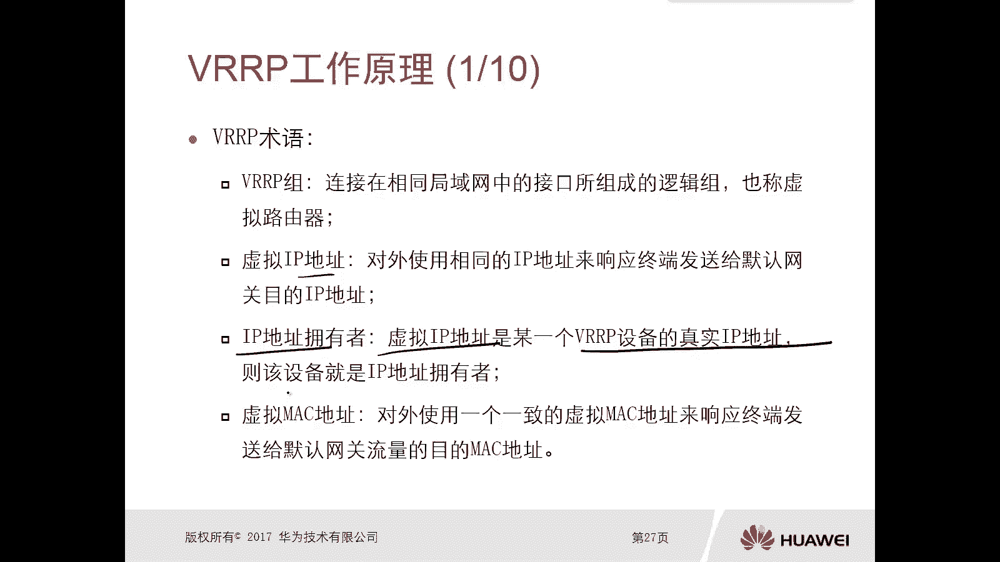
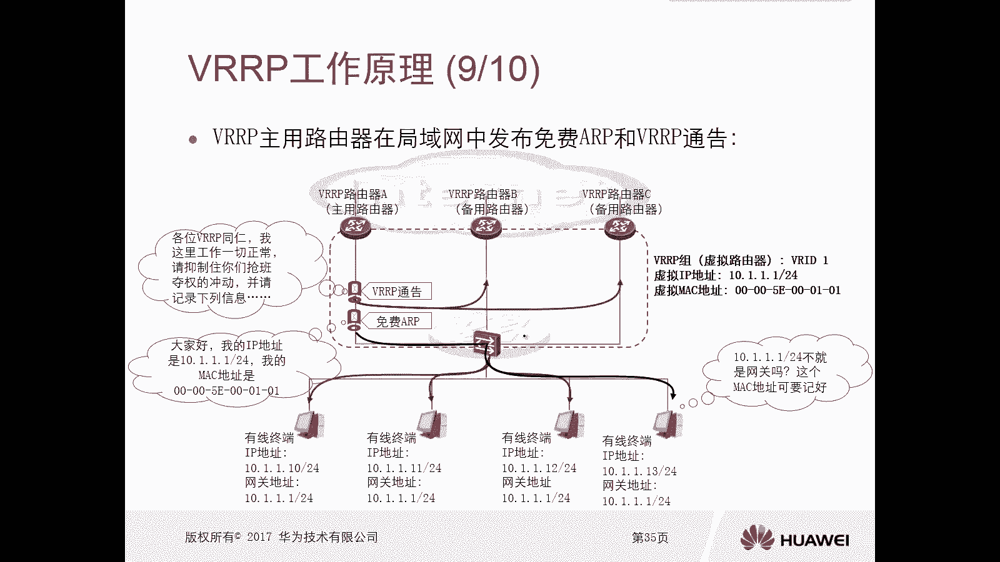

# 华为认证ICT学院HCIA／HCIP-Datacom教程【共56集】 数通 路由交换 考试 题库 - P40：第3册-第2章-2-VRRP概述及工作原理 - ICT网络攻城狮 - BV1yc41147f8

那么接下来呢我们再讲另外一个，高可靠性的一个小技术，叫做第一条冗余协议，第一条龙形呢F加P，那么他呢是为这个终端设备啊，去提供的这个网关的冗余的这么一类协议，那么注意一下这个FH2P。

它是第一跳冗余协议的一个统称，那么实际上我们有好多种，这种就是第一条龙协议，那么有商有商的对吧，又有公有的，公有的，比如说VIP对吧，那么比如说友商的HS2P等等，好那么这种呢都是为这个网关去提供。

那么本节呢我们主要是从这个如下三个方面，去介绍这个部署，用于网关石最为常用的这个FEHIP，那么就是VRPVIP这个实体协议，第一个就是VRP协议它的概述啊，第二个是VRP它的工作原理。

最后是VRP的配置。

哎我们先看一下这个VIP的一个协议概述，那么这个呢是一个小型网络对吧，那么比如说我们这个小型网络啊，他为了实现这个终端，能够不间断的去访问这个网，那么很有可能呢它要部署两个出口网关。

路由器分别是路由器和路由器B，那么最主要的目的，就是为了去避免那个单点故障对吧，你比如说我假设啊只有这一台路由器设备，那当这个路由器设备出问题以后呢，那完了对吧，我的终端就无法去访问了。

那现在呢我去部署两台，这个连接运营商的两台设备对吧，那么只要有一台设备出问题了，那么另外一台设备是好的，我就不会出现中断对吧，那么这种这种拓扑呢就是可以去避免它呃，由于有一台设备或者某条链路出现问题。

而造成的中断问题，但是我们想一下啊，由于我们这两台路由器呢，它都是这个和这个PC直接相连的，因为中间是一台交换机嘛，我们说是透视，那么这种情况下呢，我们的不管是有线终端还是无线终端。

我们去设置这个网关地址的时候，你要么去设置路由器A作为你自己的关，那么要么是去设置路由器B作为你的网关对吧，那你想啊你这个很这个扩展性很不好啊对吧，当出现问题以后，我得手动去改对吧。

因为我们去设置网关的时候，你只能设置一个吧，你能设置两个吗，设置不了，你要么设置A要么设置B当A出问题，我还得去改改成B对吧，显然它并不是一个非常灵活的地方，所以呢在早期啊。

在早期我们怎么实现这种冗余啊，就是网关冗余呢，一般呢是在这个终端上不配网关，不配这个网关，那不配网关呢，需要我们在路由器A和路由器B上，开启这个IP代理的功能啊，以此去实现一个用于有代理的情况下。

那就是你发出来的包，那么A也可以给你转，B也可以，你转对不对都可以，那么当当这个A出问题以后，B也可以必须精准，对不对，这是当时在没有这种冗余的网关协议之前，我们的解决方案就是使用这个API。

但是那个也是有缺点的，因为在我们的终端上会产生大量的AIP表现，那么一定会消耗我们终端的一些资源好。

所以呢我们随着网络发展啊，那么就提出来了，哎我们能不能搞一种协议出来，专门做网关的冗余呢，那么这种情况下，这个FH2P呢就应运而生了对吧，那么其中一个协议就是VR进VIP，那么这个VIP呢。

是我们在部署这个网关冗余的时候，最常用的这个F1小题对吧，那么这是一个标准来着对吧，我们所有的这个基本上所有的糖的时候，都是支持的啊，好那么这个VIP呢它就是将多台路由器啊。

虚拟成一台路由器这样的一个服务对吧，你也可以认为它类似于一种驯化技术啊，类似一种驯化技术，它将多个真正的路由器去虚拟成一台路由器，那么他的目的就是提供业务不间断的网络，做高考可能性。

OK好，这是这个VIP的一个概述啊，那么我们接下来看一个，这个使用VIP协议环境的一个拓扑啊，这是一个逻辑拓扑，那么假设如果说你没有这个VIP的参与的话，那么我们可能去连的时候。

就是这样的一个连接方式了对吧，哎那么两台路由器A和B好，那么接下来呢，我们要通过VRP去实现网关的荣誉好，那么首先呢哎我们看啊，这两个路由器呢它肯定都有一个接口地址。

这个接口地址局域网地址肯定是不一样的，一个是10。11。1杠24，一个是10。11。2杠二，对不对好，那么对于这个路由器A路由器B呢，现在我给他配置的这个VIP这个协议，所以呢叫做VRP路由器。

A叫做VRP路由器B，那么配置完了VIP以后呢，就我们可以认为这两台路由器，就虚拟成一台大的路由器，哎就虚拟成一台大的路由器了，那么这台大的路由器它有一个虚拟id啊，叫做VRID。

就是VRIP的一个组的虚拟id啊，这个id呢你可以去定义，这是一同时这个大的路由器啊，它也有一个虚拟的IP地址啊，这我们现在看到这个虚拟IP地址呢，你看正好是10。1。1。1杠24。

这个虚拟IP地址和路由器A的真实IP地址，是一样的，哎这种情况是没有问题的，哎那可能呢我们这个虚拟IP地址啊，和这个局域网接口的真实IP地址是一样，你不太好理解啊。

比如说啊我给大家把这个地址换成了三题吧，我把这个地址给大家换成了三对吧，这样就好理解了对吧，哎这个是虚拟地址，是点一对吧，然后这个实际地址是点3。2，但是如果说你的虚拟地址是点一。

你的实际地址地址也是点一，有没有问题的，一点问题都没有，他一点问题没有啊，这个没关系的啊，不会说有什么地理冲突这样的问题啊，不会同时呢它会有一个虚拟的Mac，虚拟Mac呢它是固定的0000510001。

后边这个呢就是你的VID，那是016006602的好，那么虚拟Mac地址呢不需要我们手动设置的啊，但是虚拟IP地址是需要我们配置的，它配置的是10。1。01，OK那么这样的话在客户端原理，你还讲啊。

他们去配置这个网关的时候，就直接设置成10。1就可以了，而且他们认为他的网关是路由器A吗，不是他们设置网关呢是这个大路由器，也就是说他们设置的这个网关地址，实际上是个大路由器的虚拟地址，哎再虚一点哎。

这就是这个VIP啊，VIP它怎么实现的，我就是把多台路由器去做一个VIP对吧好。

那么做完以后呢，这里边呢两台路由器呢它会有两个角色，那么就会讲到这个VIP路由器，那个角色分工啊，一个叫做主用，叫做master，那么master是负责里面的转化的，另外一个叫做备用，叫做backup。

那么这个backup呢他只会去监听主音设备状态，而目的就是爱达米种设备出故障的时候，我能够及时的接替接替。

你总是注意一下啊，所以他们两个呢是有祖辈关系的啊。

主关系，你比如说我这个路由器A，假设它是master主的那个路由器B呢它是背的，那么实际上你看啊，你你现在终端的网关地址是10。001，那么这种情况下，你的数据肯定是往上交就过来，做完了以后。

那么这个数据到底是由A进行转发呢，还是由B型转发呢，一定是A型转换，那比如说有一天A出问题了，B呢就变成master了，变成主了对吧，那么后期你这个流量再转化过来，由谁转化呢，有必定转化。

而且即使当你A出现问题了，那么你的虚拟IP地址和虚拟Mac地址，是不会变化的，所以这种情况下呢，你说我们的客户端，它的网关地址需不需要再手动去改了，不需要哎，这就解决了，刚才我们说哎。

你没有这个VIP这种技术的时候对吧，你搞两台设备出现问题还得手动去改，这个行不靠谱，对不对。

嗯嗯好，那么我们再看一些其他的这个术语啊，术语术语呢就是第一个就是这个VIP组好，VIP组呢就是连接在相同局域网中的接口。

所组成的一个逻辑组，也称为虚拟的容器，你比如说我们这个图里面对吧，路由器A这个接口和路由器的B这个接口，我们需要把这两个接口给它，放到一个VIP处理点啊，这个组呢就是VIDE对吧。

哎是把这两个接口放进去的啊，一定是面向你这个终端的两个接口。

这就是一个组啊，那么虚拟IP地址呢，虚拟IP地址就是我们对外使用相同的IP地址，来响应终端发送给默认网关目的的IP地址，说白了简单点，虚拟IP地址，就是你将来你的终端设备的网络地址，对啊。

这是虚拟地址好，另外一个呢叫做IP地址拥有者，那么虚拟IP地址可以是一个随便一个地址，也可以是一个真实的VRP路由器的IP地址，如果说你的虚拟IP地址，正好是某一个VIP设备的真实的IP地址。

那么这个设备就是这个IP地址的那种。

没有吧，你就是比如说我们刚才这个图等一下啊。

哎这个A设备啊，它的真实地址是10。1，那么虚拟IP地址呢也是10。101对吧，所以说我们可以认为这个例如7A诶。

他是一个IP地址的拥有者啊，好那么虚拟Mac地址，那么虚拟Mac地址是对外使用一个一致的，虚拟Mac地址来响应终端发送给默认网关流量，他的目标Mac地址。

你看我们配置的这个终端，它的网关地址是10。1点点一，那么你去访问因特网的时候，你首先要去做ARP解析，要解析你的网关的Mac，那如果说没有这个虚拟Mac的话，你去解析的时候，那谁回复呀，要么是A回复。

要么是B服回复，那A回复了对吧，那地址那数据就是由A进行转化对吧，那当当A出问题了呢啊B还要进行回复对吧，这由B进行啊，这是一种方案，那么另外一种方法就是我搞一个一致的形态，就是对吧。

那么你进行这个IP对吧，进行回这个响应的时候，就ARP进行请求的时候，我响应的时候给你响应的训练，那也不是A也不是B对吧，是这个大路由器的虚拟路由器的对吧，这种情况下，甭管你是A出问题了对吧。

那B接管了，那么B还需不需要把他的Mac地址给你，不需要对吧，那客户端需不需要去再去做ARP的请求呢，也不需要因为Mac地址没有发生变化。

对吧哎就统一了，就是这个虚拟那个地址啊，好，然后VRD，VRD是标识不同的VRP组的一个标识符，好那么我们接口呢你可以配置多个VRP组，可以实现这个冗余备份，好我们现在我们刚才看到的一个主。

一个被一种主备备份，对不对，我们可以配置两个VIP，比如说我可以配置保两个V加P这个id，一个是一个是二对吧，A路由器和B路由器，那么A呢是一的主，那么B呢是一的倍，然后我可以设置为B是二的主。

A呢是二的倍对吧，互为备份啊，好优先级，那么优先级呢每个VIP组中啊，会分配各个VIP路由器啊，就这个接口啊一个参数，那么优先级高的呢承担master这样的角色，a master角色。

OK这个注意一下啊，他就是看这个优先级去确定这个master，那么抢占呢，那么抢占抢占什么意思呢，是保证优先级的高的，作为这个总用路由器，它叫做主路由器，就比如说有一台路由器啊。

他工作的这个抢占模式对吧，那么你当这个接口的VIP优先级，高于当前的这个主用路由器VIP编辑的时候，你就立马就会抢占这个角色，就是反正就是如果说你他的强大就是高的为主，如果说你工作的是一个非抢占的模式。

非常的模式对吧，那比如说现在这个主主的这个master已经选完了，你又来了一个可能比当前主的master更高的路由器，那这种情况能抢吗，不抢，除非它失效了，所以他失效了啊。

要不然不抢就是抢占的一个作用，那么VIP协议呢它是有两个版本的啊，那么V2和V3，那么V2呢是只能用于IPV4环境，那么V3呢可以应用在V4，也可以用在V6好，那么对于VIP协议呢。

这个IP头部的鞋子段呢确实是112，同时我们VIP协议发送报文的时候。

他用的是一个组合地址，20。0。0。68好，我们看一下这个VIPV2啊，这个头部格式是这个版本是类型，那么这肯定是VR嘛类型报文类型了对吧，虚拟路由器的一个ID优先级。

IP地址数认证什么这个IP地址认证数据等等。

那么接下来我们就一个看一下啊，那么版本呢就是这个VR对吧，不要那么类型呢，这个字段取值一律为一，表示这是一个VIP的通报消息，虚拟虚拟路由器id，这个取值是1~255啊，就是VD好。

有多个优先级的取值是0~2到15，那么优先级越大，肯定越越越越容易被称为一个主路由器，对不对，IP地址标识，这个VIP的虚拟的IP地址的数量，就是IP地址数，IP地址数，那么缺省，我们华为路由器。

它的优先级是多少呢，默认是100，默认是100，这个要注意一下啊，那么我们可以通过修改这个优先级序，影响他的选举啊。

好那么还有哪些呢，比如说认证类型啊，认类型，那么我们这个VRPV2版本的，是支持三种类型的呃，那么呃有明文认证，有MD文认证，还有不认证是吧，有三种人啊，然后呢是通告时间隔。

这个通告时间表呢表示是你这个VIP设备啊，它发送这个VIP通道的时间间隔，它是周期发的，而它是周期发的，好像和这个工具解释了，就是让计数方，那么这个VIP设备检测到这个VIP消息，是否和事发的一致。

这个教练和我们在基础内容里面都讲过，包转发的时候也有讲啊，对不对，你得知道它是正确的才能转发，对吧好，然后是IP地址，IP地址呢是标识这个VIP组的一个虚拟地址，就是地址认证数据。

那么就是我们的人字段啊。

好，那么对于这个VIP，它的工作方式是什么样的呢，第一个，首先我们在这个VIP组里面，要选举出来主流游戏对吧，首先来要这个选取一个主路径，然后主用路由器选取完以后，他会主动在局域网里边去发送ARP。

AIP响应消息，来通告这个VIP组区域的Mac地址，你看比如说当我变成一个主路由器，然后主路由器它的责任就是哎，首先我要去发送一个5VRP，把虚拟IP地址和Mac地址发出去，然后这样的话终端就看到了哦。

原来这样的一个地址和Mac地址是这个诶，正好这个这个这个IP地址呢是我的网关地址，OK下次再发数据，我就交给他，同时呢主用路由器，它会周期的向着VRRP组里面的其他路由器，去通报自己的信息一个状态对吧。

我们刚刚说了土地址是2400了吧，他的目的呢就是说哎我还在啊，我还活着啊，我现在是主动器，我是老大啊，你们不要抢啊。

好那么我们看一下啊，这个通过动图的方式去做啊，现在呢我们三台路由器，当然大家注意一下，我们去配置VIP的时候，我们前面刚才看到了对吧，它是有两台设备，但是一定是必须是两台设备吗，不一定我可以有三台。

可以有四台啊，有三台的时候就是一个主两个为背板，四台的时候一个主三个为背板，一两台的时候就是一体背板啊，没问题吧，可以有多台设备啊，比如现在有三台设备，那么分别呢是他们结构力10。1001，然后10。

002十。003，OK注意一下，那么对于对于10。1。1。2，它的优先级呢，我设置成105十。1。0。3的优先级呢，我说你改不改，然后10。1。1。一二十四，优先级为255啊，这个是最优先的啊。

最优先的，而且注意一下，255的油烟机是没法进行手工配置的，那这个优先级怎么来的呀，哎注意一下，如果说你的虚拟地址和他的真实地址是一个，那么这个真实地址它的优先级是最高的。

好那么后面呢我们去讲配置的时候就能看到啊，哎好定好了啊，那么这种情况下路由器ABC啊，那么他们就会选举帽子是吧，那我们比如说我们设置的这个VIP组啊，VID是一，然后虚拟IP地址是10。1。1。1哎。

你看这个虚拟IP地址，和路由器A的这个实际IP地址是一样的，所以这种情况下这个路由器A它原先你缺什么，就变成了255，你不用手动去设置的，你比如说点二和点三，那必须要手动配了不对。

100公分确实虚拟Mac地址是映射下来，但是0000510001这些全都是固定的，后边这个零幺呢是根据你这个id啊，你这个id是一就是一二就是二三，就是三把它定下来的啊，哎你不用管了啊。

好在这种情况我们想一下谁会是这个VIP的master，一定是对吧，那你就讲假设你都不敢，假设地址也不一样，那他缺省级都有100，那谁会变成master，OK如果优先级相同的话。

他们会比较按这个结果的地址，IP地址大的会变成master，IP地址大的会变成，OK现在我们看啊这个A那么它变成master以后呢，它会发送这个VIP的信息对吧，信息里面呢这个目的地是24。0。084。

五十一六级是二八十，OK那我发过去以后，你看路由器B和C就是对吧，各位这个VIP组啊，谁来做主用路由器呢，哎他得瑟一下对吧，你也很高嘛对吧，哎其实B和C呃，他们也会发啊，只不过A发出来要比B和C要优先。

那B和C收到以后，你是IP地的拥有者，你说什么都对，边解2856嘛啊，你优先级255还选啥呀对吧，那就是你的得瑟啥对吧，这个B和C加上，那么这个A呢就是这个master。

OK那么当A变成master以后。

那么master呢它就会在这个局域网里面呢，去免去发布这个免费P和VIP通道，大家注意一下，现在我们的网关地址呢，终端都设置的是这个虚拟地址，10。1。01，OK那么这种情况下。

这个主用设备发送VIP通道，哎说哎我现在什么手啊，我现在还在，我还活着对吧，同时呢同时注意一下，路由器A还会去发送免费IP，大家好啊，哦这个IP地址是10。101。

我的Mac地址是000051000101哦，那么这样的话，所有其他的终端呢都会收到这个免费IP，大家一看哦，10。1。1。1，这不是我们的网关吗，哎这个Mac地址我们可以记好。

后期我们在取整个数据的时候，直接封装这个Mac地址给这个网址就可以了对吧，哎那么同时这个无故ARP还会影响到谁呢，这对吧，这个交换机你看啊，这是假设这一口二口三口连接了三个路线。

那么后面这个主题好多接口挂了，而这种情况下，我们可以想一下关于这个虚拟Mac地址，它的一个接口是谁呢，一定是一口对吧，一定是一口对吧，因为从这个接口收到了一个免费IP对。

所以在这个交换机上形成的一个关于网关，Mac地址，它的一个表象接口一定是，所以呢当你终端封装网关的Mac地址的时候，数据包到了交换机，交换机只会从一口转发过来，交给这个9年级啊，会交给路由器B和BC吗。

根本就不会对吧。

这样的话主路由器就可以把数据转发出去。

看来我们看哎这样的话就有主用路由器诶。

去发送对吧，那你B和C实际上是不管他什么。

他们实际上也不会收到这个报啊，除非除非说比如说你接近了一台新的电脑，这个电脑呢它是没有网关的Mac地址，他要发送ARP对吧，他发送IP，那它发送ARP请求网关的Mac的时候。

那么路由器B和路由器C是能收到的，但是他们会想什么，拨一下丢掉对吧，只有路由器A去想，OK好这是一个稳定的情况下，这个主机游戏这个工作。

但是我们可以想一下，当主路由器出现问题了。

该怎么办呢，比如说A出问题了，没问题啊，一开始啊这一口二口三口那个虚拟Mac地址啊，虚拟Mac地址在交换机上，它对应的接口是一口对，比如说A出问题了，A出问题，假设B现在变成了主动设备。

这个C呢还是备用，那么它变成了主力设备以后，那么他也会做主音设备的两件事，第一件事就是我发送啊，V啊啊P通道说我现在是master的，其他人不要抢，那第二个呢他也会去发送服务ARP，那他发送无故VIP。

实际上这个无关IP和A路由器，之前发送无VIP是一模一样的，虚拟IP地址对应虚拟Mac地址，哎，这个5RP发下去对于终端来讲没有太大意义，因为终端他已经有记录了虚我的网关地址，就那一个me。

那你发送无VIP的目的是什么呢，目的是告诉交换机，现在这个Mac地址现在不再是一口了，诶，变成二考了，因为你从这个接口发出去到就变成2号了，那下次主机再发送数据出来以后，那么这个数据经过交换机。

交换机是不是就从二口转发到路由器B，然后B呢作为master再往外转发，没问题吧，哎所以说注意一下啊，这是当主路由器出问题或，备用路由器做了两件事，通告5LP的目的是什么，目的就是报考交换机诶。

这个是该地址端口变了，变成口好。

