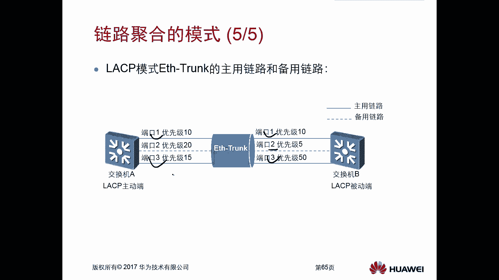
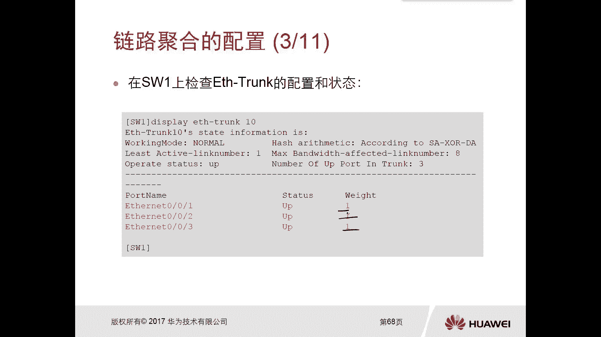

# 华为认证ICT学院HCIA／HCIP-Datacom教程【共56集】 数通 路由交换 考试 题库 - P41：第3册-第2章-3-链路聚合 - ICT网络攻城狮 - BV1yc41147f8

好，那么接下来我们再看另外的一个这个呃，高可靠性的一个技术啊，就是链路聚合，那么本节呢主要是通过如下三个方面去介绍，当今这个局域网中，极为常见的这个端口冗余技术啊，这个链路聚合。

那么第一个方面呢是这个链路聚合，它的一个介绍啊，那么介绍什么情况下，需要使用这个链路聚合是吧，第二个呢是链路聚合它的模式，那么有不同的模式啊，那么不同的模式它的特点是不一样的。

第三个呢是链路聚合它的简单配置的来，首先我们先看一下这个链路聚合的介绍呃，一般情况下我们在这个局域网里面啊，那么为了让这个交换机有更多的这个链路，去发送流量，你比如说我们接入层到汇聚层。

那么甚至是汇聚层到核心层，主要是为了去提高这些层次之间，交换机它的一个整体的这个链路带宽啊对吧，我们我们有可能会采用啊，比如说基层会长，会长会长有可能会多连几条线路对吧。

因为你比如说你交换机的端口是千兆口，那我多连几条链路，那不就变成了成倍的关系嘛，对不对，但是在二层的网络环境里边啊，如果我存在多条上行链路的话，嗯由于我们二层环境里面有生成树的原因啊。

那么生成树一定会主色调端口啊，因为因为在二层里面，我们知道当有多条链路对吧，连接到交换机上，连接到交换机的时候，他为了防止环路对吧，这个生成树呢，他一定会把其中的端口给阻塞掉对吧，所以这样一来的话。

你甭管是在这个呃交换机上，就是汇聚层交换机和技术层交换机，就是我们这个胶片上面的对吧，你甭管是在他们之间连多少个这个链路，只有一个链路是处于转化状态对吧，因为它要防缓对啊。

那这样的话实际你达不到你的一个效果，达不到你的预期，你搞了那么多链路上来以后，发现诶这个链路带宽还是没有提高对吧，哎这就有问题，那么在三层的环境中呢，我们也有可能会有这种需求。

也是为了增加路由器和路由器之间的，一个总体的带宽啊，有可能我们也采用这个读条链路证方式对吧，因为这种呢比如说你在有这个端口的情况下，这种成本是最低的，对不对啊，但是这种呢其实也有不好的地方。

虽然他确实不会受到一个生成，生成树的一个阻塞对吧，你这不存在生数的，对不对，但没有环路对吧，哎他确实没有问题，但是这种呢就是嗯你的扩展性是比较差的，扩展性比较差对吧，而且呢你想我们这是一个三层链路。

那你连一根线，是不是对端都要相互去配置一段不同的地址，对吧，你一根线上一对IP地址，一根一根线上一对IP地址，你势必会造成一个这个资源的浪费，还有一个呢就是你当你路由器A和路由器B上，假设啊。

你中间这搞了十条并入，为了提高这个带宽，对不对，那你是不是要配十个网站，那你后期IP地址的复杂性呢肯定会增加的对吧，哎所以呢在这种前前前前提下啊，我们就有这个链路聚合了啊，那么链路聚合。

那么链路聚合是什么样的，是我可以直接把这种物理链路，说白了就是把这种物理链路给它捆绑到一起，哎哎给它捆绑到一起，然后变成一条一条链路，诶这个给我的感觉就是好像在搓麻绳啊，我不知道大家有没有这种经历啊。

嗯在农村很小的时候还搓麻绳啊，你像我我我奶奶辈，爷爷辈他们对吧，他们还搓麻绳对啊，那粗麻绳呢就是诶好几根好几根，非常细的那个麻绳，你放一块粗的一块变成一个粗的，就是这个效果和它很像的对吧，我三条链路。

OK我把三条链路把捆绑到一块，变成一个粗的链路对吧，哎你比如说我们现在看到胶片里面，我把路由器A和路由器B之间的三条物理链路，给它，通过一个叫做以太trunk链路聚合对吧，给它捆绑到一块儿。

变成一个逻辑的链路，那这种情况下，我只需要在逻辑链路上去配地址就可以了，那我一边配一个地址就行了，不再是不再是配在物理扣下来，而是配在逻辑的一个联盟上面，那么这种情况下这两台设备对吧。

它在传输流量的时候，实际走的还是这三条链路，而且可以实现负载分担，这多好对吧，包括你三层也可以这样做，那么二层呢当然也可以这样做对，而且二层做了以后呢，你比如说假设啊我们我们是二层。

你把两个链路捆绑在一块，那么这两个链路呢，这两个链路现在呢在生成树的眼里来讲，他就不管你的物理链路是几条了，而只看你的逻辑链路，因为你把这两条链路捆绑到一个track里面，那么对于生成树来讲。

他认为以track是一条链路，那么属于这个以太创客里面所有的物理链路，它都不会被生成树给阻塞掉，这样的话你的链路全都可以用了。

而且是没有环路的，哎这就是以太窗口它的好处哎，那么接下来我们就看一下对吧，它是一个简单介绍啊，那么链路聚合它是虚拟技术的一种对吧，就是将这个多个以太链路呢，捆绑成一条这个逻辑的以太链路。

而且所有这些实际的链路，它的带宽都是可以充分用来，去转发两台设备之间的一个流量的，说白了，链路聚合其实就是为了去提高两台设备之间，它的一个贷款，对吧好，那么三层链路连接两台设备。

还可以起到节省IP地址的作用，对啊我一边配一个就行了，完事了对吧好。

那么接下来我们看一下这个链路聚合的模式，那么对于链路聚合呢有两种模式，一种是手动模式，一种是LCP模式，那么手动模式呢就是我们将多条连接在，比如说同一个交换机上的端口，甚至是同一个路由器上的端口。

给它添加到这个窗口里面啊，然后呢再在对端交换机执行对应的操作，就是手工去添加就行了对吧，你添三个三个都进来，你添两个两个都进来，那么对于LSP，LCP全称叫做链路聚合控制协议。

这是link aggregation control protocol，叫做链路聚合控制协议，那么链路控制聚合链路聚合控制协议呢，它是要通过去发送协议报文去协商对吧。

协商哪些链路需要加入到一些窗口里面啊，不像我们手动手动，你加进去就加进去了，没有什么报文交互的。

哎这是两种模式啊，这两种模式好，那么首先我们先看一下手动啊，手动模式，那么手动模式呢，哎你比如说你比如说我们两个交换机对吧，这两个交换已经给它命名化了啊，我们看一下啊，啊罗密欧朱丽叶是吧。

这两个交换机一个是罗密欧，一个是朱丽叶是吧，好那么假设这两个交换机啊，我们把他们之间的三个物理链路啊，给他通过手动的模式啊，给它放到一个以太圈里面去啊，那么这种情况下，如果说你这三条链路都正常的情况下。

那么两台交换机之间的通信呢，它会负载均衡，然负担分担就三条链都会去转，假设你比如说有一条链路断掉了，那这种情况下怎么办啊，两条链路负载分担呗对吧，哎比如说哎这个罗密欧要给朱丽叶发送信息。

比如说这个很俗的一句话对吧，那就是三个字，那我就是哎第一个字我走上面链路嘛，哎第二个字我走下面链路嘛，第三个字走上面链路吗，所以我们现在也能够体现出来，而体感受到啊，这个手动模式啊，这种一代串口啊。

它是全都是负载分担的，唉全都是负载分担的，不存在什么主备，那么什么是主辈，主辈呢，就是正常下走主的主的出问题再走背的背了，闲闲着对吧，手动的不是手动的，是大家都要走负载分担对吧，有问题了，你就歇着。

没问题。

你都要走，这是手动模式啊，但是手动模式呢，很有可能会因为你配置错误而无法正常通信，因为他不协商，你配错了，你也搞不清楚，对不对，你比如说这个上面啊，你本身要将三个接口给它，放到一台一台窗口里面对吧。

但是呢你你放错了一条，那么另外一条呢是这个连接另外一个交换机，那这种情况下你发信息就有问题了对吧，哎这第一个确实到了注意力，第二个不对吧。

第三个不对啊，第二个也过去了，好记住一下，但是这个ICP模式呢，CP模式呢就有这个协议去参与了啊，那么当我们完成了这个以太track，链路聚合的这种LCP模式啊，交换机和交换机之间就相互去发送。

LCP的一个PDU啊，就是数据单元啊，那么他们在交换这个LCPPDU的时候，LCP叫做LCPDU啊，写一下啊，叫做LACPDU，他们交换这个ICP数据单元的时候，会携带一个系统优先级，系统优先级。

那么这个系统优先级呢，就是我们交换机的一个优先级啊，那么这两个交换机啊，它会根据这个系统优先级去判断，谁来充当两者中LCP的一个主终端，那么如果说你A作为准中端，那么B呢就是被终端。

所以说呢第一个我们这个SP这个模式啊，他首先要选一个主备设备啊，那么这个优先级呢如果是相同的话，如果优先级相同，那么Mac地址小的交换机，就成为LCP的一个主动断，那么缺省优先级是多少。

区省优先级是32768，嗯而且优先级越小越优先，这一下啊越小越先，如果优先级一样，这个magic小优先好，这是这个选主被动的设备啊，然后主被动设备选完以后呢，接下来选取主备用链路啊，主备用电路。

因为我们LCP模式啊，它可以实现主和被，那怎么理解呢，你比如说啊我要配置一个track，我要将三条链路放到一个这个，一台track里面去，但是呢我想实现的效果是二比一的效果，什么叫做二比一。

两条链路是active状态啊，一个链路是back up in active状态，就这三条链路我都放到一台trunk里面，但是正常情况下，我只让两条链路处于转弯状态，另外一条链路呢处于back up。

怎么来，这就是二比一，当然你也可以实现什么一比二哈，当然也可以实现这个这个呃，把一比二二比一对吧，或者说你三条链路都转三比零都可以，没有吧，哎它不仅可以完全负载分担，也可以实现注册好，那么这种情况下。

你想我三条链路要要求两条链路处于转换状态，那这种情况下哎我们就必须要选主备用链路，哎，那这三条三条链路里边，到底哪两个要变成一个主链路，哪一个要变成被链路啊，唉就是选主备用链路啊。

这个呢是我们这个交换机，是根据自身的端口的优先级来决定的，那么这个端口优先级的数值越低呢，它代表的优先级就越高对吧，还通过端口优先级，通过端口的一个优先级，那么缺省端口优先级呢也是32768哎。

当然也是优先级越小越低啊，但是如果说你优先级都一样呢，对吧，如果说你优先级一样，怎么办呢，哎那这种情况下呢，他会选一个port number，小的pod number，小的哎。

这个power number注意一下啊，他不是说什么G0杠零杠零杠零杠二，那么它在trunk里面呢，它会为所有的接口啊，就是分配一个跑，分配跑，当然也是机构号小的小啊，一会我们看后面配置呢能够看到的啊。

好那么我们看一下这个呃协商是吧，这是这是协商这个主动电路和备用链路，那么主动端被动端比如说已经协商完了，那么A呢就是主动端，那可能他的优先级比较低对吧，然后B呢它的这个是这个被动端。

那现在你比如说A现在是主动端了，那么这种情况下，比如说我这三条电路，我要求我要求只有两条处于转换状态，另外一条呢作为备份，就是二比一这种效果，那么这种情况下，这三条链路到底哪有哪两条处于转发状态呢。

是由谁说了算呢，哎是由A这边端说了算，因为你看一下A这边端端口一端口端口三有积，分别是十二十十五，但是交换机B端呢是十五五十，对不对对吧，那对于A来讲，它的优先级哪个最优呢，是这个口和这个口对啊。

就是也就是这个端口一和端口三，但对于B呢，他哪个端口比较优先呢，还是一口和二口，你不能插着吧，对不对，你这这两个端口能不能对到一块去，所以这种情况下是由主动端说了算，被动端呢只能被动接受。

那对于主动端来讲，他会选择优先级U的啊，那就是端口一和端口三，那么端口一和端口三，正好对应的是交换机B的端口一和端口三，哎这种情况下，虽然哎你交换机B2的优先级很高啊，但是你说了不算呀。

哎交换机A说了算，这种情况下，端口二就处于backup备份电路，那么端口一和三呢处于这个主用电路的啊。

好这是这个链路聚合这种模式比较简单，配置呢也是非常非常简单的，so easy对吧，这个没什么可说的啊。

我们简单过一下啊，这个我就不做实验了，那么建议大家做一下实验。

我们看一下啊，就是在两台交换机上啊，连了三根线对吧，我们要把这三根呢。

物联路给它捆绑到一个以太track里面去，那么就是interface sk对吧，后边呢去写一个号码，这个号码号码那就是任意的啊，然后把券把接口GE0杠零杠1~0杠。

零杠三都放进去啊，然后你这接口，你交换机连接的链路呢一般都要被trunk，对不对，那么配trunk的时候呢，就需要我们在这个以太trunk里面配了。

就不要在物理口才去配了，所以呢是直接在那个以太下去配的，Pintrunk paul trunk。

low of pass winner or就行了，做完以后呢，我们看display it trunk啊，这个这个模式呢是手动模式啊，所以我们可以看到这三个模，三个接口都处于up状态。

然后权重是一比一比一啊，这说明了他们是发送流量的时候，是均匀的发送的。

哎就是这种手动的模式啊，手动模式哎，然后呢，呃比如说我们在交换机一和二上，要配置这种ICP的方式啊，那么首先呢我们要去配置一个模式，是LSP静态啊，然后同样的把这个接口给它划分进去对吧。

那么做完以后呢，我们display it trunk我们就能看到了对吧，现在是LCP的一个静态，然后系统的优先级呢三十七十八对，CMD呢这是我们的一个Mac地址，然后三个接口。

每个接口呢有端口优先级和pod number，我们可以看一下port number234，对不对，哎，缺省呢缺省，如果说你没有去设置它的最大的active的链路，的条目数，那么缺省是八条。

那现在你是三条啊，所以说这三条呢全都属于selected的状态，那就是被选择的状态，也就是说这三条链路实际上啊，现在全部都是主动联络，而且权重呢是一比一比一啊，如果说你想啊。

你想实现修改这个优先级，那么呢我们可以在这个全局去配置CPPOORTY，唉你把这个数值改小，那么缺点是三十七十八。

你改小，那么就更优先了，对不对，哎这修改的先级可以改了嗯，然后我们还可以去更改端口的优先级，sap在结果下面c p property是吧。

去改，那么刚才我们看到的是，我没有做任何限制的时候，他的max active是八条，所以呢我捆绑了三条，这三条全部都处于转，但刚才我是没有配置这个activate number。

所以三条都处于转换状态对吧，但是现在比如说我要想实现二比一这种效果，就是两条链路除以XT5，然后一条链路属于inactive，就是不转发备份对吧，那这种情况呢。

我需要在这个以太trunk里面去配置一个max，active link啊，那比如说二在这种情况下，你会发现诶这个变成二了对吧，同时呢你会发现只有两条链路被selected的。

另外一条链路是ISNET对吧，因为我们改了优先级，如果你的优先级一样的情况下，OK端口号码生效越低越小越优先嘛。

这是这个啊好那么我可以把这个接口给杀当掉，给大家看一下，你比如说呃我把这个其中的一个口给down掉了，那么第三个口呢就被选择了，对不对，现在是处于这个转发状态的，是这两条链路对吧，哎两条好。

那么我们还可以去配置这个抢占功能啊，抢占功能啊，抢功能，那么呃我我们这个抢占呢缺省呢是，确实是没有打开的，我们可以看一下，你看啊这个抢占食盐是吧，Disable，那么我们可以打开打开，那么打开以后呢。

打开以后你可以去设置一个抢占实验，抢占实验确实是十秒对吧，那么如果说你没有开抢占的话，比如说啊现在这个一口你又好了。

那么他不会切换回来，即使它的优先级很高对吧，他也不会切换回来，就是没有抢占的情况下，但如果说你想比如说当这个这一口好了。

我就想让他强调回来对吧，这种情况下我们就必须要去开启抢占，就是LCP的prevent enable，然后时间是十秒对吧，哎时间是十秒，就是十秒后我强调对吧，他不是立马抢来的啊。

这个的话你看我们做完以后呢，我们在这个接口去做一个安都杀，当对吧，然后我们就立马就看到这个抢占回来了，如果说你没有开启抢占的话，你安度上当以后，这个呢还是不会被抢占回来的。

这个要注意一下啊，可最终呢我们看一下这个track，而使它的状态。

这是最稳定的一个状态啊，这样就把这个呃以太track就讲完了，我们看一下重点一链路聚合的两种模式，手动模式和静态ISALCP静态模式对吧，好链路聚合的相关配置还比较简单，那么希望大家通过ESP的方式啊。

去这个拿两台设备对吧，你搞几根线出来，然后做下实验，同时我们大家呢，也可以去用两台路由器去做链路聚合，哎你可以尝试一下啊，用路由器去做三层的内容聚合。

