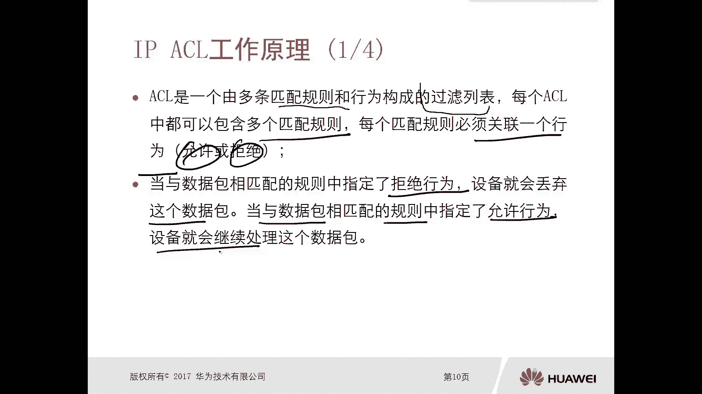
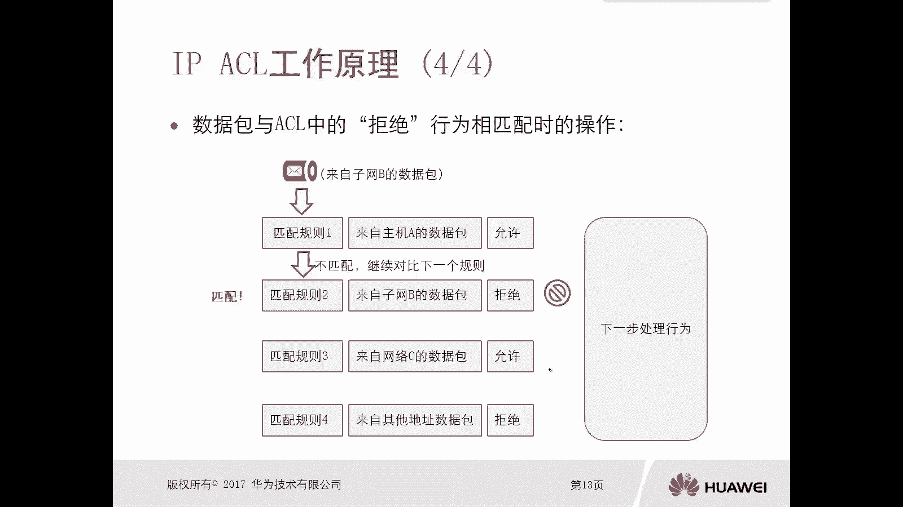
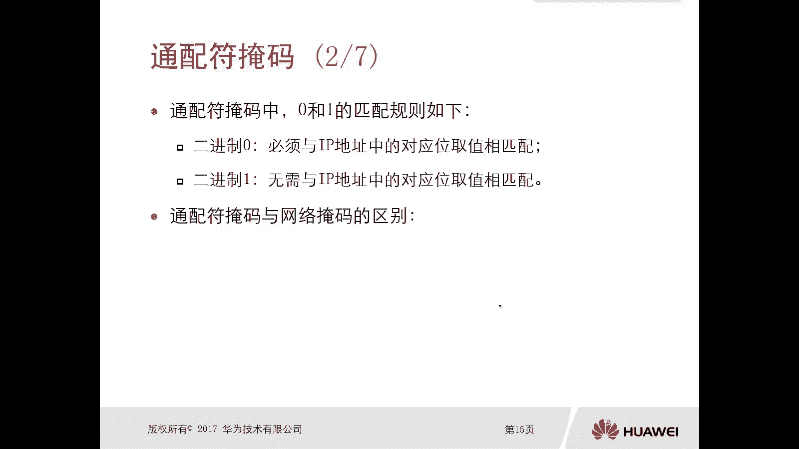
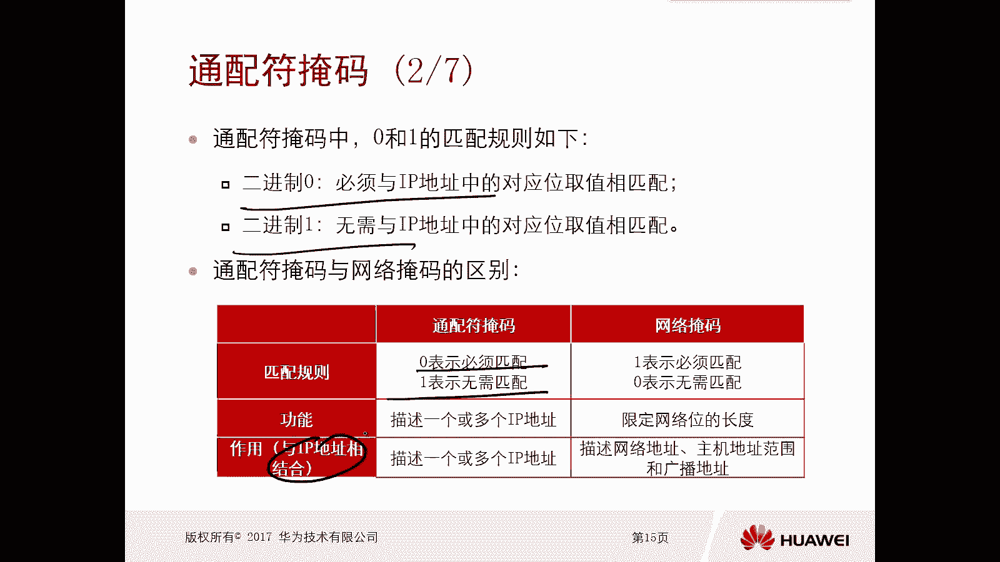
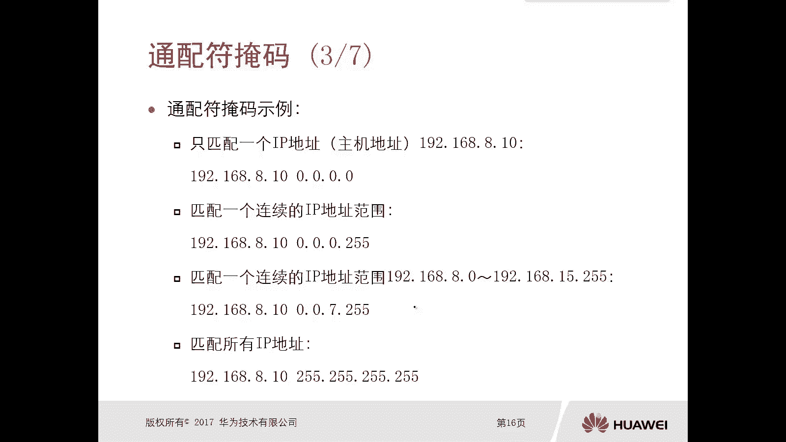
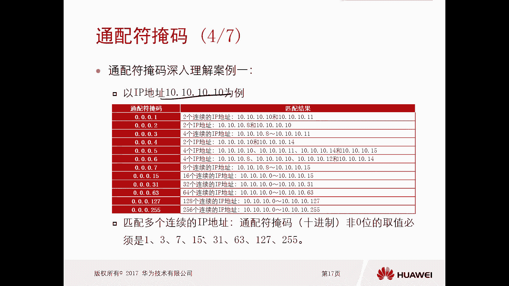
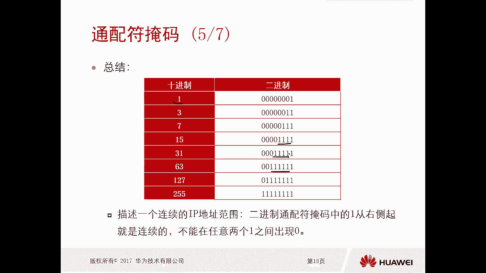
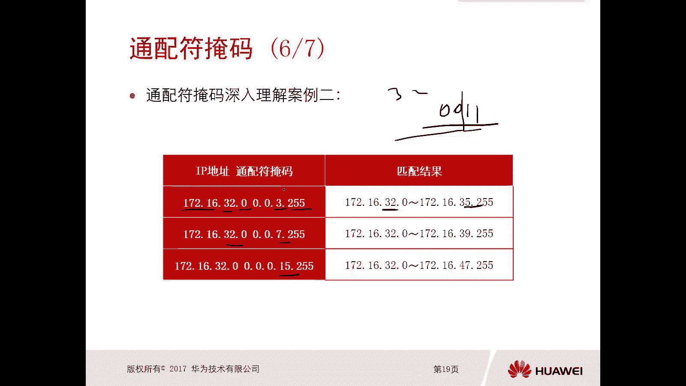
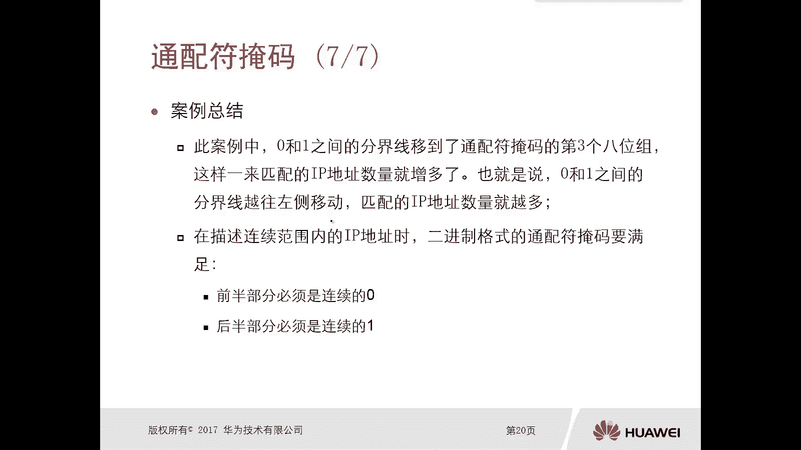

# 华为认证ICT学院HCIA／HCIP-Datacom教程【共56集】 数通 路由交换 考试 题库 - P42：第3册-第3章-1-ACL工作原理及通配符掩码 - ICT网络攻城狮 - BV1yc41147f8

好，那么接下来呢我们看一下这个IPACL，它的一个工作原理啊，哎我们先看一下啊，嗯那么对于这个A4L啊，它是由这个多条匹配规则和这个行为构成的，一个过滤的列表，那么每一个ACL呢。

它是都是可以包含有多个匹配的规则的啊，我们可以去设置规则一规则二规则三对吧，那么每个规则呢它必须关联一个行为，那么对于ACL呢只有两种行为，第一种是允许，第二个呢就是第二种就是拒绝，唉就这两种啊。

要么是允许，要么是拒绝，那么当与数据包诶数据包相匹配的规则中，如果你指定了拒绝的行为，你比如说拿了一个数据包，那么匹配出了这个A4L啊，正好匹配到的规则里边，他的行为是拒绝行为，那么这种情况下呢。

这个设备呢就会丢弃这个数据包，但是当与数据包相匹配的规则中啊，比如说这个行为指定是允许行为，那么这种情况下，这个设备呢是允许数据包继续对吧，处理啊，就是继续往后处理好，就是这个ACL。

它的一个这个大体的一个工作的原理啊。

好那么接下来我们就看一下啊，比如说下面那个工作的一个示意图啊，工作示意图，那么我们有多个规则啊，匹配规则，比如说规则一啊，那么规则一可能是这个来自主机A的数据包，哎我可以这样去定规则啊。

嗯同时呢他的行为呢是允许对吧，哎我还可以去设置规则二，规则二呢是来自子网B的这个数据包，哎那么行为呢是拒绝啊，就是丢包了对吧，规则三呢是来自网络C的数据包，也是允许对吧。

哎规则四呢是来自其他地址的数据包而拒绝，那么除了规则一，规则二，规则三能够匹配到的什么主机A的呀，子网B的呀，网络C的呀，剩下的其他所有的数据包，那么都会匹配到这个规则四啊，那么是拒绝。

那么当只有他的行为是允许行为的时候，那么这个数据包呢才会进一步啊，就会进入下一步的处理行为啊，就会进入到下一步的处理，如果说你的匹配规则，它的这个行为是拒绝，那么这个数据包呢只有一种结果就是被丢弃。

这个一定要注意一下啊，好那么接下来我们就看一下这个数据包，比如说在这个ACL对吧，他正好被这个规则匹配了，同时这个匹配的规则呢它是允许啊，允许这样的行为，那么看它是怎么操作的啊，比如说有一个数据包。

这个数据包呢是来自于网络C的数据包，来自于网络C的数据包，那么如果说你这个ACL有一条规则啊，它的规则是一，但是你这个规则是一呢，它是来自主机A的数据包允许，但是我们看你这个数据包是来自主A的吗。

不是是来自网络C的，所以说这一条匹配规则就是规则一呀，实际上是不匹配的啊，是不匹配的，OK那么这种情况下就继续比下一个规则，比下有规则，因为不学会嘛对吧，那么就进入到了规则二。

那么规则二呢是来自子网B的数据包拒绝，但是现在这个是来自子网B的数据包吗，不是他是来自网络C的数据吧对吧，所以这种情况下，这个规则二也是不匹配，那么不匹配呢就继续对比下一个规则对吧。

哎规则三规则三是来自网络C的数据包，OK那么正好和你现在的这个数据包相匹配，所以呢这个数据包呢就被规则三所匹配，那么就看规则三他的行为是允许还是拒绝，OK那么是允许对吧，那么就匹配了呗对吧。

那么行为是允许，那么既然是允许，那么这种情况下呢就要进行下一步的处理，哎该转发该转发对吧，哎该路由该路由好，那么可能你后边还有匹配规则，比如说匹配规则四对吧，虽然你这个匹配规则四啊是来自其他地址。

所有的数据包对吧，就是来自其他地址数据包，那么是拒绝，但是由于我已经匹配到了第三个规则，那么这个匹配的一个流程，还会不会继续往下匹配呢，哎不会没有吧，哎不会啊，就是ACL只要匹配住了。

那么后边甭管你是有多少个规则，他是不会再继续往下匹配了对吧，匹配住就结束好，这是这个数据包在ACL中啊，允许的行为相匹配的时候，它的一个操作，那么接下来我们看一下数据包在ACL中，拒绝行为相匹配的时候。

它的一个操作啊，哎那比如说来个数据包，这个数据包是来自于子网B的数据包，对要进行ACL匹配，那么规则一规则一呢是来自主机A的数据包，允许匹配吗，不匹配对吧，那么继续比较下一个规则。

规则二来自子网B的数据包，OK匹配了对啊，匹配了，那么这个规则二的行为是什么呢，拒绝，所以这种情况下这个数据包就会被丢弃，被丢弃以后，请问还需不需要进行下一步的处理呢，不需要还需不需要再往下匹配。

第三条和第四条呢也不需要对吧，刚才讲了，只要匹配住了，就不再往下进行了啊，那么对于我们ACL呢，呃我们开篇就讲了，他是有多个规则的啊，那么规则呢有1234，以此类推，那么它匹配的时候呢。

一定是从第一条开始匹配，从上而下的，一旦匹配住某一条规则，它就不再往下匹配了，OK好这是A4L它的工作原理好。

那么接下来我们再看一下这个通配符掩码啊，那么我先讲一下为什么需要通配符掩码，你看啊，我们说用A4L，一般情况下是用来过滤一些数据包的，那么过滤数据包呢就会有一个范围对吧，你比如说啊你是过滤主机A的呢。

还是过滤主机B的呢，你是过滤A网段的呢，还是过滤B网段的呢，有一个范围好，那么你通过什么样的方式，去表示一个地址的范围，或者或者叫做表示一个主机的范围，那么就是通过通配符哎，我们写ACL的时候。

是通过通配符的方式去表示，你这个A4L匹配的一个范围，是一个主机还是多个主机，还是很多个主机，对啊，还是是是A网段还是B网段，还是好多网段哎，就是通过通配符，所以说通配符掩码这一块呢。

是非常非常重要的啊，那么通分通配符掩码呢它是有两种表现形式，第一种呢十进制点分十进制，这也是我们写ACLACL的时候就经常用的，另外一种就是二进制啊，你比如说我们这个IP地址，IP地址范围啊。

假设1921688。0，到1921688。255对吧，那这里边实际上这个范围呢是主机，从一开始的对吧，一直到254这么多主机对吧好，那么我们这样的一个地址范围，我们我们通过什么样的掩码去标识呢。

是通过三个R五一个零，因为本身它是C类的一个地址，对不对，但是我们在写AACL的时候，写A4L的时候是不能使用掩码去代表啊，这些主机的就是写ACL的时候，注意一下，写ACL的时候。

你比如说我写IP地址的时候，我写个192。168点哎，8。1杠24，那么通过这个掩码表示我主机所在的网段，但是注意一下写ACL规则的时候，你让某个规则去代表你匹配的一个主机的范围，不能用掩码。

要用通配符掩码啊，那么如果说你想将标准1688。0这个段，所有的主机这个范围也匹配出来，那么你要用0。0。0。25哎，这个这个掩码我们一般情况下，有的时候还叫做反向马，其实反应马这个不是特别准确。

应该叫做通配符对吧，但是你看一下，和页码和这个掩码好像就是反着的，哎对吧，俗称反掩码，但是不要这样去讲，就是通配符掩码哎，同配符掩码，那么对于原版的二进制呢，哎那就是R5全都是一呗，0。0呗。

那么通配符呢哎零就是零吧，哎那么二五就是一吧，其实这个没有什么太大区别的，OK好注意一下啊，通配符掩码它是这样的啊，通配符掩码是这样的好，那么通配符掩码中，这个零和一匹配的是什么样的规则呢。

我们可以看一下啊，通配符掩码那边这个零和一，它匹配的规则是什么样的，第一个二进制里面的零，二进制里面的零是必须与IP地址中，对应位取值要相匹配，好这个可能放在这儿，可能大家还不太明白对吧。

那么一会呢我们讲例子的时候就明白了啊，我们先看一下，再重复一遍啊，二进制零必须与IP地址中的对应位取值相匹配，因为我们去写ACL的时候，它一般是先写一个这个地址范围地址段，然后再写一个通配符掩码。

我们要用你的IP地址和通配符掩码去做相遇，最终得到一个范围，那么二进制一，二进制一是无需与IP地址中对应的位置，取值相匹配，不需要相匹配的，所以说这个通配符和网络掩码就是通配符。

掩码和网络掩码有什么区别呢，来我们可以看一下匹配规则，上面对于通配符掩码零表示必须要匹配，一表示无需匹配，那么正好和网络掩码是相反的，网络掩码一表示要必须匹配，零呢是表示无需匹配。

那好那么功能对于通配符掩码来讲，它描述的是一个或者多个IP地址，唉它是描述的一个范围对吧，那么网络掩码呢它是限定网络的一个长度，不具备描述什么地址这样的一个功能，网络掩码是不具备的啊，那么作用。

比如说我们一般来讲呢，就是和这个IP地址相结合，你看你配置这个网络掩码的时候，也是有一个地址相结合嘛，对不对，哎那么对于通配符掩码和IP地址相结合，是描述一个和多个IP地址的。

那这是我们在cl里面要用的，那么网络掩码呢，网络掩码与地址相结合是描述网络地址，主机地址范围和广播地址的truth是吧，没有其他的作用，这就是它们的区别好可能在这儿啊，可能大家还是有点云里雾里啊。

不用担心，那么后面呢我们还会讲例子啊，我们在这呢只需要关注二进制的零对吧，是表示必须匹配，那么二进制的一呢是表示无需匹配啊，那么我们这个同配符掩码呢要和IP地址相结合，结合到一块去用。

你不用单独去用了，好，那么接下来呢我们就给大家看几个，通配符掩码的实例啊，比如说啊我现在有一个A4L的要求，要求只匹配一个IP地址，一个IP地址，那这个IP地址其实就是给主机地址，比如说191688。

10，假设我要在一台设备上做限制，我要配个cl，我要匹配这个主机，或者叫做这个地址，那么这种情况下我们写ACL的时候，那么它的前缀和通配符掩码写多少呢，1921688。10。0。0点零。

这个呢就是只匹配这一个地址啊，那么给大家讲一下为什么是这样的，好这个呢你这个是地址，然后后面是通配符掩码，那么通配符掩码呢，要和191680。0相做相遇，OK那么大家注意一下。

这一个零实际上是有几个零啊，是不是有八个零啊，哎这是八个零，这是八个零，这是八零，正好是八个零，对应的上面八个比特，八比特，八比特八比特，而且我们讲了通配符掩码里面的零是必须匹配。

那么必须匹配那四个零呢，意味着我必须是1921688。10张的地址，没有吧，我必须是1921688。10这样的地址，因为你四个都是零啊，就必须要匹配，你看他俩是结合用的啊，这样就匹配了这个IP地址了。

好我们再继续往下看啊，比如说匹配一个连续的IP地址范围，假设我我我有一个需求，需求呢，是将网络里边的192。168。8。0啊，这个段里边啊，这个段里面的所有的主机是吧，所有的主机匹配出来。

所有的主机匹配出来，把所有的主机匹配出来，那这个8。0里面有包括多少，1~254对吧好，那么这种情况下，我们应该怎么去写这个A4L呢，还可以这样写，1921688。0。0。0点二五好。

我们还做相遇相遇呢，就是1921688必须要匹配，但是我后边这个是R5啊，R5是八个一啊，就写出来，123456789212345678，没九啊，怎么有九呢，12345678好。

这八个比特全都是一表示和IP地址，后面的八个比特啊，做做做做结合啊，就是后面那个八比特，你任意你随便随便就是我可能是一哦，我可能是二哦，我可能是三哦，我可能是100哦，我可能是254。

所以说有多少可能呢，1~254，那么这种情况下，通过这样的一个A4L就匹就匹配住了，只要是八网段的主机，只要是八网段的IP地址都被我匹配住了，没问题吧，OK好，那么接下来我们再看第三个，第三个。

第三个呢是匹配一个连续的IP地址范围，假设我想让大家匹配到的范围是，8。0到15。255，8。0到15。255，哎这个有点难度，对不对，唉那这种情况下呢，你得去找你的。

必须要匹配的部分和不必须要匹配的部分，那么你必须要匹配的部分呢，是192168对吧，然后对于后面这个零，你看零是到255，那这个呢肯定是随便匹配，所以这个掩码呢我们这个通配符掩码呢。

我们可以确定的是诶这一位肯定是零，这一位肯定是零，那么中间这位空着，后边这一位呢一定是255，就是通配符对吧，那么对于这一位，你怎么通过通配符表示8~15，那么我们就要把这个8~15。

它的这个二进制哎给写出来，那八我们通过二进制写啊，这个八二进制写出来是多少呢，啊就是123，45678对吧，因为这是二进制嘛，124哎，不是这个啊，这是零，应该是这样的啊，零在这呢重写一下啊。

好我重新写一下啊，哎刚才确定了是零零空对吧，255K那么这个八呢它的二进制对吧，是多少，是12341234，这是八吧，对吧，哎这是八，然后九九就是一二，341121，这是90呢，1234好。

然后后边呢是这个叫做一二呃幺零，这是十，对不对好，然后11啊，再写出来，123412011好，12，然后都写出来吧，12341100对吧啊，十二十31234好像是腰101哦。

十四十四呢就是12341110啊，那么15呢写不下了啊，15就写这了，1234对吧，四个零，然后是1111哎，这是五好，那么这种情况下，你就把这从8~15这几个二进制去比一下，看看哪一部分必须是一样的。

哪一部分是哪一部分是一样的，对不对，应该是这位，你看到这啊，解开就是都是一都是一后面这个任意变化，好那么这样的一个掩码，因为我写的是我写的是这个不叫掩码地址对吧，因为有可能是8。0，有可能是这个九。

有可能是11，直到15，就这一位啊，就是第三个八个比特组，那么这种情况下啊，这种情况下，你怎么去通过一个通配符掩码去表示，去表示对吧，前面这五个比特必须要完全一样，后面这个任意呢，后面这个任意呢对吧。

那就是我前面必须一样，我通配符用几表示必须要匹配啊，是不是用零啊，就是1234同时再加一个零五个零对吧，那么后边三个比特，你任意的话，通配符掩码用零还是用一表示任意呢啊，用一要要要诶。

这个写出来就是我们空档的第三个啊，通配符它的一个数字了，那这个是多少呢，是七，对不对，哎这这就是七，所以这个做完以后啊，他应该是19688。100。0。7点二五，唉，这样的话就可以匹配出来8。0。

一直到15。255这样的一个范围，好那么下面那个匹配所有IP地址，匹配所有IP地址，那就112128，8。025252525对吧，都任意对吧，都任意，那那所有的都匹配了，对不对，OK好。

这是这个通配符掩码好，那么下面呢就是更深的一些案例了，这个大家都可以去算一下对吧，通配符掩码如果是0。0。0。1，那么如果这个IP地址啊，那么它的通配符掩码第一个是0。0。0。1。

那么这个IP地址是多少呢，然后二啊三啊四啊，一直到这个255，那么呃这个嗯地址你看啊有两个的，有四个的连续的对吧，然后四个八个的，16个，三十二六十四，128，256等等对啊，所以说我们看。

当你匹配多个连续的IP地址的时候，这个通配符掩码十进制，非零位的取值呢必须是1375，三十一六十三，127对吧，二百五十五六十，其他的对吧，就是匹配多个连续的多个连续地址的时候，都是这样的对吧。

哎多个连续的时候一定是1357 15。

316312712百五十五好，所以说我们可以看一下啊，这个总结就是当我们去描述连续的IP地址范围，那么二进制通配符掩码中的一从右侧起，它是连续的，不能在任意的两个一之间出现零。

你看当你的十进制是一的时候，你的二进制是00013呢是幺幺对吧，新的是幺幺十511，什么3A1多个一对吧，那这些肯定是连续的，有没有出现什么101111不可能对吧，通配符从右开始，他的一一定是连续的。

不可能中间出现零。

不能按零啊，那么接下来我们再看一下这个啊，这个同步源码深入的理解，案例二，这个实际上我刚才已经讲完了对吧，哎如果说你你这个IPACL里面写的是172，16。32。0，然后0。0。3。25。

那么这个可以确定的是，17216必须要一致对吧，然后后边这个零呢，十二五表示这个零呢也可以是任意，就是这个段啊，这个主机可以是任意对吧，你从一开始一直到25，然后中间这个333是多少。

三是0110011这样的对吧，那么说明前面这些必须要完全匹配，后面这一位呢随便对吧好，那这种情况下32，那么到多少呢，35，因为你前面是32，32，再加一三十三，加234加三三十五对吧。

就是32~35啊，那么后面的实际上是一样的啊，32。07啊，15啊，哎这个如果说啊你你这样一一眼，实际上呃刚开始学的时候，肯定是一眼看不穿的对吧，哎我们可以通过按照我刚才那种方法，你把十进制写成二进制。

然后通过IP地址和这个这个通配符，进行一个与啊去对比去结合。

然后就能写出来它的范围好，所以呢我们就做一个总结，那么在这些案例里边啊，我们零和一之间的分界线呢，移动到了通配符掩码的第三个八位，第三个八位组，这样一来呢匹配的这个IP地址数量就增多了。

那么也就是说你这个零和一之间的分界线，越往左移动，大家想一想啊，越往左移动匹配的IP地址数量就越多，越往右移动呢匹配的数量就越少对吧，哎而且在描述这个连续范围内的IP地址的时候。

二进制格式的通配符掩码要满足，前半部分必须是连续的零，后半部分必须是连续的，E不可能对吧，中间会插入E，中间会超零的，唉总结一下啊，一定是前半部分是连续的零，后半部分是连续的一，这就是我们的通配符掩码。

正好那个网络源码是相反的。

