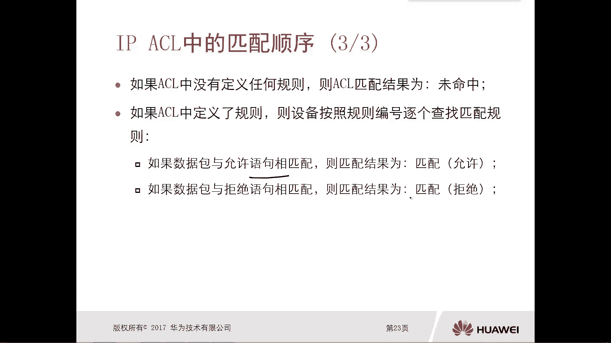

# 华为认证ICT学院HCIA／HCIP-Datacom教程【共56集】 数通 路由交换 考试 题库 - P43：第3册-第3章-2-IP ACL中的匹配顺序 - ICT网络攻城狮 - BV1yc41147f8

好那么接下来接下来我们继续往下看啊，那接下来我们看一下这个IPACL中，它的一个匹配顺序，那么在有多条匹配规则的ACL里面，那么往往我们去配置ACL的时候呢，嗯很有可能会配置多条规则啊。

那么有多条规则都存在的情况下，这个数据包呢它是按照顺序从上到下啊，与多个规则进行一一匹配的。

那么ACLAACL中的每个条目，也就是这个匹配规则，它都有一个相应的一个编号啊，相应的编号，那么缺省呢，我们去配置A4L的时候，你可以去指定这个编号，比如说你指定一啊二啊三啊。

那他就按照这个顺序从小到大啊，这样对这个数据包进行匹配，但是如果说你没有去指定这个编号啊，你写了一条又写一条又小条规则对吧，你可以按照写好多条规则，那么缺省你第一第一条写的规则，它的编号是五。

第二条写的编号的规则是这个呃，写的规则的编号是十啊，那么也就是说它的步长是五啊，以五递进的啊，就是五十十五，二十二十五，以此类推啊，所以说你没有去写编号也没关系，先写的哪个规则，它就是在上面啊。

它的编号就会小对吧，然后写的就一次增大啊，那么当有了这样的一个编号，那么当设备收到数据包以后，然后根据AACL里面的编号从小到大的顺序啊，去对数据包进行一个匹配，哎这是这个匹配顺序啊，一定是从小到大的。

那么在设计ACL的条目和它的顺序的时候，作为我们我们管理员来讲，我们要考虑以下几点，第一个呢是设备会按照从上到下，也就是这个编号从小到大这样的一个顺序，依次去匹配这个数据包，哎这个一定要注意对吧。

你不要搞错了，你把大你把这个想要首先匹配的放下边了对吧，很有可能匹配不住啊。

或者很有可能会有问题啊，第二个呢是，一旦数据包与当前的规则匹配成功啊，那么设备呢就会按照当前规则中指定的行为，来处理数据包，要么是允许，要么是丢弃对吧，这个一定要注意，前面我们讲过了，一旦匹配成功。

它就不会再往下匹配了，所以这种情况下呢，这个A4L的匹配行为呢对于这个数据包来讲，那么就到此结束了啊，那么设备呢是不会继续在A4L中，查找其他的匹配条对吧，哎这种情况下一定要注意了，一定要注意了。

我们写A4L的时候，一定要注意好。

那么如果说这个ACL里边，你没有定义任何规则，那么这个ACL匹配结果呢就是为命中，如果说你ACL定了规则啊，那么这个设备呢它就会按照规则编号，逐个去查找匹配规则对吧，那么有三种情况，第一种。

如果数据包与允许语句是相匹配的，然后这个匹配结果哎就允许呗对吧。

如果数据包与拒绝语句相匹配，那结果呢就是拒绝吧，丢包对不对，如果数据包和管理员，你明确配的语句都不匹配对吧，我配了那么多规则，一个都没匹配，那么这个匹配结果呢就是未命中。

那么ACL它缺少有一个未命中的一个动作，那就是允许所有对吧，你你假设啊，我写了五条规则，五条规则对于这个数据包都没有匹配住，那就是没命中，那么缺少，那这个数据包怎么办呢，允许通过，没事吧。

哎对于我们华为设备上的ACL缺省是允许的好，那么接下来呢我们就看一下这个A4L，它的方向，对于ACL我们可以用应用在这个录像，也可以用在设备的出现，我们先看录像，那么在这个路由器去转发数据包的时候呢。

会有一个接口接收数据包，并从另外一个接口转发出去对吧，唉那么因此呢，这个数据包可能会经有两个A4L型过滤，如果说啊你在两个接口都设置了ACL，那么很有可能就会经过两个AC好吧。

哎一个呢是当你接收数据包的时候进行过滤，那也就是说在这个入站接口上对吧，你数据包进来的时候，就做一个这个录像的ACL过滤，很有可能你从另外一个接口转发出去的时候。

就出站的时候又进行了一次ACL的过滤问题吧，哎这个ACL，这个很像我们实际生活中的安检对吧，很像我们实际生活中的一个安检对吧，你进去要这个做一个安检，要出去也要做安检，在什么情况下会有这种效果啊。

比如说我们坐火车对吧，坐火车还坐火车，那你从北京坐到保定对吧，那你在北京火车站进站的时候，是不是要过安检呀，要看看有没有这个违法的一些这个呃，刀具啊是吧，这个汽油啊等等是吧，爱违规的做一次对吧。

当你到了保定终点站下车了，又出去了对吧，这个绑定可能还要做一次案件对啊，如果严格的情况下他要做的啊，但是我们一般情况下出站还不做，出站的时候不做，一般都是入站的时候做，但是比较严格的时候啊。

比如特殊时期他可能要给你做啊，就类似这种效果啊，OK好，那么接下来我们就看一下啊。

这个嗯示意图，那这个示意图呢就是你看这是一个路由器吧，对不对。

然后路由器，那么它有一个这个入口啊，那么有一个呃这个出口，那么当然你这个入口和出口，是针对数据流的一个方向而言的，如果你对对于一个从左到右的数据，那么左侧呢就是入口，右侧就是出口。

那么对于一个你这个叫做从右到左的数据对吧，因为我们数据都是双向的对吧，那么你右边的就是入入口，然后左侧呢就是出口。

对不对，OK好，那么我们就可以在这个接口上去嗯，设置这个录像ACL对吧，哎出向ACL入像cl出向AC对不对啊，那么你进来的时候经过ACL的处理，那出去的时候还要进行SL的处理对吧。

回报的时候你经过录像A4L出去处理，出去的时候还要进行进入这个呃，呃进入到这个抽象ACL进行处理，OK好，那么并不是意味着我们去部署ACL的时候，都要在入站和出站共同部署，不一定的。

很有可能是诶我们在入站做了，出站不用做了，或者说你在出站做了录像也可以工作了对吧，哎这个针对你的一个场景的不同啊。

我们可能做的一个方式也是不一样的好。

那么我们接下来看一下这个录像的cl啊，那么数据包在进入路由器的接口的时候，会受到这个入站接口上应用的这个录像的IP的，ACL的规律啊，很有可能会产生两种结果，一种结果呢就是这个路由器啊。

把数据包转发给路由转发进行进行处理，那么什么情况下，路由器会把数据包转交给这个路由器转发，进行进行处理呢，比如说这个接口没有意思啊，啊这这就不算了，因为你说的是有ACL的情况下对吧。

那么当你有ACL但是不匹配，就是未命中，或者是你命中了是允许的语句的时候，是不是都会交给路由转发进行进行处理啊，对啊，那么另外一种情况就是路由器会丢弃数据包，就是有A4L了，匹配了啊，行为呢是拒绝。

那这个数据包就被丢弃了，对不对。

进不来，OK好，那我们就看一下这个IPACL。

他这个应用位置和方向的一个示意图，哎是这样的对吧，哎在这个路由器的入接口，我们设置了一个ACL，那么ACL呢有好多规则对吧，OK那么来的数据包呢，从规则的第一条开始往下匹配对吧，唉那么也可能是拒绝掉。

有可能是允许对吧，那允许的才会进入到这个路由转发进程啊，比如说插路由啊，哎从接口扔出去啊对吧，好拒绝的就不用讲了对吧，把数据包就丢掉了，那么既没有被匹配拒绝，也没有被匹配允许的呢，那就是未命中。

未命中呢依旧是要交给路由转发进程的。

唉这个注意一下好，那么接下来我们就看一下这个入入站的数据包，过滤的流程的动图啊，哎比如说我们从接口接收到了数据包，那么首先是否应用了这个入选项对吧，如果没有的话，那看什么看呀，对不对。

就把数据包交给这个路由转发进程，如果有ACL，OK从第一条开始匹配，如果匹配住了允许，那么就转就转交给这个路由转换进程，如果匹配住了，是拒绝，OK丢弃数据报，如果说第一条规则没有匹配。

那么就匹配第二条规则，那么第二条规则有两种可能匹配了允许啊，那么继续转发哎，拒绝丢弃数据包，很有可能也没有匹配对吧，可能你有N条，到最后所有的规则都不匹配的情况下，OK那么就是为民众。

那么未命中的数据呢最终是允许的，没问题吧，未命中的数据最终是允许的，就会把这个数据包呢，交给这个路由的一个转换进程。

哎，这是这个入向的IPACL它的流程图，那么接下来我们看一下初向的IPACL。

那么初向excel呢是当你要对这个数据包进行转发，那么首先你路由器肯定是查询了IP流表对吧，然后找到了这个数据包哎，应该从哪个接口扔出去转发出去对吧，那么这个数据包就会受到这个出站接口应用的。

初项的ACL的规律，并且呢也会产生两种结果，第一种转发数据包，转发数据，第二种有可能又把数据包给丢起来对吧，那么转发出去很有可能就是这个A4L匹配了，是允许这个数据包通过的，那么就转发出去了对吧。

或者说你未命中也转发出去，那么什么叫丢弃呢，哎匹配了，而且行为是拒绝的。

哎那么就会丢弃数据包对吧，来我们看一下示意图啊。

就这样的对吧，哎你这个路由器收到一个数据包，要从出接口转换出去了，如果说你这个出站接口，应用了这个接出接口的A4L，那么你有好多规则，那就匹配呗，拒绝就丢弃了，允许转发。

未命中呢也是转发，这样好，我们再看一下这个出站数据包，过滤的一个流程图啊，哎比如说数据包到达了出接口对吧，那么还要去看有没有用ACL，如果没有，那就直接转发了对吧，如果有就去匹配第一条规则。

如果匹配住了，而且行为是允许的，那么进行转发对吧，如果匹配住了是拒绝，那么丢弃数据包，如果第一条规则没有匹配，就OK第二条哎，第二条呢有可能匹配出来是允许让你们转发，有可能匹配出来是拒绝丢弃。

如果你好多就是你所有的这个规则都不匹配，那么就是未命中未命中呢，实际上缺少的就是允许数据包，通过看好这个就是IPACL它的一个匹配顺序，包括我们在路由器上，你可以去设置出向的ACL和入像的ACL。

包括入像cl，出像ACL它的一个过滤的流程图啊。

