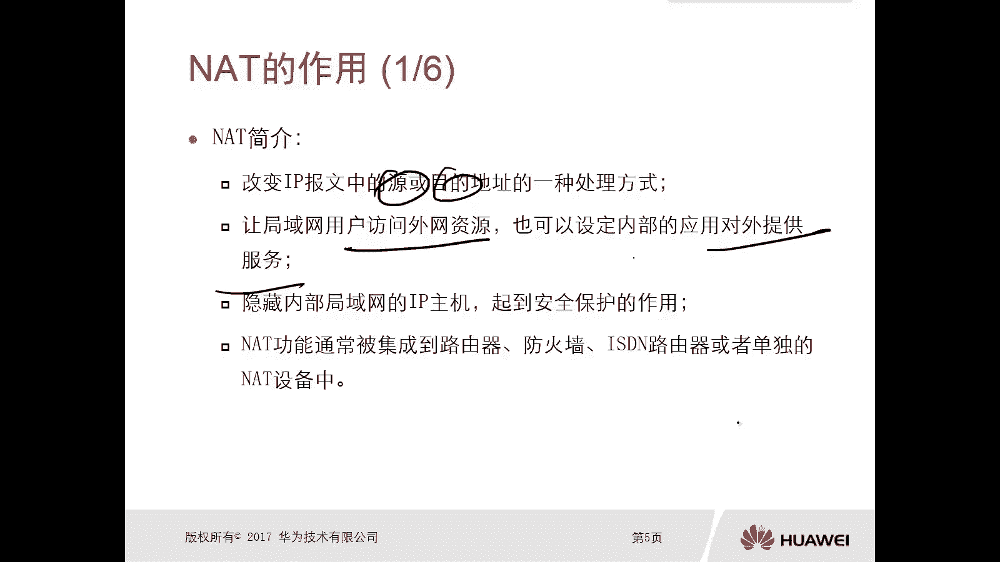
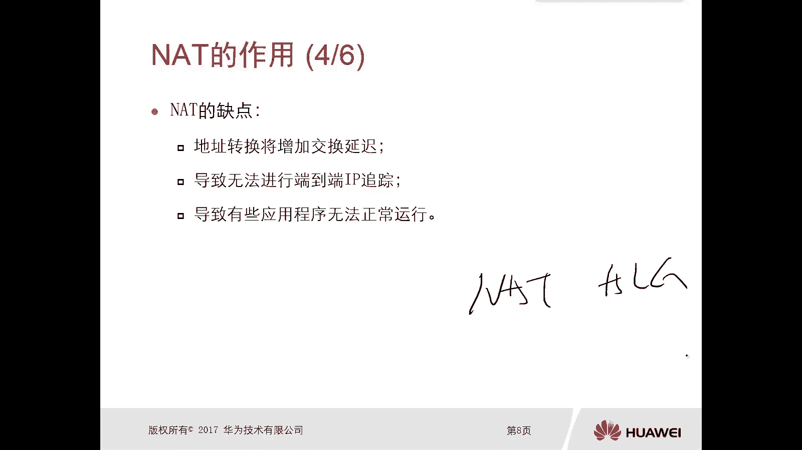
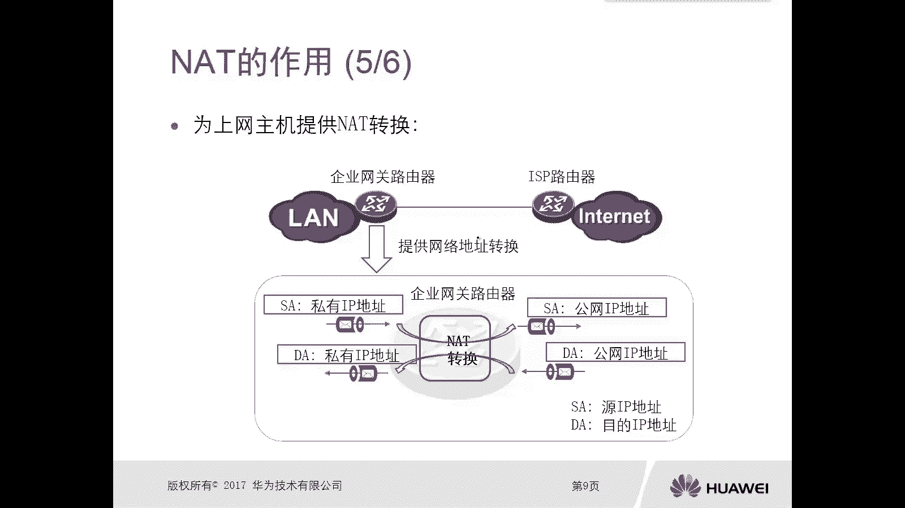
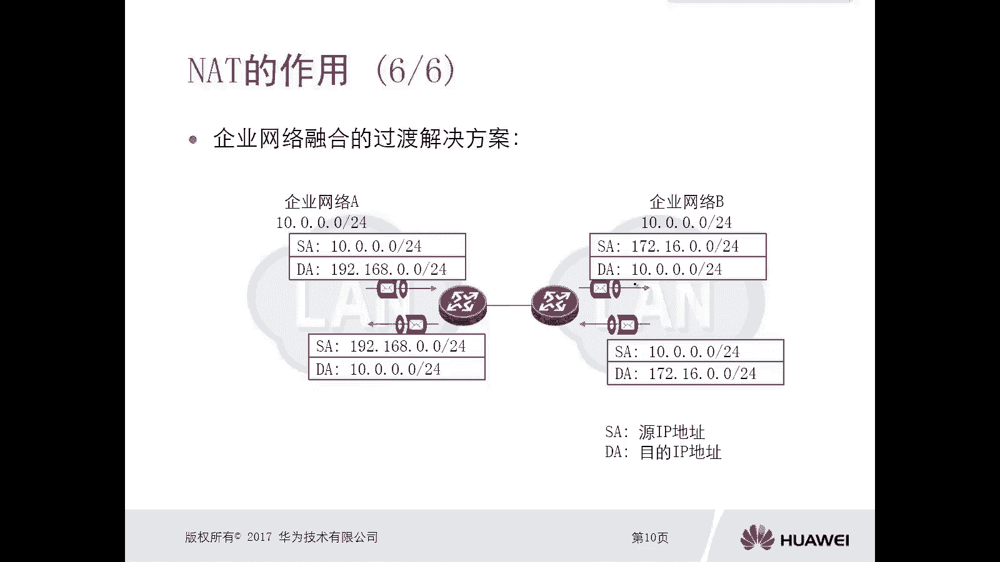
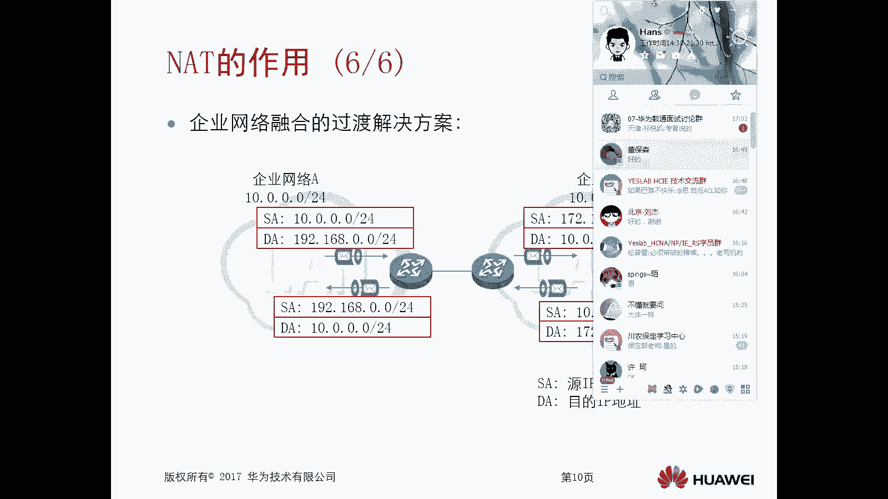
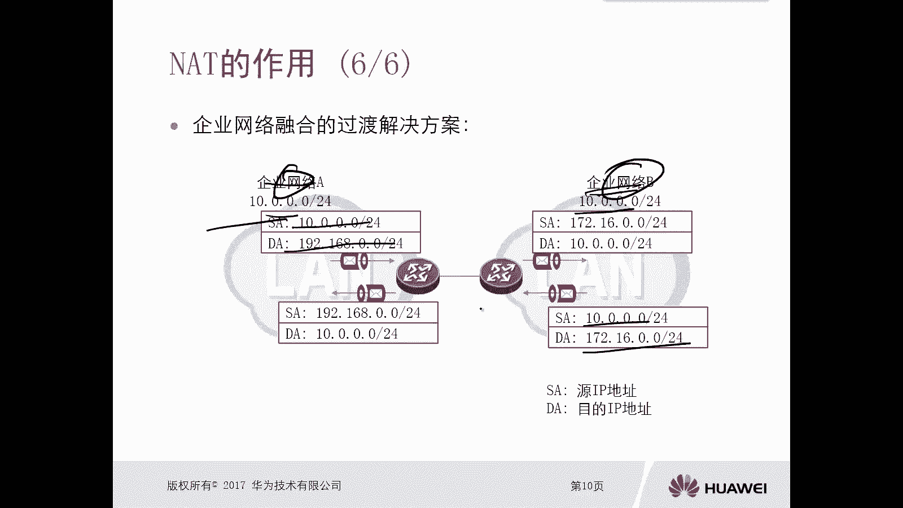

# 华为认证ICT学院HCIA／HCIP-Datacom教程【共56集】 数通 路由交换 考试 题库 - P44：第3册-第4章-1-NAT的作用 - ICT网络攻城狮 - BV1yc41147f8

好那么接下来我们看一下这个NT技术啊，那么首先我们先看一下这个NT的一个作用啊，那么再看这个NT作用之前先介绍一下这个NT，那么对于这个NT呢。

它的全称叫做network address translation，那么叫做网络地址转换啊，那么这种技术啊，那么这种技术呢一般是用在哪呢，用场景是这个私网IP地址，和这个公网IP地址之间。

它执行一个转换，那么场景呢就是比如说我们的企业网，那么由企业内网对吧，那么企业内网的用户呢有上因特网啊，就是需要连接因特网站的需求，所以在这种情况下呢，我们需要在这个企业网的一个网关出口设备上。

要去部署这个INT技术，那么对于这种NT技术呢，可以这样说，在我们所有的企业网络中，都会使用所有使用对吧，因为在我们企业网内部呢，你全都是使用的这个私网地址，进行互联互通的对吧。

那不可能说我们这个部署这个呃网络的时候呢，你把这个内网搞成一个公网，即使你搞成一个公网地址部署，实际上你这个公网地址，能不能在因特网上进行一个互联呢，啊是不可以的啊，是不行的对吧。

所以说我们在学习这个呃地址哎，在学习这个IPV4地址的时候呢，就假了对吧，有什么ABC类，那么每一类里面都有私网地址，那么私网地址的目的呢，就是当我们在内网进行部署的时候呢。

我们要采用私网地址的方式应部署对吧，那么这种情况下呢，我们需要如果说你需要上这个特网互联网，那么你需要去购买这个网络带宽啊，去购买这个公网IP地址，一般呢我们是进入到运营商。

运营商会给你分配一个或者是几个，这个一般情况下不会特别多啊，会给你这个公网地址啊，你可以利用一个公网地址或者多个地址，然后实现全公司内网，所有的用户进行一个互联互通，那是怎么实现呢，那就是使用NT技术。

哎，所以接下来我们就看一下，这个NT的一个简介啊，那么NT呢，它是改变这个IP报文，中原或者目的地址的一种处理方式，那么按照我刚才讲的，就是你的内网的用户实际上是私网IP地址。

那么你想要去访问公网上的一些资源呢，那么你最终的数据包到达运营商的时候，就是或者叫做到达英特网的时候，它一定是源和目的地址呢全都是公网地址对吧，但是你实际呢你是私网地址，那么怎么变成公网地址。

那么就是要进行一个改变对吧啊，不管是改变圆也好，还是改变目的也好，那么场景不一样呢，它改变的目的或者改变的原因是不一样的对吧，也有可能改变的是圆，有可能改变的是目的好，那么第二个呢。

是让我们的局域网用户访问外网资源，那么也可以设定内部的应用对外提供服务啊，那么如果说你是为了让局域网的用户，去访问外网的资源，那么一般呢我们采用的是这个，原地址的转换技术。

如果说你为的是对外去提供一个服务啊，对外提供服务，也就是说你比如说你有一台服务器对吧，你想让外网的用户去访问你内网这台服务器，那么这种情况一般我们是对内网的服务器，它的目的地址进行一个转换啊。

所以说这个场景不一样啊，你转换的这个地址啊也不一样嗯，好那么对于NT技术呢，它是隐藏了内部局域网的IP地址主机对吧，就是隐藏了内部局域网的IP主机，那么起到了一个安全保护的作用。

因为只要你局域网的IP主机，要去访问这个外网的时候，他都会去做一个地址转换对吧，所以说呢那么你访问到外网的一些资源，那么外网的一些这个比如假设攻击者吧，他实际上是不清楚你这个主机到底是哪一个的，对不对。

隐藏了，那么对于NT的功能呢，嗯你像我们现在最常见的一些设备，比如说路由器啊，防火墙啊，或者是SDN路由器啊，或者单独的NT，那么这些设备都是可以支持的啊。

都是可以支持的，好这是这个NT的一个简介啊，嗯那么接下来我们看一下这个丝网啊，这私有网络预留的IP地址空间，那这个算是一个回顾了对吧，我们在讲IP地址分类的时候，应该讲过有一个组织叫做IANA。

它规定了诶哪一段是公网地址，哪一段是私网地址对吧，同时它也规定了诶公网地址哎，这段是给哪个运营商的，这一段是给哪个运营商的，对不对，也不能随便哎，不能随便去冲突的啊，不能随便去分配的啊。

要不然你分配不合理，可能就有冲突，那么对于这个IANA呢，他在这个ABCD呢，它都预留出来了私网地址啊，那比如说A类呢它预留的是10。0。0。08，这样的一个地址范围对吧，是10。0。0。0。

一直到10。252525对吧，那么B类呢是172160。622，那是172160。0到172。3，1。2525，C01921680。0杠16，就是1921680。0，到192182525对吧。

那么为什么这个他要分配出来这么多，这个私网地址呢，那么实际上它的作用呢，他的目的也是为了实现复用对吧，你甭管你是哪个企业网啊，甭管是100个企业还是1000个企业，那么这些地址随便用。

因为本身这些地址呢它都是丝网的地址对吧，那你用了没关系啊，那有人记下了，这不冲突了吗，冲突不了了对吧，你内网自己通信，只要不冲突就可以了对吧，你A企业和B企业有冲突，有什么关系呢对吧。

那当你A企业和B企业，想要去访问因特网的资源的时候，能用这些私网地址吗，肯定是不可以的，必须要采用公网地址，对不对，那官网地址怎么办，那么就是利用ND艺术哎，所以说NT有哪些优点呢。

那么第一个呢节省了合法的注册公网地址对吧，假设A企业还有100个这个员工，那假设100个员工都要去访问因特网，那么有两种方式，第一种方式呢就是你这个企业呀，花钱买100个公网地址。

给所有的员工一一分发对吧，那这个公网地址价格不菲啊对吧，何况是100个呀对吧，那我是不是可以通过NT技术对吧，我可以买一个公网地址对吧，我用AT进行转换，你甭管是100个用户还是100是200个。

这个员工，不管是100个员工还是200个员工都无所谓，就我用一个就可以搞定了对吧，那这种情况下，你看是不是节省了这个公网地址啊，好第二个呢在地址重叠时呢，可以提供这个解决方案啊。

在地址重叠的时候可以提供解决方案啊，你比如说这个两个企业要做一个融合，但是他们的地址是有重叠的，那没关系，我可以通过NT进行解决，如果没有NT技术的话，那么你地址重叠是没法实现通信的，是有问题的。

那么第三个呢是提高连接到internet它的灵活性，第四个是在网络发生变化的时候，它避免重新编辑，这个就不管了是吧，其实这个NT技术出现呢，它最主要的原因就是解决这个公网IP，VCD是不足的问题。

因为实际上你看我们那么多地址，但是实际上可用的公网IP地址是很小的对吧，很少的不够用的，那么就去用NT，但是现在呢我们IPV4地址啊，不仅仅是面临的公网地址不足的问题，现在面临的一个最大的问题是。

IPV4地址都不足了对啊，因为随着我们这个网络的发展对吧，那么官网地址不够用了，甚至是现在已经枯竭掉了，就没有了，IN这个组织呢，所以说呢有必要唉，我们后期好好学习一下IP6啊。

那么IP6呢是可以从根本上去解决这个问题的，对吧，地址不够用的IPV6，IPV6最大的特点是什么呢，是我近乎啊有这个无限的地址空间好，这个是后话了啊，后边是讲IPV6的时候再讲好。

那么NT有优点也有缺点啊对吧，缺点是第一个，因为它进行进行一个地址转换，那么地址转换呢肯定有时间，多多少少有个时间，那么就会增加这个交换延迟，但是这个延迟呢嗯在这种嗯设备硬件硬件。

设备它的一个发达的一个状态下啊，那么这个延迟呢我们可以忽略不计啊，第二个呢是导致无法进行端到端的一个，IP居中对吧，为什么现在我们说这个有一些网络犯罪对吧，网络诈骗，那很难去找到。

很难去找到这个犯罪者他的IP啊，因为有NT这种技术啊，很有可能你一层NT，两层NT甚至是多层NT，那你这个追踪起来就很麻烦了，对不对，那我们看到有一个人在这个用用一个QQ，还在这上网。

或者说有用用一个什么其他的一些客户端采访，我们呢，我们是能够追踪到他的一个公网地址，但是你也很难追踪到他的一个私网地址对吧，除非他在线能找到对吧，这样就加大了一个难度啊，加难度。

而第三个呢是导致有些应用程序无法正常运行，你比如说某些呃这个特殊的应用，比如说FTP，如果说仅仅是开启了NT这样的功能，那么FTP呢它是没法去实现的，我们还要开一个叫做NTALG。

基于应用层网关的一个NT技术啊，这种情况下这个FTP才能够得以实现啊。

这是NT的一些缺点啊，好那么接下来我们就看一下啊，第一种场景啊，就是为我们上网主机提供这个NT的转换啊，那么提供转换，那么最常见的应用场景就是这个对吧，我们唉我们这边呢是一个企业网关路由器。

那么这边呢是企业内网，那么企业网关路由器呢，它连接了运营商的一台路由器，那么运营商后面呢就是因特网了，对不对好，那么我们怎么让企业内网的用户，能够访问到这个因特网呢，哎。

那么需要在这个企业网关路由器上去部署，这个T技术，还有就是部署这个NT技术好，这是我们的企业网关路由器，假设我们部署了部署以后呢，那么如果说你内网发送一个数据包，要去往因特网。

那么你这个内网实际就是原发出来的这个数据，它的原地址一定是私网地址，那他的目的地址肯定是个公网地址对吧，你比如说你去访问百度嘛对吧，你通过DNS解析回来的肯定是一个公网地址。

那么原地址一定是一个私网地址，那么这样的数据包，这样的数据包如果说没有NT艺术，它是能出去的，因为你有缺省路哦，你是能出去，但是回不来，因为运营商根本不知道你的私网地址诶，怎么回去啊，不知道对吧。

所以说呢在企业网关路由器上，我们要提供NAT这个地址转换啊，要设置这个NT技术，那么它会将这个私有的IP地址就是源啊，私有的IP源地址转换成一个可用的公网IP地址，哎怎么出去了，那运营商一看，哎。

你这个圆是一个公网地址啊，那我就插入图表，我肯定是有的对吧，然后进行回报了就对吧，那么回包的时候，那么目的地就是公网IP地址了对吧，因为这是这个基本的通信，我觉得不用再给大家去解释了，对不对。

因为你你过来圆，那么回去的时候肯定圆就变成目的了，它是一个它是一个相互镜像的一个过程，倒过来了，对不对啊，所以这个运营商呢，它的英特网的设备进行回报的时候，这个destination就是公网IP地址。

那么这个公网IP地址呢，根据路由最终是被给被他，被他指引到这个企业网络服务器，那么企业网关路由器呢又做了一次NT转换，把这个目的的公网IP地址转换成一个丝网的啊，丝网的目的啊，这个IP地址。

而最终的数据包就转发到了这个内网，那这样就可以实现一个通信，好，这是这个微商网主机提供T的一个转换啊，好这是第一种那种场景吧，这是最常见的最常见的，我们可以这样说，我们所有的企业都会用啊。

都会用好，那么另外一种呢我们可以看一下，就是在这个企业网络融合的一个过渡解决方案，还可以采用这个NAT啊，那么在什么情况下会有这种过度解决方案呢，哎你比如说我有一些大型企业，他有这个合作伙伴对吧。

那么这个大大大型的企业呢，要需要和合作伙伴来进行互联对吧，那么一般情况下我们为了确保一定的安全性，那么管理员可以使用这个NT技术，将我们企业网的地址呢进行一个转换。

这样呢可以隐藏自己的一个内部网络架构对吧，那合作伙伴可能看到的是另外一段地址，但实际上你用的是这段地址吗，不是还有一种呢，比如说我们企业，可能把多个企业进行并购了对吧，那这个被并购的这些企业呢。

可能他们之间也需要进行互联互通。

但是他们的这个规划网段呀有可能是重重叠的，你比如说我们这个图上面就是。

啊比如说我们这个图上面就是哎，你比如说这个企企网了，A起了A10。0。0。0对吧，那么企业网络B呢它也是10。0。0。0，那他们两个之间呢互联到一块，能不能这样肯定是不可以的对吧，那你10。0。0。

0去访问10。0。0。0，那不是本地址了吗对吧，所以说我们可以让企业网络A，让10。0。0。0去访问，191980。0对吧，然后在这个路由器设备上呢进行一次转换，把它的原地址变成17216000。

目的地呢再变成企业网络B的10。00000，而最终呢就能够访问到企业网络，B的10。0。0的资源，那么企业网络毕竟回报的时候，他的语言是10。0。0。0，它的目的是172160。0。

然后再做一次NT转换，转换成圆是19180。024，destination是10。0。024啊，这样才能完成你即使两个企业网线对接的时候，他们的私网地址对吧，或者他们的内网地址是重叠的也可以解决。

那么这是通过这种NTR实现的好。

