# 华为认证ICT学院HCIA／HCIP-Datacom教程【共56集】 数通 路由交换 考试 题库 - P45：第3册-第4章-2-NAT工作原理 - ICT网络攻城狮 - BV1yc41147f8

好，那么接下来我们看一下这个NT，它的一个工作原理啊，啊首先我们看一下这个传统NT的一个介绍啊，那么对于传统NT呢，就是我们要实现这个内网主机向往外，向这个外网主机发起并建立绘画对吧。

因为本身你这个内网主机呢，它采用的是私网地址对吧，那你向外网主动发起会话的时候，那么外网主机，那么他要给你回报的时候，你这个原地址就是回报的这个目的地址啊，就是目标地址啊，他一定是个公网才可以建立会话。

对不对，所以说呢，嗯我们这个内网主机要向外网主机发起并建立，绘画的时候，一定要进行这个NT的一个转换，对不对好，那么第二个呢是主机用户呢，他是不会体验到同行的过程，经历了网络自己转换的操作的对吧。

你比如说我们上网，我们在公司也好，再加上哈，再加一条对吧，你上网去访问百度啊，去打游戏啊，去看电影啊，你有没有感受到这个地址做了转换呢，感受不到的对吧，体会不到的你也不知道发生了什么对吧嗯。

那么对于这个传统的NT呢，它是包含基本的NT和NAPT的，那么NP呢叫做基于端口的NT技术，那叫做point translation是吧，好那我们一会就去看一下吧，什么是基本的NT。

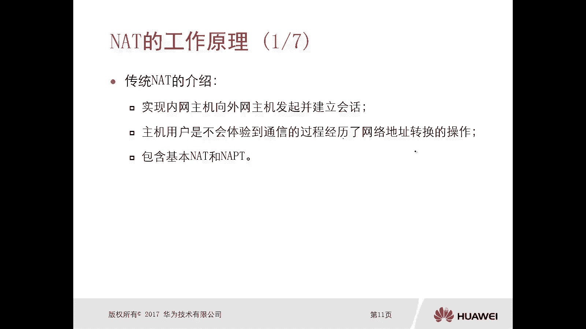

什么是NPT好，那么接下来我们就看一下，这个基本的NT的操作啊，这个呢是一个基本的NT的一个操作拓扑啊，我们可以看一下，并不陌生对吧，那么左侧呢是这个企业的一个内网啊，那么采用的是丝网编制对吧。

然后中间的这是一个企业网关路由器啊，那么右侧是连接了运营商啊，那么和运营商互联的这个网站呢，肯定是一个公网地址对吧，那么你购买运营商肯定是公网地址好，那么对于这个基本的一个操作是什么样的呢。

哎我可以在这个企业网关路由器上去部署。

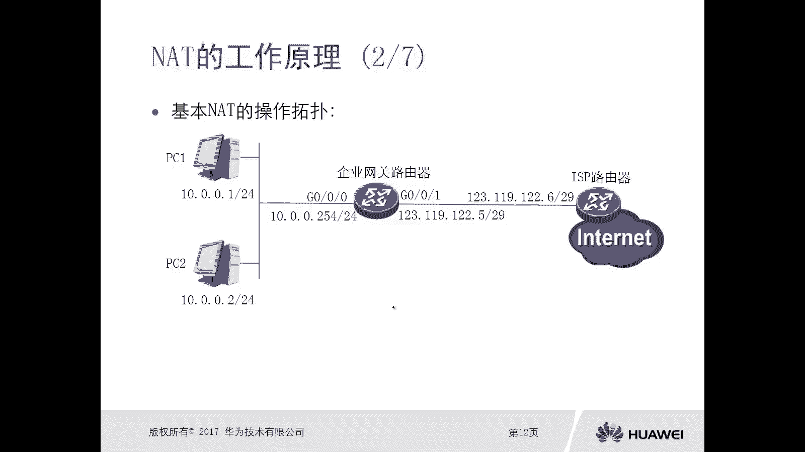

NT转换技术对吧，我将丝网的10。0。0。1这个主机，以及10。0。0。2这个主机的IP地址，给它转换成一个固定的IP地址啊，分别转换成了12。112。2，那么当然我还有两个地址，我可以做备份。

不用搁这儿，对不对，万一再有两台设备呢，哎这个呢比较极端啊，假设这个企业网里面就有两台设备，哈哈啊，这就是举一个这样的例子啊，好，那现在我这个企业呢实际上是有四个公网地址，但是呢我现在如果一一对应的话。

我只需要有两个就可以了，对吧，哎这样做一个这个转换，那么这样的话当我们的PC1啊，PC1啊，10。0。0。1，他去发送数据的时候，那么到达了企业网啊，起网关路由器，那么它会被这个NT技术。

把他的这个地址转换成12311，9。12。1，那么相相相同，那么10。0。0。2呢就会转换成123。1。

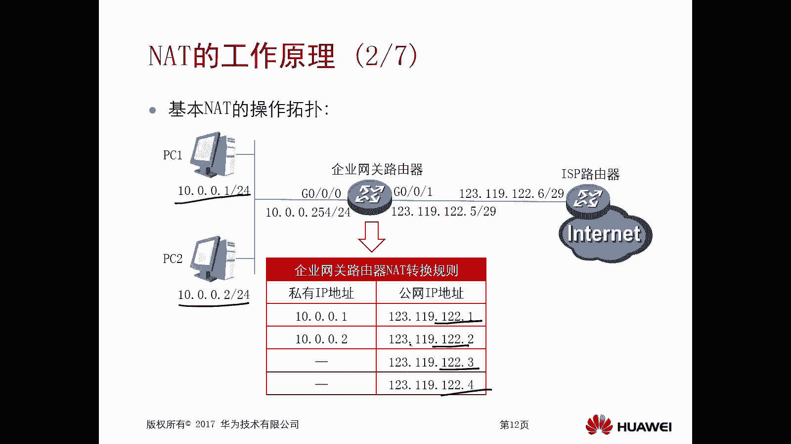

9。12。2，然后去访问这个因特网的资源好，那我们看一下它的过程啊，比如说PC1发出的数据包，那么网络路由器呢收到PC1发出来的数据包后，先去查找路由表，找个出气口，那么我们在讲静态路由的时候。

讲过讲过一个非常特别的静态路由，缺什么静态路由对吧。

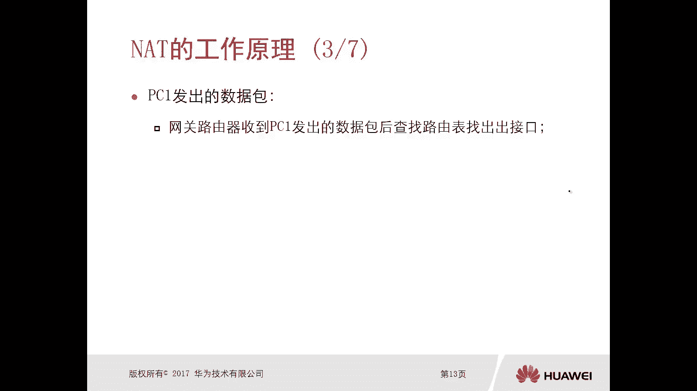

一般是应用在这个出口网关路由器，也就是我们的企业网络路由器，在这呢一定是有一条缺省路由，指向这个运营商的那来的数据包。

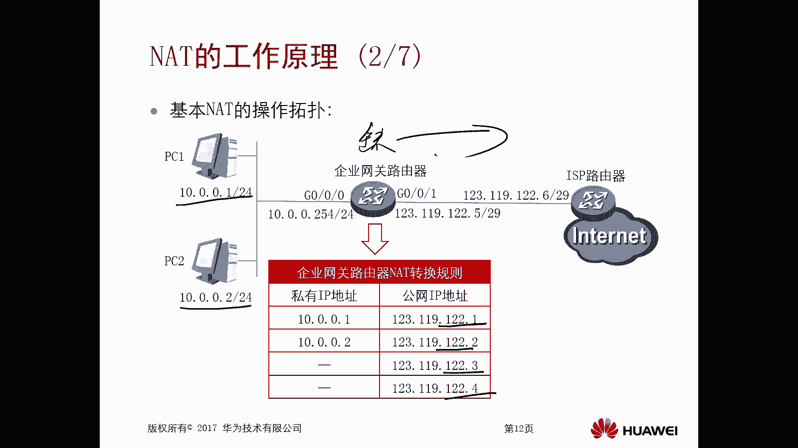

我一看确认路由从G001口转出去，这种情况下，路由器就找到出口，然后再根据我们初接口上它的NT规则，我们一般情况下呢，这个NT呢是把它放到这个出接口的对吧，你从这个接口出去哎。

就使用这个接口下面配的nt vision对吧，唉，因为我们可能和运营商对接的不止一个接口啊，那么比如说有两个接口，那两个接口很有可能都要执行NT的策略，对不对，所以你从哪个接口转发出去。

就要利用哪个接口的NT规则，那么根据这个接口的NT规则，那么确定PC1的IP地址是符合需要转换的条件，并做一个对应的转换。

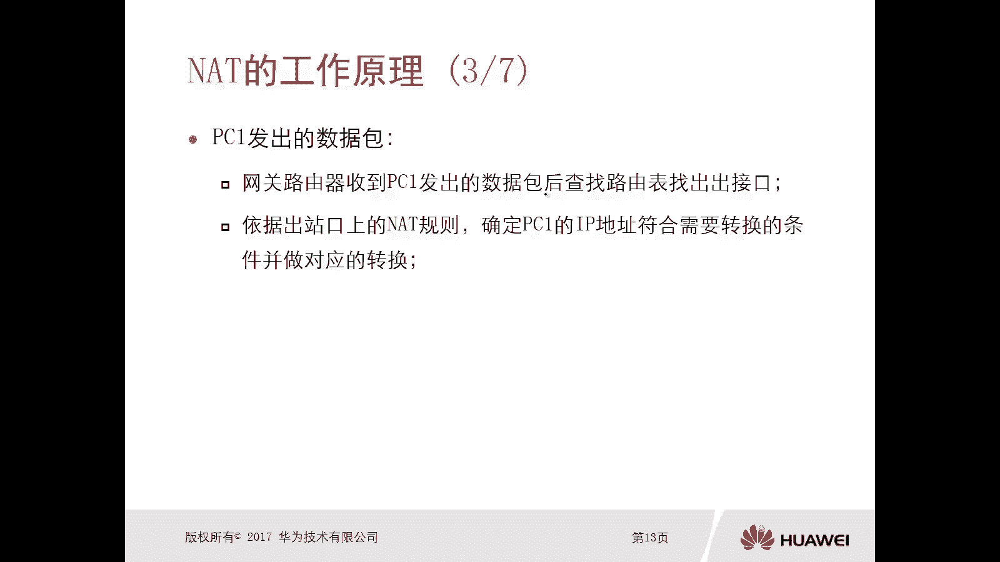

因为我去设置的时候呢，是将10。0。0。1去转换成123。12，9。12。1对吧，那是符合条件的对吧。

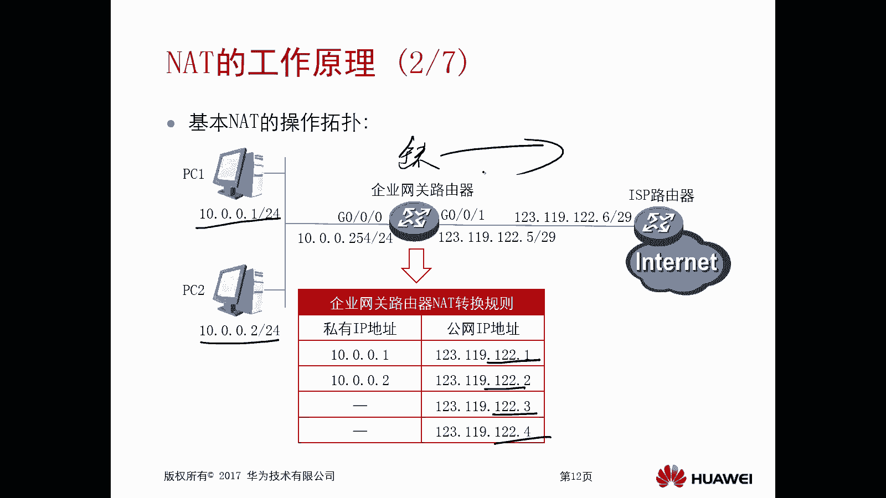

这样就会被转换成1201好，那么重新以转换后的地址封装，去往目标数据报啊，并从这个G0杠零杠一发送出去，一开始你没在，你在没转换之前啊，你的原地址肯定是10。0。0。1，然后进入转换以后。

你的原地址呢又变成一个公网地址，但是你的目的地址会不会发生变化呢，不会对吧，哎不会像这种基本的NT技术啊，我们是转换的原地址啊，这个叫做原NT技术啊，好那么我们看这个PC1，他怎么去接受这个数据包呢。

当你PC的数据包发到了这个因特网，那么因特网要进行回报对吧，那么也就是说外网返回给PC的数据包，先到达路由器，到达路由器以后呢，这个路由器依据NT的规则，再将之前更换的UIP还原作为目的IP。

因为他之前是有表现的，他很清楚对吧，哎是哪一个私网地址转换成了这个公网地址，所以当他收到数据包的时候，发现诶这个公网地址K转换成这个死亡地址，对好，然后再去查找去往PC地址的路由表。

从接口即零杠零杠零发出去，唉，所以说大家可以看一下，这个，你NT就是你数据包出去的时候和，回来的时候对吧，他这个查路由表和转换是不一样的，初期的时候先查路由表对吧，再进行NT转换。

回来的时候先转换再查漏票是吧，有一点点顺序的区别啊，然后PCE呢就收到了外网资源的回信息啊，比如说我访问百度，我就看到一个百度的网页了。

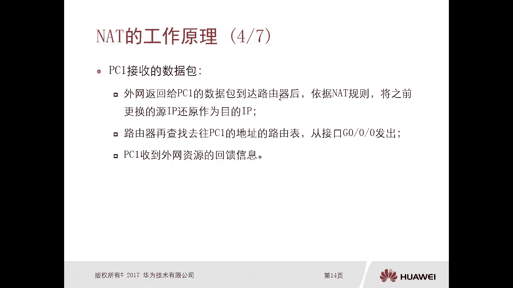

对不对好，然后我们再看另外一种NAPT，刚才我们说的那种呢，你可以认为就是一对一的一个NT，PC1转成某个地址，PC2转成某个地址，但是但是响应问题，假设我们的企业的网络它有100个员工。

如果你都一一对应的话，那么你想一下，你是不是要购买100个公网地址啊，对吧，唉这个显然是不靠谱的，对不对，唉所以说在我们地址有限的情况下，我们一般用的是哪一种NT技术。

是NAPTNPT基于端口的NT转换，我们看啊，还是这个这个场景对吧，哎场景，那么如果说我们采用NP的话。

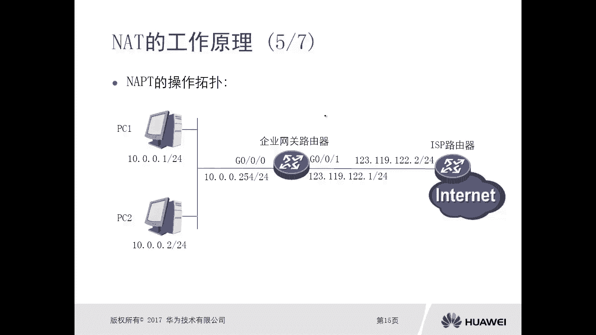

那么在企业网关路由器上，那么做NT转换表去转换的时候呢，我就可以将不同的IP地址，转换成相同的一个公网地址，但是使用的是不同的端口对吧，即使你们的内网地址是不一样的，转换成公网地址是一样的，没关系啊。

你的端口不一样啊，就可以进行区别了对吧，就可以进行区别了，你比如说你PC1PC2发出来的应用都是一样的，那么你们的原端口可能都是一样，303017对吧，而地址也不一样，但是呢我给你们进行转换的时候。

把地址都转换成同一个公网地址，但是端口不一样，那么就可以得到区分，这就是NAPTAPT好，这个呢是我们现在企业网里面用的，好像刚才那种一对一的那种基本不会去用的啊。

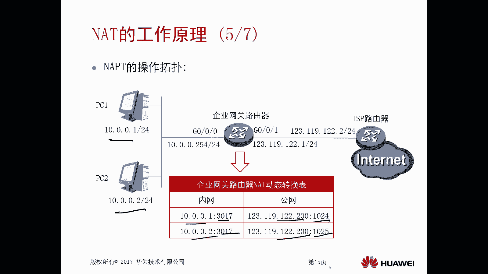

好那么我们再看一下啊，哎这个过程，那么PC的数据包，网关路由器收到PC1发出的数据包后，还是查找路表，找出借口对吧，然后依据这个出站上的NT规则啊，匹配第一条，对原IP地址和源端口进行转换。

你看我们前面讲的那种基本的NT技术，只是对原地址进行转换，会不会对端口进行转换呢，不会，所以它是一对一的，而这个是要转换原地址和原端口都要进行转换，所以它叫做NAPT，那么重新转换后的地址和端口呢。

封装去往目标的数据包数据包，并从这个G0杠零杠一口呢发送出去啊，那比如说这个，比如说这个PC2的一个数据包对吧，PC的数据包好，那么网关路由器收到PC2发送数据包，也是插入路由表对吧。

然后根据这个出站口的NT规则呢，匹配的第二条对原IP和源端口进行转换啊，所以呢它就会根据表象，将它转换成一个公共地址和端口，并从这个G丙杠零杠一口发送出去，好，那么这个值得注意的是。

我们在路由器上设置了NNT技术以后，这个表象一开始是空的，只有当数据包来了以后，它会动态产生表象，产生表象，那么地址你可能是固定的对吧，你用了一个地址，但是端口呢它也是随机的对吧。

只要我给不同PC分配的端口不一样就可以了，那你注意一下啊，这个转换表像一开始是空的，是没有的啊，所以这种动态的NT啊，那么静态的NT肯定又有表象，那刚才我们讲的这种嗯这个PNAPT。

他这个表象呢是一开始是没有的，没有的，只有数据来了才会有，我们我们刚才讲的那种基本的NT1对一，那一对一一般呢是采用静态的方式去部署，所以内整呢它是有转换表箱的啊，你数据包来了以后。

根据表现转就可以了对吧，类似这种NAPT动态的这种NT啊，还是没有的好，那么在我们下一小节讲NT类型的时候，那这个呢就会分辨的更加清晰了，好这就是NT的一个工作原理，注意一下啊，AT的工作原理就是。

当你这个数据包，从我们NT网关路由器出去的时候，它会对它的原IP地址进行一个转换对吧，根据你之前的你不管是基本的NT技术也好，还是这个NAPT也好对吧，进行转换啊，那么转换完了以后。

当数据包在回来的时候，再根据表象再做一个反转化，你可以这样理解对吧，根据表现做一个反转换诶，发给我们的一个内网的PC，就可以实现内网访问外网因特网的一个资源啊，这样的通信过程了啊，OK好。

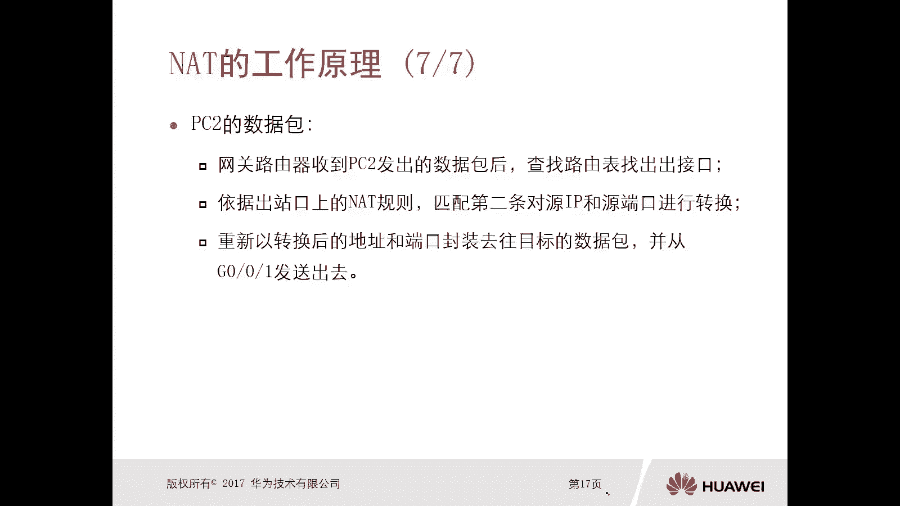