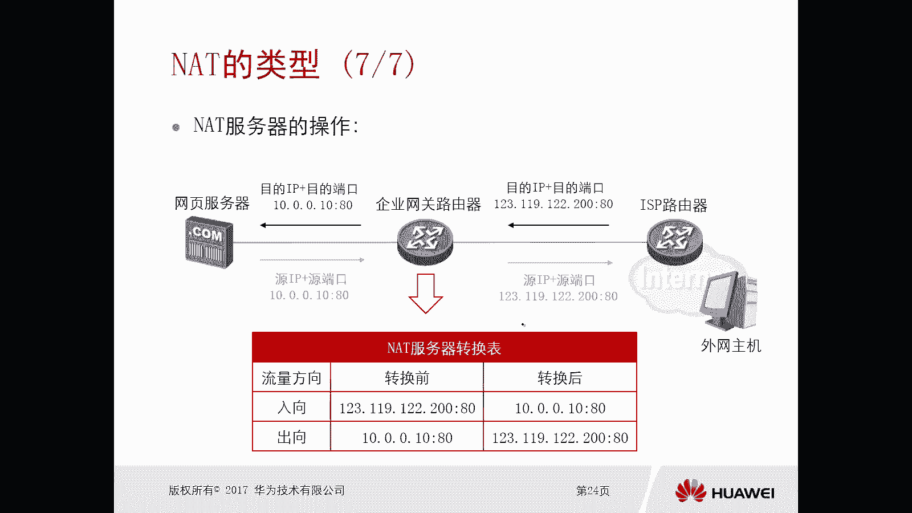

# 华为认证ICT学院HCIA／HCIP-Datacom教程【共56集】 数通 路由交换 考试 题库 - P46：第3册-第4章-3-NAT的类型 - ICT网络攻城狮 - BV1yc41147f8

好，那么接下来我们就看一下这个NT，它的一个主要类型啊，它的主要类型呢是大体是包括三个啊，一个是这个静态的NET，而静态的NT也包括这个NP啊，那么其实NPT呢，嗯严格来讲它不算叫做静态的NT是吧。

哎你可以认为就是两两小两小类，一个是静态T，一是NPT，而另外一种呢叫做ezip zip的NT，还有一种是NT的服务器，也叫做nt server，我们先看一下这个静态NET，那么静态NET呢。

是内网中一个主机和私网IP对吧，就是内网中一个主机的私网IP地址，与一个公网IP地址相绑定，那么静态的NT实际上实现的效果是一对一的，一个转换关系，哎这是我们上一小节讲到的对吧。

这个NT工作原理里面那个基本的NT哎，比如说PC1要用这个公网地址，PC2要用这个公公网地址对吧，一对一的转换关系哎那么在实际过程中，你想一下这种静态NT会用吗，反正是很少用对吧，很少用啊。

因为这种技术呢，你一个公网地址，没法为内网中的多台主机提供外联服务，那也就是说你有多少个主机，你就要使用多少个网地址，显然是不靠谱的，对吧哎这是静态的NT，那么另外一种呢是NNPT，这个我们也讲过对吧。

他转换的是把你的底地址和端口都去做转换，是把二元组，二元组呢是内网这个内部的网络主机，IP加端口号对吧，然后转换成一个公网IP地址和端口号对吧，哎那么进行一个一对一的一个绑定。

那这种情况下我就可以实现一个公网IP地址，可以同时为多个私有的IP地址提供，提供这个外联外网的一个连接对吧，哎这种NPT呢我们用的比较常见，比较多啊，但是用的最多的是哪一种呢，EZIP好。

E z i p，那么我们看这种APT这种技术啊，它的应用场景是什么呢，比如说我的企业网，它有固定的IP地址，有固定的一个或者多个供IP地址的时候，我可以采用NP，但是并不是我们所有的企业网。

它都有这个固定的公网地址，对，比如说我们这个企业网，是通过PPPOE拨号得到的地址，甚至我们的家庭网络对吧，运营商也不会给你分配一个这个，固定的公网地址，也是通过什么PPOE。

大部分都是PPOE拨号对吧，这种情况下就用不了这个NPT了，我们就用EZIP好，Ez i p，那么EZIP呢，是常用于这种拨号上网的网络环境中，对这种这种环境有什么特点呢，特点是你得到的公网地址对吧。

它是自动获取的，我也不知道他是多少，哎，所以这种情况下就是你得到的公网地址是多少，我就把它转换成对吧，哎，就把所有的私网地址，转换成这个得到的这个公网地址就可以了，唉。

那么这样我所有的内网主机就可以使用这个啊，临时工网获取的IP地址来访问互联网了啊，不像我们的APT，你拿的是一个固定的对吧，运营商永久分配给你的，只要你交钱，这个地址给你对吧，但是这个PPOE不一样哦。

你比如说这次开机获得的是这个地址，下次开机可能获得另外一个地址对吧，哎我可以认为是临时答案好，那么前面那种一对一的和基本一对一的，和这个NPT我们基本都讲了。

那么主要是看一下这个EZIP哎，他的一个操作过程啊，嗯比如说现在这个企业网关路由器，它就是通过这个PPOE的方式，得到了一个公网地址啊，那么假设我们有两台PC啊，比如说PC1发出一个数据啊。

它的原IP地址是10。0。0。1，原端口是3017对吧，假设去访问百度吧对吧好，那么到达这个企业网关路由器呢，它会把它的原IP和源端口，都转换成一个公网IP啊，中公网P地址是123。19。12。200。

圆灯呃，端口是1024啊，那么到运营商，那么由于商品回报的时候，他的目的地就变成了123。1，9。12。200，端口是124，由于这个企业网关路由器，他对PCE的原IP和端口做了转换。

所以说它会存在这个映射表象，那么当路由器收到以目的IP地址为123。1，9。12。200，端口是1024这样的数据包的时候，他知道OK我应该转发给PC唉，就会转转换成10。0。0。1冒号，303017。

这样PC就收到数据了，同样PC也是一样的对吧，原端口啊，原IP源端口IP地址0。2端口也是3017，那么到达企业网关路由器，它也转换成200这个地址对吧，这些端口呢用的是另外一个端口1025哎。

那么运营商回报的时候啊，用这个地址的1025作为一个目标，那么企业网络路由器根据映射表象呢，哎就可以给它转换到PCR，实现一个互通，哎你看这个EZIP它这个过程啊，和我们前面讲到的那个NAPT。

它的过程基本没有什么太大区别对吧，只不过区别在哪呢，只不过区别是在它的应用场景上，一个是采用固定的这种这个IP地址实现的，NT叫做NAPT，另外一种呢是我没有固定的一个地址对吧。

我我我我拿到的是一个PPOE，拨号的动态地址，我可以采用EGIP，大家注意下，对于NAPT来讲对吧，前面我们讲到的，他的操作过程是拿一个地址做的例子，对于NAPT他可以拿到多个公网地址。

把这多个公网地址，都可以采用这种NAPC的方式进行转换，但是EZIP呢只能有一个地址，这个OK好。

就是这个啊，好，我们看一下这个转换的一个转换表。

就可以看出来了是吧，转换前换后转换前后，另外一种NAT类型叫做NT的服务器，NT服务器，那么刚才我们前面讲到的，甭管是静态还是NPT还是EEZIP，他们的应用场景的是你的内网，去访问因特网的资源的时候。

我们需要的技术，那么NT服务器是用于内网应用，对外提供服务的时候，假设你的企业内网有台服务器，他要为因特网上的其他用户提供什么3W服务，那么也就是说，你外网的用户要去访问到你内网的这台服务器。

但是你内网这台服务器它是一个私网地址，正常情况下他访问不了对吧，所以这种情况下，我们就需要在网关设备上那去静态配置，Net server，就是it服务器，那么它是静态配置公网的IP地址和端口。

和丝网的一个IP地址和端口之间的一个转换，说白了就是一个公网地址，它在某个端口实际上是对应的，我内网的一台丝网的IP地址服务器，它的端口，哎那么公网用户呢只需要知道这个公网地址，哎和它的端口就可以了。

我就可以顺利的访问到你内网的这台服务器啊，那么这样内网的IP地址就隐藏起来了对吧，你比如说我们现在一些大的ICP，比如百度啊，新浪啊对吧，包括华为啊，我们去访问他的网站的时候对吧。

那DNS解析回来的肯定是个公网地址，但是你不能确定这个公网地址，就是实际访问的服务器，肯定不是，他一定是做了n t server对吧，他一定是做了n t server，可能你访问的这个公网地址。

它是一台防火墙，是一台路由器对吧，实际的这个服务器呢一定是在百度的IDC机房，内部机房或者华为的机房啊，或者新浪的这个内部技法一定是这样的啊，这样的话即使有黑客去攻击这个公网地址。

实际上你攻击的是一台路由器，或者是一台防火墙哈，实际上你是攻击不到我们的这个呃服务器的，嗯好这是NT的一个服务器啊。

那么对于NT的服务器的操作呢，我们可以看一下啊，比如说我们这个企业网，它内部有一个网页服务器对吧，那么他要为外网提供服务，那么外网主机呢需要去访问这个网页服务器啊，比如说这是华为的com对吧。

那么我们对于普通大众用户呢，要去访问华为的com这样的一个这个网页，那么我们去访问的时候呢是怎么访问的呢，比如说这个呃这个服务器的一个，服务器的一个拥有者，他会去提供一个公网地址出来啊。

比如说这个公网地址，123。129。12。200，这个公网地址其实就是我华为点com这个网站，服务器的一个地址，端口号是八零，对不对，你们访问这个就可以了啊，访问这个就可以了。

好那么实际上我们去访问这个公网地址，到了企业网关路由器，他会把这样的一个公网地址，转换成一个私网地址，你看这个转换的是目的啊，我们前面讲的那些NT转换的是原。

所以呢前面讲的什么静态NAPT和easy IP，都叫做原NT技术，那么对于这个n t server，它转换的目的IP地址和端口对吧，它叫做目的NT技术，目的T技术转换成了一个10。0。0。10。

冒号八零这样的一个丝网的IP地址和端口好，那么当网页服务器在回复的时候，到了企业网络路由器，根据啊刚才你形成的表象，在反转成一个公网地址回复给网主机，那么对于外网主机来讲呢，他感受的效果诶。

就是这个服务器给我回的报对吧，我就是访问这个服务器了，实际上你访问的是服务器吗，是真实的这个服务器吗，不是这个地址，是是这个网关路由器上的地址是吧。

还做了一次转换而已啊，所以这种情况下，我们就看这个企业网关路由器上，它的一个表象对吧，哎那么录像转换前是一个公网地址，八零端口，转换后呢是一个私网地址是吧，一个个八零端口。

那么出项呢出项呢是一个私网地址，0。101080，端口转换后是12312912。200，公网地址八零好，这就是这个NT的一个类型啊，那么呃我们这个总结一下对吧，分为静态int，还有NPTEZIP。

那么这三个呢叫做原AT技术对吧，n t server n t服务器叫做这个目的NT技术，那么前面那些原NT技术呢，主要目的就是去改变，去转换数据的原地址和端口对吧，那么NT服务器呢。

NT服务器转换的是目的IP啊啊和端口，那么这个里边你看没有体现出端口，它的发生变化啊，是吧，你可以把端口也发生变化的，比如八零转成八零，808080转成八零都可以的。

