# 华为认证ICT学院HCIA／HCIP-Datacom教程【共56集】 数通 路由交换 考试 题库 - P47：第3册-第5章-1-PPP原理 - ICT网络攻城狮 - BV1yc41147f8

好，那么接下来我们看一下这个P，PP的一个原理啊，那么首先我们先看一下这个PP的封装格式，那么对于这个PP这个协议啊，它本身就是在我们这种点到点上啊，这种环境里面的一个协议，那么其实我们还有一种对吧。

N g l c，那这两个协议呢，在我们广域网上是会用到的对吧，那么对于这个pp协议呢，注意一下，我们可以看一下它的格式，那么在这个地址这一块儿，地址我们看和以太是完全不一样的，以太的话。

你比如说我们在以太网里面，比如说这个以太度对吧，那么他这个地址字段呢，最起码有个什么原Mac和目的Mac地址对吧，那么为什么PPP这种协议，这个地址呢全都是权益了呢，他没有什么原地址和目的地址。

因为我们想一想啊，这个以太呢，它适用的场景有可能是点对点的对吧，也有可能是一个这个多路访问网络，没事吧，但对于我们P呢，它一定是使用在点到点的，那么也就是说从这台路由器，从这个P的接口转出虚拟数据包。

那么一定是到对端的一台设备对吧，而且只会被一台设备所收到，所以这种情况下呢，这个地址是做到在这种点到点的环境里边啊，那么实际上就没有太大的意义了，所以说呢在PPP里面，这个格式就变得比较简单对吧。

什么协议啊，就是我们上层使用的协议，那么数据对吧，数据然后是校验和标记，非常非常简单，一个头部啊，那么对于这个PP啊，它是一个分层，它是一个分层的一个结构体系，分为两层啊，一个是这个链路控制协议。

那么我们先说这个LCP链路控制协议，那么从这个名字上面呢，我们应该能够感受到对吧，它是干嘛用的，它是控制这个链路的对吧，那么控制链路主要是控制哪些方面，比如说这个链路我要发起，我要发起连接对吧。

哎我要去监控这个连接，或者叫做终止连接，对于我们之前这种以太啊，你看看这个以太，比如说两个路由器都是用这个以太接口，连连在一块，那么他们之间根本不需要进行协商的，而最多的情况下可能协商一下这个双攻对吧。

然后协商一下这个速率对吧，没了，那么对于这个pp呢，当两个路由器之间，比如说我通过一个这种串串口的链路，连到一块啊，那么如果说我们去运行了这个pp协议，那么当两台路由器，A和B这两个接口在up的一瞬间。

那么他们之间即使没有配IP地址，他们首先要去做链路的协商啊，这个链路协商第一个首先要做的就是ICP啊，那个ICP就是OK我们看一下啊，这个这个链路啊能不能建立起来对啊，我们这个链路是不是OK的。

是不是通畅的，通常这是通过这个CP去实现的，那么假设我们的内容是OK的，能够正常协商起来，没有任何问题，那这个链路起来以后就是up以后，协商起来以后，你这个链路最终的目的是传输协议的数据对吧。

那最常用的就是你传输IP数据对吧啊，你也可以传送什么IPV6数据，你也可以传送IP数据，你也可以去传送其他的各种各样的数据对吧，那么这种情况下，我们要进入第二个阶段的协商。

去协商这个链路上到底是去传输IPV4，还是传输IPV6，还是传输MPS，还是传输IPX那就是用哪个协议写上呢，就是NCP好，哎，所以说NCP，实际上它的作用就是协商的网络层协议对吧，协商的王层协议等等。

还有一些配置参数啊，所以说这个PP的话它是分两层，首先呢我们先把链路建起来对吧，哎这个链路说明OK了，能用了，但是这个链路能传送什么样的协议的数据，报文呢，我们要通过NCP协商哎，两个哎两个啊。

注意下啊，一定是CP在前面，NCP在后边，所以接下来呢我们就看一下这个LCP，它的协商过程啊，这个呢是给大家举了个例子啊，比如说这儿有个RTF和RTM对吧，哎那么他俩协商的时候。

刚才我们讲了sap协商是干嘛用的，是要去发起建立和监控这个链路，它的一个连接对吧，比如说这个RTF现在要发几个链接，你怎么发起呢，发一个包裹去对吧，假设这个比如说这个两个路由器啊对吧，在相亲，哎。

这个RTF呢就说OK，我这个对配偶的期待是年薪过亿对吧，布加迪威龙啊，在这个比在这个加勒比海对吧，有四人小岛蜜月旅行呢去太空是吧，在这个深圳市中心有一套三居室诶，那这个信息给我们传达的内容是什么呢。

是这个RTF在向着RT m去啊，去这个去试明一种失明一些信息，不就一种啊对吧，就是协商一些信息对吧，OK你不是想和我结婚吗对吧，OK我就是这些要求我给你写上，那么RTM呢如果说你接受就接受了。

那就那就成了呗对吧，你这M和F就OK了对吧，但是如果说RTM觉得有点困难，对不对，那你可以讨价还价对吧，这种感觉对吧，那RT m比如说啊有这个深圳三居室啊，这个条件太高了，其他的都无所谓啊。

这个咱们能不能再商量商量对吧好，然后RTF呢就改了，好对吧，年薪过亿啊，布加迪威龙加勒比海森小岛对吧，旅行太空，但是呢不要深圳什么三浴室了对吧，中欧有个深城堡可以吗，RT m1看妥了。

这个可以用哼哼这说明什么问题，这说明深圳的三居室，要比中国的一个私人城堡还贵，所以说有钱，咱们拿着钱去中欧去买个城堡吧对吧，据说这个在北京深圳肯定也很贵啊，在深圳或者北京买一套房子的钱。

可以在这个某个嗯某一个海域啊，去买一个私人小岛对吧，然后上面还有别墅，还有那个叫什么游泳池，太happy了是吧嗯好，所以这个这个呢实际上给我们传达的意思，就是我们这个ICP啊。

他协商的时候实际上就是这个设备啊，他会把自己所期待的一些配置参数发到对端哎，就是我想要这些东西啊对吧，那对端收到以后呢，你得看对你接不接受啊，如果你接受的话，就直接就成了对吧，不接受的话。

那就要去发一些信息，告诉他能不能改改这个条件对吧，OK那么比如说对端改了，那再写上OK他是这样一个过程啊，好那么直到OK我们两个都协商通过诶，然后这个链接呢就建起来了啊。

这是这个SP他的协商的一个示意图啊，通过一个举例说的说明的啊，那么对于CTFCP，他这个配置请求消息的一个封装是什么样的呢，大家可以看一下对吧，这个内容反正是相比较之前学习到的一些。

应该也是比较简单的对吧，那么首先前面这个是P的头部，这个就不用看了对吧，贴头部，然后紧接着呢我们看有一个代码对吧好，那么代码呢表示的是你这个LCP报文的类型，如果这个代码是一的话。

OK那么表示这个消息是一个请求消息，对吧，哎它是一个请求消息，啊，好那么这个注意一下E的话，就是一个这个配置的请求信息，那么如果是二的话，就是这个配置的一个券信息对吧，那我去发起协商的时候呢。

肯定发送的是一个这个配置的请求信息对吧，然后如果你同意的话，肯定是一个配置的一个确认信息，当然了，我们还有其他的code，比如说这个九啊对吧，他是一个echo的request对吧。

然后那个十啊是这个echo reply，那么这个echo request和rely它的作用是什么呢，因为当你们去把这个连接建立起来以后，你要进行维护，那刚才我们讲了LCP。

它的作用是发起建立和维护这个连接，对不对，那刚才我们讲了发起OK啊，那么这个建立建立就是协商过程嘛，对不对，那维护呢实际上就是通过EQUREQUEST和EQURELY啊，是PVP的。

echo request和echo reply啊，可不是什么SNP的好，那这个echo request呢就是这个code代码值呢就是十，然后这个eq rely呢。

这个代码值呢就是这个呃呃呃echo request是九啊，eq rely是十好，后面的是这个标识符和长度，最后呢是这个数据部分，那么数据部分那就看你这个呃，你这个报文的类型是什么呢。

你比如说你的这个报文类型是这个configuration request，对吧，那么这里边的数据部分呢，就是你要去协商的一些参数啊，比如说mt啊，比如说魔术字啊，比如说有有没有认证啊等等，对不对，好。

那么ACK呢就是哎，OK我确认的部分是哪些对吧，比如你请求mp5是多少，这个认证类型行不行，对不对，是谁，那么我去确认的时候，OK这个MC是多少，OK了对吧，认证也OK嗯好。

那么后边呢还是这个pp的一部分啊，它是个尾部，所以你看啊他是插的这个pp中间的啊，这是这个CP的一个请求消息，它的封装格式啊，好，那么接下来我们就看一下这个ICP，它的协商过程啊。

刚才我们是通过一个例子举例说明了对吧，接下来我们就看一个它的，最简单的一个协商过程啊，很简单，就是比如说A朝着一个B啊，发起这个CP配置请求信息啊，刚才讲了这配置请求消息。

然后B呢就是回复这个ICP的配置，确认消息是吧，那么同样呢这个B呢也要去发送配置请求消息，那么A呢去回复这个确认配置确认信息，OK好，那么这样的话呃，这个链路呢它才能够正常的建立起来，才能协商成功。

好这是这个LCP的一个协商问题，那么这个LCP的一个协商过程，那么属于我们pp建立这个数据连接，之前的第一个阶段啊，就是建立这个数据连接的第一个阶段，叫做LCP协商阶段，LCP形成阶段好。

那么接下来要进入到第二个协程段啊，那么第二个形成阶段假设啊，我们未来A和B之间的链路上啊，他们要去传输IPV4的数据，大家注意一下啊，为什么我要强调传输IPV4。

因为我们说A和B你们之间可能传输IPP4，可能传输IP6，那么你传输不同的网络层的协议数据的时候，那么它使用的NCP是不一样的，它是一个统称啊，它是一个统称啊，那么如果说你传送IPV4。

那么有IPV4的一个CP，如果你传输的是IPV的数据，有IPV6的一个这个NCP对吧，那么每个网层都有自己的一个NCP，所以说NCP呢它是一个统称，比如说这个A和B现在呢是要传输IPV4，地址啊。

IPV4的一个流量啊数据，那么接下来呢，那么A和B呢就要进入到一个NCP的线过程，由于A和B传出的是IPV4的数据，那么A和B他们发起的时候使用的是IPCP，IPCP这个协议对吧。

IPCP叫做IP的控制协议对吧好，那么A开始发起IPCP配置请求消息对吧，然后B呢去回复IPCP配置确认消息是吧，然后B呢也要去做一个IPCP的配置型消息，那么A呢再做一个确认信息。

那么这个阶段呢是我们pp协商的第二阶段，就是NCP阶段啊，如果是IP的话，就是IPCP，如果你们之前是IPV6的话，就是你要传输IPV6的数据，那么你们之间是IPV6的CP啊，那么如果是IP。

那叫MP的CP对吧，如果是IPX那就是IPXCP没问题吧，就每个完成协议它都有对应的一个CP，OK他是这样的啊，好那么主要就是看你看这你在你协商的时候，你要去协商城我们网络层传输啊。

哪个网络层的一个协议数据啊，嗯好那么IPCP呢，我们看一下它的一个封装格式，封装格式，那么P头P也共享了是吧，那么IPCP的头，IP的CP的头啊，这个消息呢和这个CP协议的这个头，基本是相同的。

看到没有对吧，也是有代码标识符长度和数据部分，对不对哎好，那么代码呢它有二有三样，有四有五有六有七对吧，那么分别对应这个IPCP的什么这个CONFIG，ACK啊，然后什么还有这个否认呀，NK呀。

还有拒绝呀，中断请求吗等等等等，那么这个他的这个呃，就是IPCP的报文类型是比较多的啊，那么通过代码从代码可以体现出来啊，这是这个pp的一个简单原理，那么接下来呢我们就用esp简单搭两台设备对吧。

我们去配IPV4地址，再配一个IP地址。

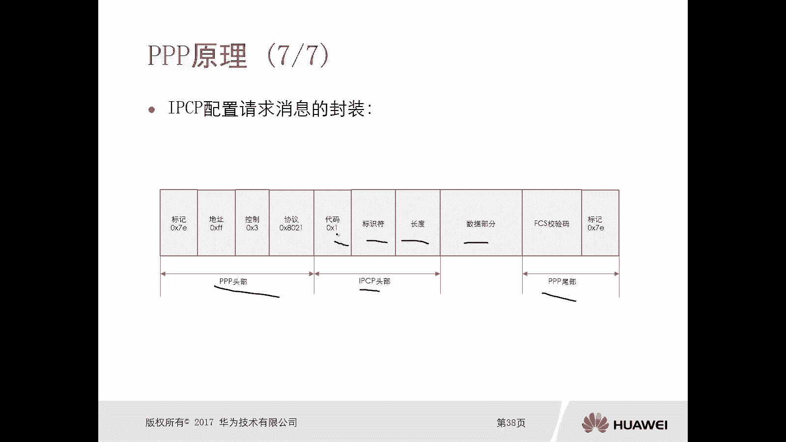

我们看一下他们的协商过程，好那么我们看用ESP啊，我们新建一个top啊，先top的话，我们就采用两台路由器，AR200AREA2好。

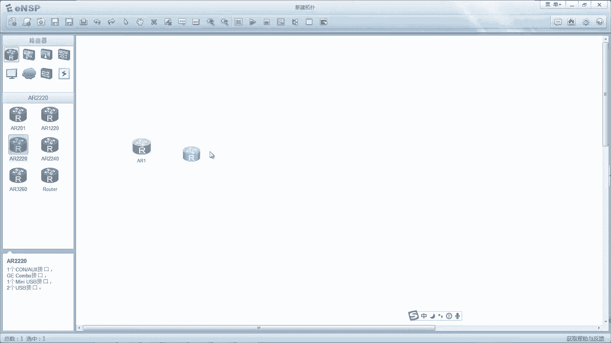

那么同时呢我们要去设置一下，然后增加一个这个串口接接口卡啊。

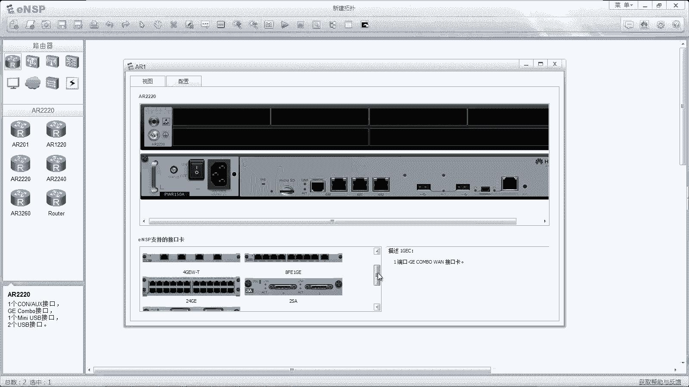

比如说这个两个串口呢，嗯那么这个呢也是呃我们去对吧。

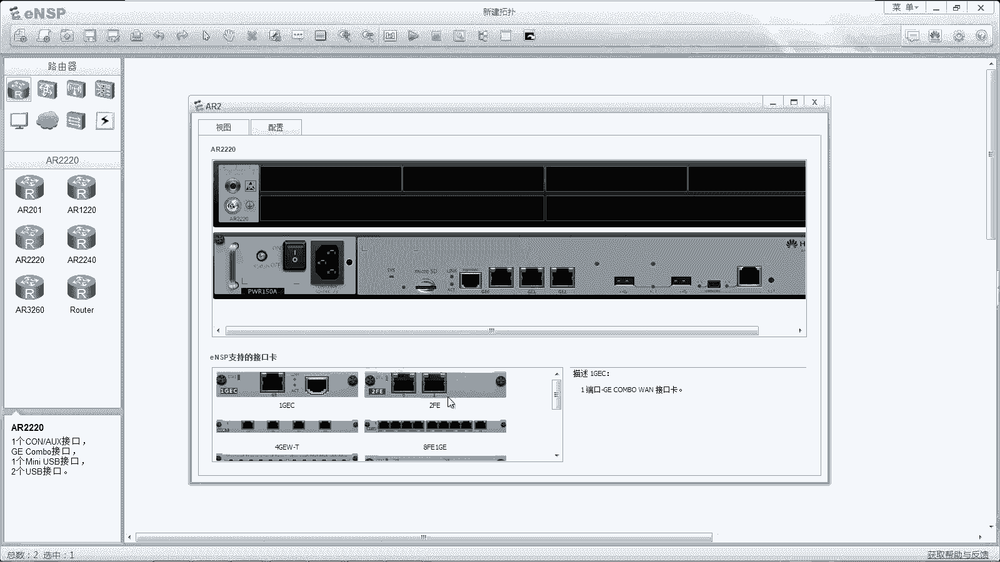

然后我们用这个串口线进行连接，用S1杠零杠零吧，这个也用S1杠零杠零，设置完了以后呢，我们就可以进行启动了啊，那么缺省华为的设备，它的这种串行的链路啊，串行接口，那么缺省的封装呢，它就是PP啊。

所以说你不需要缺陷去修改，但是如果说不是一个缺省的状态，我们要通过命令去修改成PP这个协议啊，继续写啊，好，那现在呢我们把这两台路由器启动起来了对吧，那么我们接下来呢，我们登到这个路由器设备上啊。

我们改个名字吧，这个是ARE对吧，然后进入到S1杠零杠零接口DISPLIT看一下，那么缺省呢它就有一条命令叫做link political对吧，我们可以打，我们可以把这个另一个political的命令。

去看一下啊，这个接口呢我们可以改成好多这种封装协议，对吧，封装类型，那么F2啊，HDLC啊对吧，PP啊，X2。5啊等等，那么如果如果他不是PPP的话。

我们需要敲一个命令linptical pp就可以了对吧好，那么比如说啊，比如说我们这里边去配置IP地址，那么是10。1。12。一二十四对吧好，然后我们把app6也打开，那么P61会儿我们再去敲啊。

嗯然后我们先在二上面呢也配一个IP v stage啊，啊ARAR2，然后S1杠零杠0I嗯嗯，IP地址呢是10。0。12。二二十四对吧，OK好，那我们去拼一下10。0。12。1啊，现在是能通的，对不对。

好，实际上他这个从down的状态变成通的一个状态，实际上也经过刚才我们讲的LSP的协商过程，和IPCP的形象过程，对吧好，那么我们怎么去看这两个形式过程呢，完全可以通过通过抓包。

我们可以这样我们shut down一下，然后我们要迅速把鼠标放到路由器上去做，找不啊，因为为什么要这样去做啊，那么第一个杀当原因呢是我想杀down掉以后，我们能够看到这条链路在物理物理层up的瞬间。

他第一个发出的包，我们都能抓到，对不对，我们就能抓到，哎，那么为什么你删档以后要立马赶紧过来去点呢，因为这个down掉以后呢，这个接口有一点点延迟啊，如果说这个接口已经变红了，我们没法进行抓包了吧。

哎我们shut down，那么赶紧点过来看还没有没有红啊，只要红了，你抓不就抓不了了，必须要在他绿的情况下。

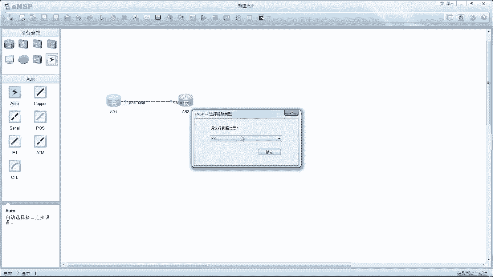

那么PPOK好嗯，然后呢我们再去做一个安度下。

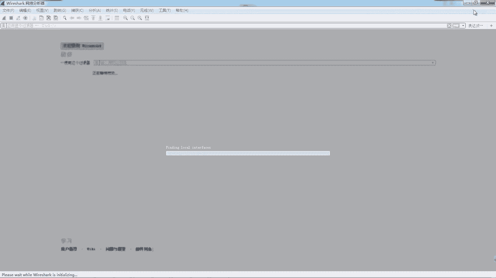

当你看现在已经红了吧，红再去抓包肯定抓不了你的点，你看有没有有没有没有的对吧，那么接下来呢我们就做一个安都杀大，好的好嗯，然后呢我们就等啊，那现在呢我们看这个接口已经up了。

同时呢它有提示信息IPCPOK，那么第一个呢是这个OK对吧，up啦，然后是IP c p up好，那么同时呢，我们接下来去看一下这个抓包的一个过程啊。

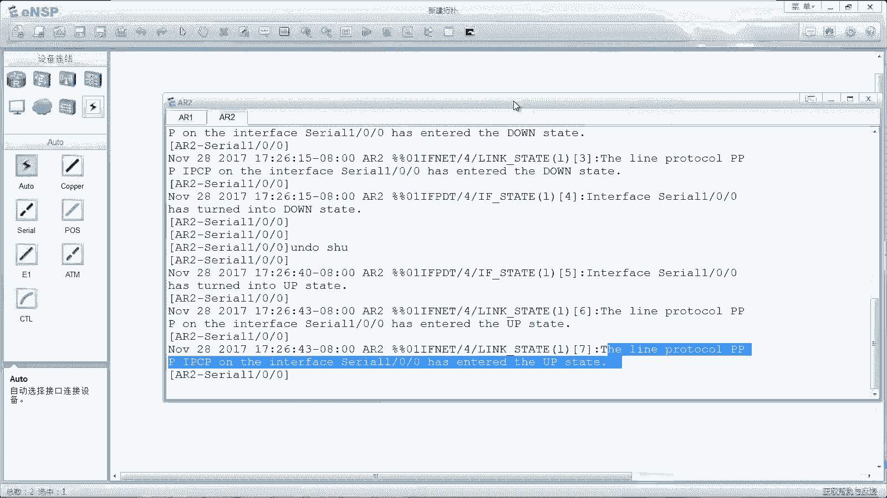

好我们看一下这个呃抓包抓包呢首先我们看啊，哎一开始呢是先交互这个PPLCP的configuration，request啊，因为两台设备都相互发送了request对吧，也相互回复了ACK对吧。

我们可以看一下啊，这个configuration request，我们看PP的封装对吧，地址字段呢全都是一对吧啊，然后这个协议呢是8021啊，那么接下来呢我们去看这个PPPP的话。

这个呃code呢是一啊，是configuration request，那么这里边呢无非就是协商的一些参数，那这个呢是一个IP地址，对不对好，那么还有哪些呢，除了IP地址嗯，除了IP地址，除了IP地址。

我们看这个呃，这个呢它就内容就比较多了，有IP那么有mt u有魔术字，对不对，哎哎你看这些啊都有，那么这个呢实际上就是在协商对吧，如果说你们两个都可以都可以承认这些参数啊，承认这些参数。

OK那么就是ACK哎，大家注意一下，刚才我是点的这个对吧啊，点错了，是IPCP了啊，注意一下，一定是点这个CPSP，我们看他协商的就是这个mt啊，魔数字对不对，哎，这个参数包括有认证方式，认证类型啊。

认证认证方式，那么认真呢，我没有去讲后边的都去讲才会有好，那么ACK好，那么当这个协商成功以后呢，我们说链路起来了，那么接下来这个链路上应该可以去跑哪些协议，网络层的协议，那么就要进入到NCP的阶段。

因为我们在接口配的是IPV4地址，所以说呢我们希望他以后呢可以去传输，IPV4的数据，对不对，所以说他紧接着就进入到一个IPCP，的协商过程，Request request，那么request里面呢。

实际上就是带了自己的一个IP地址是吧，哎然后呢ACKACKIPCP，这是IPCP好，那么同时呢在设备端呢。

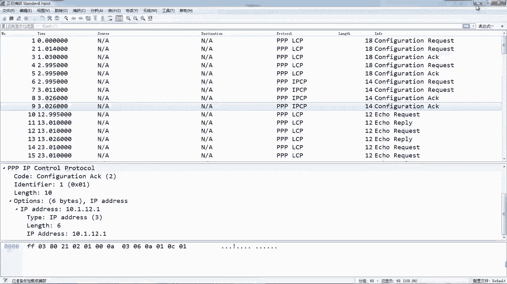

我们也可以通过display interface s1杠零杠零，我们去查看查看它的两个状态是不是都OK的，哎我们只要看到lcp open的IP c p open的，那么说明这个链路都是协商完成了。

先完成了，那么接下来呢我们再继续啊，我们把它配上IPV6，感受一下效果啊，嗯那么IP6enable i p6对吧，然后接口S1杠零杠0IPP6，enable IP p6address20012012吧。

冒号冒号一六十四对吧，然后在二上呢IP6打开接口S1杠零杠零，Ip v6，enable ipv6address2012冒冒号，冒号冒号二六十四对吧，哎这样做做完以后呢，我们还是做一个搭档动作对吧。

因为抓包还在抓啊，所以说这个我就不管他了，我们在等他红了，我们再去安度杀，当那么这种情况下呢，呃我们会看到你LCP协商的时候，没有什么太大区别，还是写上mt啊，魔术师啊对吧，如果有认证就有认证了啊。

但是IP就是NCP这一块呢，他多了一个IPV6的协商，因为现在这个接口既有IPP4，也有IP6，对不对，他就会多一个，我看下好。

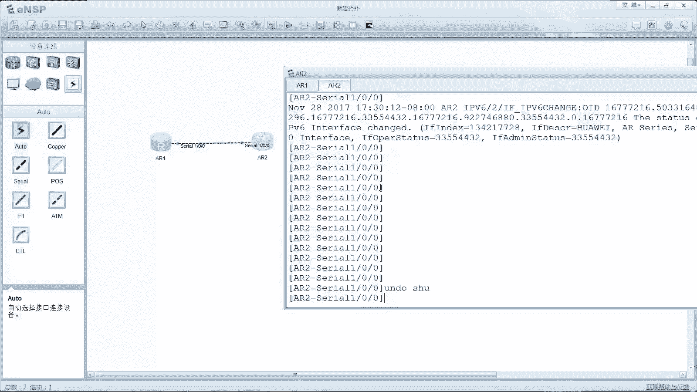

我们看一下啊，这是上一次的往下往下啊，好看啊啊你看啊，这有个ICPLCP删完了以后，紧接着是IPCP和IPV6的CP，看到没有对吧，哎也就是说你承载的网络层协议是哪一种，那么呢都有相应的一个CP啊。

那么IP就是IPCP，IP6呢是IPV6CP对吧，如果是MPS就是MPSCP，如果是IPX就是IPXCP啊，那么去协商啊。

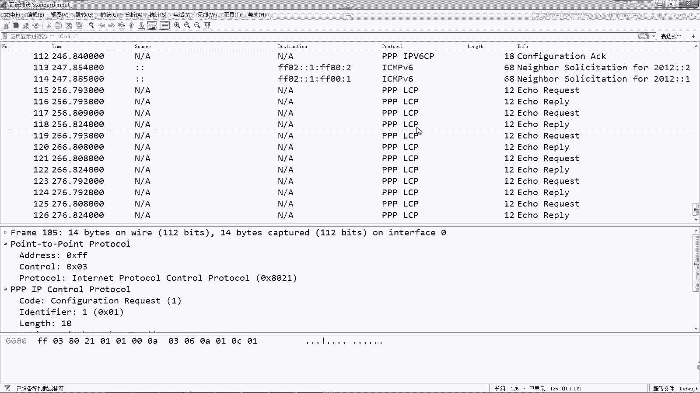

这个网络层协，那么最终协商完了以后呢，这个就up了，对不对，那么这个链路呢就可以通信了，比如说我们去拼IP62012毛毛一啊，是OK的好，这就是一个非常简单的RPP的一个原理。

实际上呢总结起来就是分为两块，第一块呢是通过sap呢去建立连接，同时这个ICP呢它可以去这个维护啊。

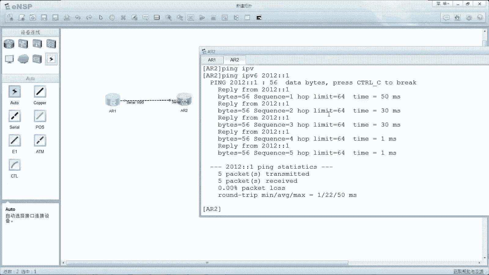

维护这个链接对吧，哎我们看下这个抓包啊，你看当做完以后呢，你看这个SP是不是周期的，再去发送echo request eq reply是吧，所以说sap呢唉他是建立发起建立和维护连接，那么NCP呢。

主要是协商网络层协议和一些配置参数，看的是IP地址对吧，IP地址OK好。

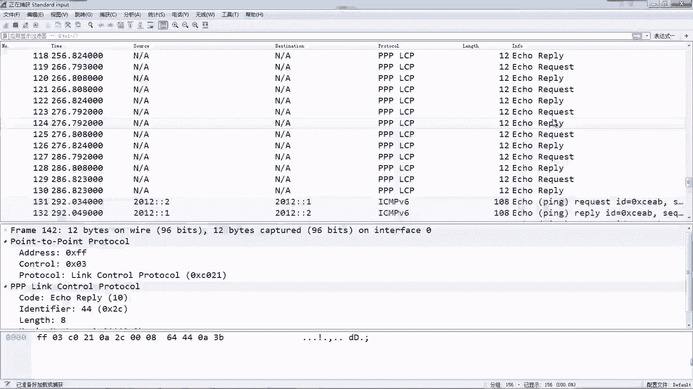