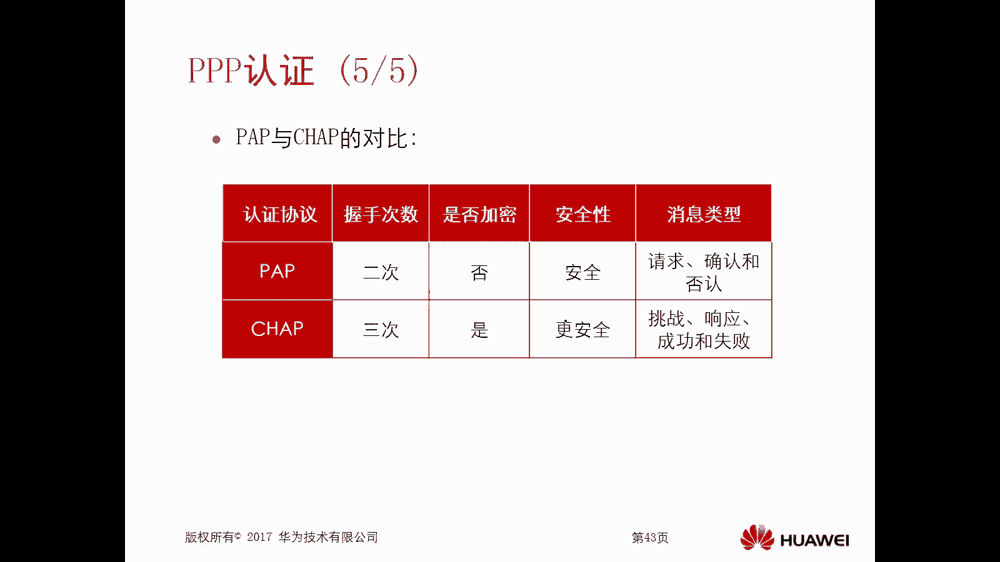
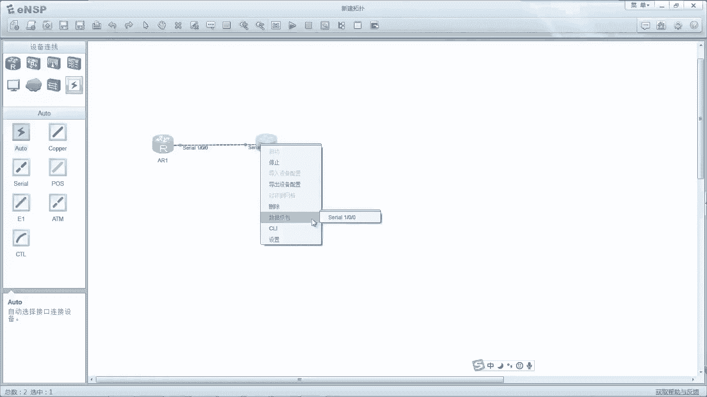
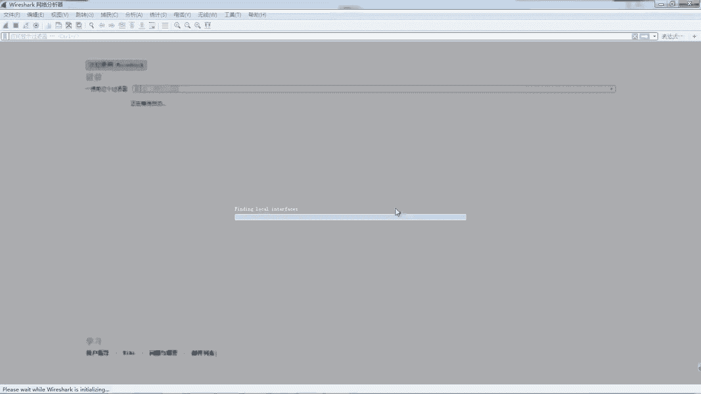
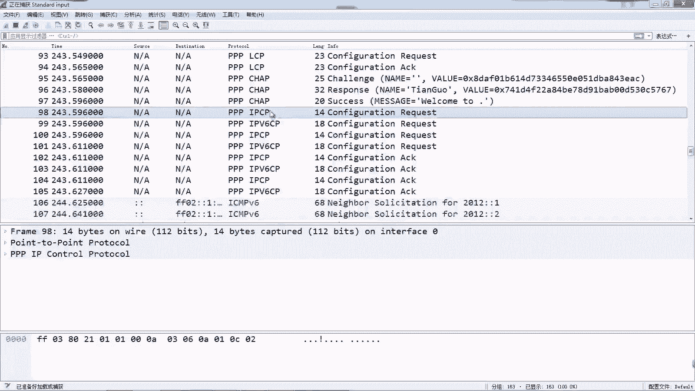
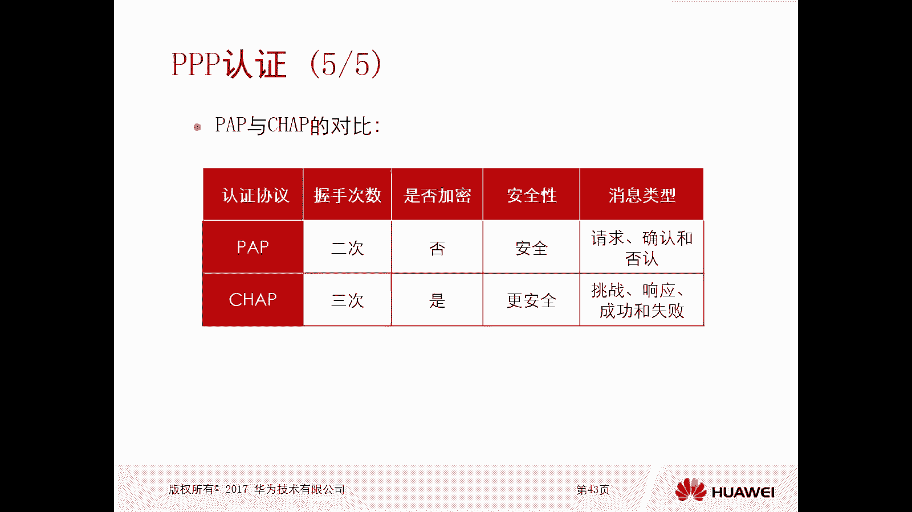

# 华为认证ICT学院HCIA／HCIP-Datacom教程【共56集】 数通 路由交换 考试 题库 - P48：第3册-第5章-2-PPP认证及配置实验 - ICT网络攻城狮 - BV1yc41147f8

好，那么接下来我们看一下这个P的这个认证协议，那么实际上我们刚才讲了这个PP协议，它是分为两个阶段，一个是呃第一阶段叫做LCP阶段对吧，那么第二阶段呢就是NCP阶段嗯，那么其实呢这是缺省缺省的一个情况。

那么缺省呢只是这两个阶段呃，如果说非缺省的情况下啊，我们引入了印认证，那么这个认证呢就会出现在sap和NCP中间啊，就是先做sap，然后呢去做认证，如果是认证通过，那么再去进行一个NCP的协商啊。

那么为什么认证这个为什么认证这个原因，实际上也比较简单，那么就是为了安全，对不对，你不能说你随便有一个路由器，都和我能够建立起这个PP的连接，对吧，我得去做一个认证，对不对，OK好，那么接下来呢。

我们就看一下这个PP的认证协议，那么对于PP的认证协议呢有两个，一个是pap认证，tap认证，他是这个密码认证协议的一个缩写，叫做pep啊，密码认证协议，那么第二个呢叫做trap tap呢。

叫做挑战握手认证协议，是这个缩写啊，这两个认证啊，那么对于这个pip认证呢，它是这个铭文的，就是密码是传送的啊铭文，而且这个密码是传送传送密码，你那个密码是以明文的方式出现，所以说呢它并不安全，对不对。

哎并不安全，那么对于这个挑战握手认证信息呢，他是这个密文的插密文，但是这个密文呢不是密码，哎所以说它传送的呀不是密码，但是他传对吧，那这个一般呢他是传一个哈希值，哈希值通过哈希算法得到的一个这个哈希值。

所以说这个chap认证呢它是比较安全的，比较安全的，而且这两种协议他们的交互过程有一点区别，对于pip这种认证方式啊，我们俗称的两次握手啊，两次握手啊，那么对于trap这种呢，它叫做三次握手啊。

这是交互的次数也是不一样的啊，好那么接下来呢我们就看这个PPP的一个认证啊，呃我们先看一下这个pp认证请求，消息里面的一个封装，拿封装，那么前面的是PV的头部，后边是PV的尾。

那么中间呢哎是这个pip pip头部，那么pip头部它也有代码，那么代码呢也是代表了你这个认证协议，它的呃消息类型是吧，如果说这个代码唯一的话，它是这个认证的一个请求消息啊，如果是二的话。

就是一个认证确认消息，一般情况下就这两个交互一下就可以了，我发一个请求，发一个ACK确认就好了对吧，这是在认证成功的情况下，假设你认证不成功呢，比如说你的用户名和密码错误，对不对。

那么这种情况下我要去做一个否认啊，就是认证的否认消息，那么这个代码是三啊，所以说这儿有三个代码啊，好然后是标识符和长度数据部分好，那么接下来呢我们就简单看一下这个pap认证，它的一个协商的过程行。

我想哎比如说啊，比如说A呢作为一个这个叫做被认证方啊，被认方，那么B呢作为一个认证方，那么意思呢就是呃我B要对A进行认证，但是A没有对B以前验证对吧，当然我们也可以双向认证啊，就是A我要认证B。

B呢也要认证A但现在我们讲的是单方向的，就是B要认证AA呢不需要认证B，那么这种情况下A发起数据之前对吧，你想让B在认证它之前，那么B呢必须要配置一个用户名和密码对吧，因为你是认证方嘛，对不对。

你有一个数据库，数据库呢无非就存的用户名和密码，假设这个用户名是填用户名是苹果对吧，配置的密码是华为X23好，那么这种情况下这个AA对吧，那么他去发起链接的时候，因为他用的是ICPICP这个配置性消息。

那么这里边是不要求对方认证的对吧，没有什么认证的这样的需求，那么B呢就确认了，OK对吧，你的这个协商参数啊，我都可以接受，那么同时B去发送LCP配置请求消息的时候，由于B做了认证，他要对A进行验证。

对不对，所以说B在发送这个LCP呃，这个协商报文的时候啊，他有一个参数就是要求对方要认认证哎，就是这个A你要提供认证数据啊才行好，那么A呢说OK也没有问题，我给你提供对吧好，那么这个呢。

就是我们刚才讲的那个ICP协商阶段，那么这个协商和之前讲到的协商多了一个东西，就是我们加入了认证是吧，加入认证好，那么接下来如果说你ICP阶段，它是有认证信息的，那么接下来呢就进入到了认证阶段。

如果没有，就直接进入到NCP阶段嘛，对不对，好，接下来是认定阶段，那么认证阶段由于必须要让A提供认证对吧，所以说这种情况下，A是主动朝着B发起用户名和密码的tap，认证请求，消息说OK用户名填过密码。

华为MA3能不能通过，那么B收到这个用户名和密码以后呢，他去搜索他的数据库，那么一般就是本地的一个SA数据库，搜索发现哎天果密码发131样，OK认证成功，那么这样呢这个pap认证阶段呢就就通过了。

哎这个pap认证阶段通过以后，接下来进入的阶段，那才是NCP阶段对吧，然后你才有权限去协商，唉我们的网络层协议，如果说你认证都没有通过的话，OK不用去协商了对吧，同时他如果重新认证失败了。

他会把这个LCP他协商出来的链接给断掉，断开断开，因为认证不通过嘛，没必要去维护它了，对不对，这是这个pip认证啊，OK那么我们再看一下这个chain chap认证呢，就相对来讲比较复杂了比较复杂了。

OK那么首先A和B要去做pap认证报告认证，那么假设B是认证方，A呢是被认证方对吧，那么和pap认证不一样的地方是，不管你是认证方还是被认证方，都要预先配置个密码啊，那么用户名配不配，这个倒是无所谓啊。

可配可不配，缺省不配配个码对吧好，这两个密码肯定要一样啊，这俩密码肯定一样，OK好，那么接下来接下来，那么B开始朝着A嗯去发送挑战消息，大家注意一下啊，现在我们讲的是认证了。

就是LSP阶段已经不用管了啊，因为上一个pp我们已经看到了，对不对，有SP了，我们讲的是已经sap已经协商完了，接下来是chap认证阶段了对吧，这就换成chap认证阶段了。

所以说接下来的流程是chap认证的流程是吧，哎那么B呢会发生一个挑战消息，那就做challenge信息啊，这个叫做第一次握手，这个挑战消息里面有几个比较重要的值啊，一个叫做标识符，一个叫做挑战值啊。

条件值这是个随机数啊，随之好，那么当A收到这个挑战消息以后，它会使用三个元素，第一个元素A配置的密码，第二个元素收到的挑战报文的标识符，第三个元素挑战的随意日，三个元素通过散列算法啊。

散列算法那就是做MD5的散列哈，希然后得到一个散列值，得到一个散列值A，好那么他得到的值以后呢，再把这个散列值给它，放到响应消息里边进行回复，那这个呢就叫做第二次握手了，对吧好。

那么当B收到这个响应消息以后，B也会利用之前的标识符，挑战值和B上面配置的密码，也采用相同的散列算法，比如MD5哈希得到一个散列值，散列值B，那么如果说这个散列值B和A发送过来的。

第二次握手响应消息里面，三只A如果比较一致的话，那么B呢就会发送一个成功消息说OK验证成功，验证成功，我们想一下啊，你看啊标识符和挑战值都是必发出来的，没有变化，那么A可以变化的是密码。

那么A如果A的密码和B的密码一样，那么他们的第二个元素，和第三个元素也一样的话，那么再通过相同的散列算法，得到的只是肯定是一模一样的对吧，那如果说你的密码不一样，OK那得值肯定不一样，对不对，那不一样。

散列值不一致，那么就是认证失败就会发送一个失败消息，这是第三次握手，所以我们可以看一下他在这个链路上传送的，第一次握手和第二次握手，这里面的信息比较关键，但是我们看他有没有去传送密码出去啊。

没有只是发送了标识符啊，挑战值啊，散列值啊对吧，你能不能通过散列值去推导出来，它的它的这个密码呢几乎是不可能的，推不出来啊，这是我们安全上的一个东西啊，啊不可能推出来啊，所以呢这个chap认证呢。

就要比刚才我们讲的pap认证要安全得多，pap认证在传输用户名和密码的时候，全都是明文，哎现在是没问题，好，这是这个pap认证啊，那么我们在chap认证，我们再对比一下pap认证和tap认证它的对比。

握手次数，pip两次，tap等于三次，对不对，是否加密呢，pip是没有加密的，那么trap呢他是做了哈希的，做了散列的啊，可以认为是加密了，对不对，好，那么安全性tab呢安全chap呢更安全对吧好。

那么相似类型pip请求确认可否认，那么这个chap认证呢挑战保安，响应保安成功和失败对吧，唉好这是这个认证啊，好，那么接下来呢我们就去做一下pap证和chap证。

我们再抓个包，看一下它的交互过程，好，那么我们接下来呢还是拿着我们这个图啊，这个拓扑去做认证啊，哎我们之前做实验在上面是做了这个呃，IPP4和IP6的，对不对，我们都做了。

大家可以看一下这个接口配了IPP4的地址，也配了IP地址啊，啊那么我们做实验呢，现在我们研究的重点是这个认证，所以说你没有配IP6也无所谓啊，好那么接下来呢我们去做认证，假设这个R2是认证端啊。

假设A2是认证端啊，那么我们配置这个pap认证嗯，那么首先A2呢它作为认证端，那么第一个他要配置一个用户名和密码，要预配的嗯，比如3A啊，那么在这儿呢我们要去配一个LOCSER。

比如说啊田果田果password，华为at13好，同时呢我们把甜果这个用户名啊，这个用户名把他的服务类型呢改成P，那么缺少它都是为所有的服务服务对吧，所有的协议服务啊，所有的这个服务类型服务啊。

那我们就改成这个pp好，当然这个命令你不敲也不影响啊，好然后呢我们在S1杠零杠零这个接口啊去做，去配置一个命令，就是PPP啊啊，这个认证的模式为pip好，然后呢，我们去做一个shut down。

我们赶紧抓包。

好，那么同时呢，同时呢我们需要在一上面去做认证信息的书，对吧，因为A2作为一个认证的端啊，A1是个备用端，对不对，所以说你A21呢要提供用户名密码啊，那么就是在接口下面去配置ppp pp啊。

然后去配置一个local user啊，那么这个user肯定是R2上面的user，并不是R1的user啊，好甜果对吧，好password，华为，at123好，那么做完以后呢。

我们再在A2上undo shua，哎我们看抓包的一个过程好，我们现在看啊，这个抓包现在已经有了这个信息了对吧，那么SPACK以后，紧接着我们看是不是做了这个pap认证对吧，排分成好。

因为在他们做这个confi configuration request的时候，这个认证方呢它是携带了这个认证的，哎这个是被认证方法，他没有认证对吧，没有协商认证，那么另外一个呢看啊，他除了MTU。

除了魔术字，它还有一个说OK你要我要需要你提供认证吧，认证方式是tab认证好，所以说经过这些协商以后啊，那么紧接着是被认证方，朝着认证方去发送认证信息啊，pip pip我们可以看一下抓包就能看到啊。

这里面的信息是什么对吧，PRID填过password，华为at23，然后welcome对吧，然后紧接着进入到了NCPIPCPIP6CP对吧，所以这个并不安全，我们能够看到你看能抓到密码和用户名，对不对。

嗯好就是这个tap认证好，那么接下来呢我们再去配置一个chap认证，那么chap认证呢首先也是A2啊，它的全局下面去设置一个这个用户名和密码好，那么需要在全局也是要设置个密码用户名是吧。

那我们就还用之前的填过password saver poeat3，对不对，还用这个啊，好，只不过呢现在这个S1杠零，这个接口呢呃它的一个pp的认证模式改了，改成tap了，没问题吧。

pp austication mode改成tab，然后我们做个SHA右下的嗯，好那么紧接着呢我们在一上去的操作，那么一呢现在作为一个背景方，那么你需要去提供和chap相关的一些参数了。

不要去提供pip pip的什么user和密码对吧，就是安卓的pp pip local user好，那么接下来呢是这个一去提供，那么提供呢首先他要去做一个ppp tap啊。

后边user这个user呢我们要写成甜果，对吧好，Pp tap password，哎，华为7。3，好可以了，就这样命令这两条命令虽然你写在这了，但是注意一下这个密码是不会发送过去的啊。

只会把这个用户名发送过去啊，只会把用户名发送过去啊，好，那么接下来呢，我们在这个二上去做一个安都杀大，安都shut down，然后呢我们再看抓包它的一个抓捕过程啊，好我们看啊，那在下边是吧，好这样的啊。

你看啊，这是l s p request AC k c k好，接着我们进入到pp的阶段，首先呢是一个挑战报文，那么挑战报文里面主要是有哪些内容呢，我们看看数据，数据呢就是一个随机值，还有个ID没问题吧。

都是符id和这个随机值这两个东西好，那么这个是谁发出来的呢，这个是这个AR2发出来的，R2发出来的对吧，那么A2把这个随机值和id发出来，然后A21收到以后呢，收到以后。

他会利用这个挑战报文里面的id和随机值，以及我们刚才在AIE的接口配的密码做哈希，做哈希，做完哈希以后呢，作为散列值，他说的散件值得到散件值，把这个散值呢放到响应信息里边，所以在响应信息里面呢。

我们看它有一个随机值，同时它也会把我们接口配的密，用户名发进来填空，那么当这个AR2收到以后，AR2会利用这个用户名填果，去搜索它的本地数据库里面有没有相同的名字，发现有甜果。

OK那么再利用啊它本地数据库里边填果，找到用户名对吧，找到他的密码，再用这个密码，再和他之前发送挑战报文里面的id，以及随机值三要素做哈希，因为我们的密码都是一样的，所以说做完哈希哈希值也是一样的。

所以最终是success对吧，Welcome，对吧，哎那这个就认证通过了，那么在这个过程中，我们看他有没有去传送密码相关的一些参数上，没有啊，顶多传送了一个用户名，但是你有用户名你搞不定的呀。

因为我们去做三元三元素哈，希的时候用用户名了吗，没有用的，全是密码，对不对，哎，随机值id哎啊这就是chap认证认证成功后，接下来就进入CPIPCPIPCP。

好啊。

