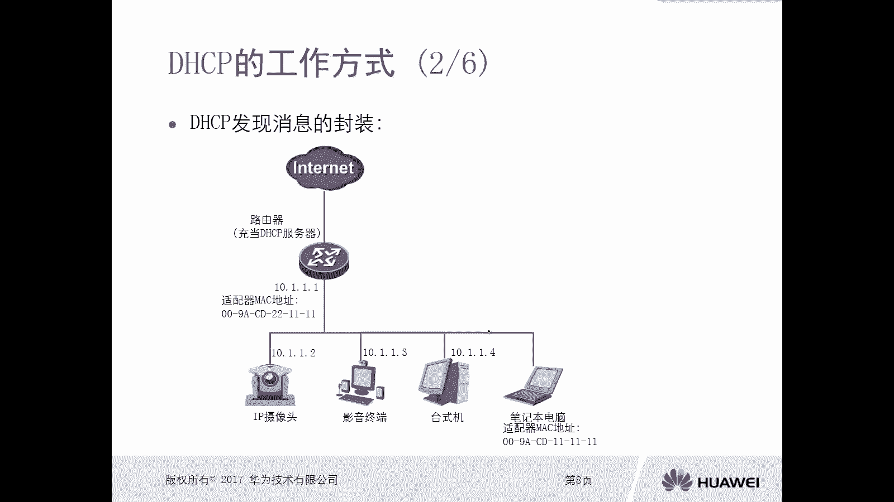

# 华为认证ICT学院HCIA／HCIP-Datacom教程【共56集】 数通 路由交换 考试 题库 - P49：第3册-第6章-1-DHCP概述及工作方式 - ICT网络攻城狮 - BV1yc41147f8

好，那么接下来我们讲一下这个DHCP的概述啊，那么首先呢我们先对这个DCP协议啊，做一个简简单的介绍啊，那么对于DCP呢，它的全称呢叫做动态的主机配置协议啊，动态的主机配置协议。

那么这个DHCP的协议的目的呢，实际上就是我们这种终端设备，可以通过DHCP协议，从这个DHCP服务器去获取一些，这个网络通信的一些参数信息，比如说地址啊，比如说网关啊，比如说DNS啊。

比如说域名等等这些信息，那么当我们PC如果说你没有去，没有去配置一个IP地址的话，那肯定是没法进行通信对，那么在一个偌大的网络环境里面，比如说我有上百台上千台PC，那么不可能管理员一个一个去做配置对吧。

所以这种情况下呢，我们需要用动态分配地址的方式，那么就需要去部署DHCP服务器，那么部署了DHCP服务器，那么意味着我们这些客户端这些终端设备，你要和DHCP服务器进行交互。

目的呢是要拿到DHCP服务器的一些地址信息，对不对，那么这种情况下就会使用到DHCP这个协议啊，没问题吧，哎这是一个简单的一个DC p的介绍啊，那么在我们现在的网络网络环境里面啊。

你甭管是大型企业网还是小型企业网对吧，那么都会使用DHCP啊，包括我们家庭办公对吧，家庭上网你搞一个什么路由器对吧，然后你打开WIFI，我们用手机也好，用笔记本也好，用台式机也好对吧。

那么当开机以后连上WIFI以后，它都会有一个正在获取IP地址的过程，也有可能有人用用手机用WIFI去连接，输完密码以后，你就能看到啊，正在获取IP地址，那是实际上这个呢。

就是你的手机正在和这个网络里边的，DHCP服务器进行通信啊，像他去获取地址参数，那么有了地址参数，你才可以进行网络的一个数据通讯，对不对，哎这是DNCP这个鞋啊，所以说他是用的比较广泛的对吧，都会用。

所以接下来我们就再看一下，这个DCP协议的简介啊，那么对于DCP协议呢，它是典型的服务器客户端的模型，那刚才我也讲了，那么服务器呢我们需要去DCP服务器，那么客户端呢就是我所有的终端设备。

包括我们这种手手机设备呀对吧，包括我们这种pad呀，笔记本啊，然后就是台式机啊，什么打印机啊等等终端对吧，那么这就是客户端，所以它是服务器客户端这种模型，那么他们去通信的时候。

就客户端和服务器进行通信的时候，他使用的是UDP作为它的传输层协议啊，用的不是棋子学啊，这个不需要确认对吧，哎不可靠，但是不可靠也没有关系嘛，哎谁说使用UDP就一定会发生丢包呢，对不对，哎。

哎这是使用UDP作为它的传输层协，那么对于我们这个客户端，可以从这个DCP服务器里面去获得啊，并且能够自行去完成配置的信息，那么包括哪些呢，比如说IP地址啊，我用网关地址，域名服务器地址啊啊。

还有一些特定平台的一些信息啊，那这是我们客户端，可以从DSP服务器那那里能够拿到的信息好啊。

比如说我们这个构图里面，我们能够看到这里面有什么有IP摄像头啊，有什么影音终端呀，有台式机呀对吧，那这些，实际上你都可以通过DSP的方式去获取IP地址，假设啊我这有一台笔记本对吧，有一台笔记本。

那么接到这个网络环境里面呢，我在笔记本的网卡上面，开启了通过DHCP的方式获取地址，那么这种情况下，哎这个笔记本呢就开始去发送DHCP的请求，那么请求的目的呢，就是哎我想拿到一个地址对吧。

那么具体过程是这样的，我们通过动画的方式给他展现一下啊，哎那么笔记本电脑对吧，先发一个报文，哎咱们大家注意一下，这个豹纹呢它是一个广播报文，它是一个二层广播报文对吧，哎这个报名呢叫做DCP请求请求呢。

就是我需要拿到一个地址对吧，那么通过这种生活化的方式去讲的话，就是哎大家好，我是刚来的，谁给我一个指定的座位号，那么由于它这种数据它是一个广播，所以说呢他会泛红给所有的终端设备，包括路由器对吧。

那么对于路由器呢，我们可以把路由器给它配置成一个DCP服务器，那么他能收到，那么其他的终端设备上也能收到，那么其他的设备收到以后呢，它是没法处理的对吧，你是在请求地址，我们我们这个终端能给你分配地址。

分配不了，所以说你找位置啊，和我没有关系啊，那什么点2。3。4就不离，那么对于这个路由器来讲呢，哎我就是DACB服务器对吧，OK好我给你分配一个地址，哎那在这个场景里面就是OK我看周表啊。

看一下给你安排在哪，哎就是这样的过程非常简单非常简单好。

所以说对于这个DCP，它的一个工作的一个步骤呢，简单来讲是分为四个步骤啊，第一个呢就是当我们客户端啊，这个网卡初始化的时候，它会在网络中去寻找这个DSP服务器，哎那就是发送广播对吧，哎谁是DSP服务器。

请给我一个IP地址对吧好，那么当服务器收到DCP请求报文以后，那么服务器就会向着这个DCP客户端，提供一个可用的IP地址，哎我给你提供对你需要不需要，哎如果说客户端需要的话。

那么客户端会向着DSP服务器去申请，刚才你分配的IP地址的使用权，就是我分配出去了，你得确认你要不要啊，为什么这样讲，因为在一个网络环境里边啊，有可能会存在多台服务器啊，多台DSP服务器。

那么当你发送请求报名去查找服务器的时候，那么广播报实际上所有的服务器，DOTA服务器都可以接触到这个B，所以说这多台服务器呢，都会向你提供一个可用的IP地址，那么这种情况下，客户端你必须要表明啊。

你需要的IP地址是哪台服务器分配给你的，哪一个IP，所以说客户端它必须要向着TCP，服务器要申请使用权好，那么当服务器收到了这个申请申请IP地址的，使用权的消息的时候。

那么服务器就会向这个客户端再次确认，这个地址，你可以用哎，这是DCP他的工作的步骤就是四步，那我们俗称的四次握手没看四次握手好。

那么接下来呢我们就整体看一下啊。

整体的通过这种动图的方式啊，看一下这个DCP它的这个工作步骤。

那么首先第一个哎，那么我们这个笔记本电脑大家注意下啊，他的Mac地址是11111哎，这个后前面就不读了啊，那么这个路由器呢，呃这个路由器的地址呢是10。1。1。1。

然后他的Mac地址是2211杠幺幺啊啊，这样的好，那么同时呢在这个网络环境里面的，这个路由器呢，它是充当DHCP服务器的，那所以一开始这个笔记本它初始化以后，他想要拿到一个IP地址。

那么它一定是要发送一个报文出来，而且这个报文大家注意一下，它一定是广播报文诶，那么目的呢就是诶我要去请求，我要去请求，那么谁能给我发送一个DCP哎，能给我发送一个P地址，谁是DCP服务器。

那么这个豹纹它的封装是什么样的呢，哎我们可以看一下，我们从底层开始看啊，那由于我们这是个以太啊啊，所以我们看这个链路层以太封装啊，它类型的是IP，那么表示它上面承载的是IP协议，对不对。

然后原Mac原Mac地址字段呢是笔记本的Mac地址，111，这是目的Mac地址，我们看全F2层广播对吧，二层广播，那就意味着这个网络环境里面，所有的设备都会收到好，那么网络层封装呢，唉协议字段UDP。

因为我们刚才讲了啊DHCP啊，它是基于UDP群里传输的，对不对，所以说呢上面封装的是UDP传输层，然后原IP地址字段四个零啊，为什么是四个零，因为你这个笔记本电脑啊，现在还没有拿到地址。

当然是没有地址可用啊，所以说它是一个未指定的地址，四个零目的IP地址字段呢来对应这个全F对吧，就是全是全部都是1252525哎，这就是广播了好，那么传输层UDP源端口是68目的，端口是由器，注意一下。

这是固定的，我们DCP使用的固定端口号，原端口68，目端口67，安全性好，那么那么上面的信息呢就是DHCP的请求信息，就发现信息叫做discovery a message啊。

所以这个报文呢一定会被路由器，还有各种终端疏导，但是其他终端会理你吗。

不会对吧，唉这是请求的过程比较简单好，那么接下来当路由器收到这个请求报文以后，那么路由器呢开始去回复offer bone啊，就是翻译过来提供对吧，提供消息，offer boy啊，Offer。

那么路由器回复的er bone，它的封装，我们看一下链路层的封装呢，Mac地址，自己的Mac地址，目的Mac地址全F那么注意一下，对于这种offer，他用的也是广播的方式去广播出去的好。

然后紧接着它的网络层封装原IP地址，10。1点点一，就是这个路由器的IP地址对吧，然后这个目的IP地址呢还是scar5，远端口67，目的端口68，反了嘛，对不对，相反相反了。

好那么上层的信息呢就是DACP的er信息哎，里边呢携带了一个地址哎，10。1。5。5，当然除了地址，还有什么网关呀，哎网关就是10。1点点一呗，对吧，按照我们这个图来讲，还有什么DNS啊啊域名啊等等。

那么最重要的我们主要是看这个地址啊，10。1。5。5，那么这个意思就是我作为服务器，我可以给你提供一个可用的IP地址，10。50。11。5，你需不需要好。

那么这是第二个步骤好，那么第三个步骤，第三个步骤呢就是我们客户端，客户端必须必须要向着服务器啊，必须向服务器去做一个申请对吧，为什么，因为可能在一个网络环境里边，我可能有多台DHCP服务器，看到没有。

假设有多态，那你笔记本电脑你做了discovery以后，那么路由器做offer啊，那么这个服务器DCP服务器也做offer，那么两个offer两个都给你提供了一个IP地址。

那么请问你笔记本是不是得选用一个啊，你要么选用路由器给的，要么选用TCP服务器二给的，但是你不能说无责任，你必须要通知告诉他们说，OK我要去申请你路由器的app，给的还是DSP服务器给的对吧。

哎所以说这种情况下，哎笔记本电脑他必须要去做一个request，去发送一个request bone啊，request请求报啊，请求报，那么就是要确定我是使用哪一台服务器，给我提供的那个地址。

比如说现在我们这个场景里面呢，它发送的一个请求报文是使用路由器，就是路由器这台服务器提供的10。1。5。5，这个IP地址，同时这个报文注意一下，它也是广播报文，对呀，为什么要广播啊。

第一个为什么没有广播，我们想一想为什么没有广播，第一个就是我要告诉所有的人，OK这个地址我用了对吧，这无关紧要，最重要的是要告诉两台DCP服务器，我用了谁的，我用了哪台服务器给我分配IP地址对吧。

那在这呢实际上是在通知两台服务器说，OK我用的是路由器，这台路由器给我分配的地址，我申请的啊，同时呢这个DSP服务器也看到了哦，原来你用它的，OK那刚才我给你提供地址不能用了，我就回收了，没有吧。

哎所以说这个通知呢是双向的一个作用啊，来即通知选用的DACP服务器，也通知不选用的DSP服务器，那么对于这些终端，你收到的这是无关系对吧，没关系，反正这个地址被别人用了，我不能再配了，对不对。

就这意思吧，对吧好呃，然后呢，这个TCP服务器二，这个效果呢就是OK，哎看来这个呃我给他提供了10。1。1。100，人家没看上对吧，哎我就回收吧，那么路线的时候哦，原来你是选中了，我给你提供的10。1。

1。5K，这个就给你了。

好当这个路由器收到这个请求报以后呢，他一定要去做，对这个一定要对这个信息做一个确认，那么就是一个ACKACKACK报文啊，所以说那么正常下个路由器就会发送一个报文，哎这个报文呢就在不再是广播了，单播了。

看一下原Mac地址，2111目的Mac地址就是PC的好，那么原IP地址10。1。01目的IP地址呢，哎这个是错的，对不对，哎原理上来讲，这不可能是四个二五啊，那么应该是谁呢，应该是10。1。1。

5这个地址啊，我们抓包可以抓出来的啊，10。1。5。5啊，10。1。1。5是吧，唉然后呢这个原端口67，目标端口68哎，确认信息，那么确认信息里面实际上包含的内容。

和我们的offer ball里面包含的内容是一样的啊，就是地址啊，域名DNSS啊等等这些内容好。

那么这样的话这个呃PC呢他就拿到了IP地址啊。

这就是我们DCP他工作的四次握手啊，首先是服务器画一下图啊，首先是这边是服务器，这边是PC啊，首先呢是这个PC发送一个discovery b发现报文对吧，去发现这个服务器。

服务器呢去做一个offer去做提供对啊，那么PC呢再去做request，啊那么服务器呢再去做一次ACK啊，这样就完成了交互，但是你有没有发现我们一直在讲，那么在他们之间交互的时候。

只要是广播全都是二层广播，那我们知道二层广播呢是没法去唉，穿越路由器泛红到另外一个网段，对不对，那么像这种环境里边呢。

就是我们小型网络啊，通过一台服务器啊，通过一台路由器，哎，那么记住我们的网关设备，也作为一台非常简单的DACP服务器，是没问题的，但是在大型的网络环境里边，那么大型的企业网，他有自己的IDC机房。

他有自己的服务器集群，那么可能他不会用网络设备，作为DACP服务器，那他可能专门搞一个windows操作系统的对吧，windows server对吧，一台服务器，那么作为DSP服务器。

放到他的这个服务器的一个机房里面，那很有可能这个服务器和我们的终端设备中间，可能有跨了路由器呀，什么三层交换机啊，什么防火墙等等设备，那这种情况下，你客户端有可能和服务器处于不同的网段。

比如说这个图对吧，你看这是我们的服务器的一个呃集群啊，就是放在另外的一个这个分隔网段里面了对吧，他们属于17216网段，但是我们的终端呢它属于十网段，那现在这个笔记本电脑。

也想通过DHCP的方式获取地址，那DCP在哪，在这呢，七那你发一个广播过来，那请问这台路由器，能不能把你这个二层广播给泛红过来呢，过不来的对吧，所以这种情况下哎我们就需要配置一个中间人。

哎这个中间点叫做中介代理，叫做中介代理，哎，一般呢是我们的这个和这些呃，客户端和客户端啊，哎直接相连的路由器设备，或者是三层交换机设备嗯，那比如说咱们图上就是在设备好。

那么我看这个中介代理它的工作方式啊，这样的啊，首先这个笔记本呢还是想要获取一个IP地址，发送一个广播厅出去对吧，哎就是我我要发送一个DSP请求对吧，哎大家好，我刚来请给我一个座位对吧好。

那么这个是个广播，这个广播信息呢被客户端，其他台式机收到以后没有什么用，但是被路由器收到以后呢，如果说你没有去配，没有去设置中介的话，那么这个路由器肯定是把它丢掉吧丢掉，但是啊我们不能让他丢掉。

我们得想办法让路由器，把这个信息通知给这个DSP服务器，所以这种情况下，就需要在这个路由器上去配置中继对吧，哎那么中继的效果呢就是OK，哎虽然我没法给你分配啊，但是呢我知道DACBDACB服务器在哪。

唉我帮你转发给他，让他给你分对吧，然后我再告诉你，哎所以这种传下这个路由器呢，就把这个广播啊通过单播的方式就转了一次，变成一个单播数据朝着服务器发送了过去，没问题吧。

哎那么这台路由器呢就叫做DHCP中继代理啊，那么当地CP服务器收到这种单播DCP请求以后，他会给他分发啊，给他提供offer，那么这个offer是以单独的方式又回给这个路由器，那么路由器呢。

再以广播的方式再回给所有人是吧，哎所以说你看这呢它就是一个中继，在这边呢该广播该广播，该单播单播对吧，但是中继和服务器之间的全都是联播，没有吧，这个呢中级代理，我们在实际工作中呢用的也是比较多的啊。

用的也是比较多的好。

