# 华为认证ICT学院HCIA／HCIP-Datacom教程【共56集】 数通 路由交换 考试 题库 - P4：第1册-第3章-3-OSI参考模型与TCP IP参考模型 - ICT网络攻城狮 - BV1yc41147f8

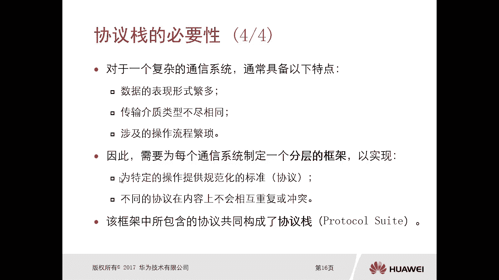

那么刚才我们讲完这个协议站的必要性啊，那么接下来呢我们就看两种协议，第一种呢叫做OSI参考模型，那么OSI参考模型呢它的第一组就是ISO，那么这个S这个组织呢，它的全称叫做国际标准化组织。

那么它开发出来的这个OSI呢，叫做开放式的系统互联模型啊，这是一个参考的模型啊，参考模型，那么定的时间是上世纪70年代，上世纪70年代，那么这个呢是在1984年正式公布的。

那么定义这个OSI参考模型的作用是，第一个强化了通信流程，它的逻辑性啊，使得各层次的职职责呢更加清晰，第二个呢是实现了分层模型的模块，好画修改某层呢是不会影响到整个通讯系统的。

那么对于这个OSI参考模型呢，一会儿我们会去解释它是分为七层的啊，那么每一个层次它实现的功能是不一样的，而且你对某每一个层次进行修改的时候，它不会影响到临场，更不会影响到整个通信系统。

哎所以这也是他设计的一个目的啊，为什么要做分层啊，那么第三个是明确定义了协议，服务接口的一些概念，那么一会呢我们看协议服务接口。

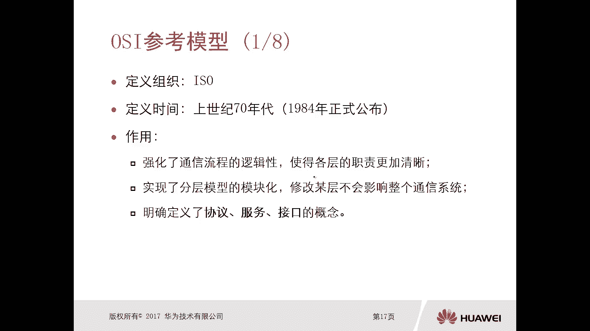

那么接下来我们就看一下这个协议服务接口，它的定义在WEI参考模型里面的协议，实际上指的就是每一层的一个操作规范定义，那么前面我们讲对不对，我们讲协议了对吧，那就是一个规范操作，操作规范怎么去定义呢。

哎这就是协议，那么服务呢是每一层在功能上的一个界定啊，每一层在功能上的基地，就是你在这一层能够实现的功能是什么，你能够做到的一些功能是什么，哎这就是服务，那么接口呢就是上下层之间的一个访问标准。

因为你上下层呢虽然我们两层之间对吧，没有没有这个呃特别紧密的一个联系，也就是说你上层的修改不会影响下层，你上层和下层是不会冲突的，也不会重叠的，对不对，但是呢你上下层之间呢它是有访问的。

那么我们就是通过接口对接口，就是你的访问标准是什么，那么三者的联系，我们看同一设备，每一层呢是通过接口为上层去提供服务的，通过接口去接受下层提供的服务，那么全都是通过接口，OK那么不同设备呢。

同一层的通信的规则是由协议来定义的。

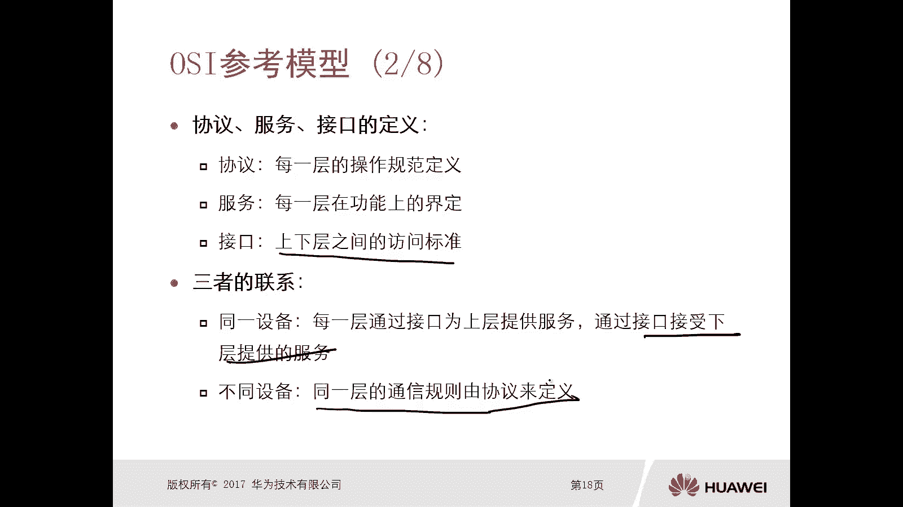

唉这就是三者它的联系，好，那么我们把三者给它放到OSI参考模型里面呢，我们可以看到你每一层，每一层之间都是有协议规范的对吧，唉我们有各种各样的层次对吧，你不同层之间啊，当然你这个你比如说这个是通信方A。

通信方B那么他们的第一层，第二层对应之间的协议肯定是一样的，好那么不同层之间啊，那是我们下层为上层提供服务啊，是上层啊，为下层啊，这个下层为上层进入服务，那么上层呢是利用一个接口去找到下层，哎。

一定要注意一下啊。

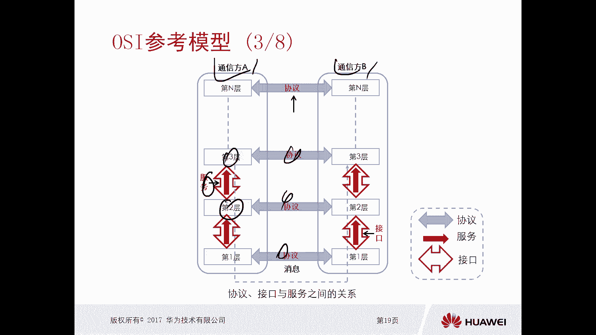

OK好，这是这个接口协议和服务之间它的一个关系啊，那么三者有什么区别呢，我们看一下协议协议，它的定义是不同系统的一个相同层次之间，的通信的规则啊，那么和系统是不一样的层次呢是相同的，好那么对于协议。

它的定义是不同系统的一个相同层次之间，的通信规则，那么这个肯定是要求这个是不同的系统喽，层次肯定要一样的啊，比如说我们这有个新建投递的一个实例啊，比如说寄件人和收件人，他们属于同一个层次。

但是是两个不同的人吧，我认为是两个不同的系统，那么他们要使用相同的协议，这个协议比如说语言对吧，你写写建的人和这个收件的人，我们都用中文对啊，那这样的话都能看懂啊对吧，你不能说一边用一个中文。

一边用一个阿拉伯文，这个搞不清楚的，对不对好，那么对于服务呢是同一系统，大家注意一下，是同一个系统，它内部下层为相邻上层提供的一个功能调用，换言之呢，就是上层仅允许调用，相邻的下层所提供的一个功能。

这就是服务，服务呢必须要存在相同的一个系统里面，层次是相邻的啊，比如说我们实际例子啊，比如说一个邮局系统对吧，他为这个寄件人收件人去提供服务，这个邮局哎，他就是这个服务的一种体现，对不对。

他是为寄件人和收件人去服务的，那么接口呢是同一系统内部，相邻层次之间的一个通信规则，也是相同的一个系统里边，而且层次呢也是相邻的，他们的通信规则啊，比如说邮局，我都规定了你这个信封的地址格式对吧。

先写这个什么省啊，在写这个是在写某个区对吧，在写某个街道对吧，在写什么游编，我都有这个地址，是的对吧。

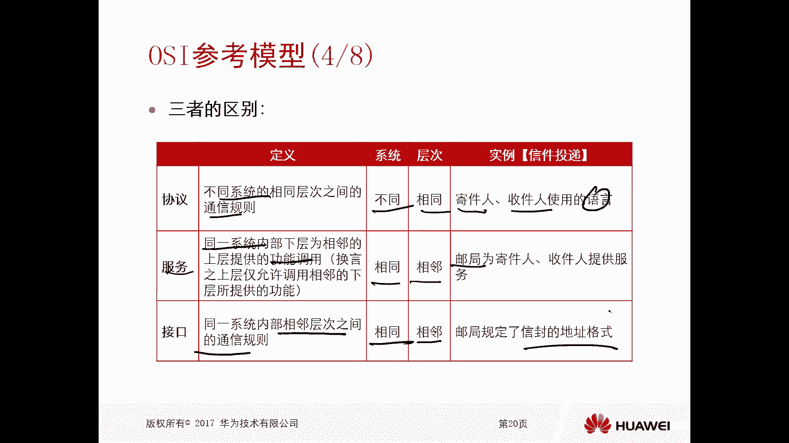

哎这就是通过接口的方式去实现的，而这是这三者的一个关系啊，三者关系好，那么接下来我们就看一个实例的演示啊，比如说现在这个机器人啊，一个美女要和一个帅哥对吧，这个帅哥是个收信人啊，去写信。

那么寄信人呢他作为一个上层收信人，当然也是一个上层啊，上层，那么寄信人和收信人之间呢，他们是有协议的，这个协议呢，比如说我们使用的语言格式是一样的对吧，要么我们两个都使用中文，要么呢我们都使用这个英语。

是这样的话，我写过去你能看懂好，那么对于他写完信以后呢，他要交给邮局，交个邮局，那么交给邮局是通过接口的方式交到邮局的，就是调用这个邮局为他服务，那么邮局呢是为寄件人和收信人，寄件人和收信人服务的。

那么你怎么去调用这个邮局呢，你得拿到邮局的邮政的单子，你要按照单子按照格式去写好你的地址啊，你的邮编啊对吧，哎这是通过接口的方式，那么你把这个信件投递到邮局，那么邮局呢就要给你服务了对吧。

所以这里面体现了接口和服务好，那么这是新建的土地业务，和信封的地址格式一样的，那么这是一个接口啊，那么服务呢就是邮局他职责范围的划分，对不对，哎就是实际例子来讲啊，哎我就是为你去寄信的对吧。

然后收到信息以后呢，我给你这个给你再快递过来吧。

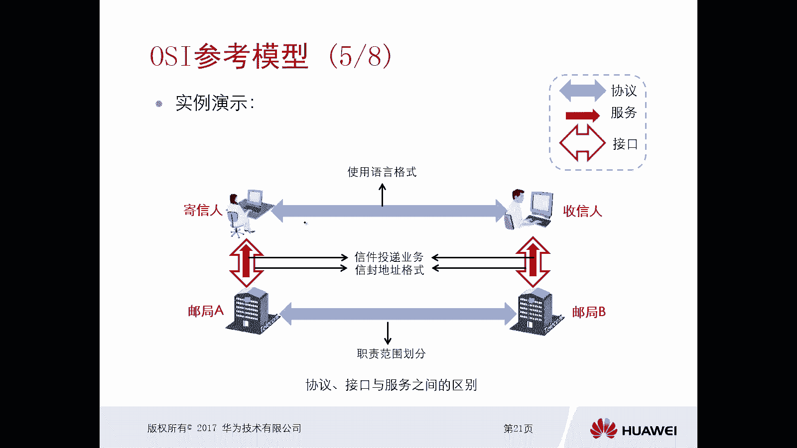

再拿过来，OK好，这是一个协议接口和服务之间的区别啊，那么OSI呢是一共是七层啊，一共是七层，从上到下啊，我们也可以认为是高层和低层，从上到下依次是应用层，表示层，会话层，传输层，网络层。

数据链路层和物理层，那么你通信系统A和通信系统B，那么它的层次呢肯定是一样的，应用层和应用层表示层表上化层或下层，那么你相同层之间的协议肯定是一样的，不同层之间的协议不一样对吧，但是相邻层。

他们是能够提供相同的一个接口和服务，比如说我表示层要为应用层服务，绘画层要为表示层服务，传输层要为绘画层服务，一定是下层为上层服务对吧，那么上层呢通过接口去调用下层好。

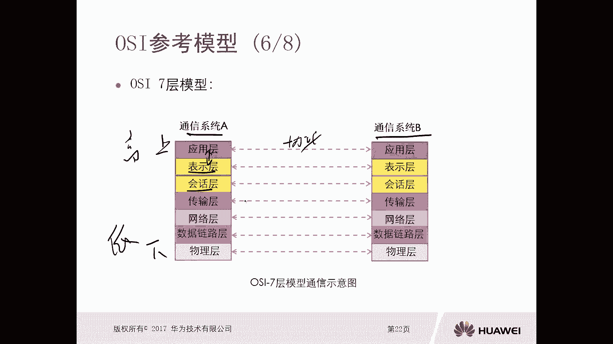

这是这个哇塞七层模型它的一个示意图，那么接下来我们详细看一下这七层应用层呢，它主要是提供用户的接口，通常就是我们说的应用程序哎，你比如说我电脑上装了好多应用程序啊，比如说QQ啊，微信啊，迅雷呀。

那么这个呢就属于应用层的一个范畴，给用户提供接口的，你到底是要去下载电影啊，还是通过QQ聊天，还是通过微信聊天，哎就一层好，那么表示层，表示层呢是确保应用层发出的信息，可以相互去解读。

那么就是格式一致啊，例如呢比如说我做一个加解密呀，进行压缩呀，编码方式等等，哎你比如说我用QQ要聊天对吧，QQ这个应用程序我要输入一些图片，要写文字，这是用层要搞定的，对不对。

然后你这个QQ呢要经过表示层啊，进行一个格式的转化啊，要进行编码，你发的这段对吧，那么最多也要通过表示层呢去做一个反解码，反编码吧，才能得到一个真正的数据好，那么会话层。

会话层呢是为通信双方用于交互信息而建立的，组准备啊，比如说我们SA里面的认证授权的操作啊，当然我们现在可能对3A的话不是特别熟悉啊，如果特别熟悉，那这个呢我们可以简单理解为，就是要去建立绘画。

因为我们一台PC，一台终端设备，它可能有多个绘画，你怎么去管理这些绘画，对不对，你收到数据以后，你从这个收到的你要交给哪一个表示层，交到哪一个应用程序呢，哎你得搞清楚，要区分出来，OK好。

那么在应用层表示层会话层，那么我们一般称这样的数据叫做date啊，这个数据，那么到了传输层，传输层呢是规范数据传输它的功能和流程的，那么这个层主要是定义消息是否被确认，如何对数据进行分片重组等等标准啊。

那么传输层呢，我们后面还去讲它非常重要的一些协议啊，那么在这一层这个交换的单元被称为数据段，SIGNMENT好，那么再继续往下看，网络层，网络层主要是提供寻址和路由功能的。

你比如说你要把这个数据要交到最对吧，那么中间要经过各种各样的网络设备，那么各种各样的网络设备，他怎么知道你要把这个数据要交到对端呢，哎他要进行寻址啊，查找你的地址，要进行路由啊。

所以这一层呢是需要定义逻辑地址的格式，寻址方式等等标准的，那么在这一层的交换单元呢，我们叫做数据包就pt好，那么紧接着是数据链路层，数据链路层呢是在相邻节点之间，可靠的传输数据的，那么在这一层呢。

主要是定义了硬件的地址格式啊，包括他执行的一些差错校验啊，流量控制等等操作，那么都是在数据链路层去完成的，那么在数据链路层的交换单元被称为数据真啊，最后呢是物理层，物理层呢是为端到端的通信区。

提供一个物理介质，那么这一层呢定义了一些比如说与电器啊，电子啊，机械类的一些硬件的标准啊，那么在这一层进行传输的交换单元呢，叫做比特啊，那么比特零，那么对于我们一个数据呢，一定是从高层啊，一层一层执行。

就是你发送方啊，对于发送方来来讲，一定是从高到低降进行一层一层的处理，到了接收方，接收方一定是从低到高，一层一层的进行处理的好。

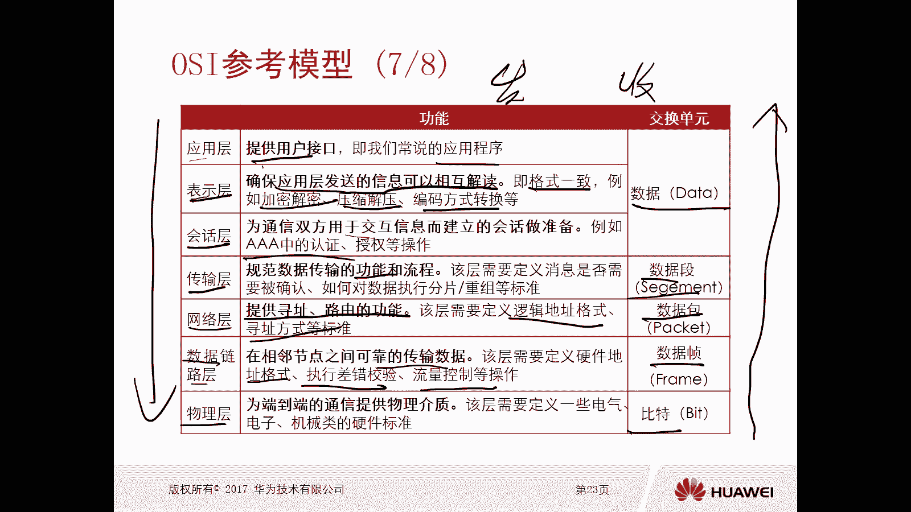

这是一个参考模型的七层，它的详细内容，但是OSI参考模型呢它有自己的一些缺陷啊，那么第一个层次的划分呢是过于琐碎的对吧，那其实表示层层你可以被混合在一起嘛，对不对，你搞那么细啊。

好第二个呢是严格要求协与服务结合，导致时间复杂啊，导致的时间比较复杂，第三个呢是相同的服务在不同层次重复出现，导致这个系统效率比较低好，第四个呢是这个模型提出的时间比较早啊。

刚才我们看了很早之前提出来的对吧，那么导致新的一些协议呢，很难去适应这个模型对吧，好虽然这个模型是由通信界提出了，但是呢是不适合计算机与软件的工作方式的，等等一系列的缺陷啊。

所以说OSI参考模型只是一个参考模型，我们现在计算机网络设备在通信的时候，遵循的不是OSI这个参考模型，而是另外一个模型，那么另外一个模型呢就TCP杠IP模型。

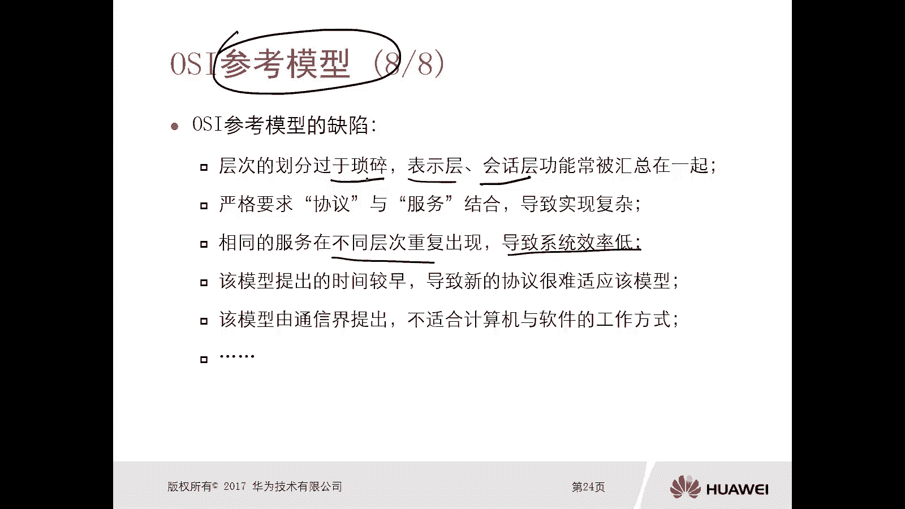

好我们看一下TCPIP参考模型，那么鉴于这个OSI参考模型的不足呢，TCPIP参考模型做出了以下调整，第一个合并了，表示会发层搞一块吧，对不对，好，第二个合并了数据链路层和物理层。

啊啊第三个在TCP跟IP出现商机后，提出与现有的TCP跟IP协议高度吻合啊，最后一个的是没有明确，没有明确定义洗衣服接口的概念，哎这是TCP跟RC模型呢。

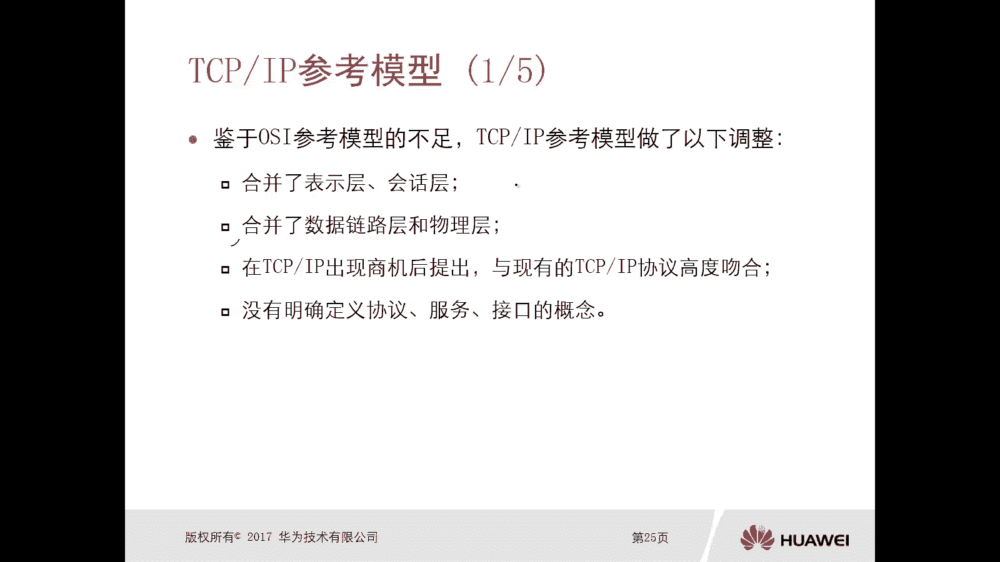

根据这个OSI的一些不足啊，做了一些调整，那么对于这个TCPIP呢呃是四层模型，那么分为是应用层，传输层，互联网层和网络接口层哦，结合上，那么有的时候呢，我们也有可能会把TCP杠IP呢给它分成五层。

那么五层是怎么来的呢，是将网络接口层呢分成了两层，一个呢是呃互联网层啊，一个是这个数据链路层啊，一个呢是物理层，它是这样分的啊，或者说一个叫做网络接口层，一个叫做物理层，它是这样分的啊。

因为我们在后期学习的时候，一般都会用到物理层数据链路层啊，哎其实也叫做网络接入层啊，是一样的呃，那么呃这个四层呢和或者说五层和七层呢。

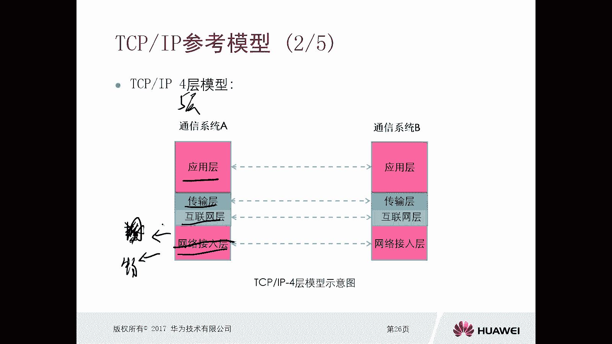

它是有对应关系的啊，OK好，那么接下来我们就看一下这个TCPIP里面的四层，它一个作用啊，应用层呢是从这个OSI模型的应用层，为用户提供各种所需的一些服务啊，比如说常见的协议呢有HTP啊。

DCPFTPTNT等等对吧，传输层呢是从OSI模型里面的传输层，你看它都是有对应关系的啊，那么为通信实体呢是建立端到端的连接的，那这里面最常用的协议呢就是TTPUTV，互联网层与OSI的网络层是类似的。

那么是用于指导数据包进行一个转发啊，那么这里面常见的协议呢是IPICNP，ITP等等，那么网络接入层呢是与OSI模型里边的，你看啊数据链路层和物理层相对，因为呢我们说TCPIP里面呢。

它是把这个数据链层和物理层给它融合到一块，变成一个网络技术层，当然他把这个应用层表示层，包括绘画层融到同一个应用层面去了对吧，这样做的融合好，那么在网络接入层里面常见的协议呢，哎暂时是没有定义的啊。

没有定义，所以说你看啊这个OSI7层呢，实际上和这个TCPIP，四层或者五层是有对应关系的啊，一定要注意好。

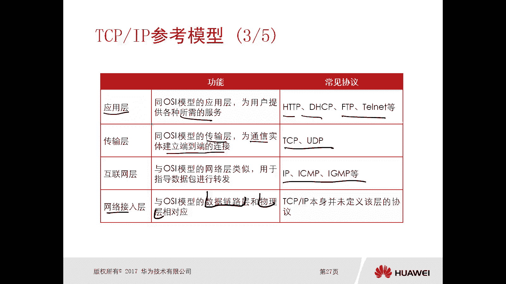

但是TCPIP虽然他做了一些这个优化啊，做了一些调整，但是呢它依旧存在一些缺陷啊，我们看有哪些缺陷，第一个呢就是它没有明确定义协议服务接口，这些概念，导致不同厂商对同一种技术的实现呢，差异是比较大的嗯。

第二个呢是对网络接入层的定义比较模糊，实际上这里边应该是定义，网络层和数据链路层的接口对吧，要定义这两个层次才靠谱啊，第三个是没有明确区分数据链路层和物理层，是吧，哎仅适用于TCPIP协议。

不具备通用性，哎这是它的一个缺陷啊。

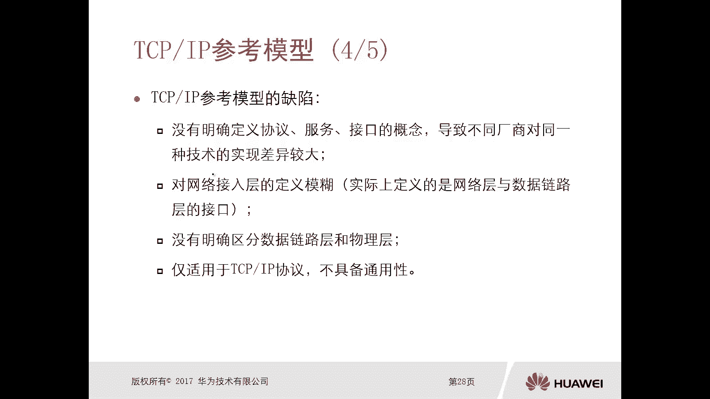

确实好，那么接下来我们看一下，TCP感YP7层参考模型和TCP高P4层模型，它的一个对比啊，对比的是前者呢是更具有参考意义，适用于教学研究，因为它分的比较细嘛，你每一层做什么呢对吧。

干嘛用的非常非常非常非常细，但是后者TP的IP呢是更具备有实践意义啊，适合于用于实际部署，所以就目前我们的通信来讲，全部都使用了TTPIP这种参数模型啊，所有的厂商再去啊这个呃研发它的设备。

研发它的一些功能的时候，都是利用TCPIP模型的，而非OSI7层模型。

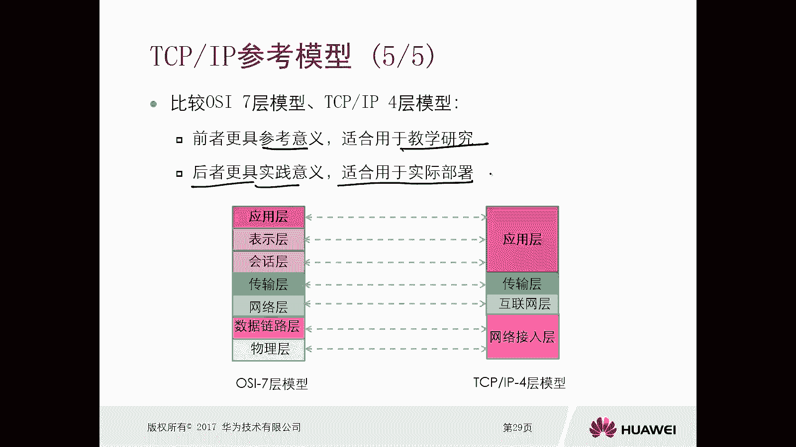

这是TCP跟IP参考模型以及OSI7层，那么本小节的一个总结我们可以看一下重点啊，我们刚才讲了通信需要解决的几个问题，我们要知道对吧，要解决哪些问题要搞清楚，第二个是地协议的一个作用是什么，对吧。

我们得规范嘛，对不对，那么协议分层的好处是什么啊，啊第四个是在参考模型的意义，每个层次的作用，这个我没搞清楚啊，重点是第五个TCV杠IP模型的一个改进之处。

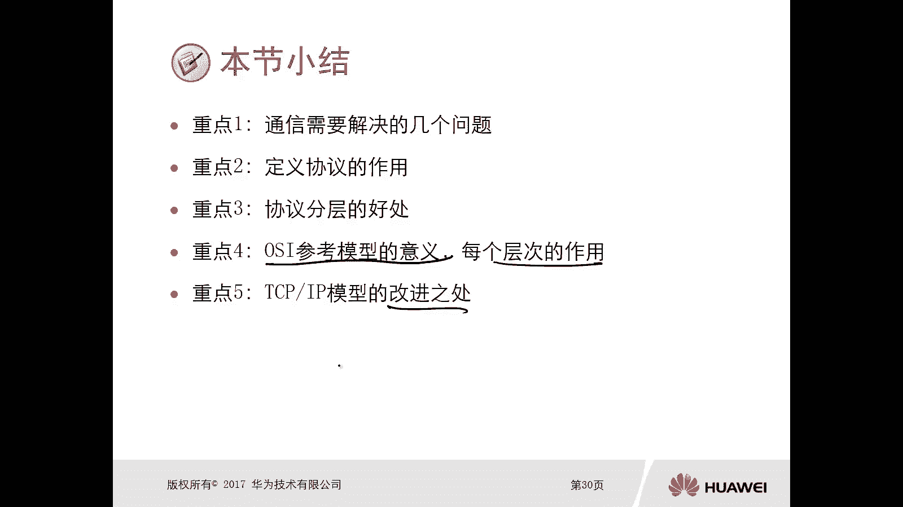

是重点五啊啊一共是这五个重点，那么思考题，第一道题下面哪一层是TCP跟IP模型特有的分层，哪一层啊，我们网络层对吧，是哇塞传输层，哇塞有用层外塞有，那么就是网络技术层，好第二题。

下列哪项陈述与TCPIP模型相符。

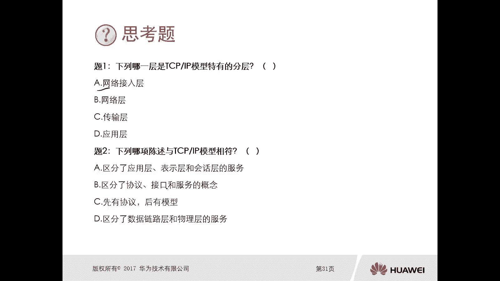