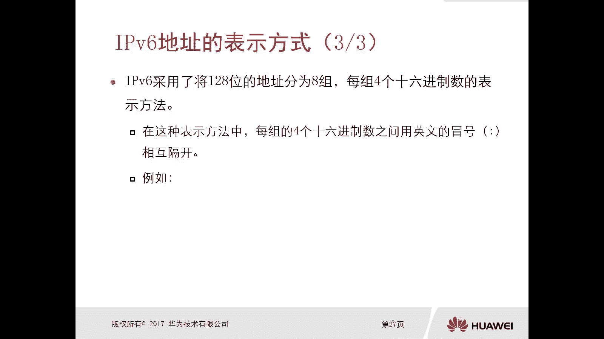

# 华为认证ICT学院HCIA／HCIP-Datacom教程【共56集】 数通 路由交换 考试 题库 - P50：第3册-第7章-1-IPv6协议基础 - ICT网络攻城狮 - BV1yc41147f8

嗯好接下来我们讲一下这个IPV6协议啊，啊我们看一下这个呃前一部分，那么本小节主要是介绍这个IPV6如何去解决，IPV4目前所面临的一系列的问题，以及这个IPV6的一个基本结构。

那么通过以下三个部分来进行介绍，第一个呢是IPV4的缺陷和IPV6的提出好，第二个呢是PV6的这个数据包的一个封装格式，最后一个是IPV6地址的表示方式，那么这部分内容呢。

实际上是IPV6非常基础的一个内容啊，嗯我们先看一下这个IPV4协议，目前存在的这个缺陷啊，大致可以归归归纳一下呃几点，那么第一个呢是IP地址空间啊，那么如果大家有有有了解的话。

那么在2011年的2月份嗯，那么互联网这个IP地址管理机构INA，他把这个最后一部分IPV4地址呢，全部都分配出去了，那么也就意味着全球啊，这个IPV4地址的这个根源，这个源头已经断掉了，没有了啊。

在一年已经没有了啊，好第二个呢是这个自动配置技术啊，那么自动配置技术呢，IPV4呢，它无法这个实现这个自己这种嗯，本身协议自带的这种自动配置技术，必须我们要结合什么DCP对吧，哎管理员要进行设计并实施。

嗯啊这也是它的缺陷，第三个呢是头部字段处理负担啊，他有好多什么可选的对吧，还有一些冗余的字段啊，啊那么后面我们会去介绍啊，包括还有一些安全机制对吧，好，我们首先看一下这个IP地址空间。

那么我们知道IPV4地址是32个比特，那么大概是43一个地址，43一个地址对吧，哎但是我们说这个网络发展了对吧，也没几十年对吧，也没几十年，那么我们我们没有想到过。

说43个地址就就这么几十年这个网络对吧，这个地址就不够用了，但实际上IPV4地址它不够用的原因有很多，第一个呢就是我们的网络爆炸式的增长对吧，第二个是我们的IPV4地址分配不合理对吧，按照ABC对吧。

哎然后每一类里边呢都都拿出来了一段，作为一个私网地址对吧，比如说还有测试地址什么127整个段，你多浪费啊，对不对，哎等等一些原因啊，造成这个IP地址呢实际上现在已经没有了啊。

那么实际上并不是说我们这种网络的设计者们，在这个嗯一年才意识到IPV4地址不够用了，实际上在上个世纪，而90年代啊，那么我们ITF实际上他就意识到了，OK这个随着网络发展啊，这PC迟早会有一天不够用。

所以说当初呢他们就提出来了，IP地址的就是IP协议或者下一代的IP协议，IPNGIP机好，所以呢就提出来这个IPV6，IPV6呢它的最大的长度啊，他这个地址的长度是128比特，128米特。

然后它能够提供的IP地址呢，大家可以看一下这个数量级呢，我是读不出来的啊，这个摄像机读不出来的话太多了啊，那么有一本书里面啊，提到过举了一个非常好的例子啊，嗯有一点夸张啊。

那么他说呢这个IPV6的地址的数量呢，可以使得全球啊，全地球每一粒沙子都可以拿到一个啊，虽然有点夸张，但是不难看出来啊，这个IPV6地址空间它的一个巨大，所以说啊IPV4的第一个大缺点，地址空间的问题。

那么IPV6呢，一定是能够从根本上去解决是吧，哎因为FV6最大的优势就是它近乎无限的底。

中间第二个自动配置技术啊，也是IPP4缺乏的啊，嗯你比如说我们想让这个IPP，IPPC主机啊，能够进入到这个网络里面对吧，你少不了，必须得有具备一定的网络技术的专业人员对吧，对这个实现通信所需要的参数。

进行手动配置对吧，哎你配不了这种配置啊，那你这种配置OK怎么办，你搞什么DCP了，那就不是IPV4的能力了，而是另外一种技术的能力了，对不对，OK那么对于IPV6，IPV6可以实现即插即用，经过对吧。

那么只要我拿一个主机对吧，直接怼到那个IPV6网络环境上，哎，他就可以去获得一个IP地址，不需要什么管理员去进行手工配置的，不需要哎。

这是这个V4的缺陷以及V6的一个好处啊，计算一好，那么V4缺陷呢是头部字段处理负担，IPB4字段呢带来的负担，主要是表现在几个点嘛对吧，第一个呢就是主要是这么一个点啊。

第一个就是我们IPPS头部定义了大量字段，给网络中间设备带来较大的处理负担，呃，比如说我们看一下这个IPV4，头部有哪些字段啊，比如版本啊，头部长度，首部长度是吧，DSE啊，这个总长度对吧好，那么这些。

Id flag fragment offset，那这个呢是和分片和重组有关系的，那我们知道IPP4数据在传输过程中，只要它超出了中间某台设备的出行地值，那么这种情况下他一定会被分配，对不对。

那正常下对分片来讲，对于这个传输设备来讲是有很大的处理负担的，是有很大的处理负担的对吧，如果说你有大量的分配，因为我们现在网络上的数据啊，有的时候非常非常大，对不对，有大量的分配的话。

那么对于这个传输设备的性能呢，会有很大的一个打击啊，不不利于它的传输对吧，包括我们说IP它还有什么OIP的ocean对吧，an option好，还有什么校验和你本身这个IP协议，你就去传就好了。

你校验和其实没有必要多此一举对吧，即使数据有问题，OK那么上层还有校验呢，你IP不用校验对吧。

传就好了对吧，哎这是这个它的负担啊，好那么对于IP6呢，我们看IPV6，他这个基本包头啊，在IPV4的爆头的基础之上，增加了流标签率啊，去除了一些冗余字段，那么是豹纹头的处理更为简单高效。

那么注意下IPV6的头部啊，它是分为基本爆头和扩展爆头的啊，那这我们讲的是基本标头，那么一般情况下呃，中间设备呢只需要通过IPV6的基本报酬呢，就可以对数据进行一个处理。

在特定的场景里边呢才会使用到扩展，包头好，我们看一下IPV6的一个头部长得什么样啊。

哎你看啊这个明显这个字段啊，这一眼就能看出来，它要比IPV4那个字段要少很多，对不对，版本就有V6了对吧，traffic class对吧，这个呢类似于我们IV4里面DS于流标签啊。

为了更高效的实现QS啊，增加流标签，然后配偶的长度有效载荷对吧，或者叫负载载荷啊，这个指的是上层的一个真实的数据，是不包含头部的，那你看V4里面还有个首部长度，还有个总长度，那么你的有效数据长度呢。

是总长度减去首部长度，那V6为什么没有首部长度呢，因为V6的头部啊是固定的40个字节，固定不变的四个字，所以说这个PO的长度指的就是有效的载荷长度，好，next header哎，下一个头部。

那么类似于VC里面POSTCO啊，Hope limit投入限制，哎，这个是类似于我们那个IPV4里面的，这个TTL嗯，好原地址。

目的地址对吧，哎这个明显就减了一些内容。

那么减了哪些内容呢，比如说我们刚才看到的教育和呀对吧，唉剪了，然后这个呃分片呃，重组相关的什么id啊，flag呀，offset呀，这也讲了，对不对，哎那是不是意味着IP就有问题啊，分别来骗了。

哎不用着急，我们后面再看啊，好那么接下来我们再看一下这个安全机制，IPP4呢它是缺乏安全机制的，因为设计IPP4的时候呢，他欠缺考虑，所以说你看我们现在这个IP协议，就是IP在传输数据的时候。

实际上对数据呢是没有什么认证啊，和保密这种机制的，它必须要依赖于其他的技术，比如说艾克对吧，就是为了在这种公网上面去保护视网数据啊，它的一个安全，那么有什么有认证啊，有加密啊，对不对，为什么要用IP。

因为IPV4本身它不具备安全机制，那么IPV6呢，IPV6我们前面讲了，它有扩展的头部对吧，那么其中其中IPV6的一个扩展头部呢，其中两个扩展头部一个叫做AH，一个叫做ESP。

哎那么esp正好就是我们IPSC里面，框架里面的一个协议，包括H对不对，都是我们IPSC里面的这个呃这个协议，所以说对于IPP6，它本身就有安全机制，所以叫做贴身安全啊，所以说IP6你他自己能搞定对吧。

他有这个身份证和加密，不需要什么，再依靠之前讲的那种什么SP技术了，不需要，所以这也是IPV6的一个好处啊。

IP的缺陷啊，好，那么接下来我们看一下这个IPV6。

数据包的一个封装格式，那么我们先看一下V4的对吧，这个应该大家并不陌生啊，哎在我们再看一遍，再看一遍，四个比特的版本，那就是V4喽，首部长度刚才讲了头部的长度，对不对，因为我们有可选项。

那么可选项包括填充也不一样，你的手你的手臂长度也不一样对吧，哎服务类型啊，DC于总长度，那么你的有效数据呢就是总长度减去首部长度，好标识啊，标记分分片偏移，这是要分片和分片和重组有关的，对不对。

设定时间就是TTL，那么实际上设计IPV4的时候呢，这个TTL啊它是按照时间算的，就是你每这个数据包每在网络中传输，经过一秒它就会减一，但是我们的网络发展啊，一秒啊这个数据要传多少条路由器啊，对不对。

所以说后面改了一下，也就是说你路由器在对这个TTL，进行处理的时候，就是美金为台路由器减一对吧，所以说你看之前有个生存时间，但是给我们现在实际的效果是TP减1-1，好协议指的是我们上层的封装协议。

那么头部交换和对吧。

原木IP地址，那么IP6呢哎很简洁了，对不对，哎版本V6啊，服务类型啊，就是traffic class，对traffic class，对不对嗯好，然后这个flu label刘伯谦嗯。

嗯也是为了提高QS这个效率的啊，那么这有个负载长度或者有效长度payload啊，因为我们IPP6的基本头部呢是40字节嗯，固定的好，下一个头部呢指指的是我的封装啊，我的下一个封装是什么。

这个呃等同于IPV4里面的pl协议，好跳出限制，它叫做Hope limit，Hot limit，哎，这个呢和IPP4里面cl的效果是一样的，每经过一台路由器就会减一。

然后原IP地址，所以说我们就能很容易的这个看出来对吧，这个V4和V6对比一下，你就能看出来吗，这个V6就显得很简单了对吧，而且它的地址长度呢还是V4的一个四倍对吧，但是他字段呢比他少了好多对吧好。

那么为了更清晰的去对比这两种鞋的区别啊，我们我们将对这个IPV4头部中定义，但是在V6里边没有定义字段进行解释，因为有的基本都是一样的，对不对好，那么我们再看它提供的功能是如何实现的啊。

刚才我们看到的在V6里面没有的，有标记标识和分分片偏移，这个没有，然后头部校验和他也没有对吧，那还有哪个没有呢，比如说那个可选项可选option。

那么option呢实际上V6呢是把它option的功能啊，给它放到扩展头部里面去了，然后扩展头部不是我们本章的一个介绍的，一个重点啊，所以说不管它了，所以我们主要看到的就是标识标记分啊。

这个分片偏移对吧，然后头部交易和他们是缺失的，那么我们就在V4里边这个标识标记分片偏移，它的作用呢是在我们进行分片和重组的时候，要使用到的，对不对，哎那么我们也知道分片和重组，它是相当去消耗设备资源。

它的一个处理行为，那么在IPV6里面呢，他是为了节省转发设备的处理资源，IPV6环境的路由器不再对数据包执行分片，哎那就有问题了，那是不是意味着V6的环境里边，数据包超出了对吧，你的这个出口就丢掉。

丢掉是不是意味着我大包都传不出去了呢。

这种情况下肯定不行对吧，哎虽然我们V6对吧，不对数据包进行分片，那么意味着一定意味着，当你超出了最大传输单元，这个数据包一定会被丢弃，但是丢了包的这台路由器啊，他会通知始发设备说。

哎你这个数据包我给你丢了，原因是包太大，而且我还会告诉你对吧，你最好不要超过某某某个mtg，下次你在发包的时候请提前分配，什么意思，那么听到大家应该知道啊，就是IPV6中间的这种传输设备。

不再处理分配啊，但是啊发送数据包的原设备可以提前分配，其实就是你你谁是原分辨下，我传输设备不管对吧，我只管丢猫，同时我还告诉你以后对吧，以后你再去发送数据包的时候，请不要超出我的mp值。

OK这个技术呢我们在更深层次的课程里面会讲，pass to啊，就是pass mtg制哎，就是通过这个机制来实现啊，发现在IPV6单向路径里面，它最大的最小的一个mt值，最小的一个mt值。

而利用这个mt值呢作为我发送端的一个标准。

以后，我再发送数据包的时候，不要超出它就可以了，唉就是这个啊这个图像好头部交易和。

那么为了提升IPV6网络的性能，IP数据包装呢删除了校验和字段啊，为什么。

因为检验数据在转发过程中是否发生变化，接收方可以通过封装在IPV6图不，内部的传输层载荷对吧，比如说我们的四层以及四层以上对吧，然后和封装在IPP这个头部外侧的链路层，头部和尾部来进行校验对吧。

那有问题你该怎么冲突，该怎么重传，对不对，该丢包丢包，那网络层增加一层校验，实际上性价比并不高，而且对于网络层来讲，它的作用是什么呢，尽力而为的传输数据啊对吧，我甭管你对不对啊，甭管你教练有没有错误呀。

给你传好了对吧，哎这样就提高了这个V6的一个性能啊。

这是去掉了头部交易和啊都不认可好，那么接下来我们看一下这个IPV6数据封装，那刚才实际上我们已经看到过了，对不对，哎那么除了上述四个字段以外，那么IP啊，这个啊IPV4头部中。

它其他固定字段都可以直接沿用，或者改良的形式啊，那么在IP里面体现的版本服类型，负载长度，下一个头部跳出线是原MIP地址对吧，这个前面我们看那个呃这个格式的，一个这个头部格式的表格的时候已经看过了。

对不对，好版本对吧，这个长度字段，它的作用呢均与IPV4头部中对应的字段，是相同的，那么V6呢就是取值U16，二进制是0110对吧，服类型呢服类型它自带的长度啊，与作用同样与IPV4中定义的字段相同啊。

在八在八个比特字字段中，前六个比特的作用是标识，用于分类数据包的参与服务的对吧，在IP里面有DCP对不对啊，但是后两个比特呢，呃是作用于显示这个音色指示的啊。

就EC对不对啊，福利型负载长度或者叫做PLOAD长度，那么相当于是IPV4头部当中的首部长度与整，长度字段，对吧，哎只不过我们view里边它的这个呃，首部长度是固定的，为44减哎，为四个字节哎。

所以说这个IPP6呢，它取消取消了这个可变长的可选项字段啊，对吧哎所以说它的头部是固定的，你想玩P4可选项可以变化，所以说他的手部是不固定的对啊，所以说这个IP6呢，哎就没有专门用一个什么字段。

去标识这个头部长度啊，那么这个负载长度，字段的作用呢，就是标识封装在这个IPV6，头部中的一个载荷长度，就是有效数据的长度啊。

复杂长度，payload的长度啊啊下一个头部，那么这个字段呢，它的功能和长度和这个IPP4里面，那个斜字段是一样的对吧，它的作用呢就是呃用一个数值来标识，这个头部中封装的数据所使用的协议是什么，对啊。

IPV6头部中下一个头部字段，与IPV是头部中的斜字段，那这个标识相同的协议的时候，使用的数值呢肯定是一样的啊。

好跳出限制啊，这个我们前面也讲了，对不对，那V4设计的时候呢，它就是TTL是按照时间算的，对不对，所以说因此而得名，但实际上我们数据在这个网络中传输的时间，要比预计的要快太多了。

对你一秒你传输多少条设备呀，对不对，哎，所以说那么我们实际的用法呢，就是哎这个数据包，他在网络中传输的票数进行显示。

美军为他周期就会丢减一，对不对，好与MP值对吧。

这个不用再做过多的解释了，对不对，哎，发数据包的时候一定是有IP地址好。

那么除了上述七个可以在IPV4头中，找到原型的字段之外，IPV6实际上还增加了一个，在IPV4里面找不到类比对象的权益字段，叫做流标签，那么前面我们讲了这个流标签，它的作用是什么呢。

作用实际上他的目的啊应该先是说目的，目的呢他是为了去提高QS的效率啊，那么作用呢，就是用标签的形式来标识不同的数据流，我们在V4里边怎么去标识一条数据流呢，唉套接字对吧，或者叫做五元组原木IP啊。

原名端口协议号，通过五元组的方式，甚至是六元组对吧，去标识不同的流啊，那么在V6里边呢，我们V6里边是通过什么样的方式，去表示一条流呢，它通过三人组啊，UMP加上流标签，按下流标签，那它的效率就更高了。

对不对，所以说你一台PC你发出来的流，你可以为不同的流达成不同的标签就行了对吧，你的原木IP地址对吧，有可能是相同的，但是你的标签不一样，那么你的流也不一样，你的原mp地址不一样，你的标签一样。

你的留也不一样，对不对，哎反正三个可变嘛，对不对对好，那么定义IP6协议之初呢，人们希望能够给实施的流量提供，更有保障的软化服务，那么流量标签呢，这是为此目的而定义在了P头部里面。

嗯就是为了区分不同的数据流的好。

那么接下来我们再看一下这个，IPV6地址的一个表示方法，那么V4，我们考虑一下IPV4的地址的表示方法，就是点分十进制，实际上V4地址在计算机里面呢，它是32个比特，是二进制的数。

只不过做我们管理员来讲，我们去在计算机上去设置，去配地址也好，那么全都是采用点分十进的方式，这样比较人性化，对不对啊，那么对于V6呢，它一共是128个比特的二进制，128个比特的二进制。

它采用的方式是16进制表示法，他有个表示方法叫做冒号分16进制表示法，哎冒号分16进制表示法，用冒号去分的，而且每个冒号分开为一组，一共是八组，每组是16个比特，没问题吧。

哎16个比特同时把这每个组的16个，16个比特通过四个16进制数进行表示，用冒号隔开。

这就是IPV6的一个基本表示方法。

就是冒号分16进制啊，嗯所以说呢，我们因为这个24次方是16对吧，所以说每一位16进制数呢。

正好可以用四位二进制来表达，哎大家可以看一下啊，这是二进制，十进制和16进制的一个这个对应关系，这个我觉得不用去讲了。

咱们都学过的比较简单，那刚才我们看了看到了这个IPV6啊，它是将这个128个比特的地址呢，分为八组对吧，每组呢四个16进制数的表示方法，但是这种方法啊，每组这四个16进制之间要用英文的冒号，相互隔开。

哎对吧，刚才我们提到了，比如说哎这个你看一八组吧啊。

每一组16比特四个数，中间呢全都是有冒号隔开，但是你会发现这个地址很不简化对吧，你一个IP地址让我去背一下，然后让我去配配上，我没问题，哎这个地址让你背一下，你背过吗，哎这个有点复杂。

对不对，所以说我们为了减精简IPV6地址，它的一个表示方法，我们进行压缩啊，啊那么压缩呢，第一个是即使采用每组四个16进制，之间用英文的冒号相互表示对吧，那么IPV6地址呢显得十分冗长对吧。

那么为了使用方便，IPV6实际上定义了两种地址压缩规则，第一个每组16进制数中的前导零可以省略，减到零啊，前面那个零可以省略，后面那个零不可以省略，第二个是，如果地址中包含连续两个或者多个全零的组。

那么这些全零的组呢可以压缩为双冒号，可以压缩为双冒号嗯，那么一个IPV6D中只能使用一次双冒号对吧，因为你要使用多个双冒号以后，那你这个双冒号代表的是几个连续的组，有几个连续的零的组呢。

说不清楚了，对不对，好，你比如说我们看一下第一个压缩规则啊，他说前导零都可以省略对吧，那这个地址呢我们看哪些都可以省略掉对吧，FC00不能省略四个零，可以写成一个零对吧。

08ab可以写成8ab对吧，17D1呢不能变四个零。

零一个零，四个零，一个零变T了对吧，然后如果你地址中包含的是连续，两个或多个全零组，那么这些全零组呢可以压缩为双冒号，哎但是只能使用使用一次啊，哎那比如说我们这个地址对吧。

你看他左侧和右侧呢都是两个连续的零的组，但是你只能出现一次双冒号，要么是前面，要么是后边不能同时啊，因为假设你同时的话，那请问这个地址的第一个双冒号和第二双冒号，到底分别代表的是几个连续的零的组呢。

说不清楚对吧，哎好这是IPV6的一个地址表示格式啊。

好这样我们就把这个基础的内容就讲完了对吧，一个是IP6相对于IPV4，它的主要优势是什么对吧，然后IPV6头部的封装结构，我们和IP4呢做了对比对吧，好，IPV6的地址的表示方式是什么样的。

哎冒分16进制还怎么压缩。

