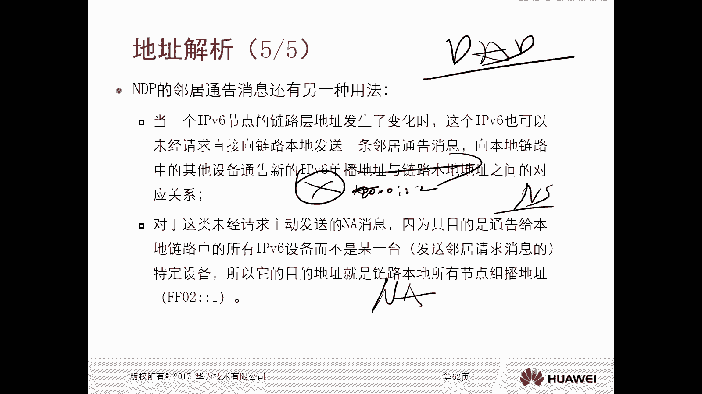
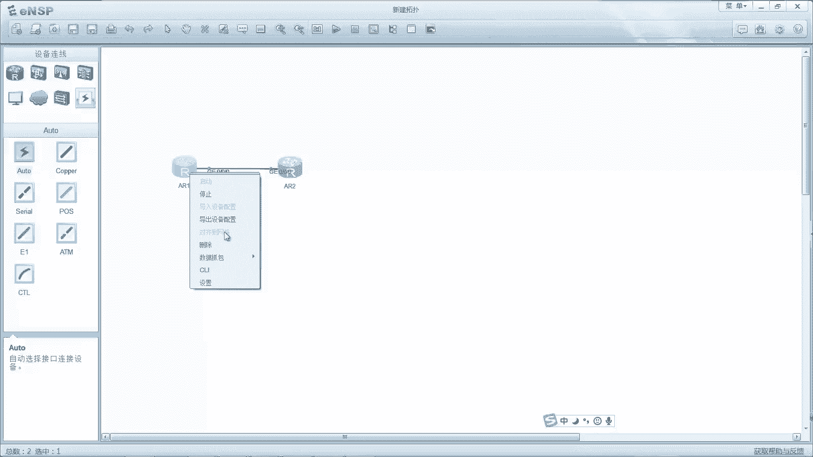
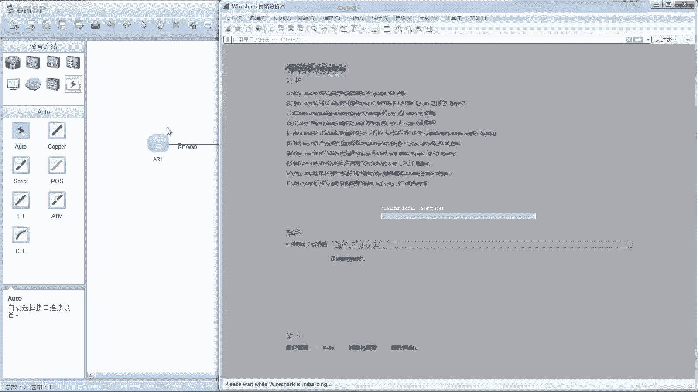
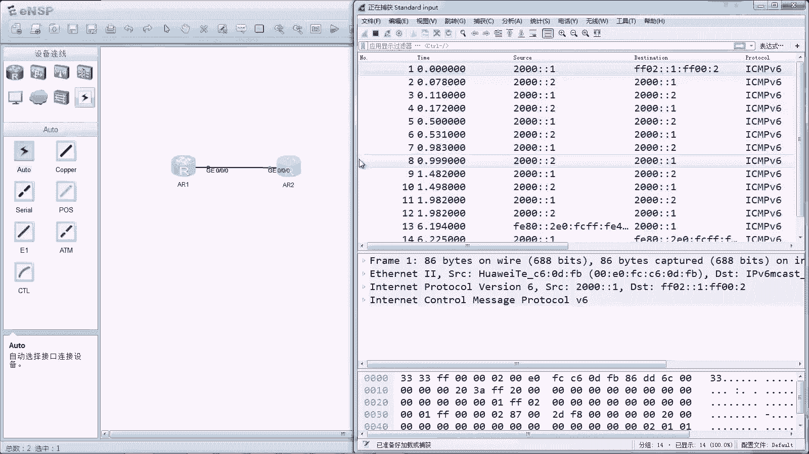
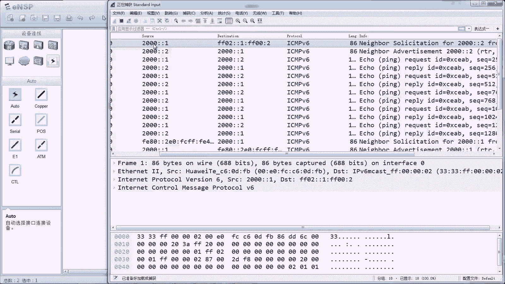
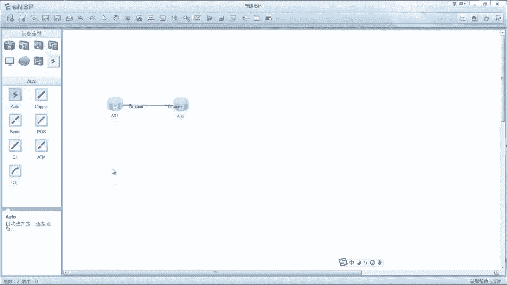

# 华为认证ICT学院HCIA／HCIP-Datacom教程【共56集】 数通 路由交换 考试 题库 - P51：第3册-第7章-2-IPv6地址解析过程及配置 - ICT网络攻城狮 - BV1yc41147f8

好，那么接下来我们讲一下在IPV6，这个地址解析的过程啊，嗯那么我们可以回顾一下在V4里面，在IPV4里面，哎我们这个地址解析它是怎么实现的，那么在V4里面呢，它的地址解析呢主要是通过一个协议。

叫做ARPAIP协议实现了对吧，而且AIP呢我们采用的是广播的方式，但是我们知道在IPV6里面呢，它有单播啊，他有这个主播啊，他有任意播，但是呢他没有广播这种类型啊，所以说在V6里边呢。

就没有什么AIP协议了啊，那么呃问题就来了，对不对，那么IPV6啊，他如何去得到这个目的的IPV6地址啊，它的一个Mac地址就是做地址解析，对不对好，那么实际上做地址解析在app里面呢。

实际上使用的也是NDP协议，使用的是NDP协议，那么NDP协议可以实现的功能太多了，比如说有地理解析对吧，然后有什么这个无状态自动配置啊，什么有状态自动配置啊，重新编制啊。

路由器发现呀等等等等好多功能啊，那么其中地质解析是NDP的功能之一，所以说NDP它的解决方法是什么对吧，你没有你没有你没有这个广广播对吧，那么我地址解析的时候用的是主播。

而且它使用的是目的设备的请求节点组，播地址作为NS的一个IPV6的目的地址啊，那么请求节点主播组就非常重要了啊，那么地址解析呢，实际上我们IP6设备发送NTP，领取请求消息的初衷。

是希望请求到这个该IP地址所对应的，这个网络适配器接口的一个链路层地址对吧，和这个ARP的这个初衷是一样的对吧，AIP的话也是我们想通过一个IP地址，能够拿到它的一个Mac地址，对不对。

因为有了这个Mac地址呢，地址才可以进行封装，所以说呢这个NS消息啊，就是我们NDP里面这个NS报，它的发送方呢，也会拥有IPV6地址所对应的，一个请求节点组组，并且呢可以这个地址作为目的地。

来封装消息的一个目的IP地址，那么什么是请求节点组不组呢，那么请求节点组不组，有的时候也被译为被请求节点组地址啊，那么这个请求节点组播组呢，它的前104个比特它是固定不变的，FF02冒冒一冒号，F f。

后边24个比特呢，就直接套用被请求节点单播IP地址，接口id的后边的24个本对吧，那也就意味着我们每当一个网络适配器啊，这个接口获得了一个，单播或者是任意波的IP地址的时候。

他就会同时监听发送给这个单播的IP地址，对应的一个请求节点组，不组地址哎，它会自动加入到一个请求节目组组，就是你甭管你配的地址是多少，只要是一个IP地址对吧，它会自动加入到这个地址所对应的。

一个请求节点，做不做，那也就意味着不同的地址，它对应的一个请求节点组是不一样的，因为你的24位是来自于你的IPV6地址，它是映射下来的，你前面104个位是固定不变的，对不对。

但是后边24个比特如果不一样，你们得到的请求节点组不组不一样的，哎他是用这种映射的效果啊，把后面24个位直接映射下去，唉所以说我们看一下，在这个环境里面，假设这个笔记本电脑它是2000毛毛一。

然后这个台式机呢是2000毛毛二，哎比如说这个呃笔记本电脑，他又想要和台式机通信，但是呢这个笔记本电脑呢，它没有这个台式机的Mac地址，这种情况下呢一定会有一个地址解析的过程，那么对于这个台式机。

它的IP的地址呢是2800方二，所以说他的请求节点组播组呢是FF02，冒号冒号一冒号F啊，冒号对吧，然后是这个二是吧，哎应该是这样的啊，哎不是冒号，二是冒号呃，嗯应该就这么好玩啊对吧，应该就这么好玩。

冒号你可以可以写成0028段，实际上就是冒号这个地址，因为这个怎么来的呢，因为我们说F02冒冒一冒号F是固定的，后边24个比特是将这个笔记本啊，台式机，他的IPV6地址的，后面24个比特映射下来的。

那他后面全都是零，然后是二，对不对，哎就验证下来就是二，这样印证下来24个比特，那么这样的话，这个笔记本电脑他去做请求的时候，发送邻居请求的时候啊，因为地址解析，他用了NDP里面的NS报文和NA报文。

那我们知道呃NDP协议呢它是有五种报文，有NSNARSI和重定向，对不对，那地址解析呢用的是N和NA这两种报文，所以说这个笔记本电脑他发包的话，就会发一个NS报文，邻居情报发行人是谁呢。

2000冒号冒一收件人是多少呢，是F02冒冒1FF00冒号002，也就是说正好是他想要请求的2000冒号，冒号二啊，这个PC这个地址的请求节点组不组，那这个因为它是一个主播信息哦。

那么泛红的那个网站里面，实际上所有的其他的终端以及路由器，都可以接收到这个组合包对吧，但是其他的信息终端是没有去监听这个请求，节点组不组的啊，因为只有谁的地址是2800毛二，才会去监听这样的一个地址。

它对你关系嘛，对不对，所以说只有台式机OK能够接收到，能够处理啊，不不能不能叫做能接收到，是能够处理，因为接受都能接收到，对不对，能处理好，那么这个报文里面的正文呢就是OK。

那么这个信息呢是我要发给2000猫猫二，这个设备的对吧，哎我的Mac地址是1111，那么收到这封邮件以后，你请告诉我你的Mac地址，那实际上就是你的Mac地址是多少，我请求对吧。

这样的话这个台式机就能收到对吧，哎所以说这个很重要，NSBN是朝着他的目的，单播IPV6地址的请求节点组不组去发的，你像我们之前IP用广播好，因为他不知道哪个哪个主机呃，呃在哪儿，对不对，就广播出去。

这个用主播主播的话，他也不知道在哪，但是你的IP地址我知道啊，你的IP地址我知道啊，所以说你的请求节点组播组我也知道，反正你在监听这个请求节点组对不对，那我就朝这个请求节点组不组去发送数据。

那么只要你监听它，只要你是2000猫猫二的拥有者，那么一定能够接收到这个信息，同时你也能处理好，那么当台式机收到这个NBN以后啊，他一看诶是有人在去向我请求我的Mac地址，哎那么这种情况下。

他就回复A报文叫做邻居通告报文，发信人呢就是他自己2000毛毛二，收信呢是2800毛一，OK这种情况下，这个NA报文就不再是主播了，而是一个单播，那么为什么是可以用单播呢，因为这个笔记本还是笔记本电脑。

对不对，他发送报文的时候，实际上这个NS报文已经携带了他自己的Mac地址，以及他的IP地址，那我台式机回报的时候，我是不是完全可以利用单播的方式对吧，发件人收件人是两个，发现是2000泡沫二。

收件人是2100对吧，又有什么原Mac地址对吧，好内容呢就是OK这两项泡沫一啊，那么呃你刚才请求的这个信息我收到了对吧，现在我向你提供我的Mac地址，我的Mac地址是11112哎。

这样的话这个笔记本电脑2000冒冒一呢，就完成了对2000冒号冒号二的一个地址解析了，其实这个过程和我们在V4里边的，ARP的这种解请求过程嗯，基本是保持一致的啊，唯一的一个不太一样的地方呢。

就是我一开始去做请求的时候哦，这个目的地址不再是广播，而是我想要请求的目的的，IPV6地址的请求节点组播组，因为请求节点组不组就对应关系，对不对，只要你配的这个地址。

那么你一定是在监听这个地址所对应的请求，节点组不足，那么我朝着它发送数据，那么你一定是能够接收到并且处理的哎，这就是NDP，它的地址解析过程使用的是NBN和NBN，那么NDP的邻居通告消息。

实际上还有另外一种方法对吧，哎比如说当一个IPV6集的链路层地址，比如他的Mac地址，二层地址发生变化了，那么这个IPP6呢也可以未经请求，直接向着这个链路上啊，他说你挑邻居通过信息网啊。

像本链路上的其他设备，去通知新的IP地址和链路，本地地址之间的对应关系，因为你变了吗，对不对好，那么对于这类未经请求主动发送的消息啊，因为它的目的是通告给本链路上，所有的这个IP的设备对吧。

并不是某一台，对不对，哎所以说它的目的地址呢是链路本地上，所有的节点组地址F02mm1哎，这是发生变化的时候，或者当你的IP地址对吧，当你新配了一个IP地址，注意一下啊，当你新配了一个IP地址。

那么这种情况下也会使用通告消息，IU使用通关消息，那么我们想一下，在IPP4里边，你配了一个地址要做什么，做什么操作啊，无故AIP免费IP去做重复地址检测，对不对，而实际上IP地址也是一样的。

你新配了一个IP地址，他也要去做地址检测，有没有冲突，有冲突不能用啊，所以说NDPNDP协议在地址解析这一块呢，实际上还有一个叫做DAD过程，叫做重复地址检测，当你IPP6的一个节点配了一个地址的话。

那么它首先会朝着这个网站去发送NS报文，哎S保温去请求配置的新的地址的Mac地址啊，说白了就是自问自答对吧，哎就问一下我刚才配的地址，有没有人这个在用对吧，实际上他发出去的数据包。

那就是OK我要请求对吧，比如说这个IP，我配了个IP地址是2000万方二对吧，那比如说这个节点路由器，某个接口配的是2000包包二，那么这种情况下配完以后呢，它会发送一个NS报文说哎2000包包二。

它的Mac地址是谁，哎他通过这种as帮我们去问，看一看有没有人去回应他，如果没有人回应他，那么说明这个地址没人用，它就可以用了，当他可以用了以后，他会主动再发送一个NABN说2000冒冒冒二。

哎我用了Mac地址是多少，就类似于有点自问自答，对不对，唉这个呢实际上是一个地址啊，冲突地理检测的过程啊，OK这个的话我们在胶片里面没有看到啊，好这个地址解析我们讲完了。

那么接下来呢我们就通过一个非常简单的实验，来给大家演示一下这个地址解析的一个过程啊，地址解析的过程。

好那么这样我们就做一个简单的实验啊，两台设备很简单对吧嗯，然后呢，我们在这个设备上呢做一个初始的配置啊，嗯先配一个IPV6功能打开，对不对，然后接口呢G0杠零杠0IP6打开，我们去配一个IP地址。

2000冒号冒号一对吧，然后是64位啊，然后二呢嗯第2IP打开G0杠零杠0IP6，enable ipv6的dress是2000冒号冒号二六十四，好哎这个我们就做完了嗯，那现在呢就是这个一和二呢。

现在是从来没有通过信，那么接下来呢假设我们让一区访问二啊，2000毛毛，一区访问2000毛毛二，那么这种情况呢，我们在这发包一定会触发AR1，他的一个请求过程，就是地址解析过程，那么在做这个实验之前呢。

首先我们先看一下这个A2，刚才我们不是配了一个地址嘛，对不对，给个地址，那么这种情况下，它会自动，这个接口就会自动加入到这个地址所对应的，一个请求节点组组同样R也是一样的啊，我们看一下。

我们display ipv6interface g0杠零杠零，我们看一下啊，你看啊我配了一个地址，对不对，然后他john group jazz，哎，这个F021冒号F002哎。

正好就是这个地址的请求节点数不足，他是把后边24个比特验证下来，因为你这个地址你看他后边16比特对吧，是二印下来了，那么剩下的那就是零呗，对就是零，你比如说我再配一个地址啊，还记零杠零杠零。

再配一个IP地址，比如说是两两千001冒号哎，冒号冒号一冒号123这个地址吧，做完以后呢，我们lay嗯，Display ip v6，Interface，七零杠零杠零，来我们看一下啊。

哎你看两两千零一冒号冒号一冒号123，这个呢它也会加入到一个请求节点组组，FF02冒冒一冒号FF01123，哎，正好是这个24个比特又进来了，它自动的哎，所以说你看请求截图组组，实际上就是。

你不管在哪个接口配了什么样的地址，它都会自动加入到这个地址所对应的一个请求，节点不足，那么接下来呢我们在这个位置进行抓包。

然后我们让A2E去拼去拼这个二的啊，去拼二的2000毛毛二这个地址，那么这种情况下。

我们抓包应该能够抓到AR1去拼的时候，他的目的IP地址应该使用的是二的2000猫猫二，他的请求节点逐步注作为目的地去发的包，对不对，好我们在一上去做一个测试，去拼app六两千冒号冒号二通了，对不对啊。

接下来我们看一下抓包的过程啊，我们看一下啊。

抓捕的过程，Ok，那么上面呢我们已经看到了N报文和NA报文，看到没有，NS我们看谁发出来的圆是2100。

我们点开啊，圆是2000，冒冒一，目的是F02，冒冒一冒号FF冒号二，这个正好是2000冒冒二对吧，他的请求现在不组嗯，好那么我们看这个呢是NS报文，它是NS报N而是NDP的其中一个。

但实际上你看他是不是就是SMPV6协议呀，对不对，NS报好，然后这里边写了目标地址是2000万吗，也就是说我发送这个NS的请求，的目标地址是2800对吧，哎我的链路层层地址是这样的一个Mac地址。

所以说这个NS报文的一个正文的表示的内容，就是O2000猫猫二它的Mac地址是多少，请告诉我哎那么当二收到以后呢，他就可以去回复NA报看下AB哎，那么是2000毛毛二。

朝着2000毛毛一起回的单O直接可以回来，对不对，因为这个N报文里面呢有原IP地址，也有原Mac地址，可以直接回回的时候呢，我们看单播对吧，又是SP6NA报N报完。

OK你不是在去寻找2000猫猫二它的Mac地址吗，OK我告诉你吧，这个target target它的link layer地址是T，这样的话我2000毛毛一啊，就是ARE的路由器就获取了2000毛毛二啊。

这个IPV6地址，它的Mac地址完成解析，所以数据就通了，哎这就是地址解析过程，那么顺便我们把DVD也给大家演示一下，因为刚才讲到了啊，dd就很简单了，比如说我在这个G0杠零杠零，我去配一个地址。

随便配了2088冒号冒号88啊，那么64这是我新配的一个地址，那么这种情况下呢，他就会为这个地址去做DAD检测，就是这个地址有没有别人在用，对不对，那他做dd检测重复地址检测的一个呃过程呢。

实际上就是ARE会主动发送N报名，去请求2088冒号冒号88SMAC地址对吧，因为他这样请求有人回复，他说明有人在用啊，他就不能用，如果他请求了没人回复，他说明没人再用，它就可以用。

我们看一下抓捕过程嗯，我们看一下抓包过程诶，这个对吧，我们可以看一下对吧，原地址是未指定哎，这个目的地F021F0088对哎，那么他给他dress，实际上他是在请求NS版吗。

他是在请求2088冒号冒号88，他的Mac地址，如果有人回应他，他一定会检测冲突吗，如果没有人回应他，OK那么他认为这个地址可用，它就可以用了啊，呃正常来讲啊，理论上来讲应该这个主机呢。

哎这个路由器呢会再主动发送一次NA报文，但是我们看到在华为的设备上，还没有发A豹纹呢，就是他就是类似有点自问自答的效果啊，但是华为是有没有发这个我觉得也无关紧，要发就不发呗，对不对。

哎其他人想要去访问的时候做解析就可以了。

