# 华为认证ICT学院HCIA／HCIP-Datacom教程【共56集】 数通 路由交换 考试 题库 - P52：第3册-第9章-1-AAA简介和RADIUS简介 - ICT网络攻城狮 - BV1yc41147f8

好，那么接下来我们讲一下，这个3A的一个工作原理啊，那么大家注意一下这个3A呢，呃它不是一项协议啊，没有说这个呃三一协议的啊，没有这样讲的啊，注意一下，那么它是一项技术啊，啊你说三一技术啊。

这样说没有问题对吧，你说这个3A协议都是哪些协议，这个说法也有错误啊，那么这项技术呢，它是由三项独立的安全功能的一个总称啊，每一个A代表的是一种功能，分别是认证授权和审计啊。

那是一个能够处理用户访问请求的一个，服务器的程序，大家注意一下，一般这种3A呢，我们刚才讲了三个A分别代表的是认证对吧，认证的话，无非就是你用户去访问某些资源的时候，要去做认证对吧，做完认证以后呢。

我可能要对你进行一个授权对吧，哎就是你可以去访问哪些权限，哪些资源，最后是审计啊，或者叫做统计你做的哪些事情，对不对好，那么提供呢认证授权以及账号服务，那么主要目的就是管理我们用户，访问网络服务器。

对具有访问权的用户提供服务好，那么本期主要是从如下三个方面进行介绍，第一个是3A的一个简介好，第二个呢是这个radius协议的剪辑。

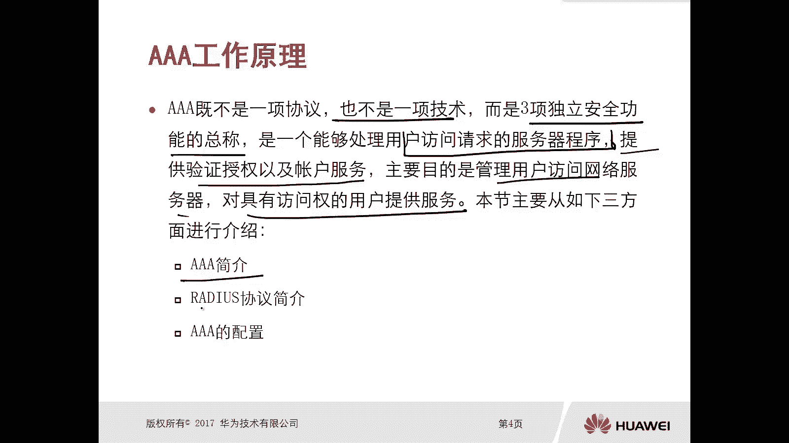

第三个是3A的配置，简单配置好，那么首先我们先看一下这个3A的简介，3A3项安全功能正好是每一个A啊，都是一个简写，第一个A就是认证啊，就是认证OSTICATION，对啊认证，那么什么叫做认证呢。

认证就是你得提供用户名和密码吗，对吧，你比如说你想访问某个服务，服务器的资源的时候，那不能说你随便有一个人就可以访问呀，你得认证一下，对不对，哎，这个就是认证，要提供什么用户名和密码等信息啊。

不一定不一定必须是用户名和密码，对不对，我们还有其他的一些这个信息啊，第二个呢是授权，啊授权，那么授权呢就是我可以根据用户的一些属性，比如说他的用户名对吧，然后呢去区分你有哪些执行的操作的权限对吧。

你比如说这个公司，我们这普通员工和你这个领导老板，去访问某些资源的时候，那权限肯定不一样，对不对，哎那我得区分，我得区分出来哎你这老板的用户名了，OK那么你访问权限可能高一些对吧，哎你这是普通用户的呀。

K权限小一点嗯，最后呢是审计啊，最后是审计，那么审计呢，实际上他就是去记录我们用户在访问期间啊，他所操作的一些动作啊，执行的一些操作，这就是3A认证授权和审计，这个3A指的是这三项的安全功能。

注意一下啊，它是一个呃3A是一种这种技术，它是一个综合的，对不对，只要包含了认证授权审计都有3A，它不是协议问题吧，好那么我们先看一下这个在华为路由器上，本地3A它是怎么工作的啊。

你比如说啊我们管理员要去管理路由器啊，那么去管理路由器呢，我们有多种方式，比如说通过HTTP啊，比如说通过这个TNT呀，比如说通过SH啊，对不对，不管是哪一种都可以，比如说我就是通过TNT管理路由器。

对不对，那么这种情况下，如果是本地3A工作方式的话，我们需要在路由器上去创建本地数据库啊，那么在路由器上去创建这种本地数据库啊，实际上呢就是去创建用户啊和密码，啊它的对应关系，然后这种情况下。

你管理员比如说通过TNT的方式去防他对吧，那么管理员呢，首先你得去提供一个用户名密码对吧，你得提供凭证，要不然我这个路由器不能随便让别人管理嘛，对不对好，然后路由器呢，在我们之前配的数据库里面去检索啊。

你发送过来的用户名和密码是不是匹配，比如说管理员提供的用户名叫做甜果，密码是华为123对吧，华为P123，OK那么路由器就会去检索哎，看一下本地数据库，因为是本地三嘛，对不对，哎。

本地数据库有没有填过华为P3对吧，那这个实际上是一个认证的过程，就是第一个A对吧好，那么认证通过以后，它会根据本地数据库啊，用户名填过去给一个权限，那么在路由器上权限无非就是哎，你可以去做哪些操作对吧。

我们前面讲过这个用户级别啊，就是用户级别它的一个作用对吧，上面有一级有二级和三级啊，升级到15级啊，对不对，那么不同用户级别，它对路由器执行的操作是不一样的对吧，你比如说零级啊，就是一个监控机了。

只能这么display ping tracer对吧，那一级可能稍微高一点对吧，三级就更高了，你可以去配什么协议之类的东西对吧，哎那么当他查完以后呢，就会把信息发给这个管理员说，OK那你可以访问访问啊。

因为你认证成功了，但是呢啊，我的授权是不允许你进入系统视图模式，唉你只能在用户视图模式去做受限的一些操作，比如pin啊，tracer display等等，而这些这个其实就是一个授权功能啊。

同时你做一些操作，我还可以通过一些日志记录下来对吧，操作记录，那么这个呢实际上就是一个审计，所以说你看这是一个简单的TNT，这样动作实际上是包含了对吧，我们sin里面的这个安全的功能认证，授权和审计。

哎这是这个本地，但是本地这种方式适用于什么样的一种场景呢，就是小型网络，你设备不太多的情况下对吧，比如说你有四五台设备，两三台设备哎，那你可以在设备上，每台设备上分别去配置用户名和码对吧。

哎那可能配的次数并不是特别多，假设我有一个偌大的网络环境，有100台设备，甭100台了啊，50台对吧，然后呢我这个网络呢有三个管理员对吧，一个总管理员，两个这个这个责任管理员对不对。

总管理员下面是助理管理员，这种情况下，我们需要，如果说你采用这种本地3A工作方式啊，你必须要在这50台路由器设备上，每台设备都要去创建三个用户，分别是总管理员用户密码对吧，两个助理管理员用户密码。

那就是50乘以三一百五，也就说你要敲150次，这样命令对这种扩展性很差的。

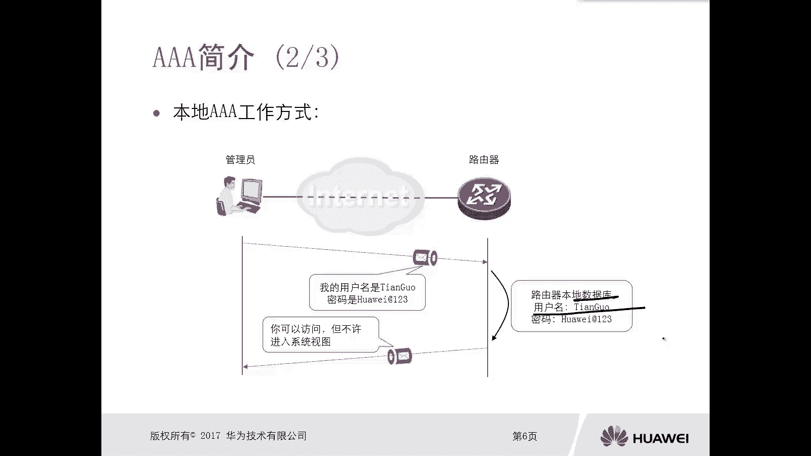

所以呢我们还可以通过3A服务器，去执行3A的功能，哎，比如说我们场景还是管理员，去访问这个被被管理的一些设备，路由器，交换机防火墙对吧，但是由于我们现在采用3A服务器，不不需要在这个路由器。

就是被管理的设备上去配置本地数据库了，但是路由器被管理的这些设备啊，必须要和好一台商业服务器相通，只要他们这个IP层可通就可以了，这个3A服务器好，大概是这样的组网，那么这种情况下。

我们的数据库创建在哪呢，创建在三服务器上，你假设啊我有那么多路由器，比如说50台对吧，那么这50台设备路由器上面，你需要去创建用户名吗，不需要对我还是三个管理员，那么这种情况下。

只需要在三个服务器上创建三个用户即可，只需要在这三个服务器上创建三个库，一个是总管理员，两个助手管理员，没问题吧，这样就很灵活了，对不对，工作起来也比较就省事，不那么费劲了，对不对，好。

那么我们看它怎么去实现的，通过这个3A服务器，去执行这个3A的工作的啊，唉他这样的，首先管理员还是发送用户名哎，填谷密码发1X13对吧，那么这个被访问路由器访问服务器，现在呢由于它和3A服务器有联动。

所以呢，他会把这个用户名和密码发给3A服务器，他说你帮我查一下这个用户，苹果华为T03，他是不是合法用户，OK那么在三线服务器上查完以后，发现诶它是合法的，就会告诉这个路由器，OK这个路由器呢。

这种情况下，就认为现在这个管理员提供的用户和密码，认证成功，而同时呢也可以给你授权，比如说你不允许进入系统设对吧，同时你做的一些操作呢，我也一样去做审计对吧，那这种情况。

你想你甭管50台设备还是100台设备对吧，只要你去管理他们的时候，那么这些设备只需要和三服务器，进行一个通信就可以了，那么你还需要在这么多设备上去创建，那么多用户名吗。

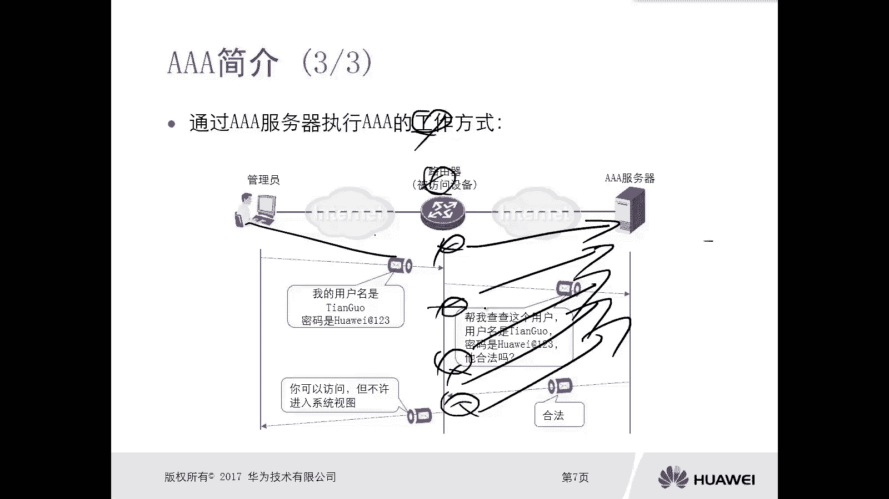

不需要，对不对，哎，这是这个通过三服务器执行的。

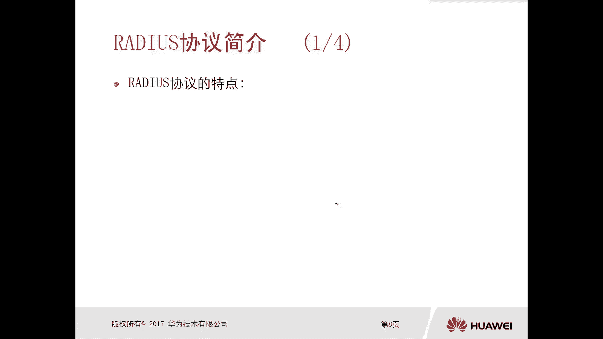

这个3A的这个工作，他的方式，那么对于我们这个场景管理员和路由器，设备之间，你比如说刚才我们用的是TNT哎，这个协议或者是用SCH，或者是用这个HTTP都可以对吧，访问这个设备，但是我们这个被管理。

被访问的设备和331服务器之间，它们之间又采用什么协议呢。

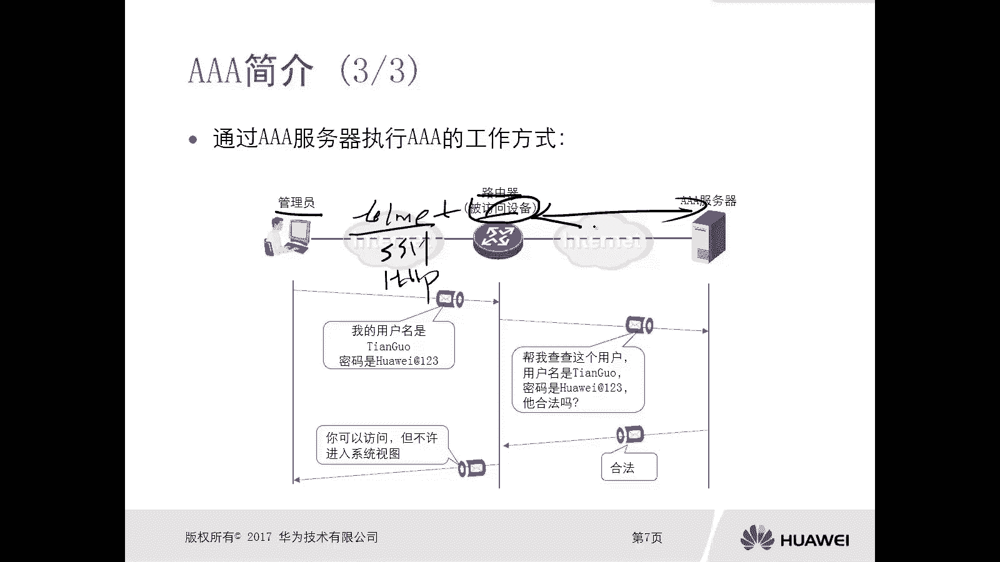

OK那么第一个可以采用的就是reduce协议，所以注意一下REDUX协议啊，radio写一啊，他是我们这个普通客户端和3A服务器之间，进行通信的一个协议，而且它是一个标准协议。

我们各大厂商的设备都是支持的啊。

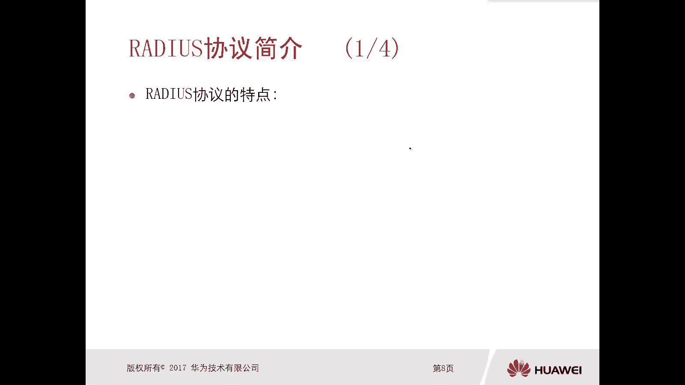

也就是说啊你看啊这个作为一个商业服务器，对于我们这些路由器被访问的设备，它就叫做商业客户端，那么这种radius协议，它是运行在哪和谁和谁之间的，运行在SN客户端和SA服务器之间的，哎那么注意一下。

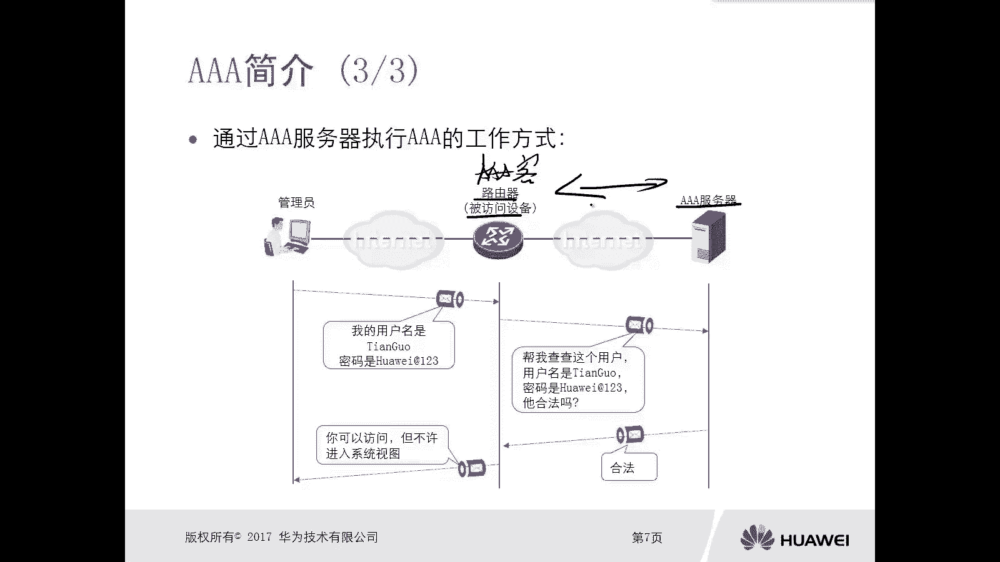

除了这个reduce写以外，我们还有华为的TX对吧，华为的TX也可以实现啊，这个3A的这种效果啊，这种功能，那么这个radius协议有什么特点呢。

第一个它是一种典型的client和server结构的协议，client呢就是我们的这个被管理的一些设备，对不对，那是服务器，就是三服务器好，那么这个reduce它的全称叫做远程认证，拨号用户服务。

就是remote astication，dela in user service啊，全称叫做远程认证拨入用户服务，Now reduce，那么它是通过UDP，去提供传输层服务的一个应用程序。

它具UDP的啊，那么我们TX基于TCP啊，那么不同的这些它的用场景啊，或者说它的特点是不一样的，那么对于reduce来讲，它是通过1813端口，就是UDP的，1813端口去提供认证和授权服务。

通过另外一个端口，1814端口去提供审计服务，所以说他的审计和认证授权他俩是分开的，端口用的不一样，这个要注意一下啊，1813114113认证授权。

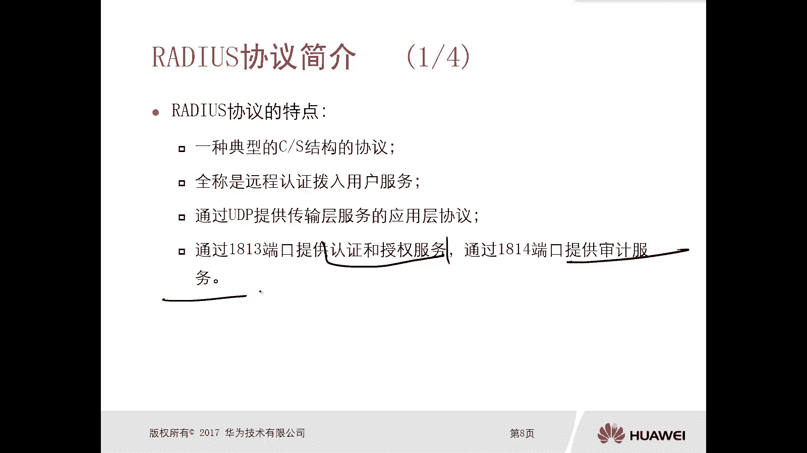

1814L级来我们看一下这个reduce消息啊，它的封装格式对吧，这个内容很简单啊，首先第一个是代码，然后呢是标识符，数据长度，认证码属性。

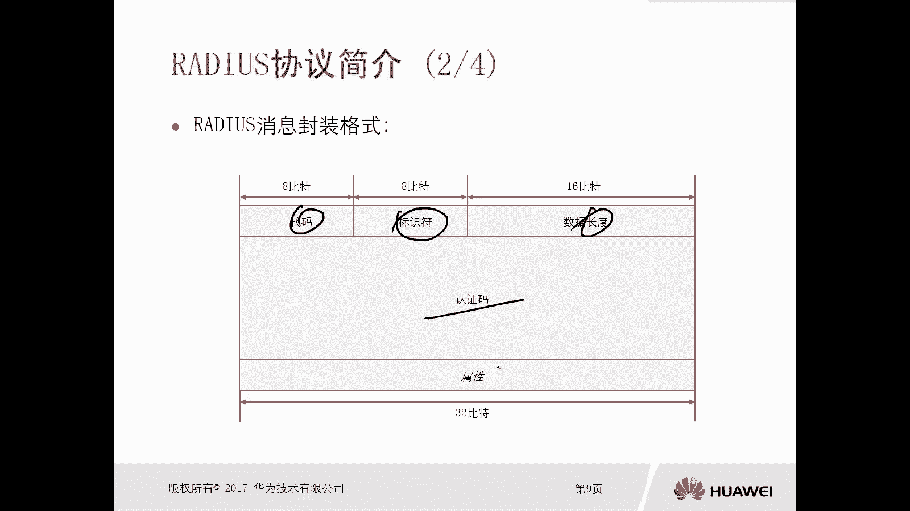

那么对于代码，代码是标识这个reduce的类型，我们reduce的类型很多对吧，其实你也不算特别多啊，那么就哎六种，一个叫做access request，那叫做文请求。

然后访问接受access accept啊，然后访问拒绝审计请求，审计响应访问挑战啊，一共是六种啊，哎那么在我们这个PPT里面，都是有这个标识的，那么同学拿到以后呢，大家可以看一下啊。

那么不同的这个消息呢，它的代码值是不一样的，那么第二个标识符字段，标识符字段是标识了这个reduce，请求消息和响应消息之间，它的一个对应关系对吧，你请求一次，比如说这个这个这个标识字段。

比如说假设是一，那么回过来如果是个响应消息，它的一来说明他是在响应，你刚才唯一的请求消息的对吧，哎这个注意下，然后是数据长度字段，那么标识是整个radio消息的一个长度啊。

那么认证码字段呢是让被访问设备认证，他接收到的响应消息，是否真的是由他请求的那台三服务器响应的，哎这是个认证码字段属性字段，那么提供了一些和3A服务器相关的一个，重要信息的可编程的一个字段。

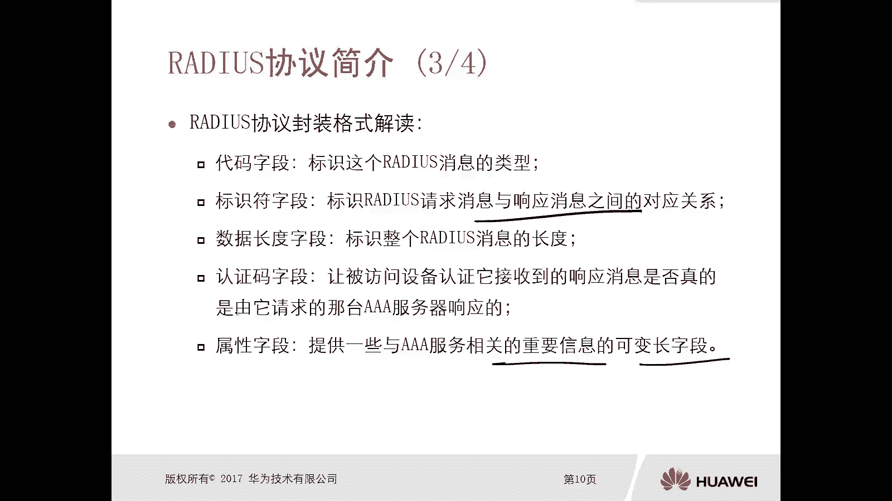

这是个radius协议的封装好，那么我们看一下这个3A服务器，它通过reduce执行认证和授权的流程啊，那么当我们被管理的设备，比如说这个RTA路由器，他收到这个用户名和密码对吧，那么这种情况下呢。

他会把这个用户名和密码，不是要交给这个三元服务器嘛，对不对，那么首先它封装的这个报文呢叫做radio，访问请求消息，哎，他会把这个用户名和密码都放在这里面对吧，哎发给这三个服务器。

那么3A服务器收到这个请求消息以后呢，他会去查询服务器上的三个数据库，那么找到对应的用户名对吧，然后再使用这个你发过来的密码啊对吧，然后进行一个校验，如果说是正确的话，如果是正确的话。

那么3A服务器有可能会有两个动作，根据设置啊，根据设置不同，可能有两个动作，第一种动作，那就是我可能去发送一个访问挑战消息，就是你这个简单的用户名密码啊，你这信息太少了啊。

你需要提供更多的信息来验证你的身份啊，这是一种强强的这种认证方式，对不对，挑战另外一种方式呢就是哎无所谓了，你就用这个用户名和密码给我提供就OK，所以呢对吧，哎我就可以去直接回复一个接收信息。

但是如果说我服务器发送的，就是这个访问条件消息对吧，那么这种情况下，要求你要重新提供更多的信息来验证，那么这种情况下呢，这个呃路由器呢就必须要再发送访问请求消息。

在这里的请求消息里面的内容可能就比较多了，就不仅仅是什么用户名和密码啊，这是这两个啊，这两个是一对的啊，哎如果说你服务器没有去设置，要去发送了一个访问挑战消息，对不对，那么这种情况下呢。

就是我收到访问请求，那么服务器直接去回复接收消息就可以了对吧，我查询用户名和密码，发现OK的，就直接回复消息了。

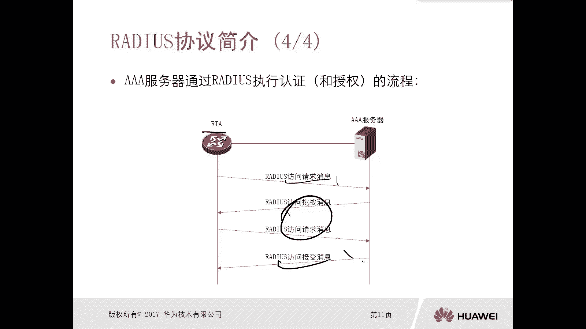

这是最基本的最简单的哎，还是这种方式啊，OK好。

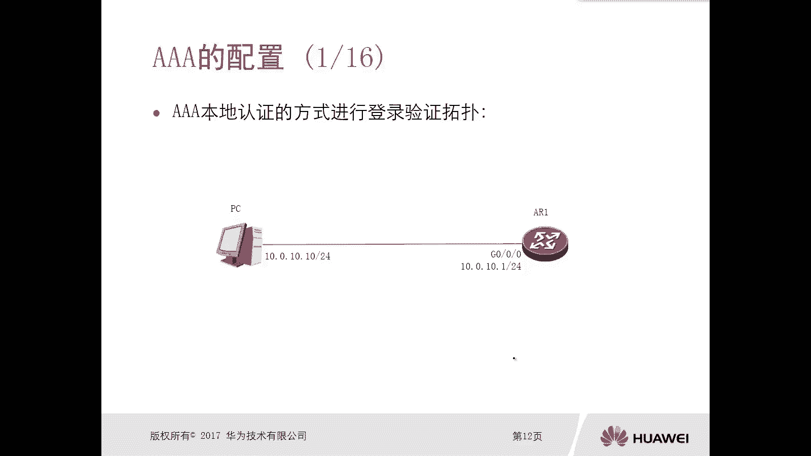

那么就是这个3A啊，3A这个技术啊，三技术里边的它的一个框架的内容。

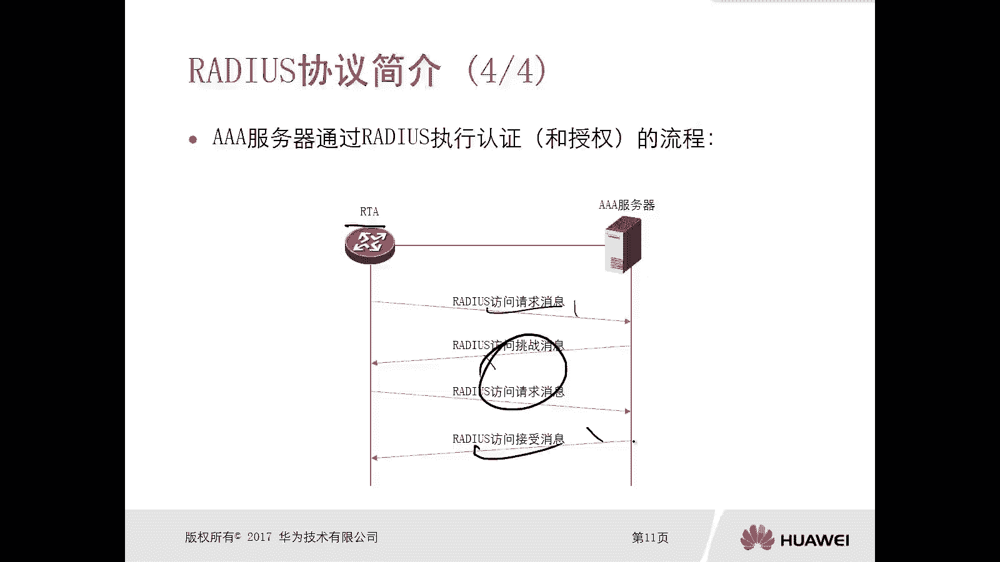