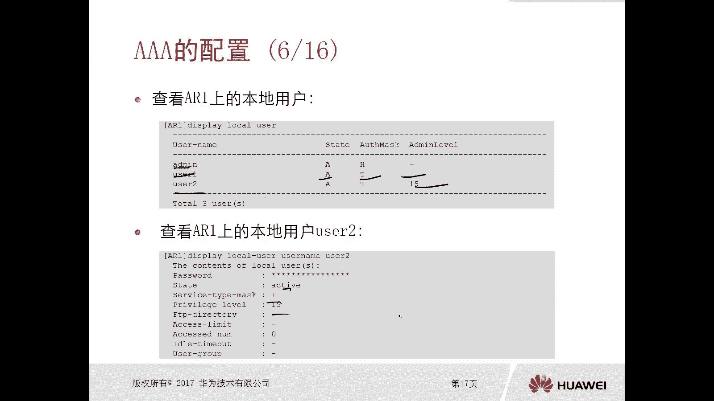
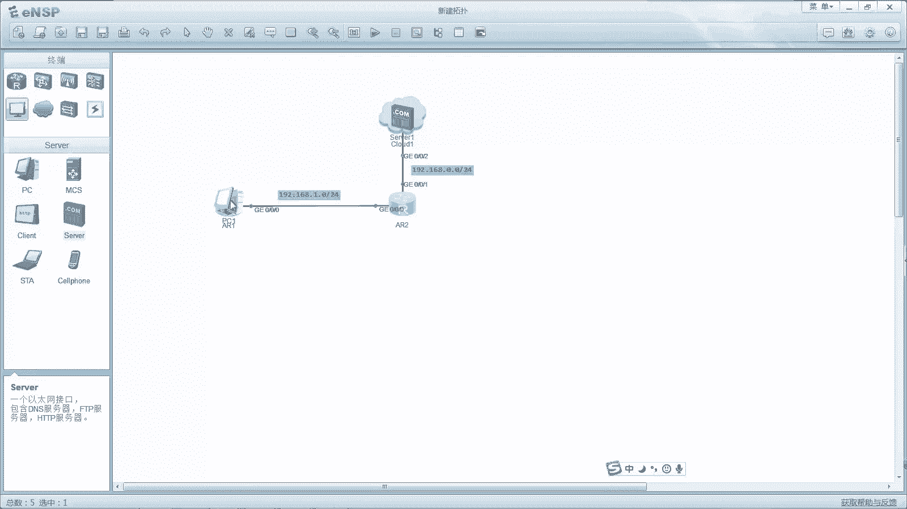
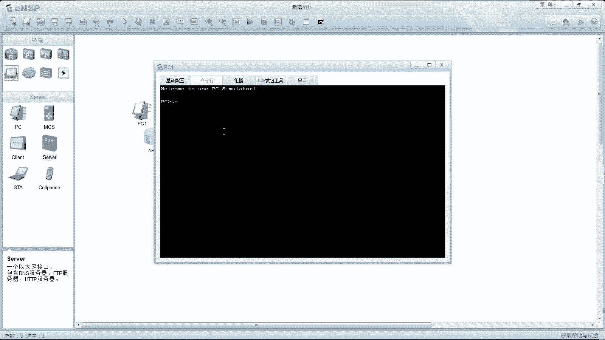
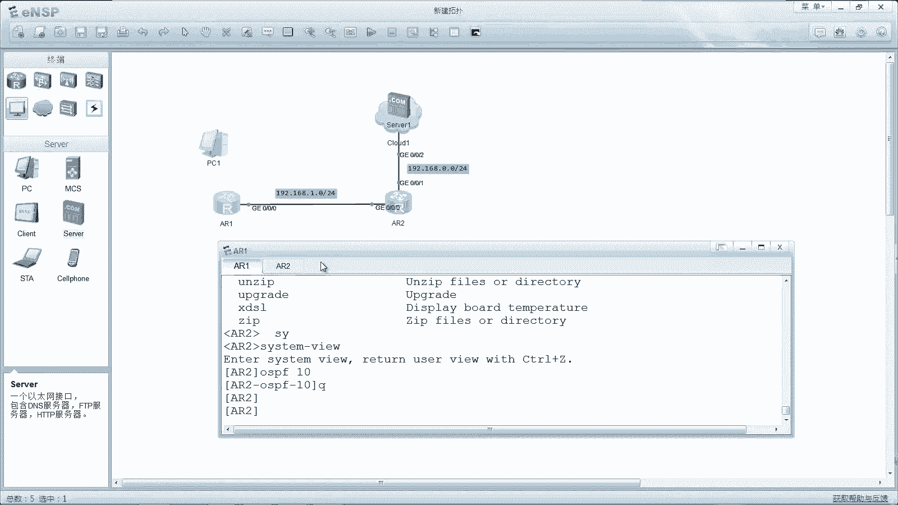
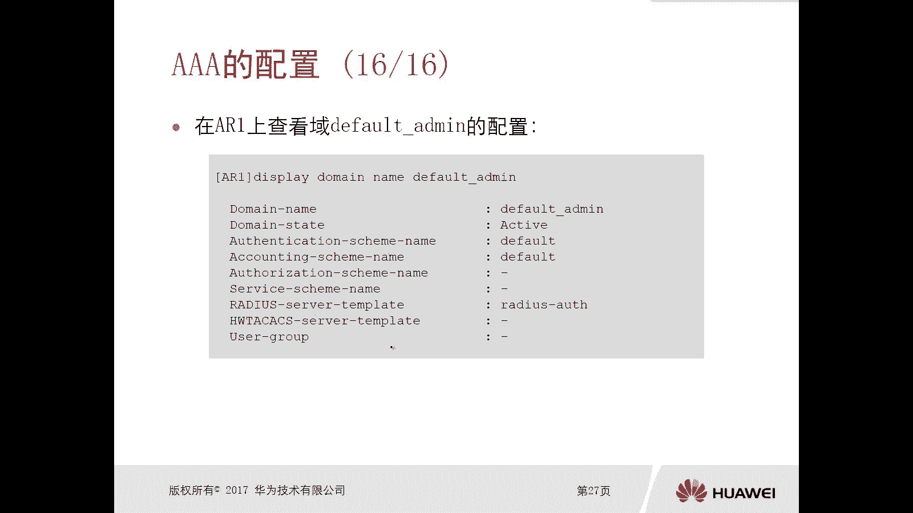
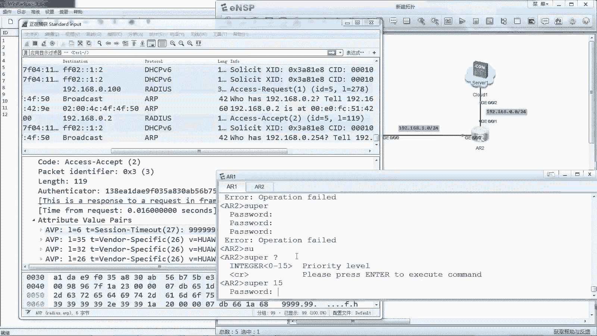
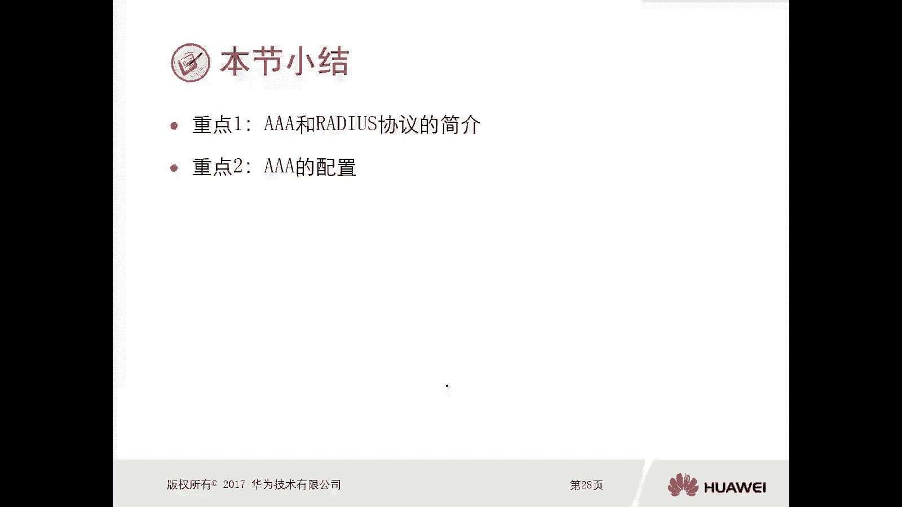

# 华为认证ICT学院HCIA／HCIP-Datacom教程【共56集】 数通 路由交换 考试 题库 - P53：第3册-第9章-2-AAA配置 - ICT网络攻城狮 - BV1yc41147f8

那么接下来呢，我们就看一下这个3A的一个配置啊，啊首先我们先看这个本地的3A本地认证，这种方式啊，那么进行登录验证它的一个配置，那比如说这个拓扑非常简单，我这边是有一个管理PC。

那么中右侧是一台路由器呃，我在PC上呢，需要通过TNT的方式去管理这个路由器，需要在路由器ALE上，采用这种3A的本地认证啊，SA的本地认证，那么本地认证呢，我们可以通过这种用户名和密码对吧。

你只有输入正确的用户名和密码，才能管理到这个ARE的设备，对不对，OK好，那么首先呢我们看一下这个ARE上，tom默认sin的配置信息，哎这是在R1上，我们进入到3a display this看到的啊。

它有什么认证模板，授权模板，accounting模板，default对吧，那么还有玉玉是有一个default玉，还有一个default n min，那么同时呢有一个呃管理员，管理员用户叫做admin啊。

那么呃它的服务类型是HTTP啊，这是缺省的缺省的好，那么接下来呢我们第一步呢，在这个AI上要去创建本地用户，哎，比如说我们创建的用户呢叫做user1password sao，华为幺幺是吧。

OK然后呢把这个user1它的service tab型设置成TNT，那么就是我为TNT服务的，对不对，OK同时呢又创建了个user user or，但是U12呢我不仅设置了密码服务类型TNT。

同时把它级别设置成15，那么对于这个user1user1我没有去设置级别，没有去设置B，所以说缺省user1，它的级别是多少啊，零零他的级别是零，那么它的权限是最低的，可执行的一些操作是最少的，OK好。

然后呢我们在VTY线路下去设置认证模式啊，这个VTY呢，我们知道都是要通过TNT进来的时候，都是通过这个VTY进来的，我们去设置它的认证模式是三好，那这样的话当你去做TNTAR1台设备的时候。

那么他需要让你去提供用户名和密码来，比如说我们看，我们用这个U321进行一个测试，user1进去以后，我们打个问号，你看一下对吧，你能够执行的命令只有这么多对吧，什么拼音啊，display啊。

然后这个save啊，TNTTRIC对吧，都是一些监控级的命令，因为你权限很低嘛，对不对，级别是零，然后我们用U32登进去以后呢，你打个问号，你会发现你的能够执行的操作特别特别多对吧。

同时呢我们还可以打system menu，进入到系统视图，然后我们在这个A2A上，你可以去display local user，我们就能看到有一个缺省的admin，这个不看了，对不对。

那么user1状态是active对吧，认证的是这种TNT的方式，那么级别注意一下，这个没有写，就是零看U三二十五，对不对，甚至我们可以去查看某个用户的一个，详细的内容，叫local user。

Username user2，对不对，就能看到是吧，哎就能看到这是一个本地的这种配置方式啊，那么接下来呢给大家做一下演示啊。

好这个拓扑非常简单啊，那么加注意一下，你看我这个ARE呢，我把它模拟成一台PC啊。

因为我们这个模拟器这个PC呢，它不支持TNT的命令。

看到没有，Invite command，对不对，它不支持，不支持的话，就我们就不用交PC了对吧，我们就用路由器去太阳能的路由器，把这个路由器A21，我们认为它是一个PC，无非就是使用它的太阳能的命令嘛。

对不对，好，那么地址网段呢，这个和我们胶片里面有一点不一样啊，那么A21呢是1921681点，120呢是191681。2啊，那么这边呢是191680。2，然后这注意一下，这个云云是桥接到我本笔记本啊。

我的电脑上面的网卡了啊，那么一会儿呢我会去演示这个嗯，3A服务器那种认证方式啊，哎这是一台服务器模拟的好啊，我的服务器地址是191680。100，OK那么这个呢我们先做一个本地的演示啊，本地的演示。

假设我们想让AR1去远程管理这个A2嗯，那么A2呢现在是一个初始的配置，OK那么首先呢我们去配置一下IP地址啊，192。168。1。224好，我们去测试一下，192。168。1。100啊，能拼通了啊。

然后呢即零杠零杠1192。168点，一个是0。2，0。22104，我们去拼192。168。0。1，那也没问题，对不对，也没问题，那么接下来呢我们要在A2上三里面去看一下，对不对。

这和我们胶片里面看到的内容是一样的好，那现在呢我们去创建local user啊，我们去创建local user，那么首先我们去创建一个user01对吧，User 1password saver。

华为at13对吧，然后local user user1啊，service tabi型呢是TNT，然后我们再去配置一个user user2password safer，华为at13对吧。

然后local user2哎，我们去配置它的service type类型TNT，同时再配置local user2啊，它的级别，比如说15K也配完了，那么user1呢我们是没有配它的级别的，对不对。

确实是零嗯，好，同时呢我们要在user interface，VTY去设置它的认证模式是sin啊，那么之前我们应该讲TNT的时候讲过，对不对，可以设置成austication mode password。

然后在这个线程下面去配置一个密码，然后你TNT过来的时候需要输入密码就可以了，对不对，那现在是3A需要输入用户名和密码好，那么做完以后呢，我们在这个ARE上去，TNT192。168。0。21点二哎。

用户名user1，华为it13，对不对，好，我们现在是用user1登录到了AR2上，那么我们打个问号，看一下它能够执行的命令很少对吧，能不能进入到system on，进不去对吧。

然后我们再退出来quiet，退出来TNT，然后用user2嗯，华为艾特13，我们打个问号，很多视图能不能配个OSPF，没问题哎，这是这个不同用户哎，我可以设置不同的一个级别，那这个呢实际上就含含。

就是包含一个我们才认证和授权的过程，对不对，哎，那么同时我们在这个二上还可以去display a local user，哎我们看到两个用户，User 1user2，对不对。

好这是一种本地的这种sin的一个认证方式，方式。

好那么接下来我们看一下这个使用REDUX服务器，他认定的方式进行登录验证啊，那这就是连了台服务器了不唉，那么我们需要在这个reduce服务器上啊，去创建数据库，那么radio的服务器呢。

实际上我们可以将这个windows操作系统，就是服务器版本啊，去给它设置成一个radio服务器嗯，那么简单简单一点的呢，我们可以去在网上去下载一些，radio服务器的软件啊。

比如说我就下载了一个非常小的一个软件，它就是win reduce，当然我们华为也有自己的那种认证的，这种软件啊，比如说我们的ng controller，对不对，但是那个呢就是比较耗费我们的设备资源。

稍微有一点点复杂，那么这种win radio，平时推荐我们去用这个做实验，这个很简单，它就是一个ESE的一个这个软件，打开就能用啊，我是安装在了我的电脑上，打开就能用啊，比如说现在这个服务器OK了对吧。

那么接下来呢这个pc ta要采用reduce认证，那么这种情况下A2E呢会朝着reduce服务器发，起码也是好，那我们看一下这个REDIS服务器的系统设置，那么当然不同的这个reduce软件啊。

它的设置方式可能不太一样啊，你看这个呢就是设置的非常清楚了，我们要去配置一个NAS的一个这个密码，而这个密码呢就是我们将来要跟啊，要跟我们的设备去对接的密码啊，然后认准端口，基本端口维护端口。

reduce IP地址这个东西啊去设置一下好啊，然后呢我们去配置在AE上去配置三方三次方案，那么首先呢我们要在认证模板，default里面给他去修改，因为缺少的是local。

我们要给它修改成认证模板是reduce，通过reduce方式取得认证好，同时我们需要在一上去配置reduce，服务器模板对吧，你告诉人家让人家去做radio认证，但是你得告诉他radio的服务器是谁吧。

对不对，哎那么就是radio server template reduce，这是一个名字啊，它是reduce o对吧，server地址是1916856。1182，然后呢去设置这个我们去联动。

去联动的这个密码，就是你路由器R1要和reduce进行联动，就连到一块，那么你要提供一个密码密码一样才能连接成功，哎就是华为123好，然后呢。

我们在A1的default admin里面去配置reduce，服务器模板，就是让这个default admin这个域里面去，它调用是让他去调用刚才那个模板，然后这种情况下缺省，注意一下缺什么。

我们就是使用的这个dom default m啊，那么你TNT过来以后，他会利用这个域里边去做一个SA的认证，那么缺省是local，对不对，但现在你做的是video server，那么它会利用这个模板啊。

朝这个远程服务器去增长，那么我们可以在路由器上通过命令去测试，你这个radio工作是否是正常的，那么通过test aa，那么你这个user是你服务器上的用户，然后后面是密码对吧。

然后紧接着是我们的这个reduce的一个模板，如果说你提示的信息info是account test succeed，那么说明你这个工作是OK的嗯，好那么在reduce服务器上也能够看到日志。

比如说我们添加账户对吧，包括你这个用户认证通过对吧，哎也通过这些都能看到的啊，好，然后呢，我们就可以用这个user，在这个radio服务器上进行验证了啊，就可以弹net上来对吧。

同时呢我们还可以在这个ARE上去配置，提升配置级别的认证方式对吧，还有在这个default里边，我们去做一个austitution super super，然后去配置一个super password。

就是你如果说你的用户上来，你看啊这个user or它的权限啊是非常少的，这是零级别对吧，在我们这个radio服务器上，没法对这种用户做一个命令的授权啊，所以我们可以在本地做授权授权的话。

就是哎我在本地只要我输入一个修拍15，那么如果说接下来的密码你输对了，那么你这个权限就在本地授权了，问题吧，哎这是认证授权，OK好，那么在AI上呢。

我们还可以去检查这个radio server它的一个配置模板，最后呢我们还可以去查看这个default的in，就可以了，嗯好那么接下来呢给大家演示一下啊，这个通过一个三服务器。

这种叫做远程的认证这种方式啊，它的一个配置好，那么首先呢我是把这个软件给打开了啊，叫做win radio啊，win radio一个软件就直接点开就可以用了啊，好那么首先呢我们对它做一个简单的设置啊。

那么设置有一个多重量，在这呢我们要去对接我们的这个NMS啊，那么AS呢就是我们所谓的这种三客户端啊，那就是我们拓扑图中的这个路由器啊，它的地理时段是192。168。0。2啊，密码呢比如说华为123。

我们都采用这个地址啊，这个密码少了一个，华为123，我们去做添加，然后结束，同时呢我们还要做什么内容呢，要去添加账号啊，账号呢比如说这个user01密码，华为123啊，那么你看啊。

这里边还可以去做什么付费做审计吧，还有什么到期日期等等啊，地费好，这呢你看添加账号成功对不对，那你可以在这呢去批量添加账户啊，比如我们再添一个啊，比如说叫做user2对吧啊，密码华为123嗯。

好这就可以了，哎其实两个用户就搞定了，那么这个就做完了啊，做完了，接下来呢我们在这个路由器去做操作好，那么我们看一下啊，这个在录像组操作啊，那么我们在这个二上，我们把机型的配置给删掉啊。

比如说之前我们做了啊，Undo local user，我们把user1给删掉嗯，Undo local user，user2也删掉对吧，哎这样全部都做完了，全部都删掉好。

那么接下来呢哎我们首先呢在这个嗯路由器上，我们先去更改3A的一个方案啊，那么就是在3A，然后是OSTATION这个模板default对吧，然后我们去修改它的模式，让它使用videos嗯。

同时呢我们要去配置reduce server，的一个template模板啊，比如说我们就用radio boss对吧，和胶片里面一样的名字啊，好，然后radio server认证的服务器是192。16。

8。0。100，哎我的笔记本也就是说我这个win radio这个软件啊，它的网卡呢是191680。100嗯，然后端口1812好，然后呢我们这个radio server啊。

和这个win radio去对接这个密钥，刚才我们配的是华为123，对不对，按L键好，这个就做完了，做完了，接下来呢我们在这个3A好，在读men in default main调用。

刚才我们配置的reduce的一个模板，就是reduce os，对不对好，那么做完以后呢，我们就可以去做test测试了对吧，很简单啊，然后user1华为123，啊啊然后reduce template。

Reduce boss，这个用户名我是不是写错了，写的是零一吧，对不对，写错了，刚才我应该记得是写的reduce01，User01，user2啊，写错了，多了个零好，那现在你看我刚才用的是user1。

没有这个用户吗，他他就报错什么用户名密码错对不对，然后我改成user01，那么我们看到account test succeed，那么在我们这个win radio这个软件上面，应该能看到对吧。

同时我们还有一个用户，第二个用户呢我就是叫做user2了对吧，有点乱啊啊，对吧，这个也没问题，对不对，哎我们一个user2011user2，这个就OK了，对不对，好，那么这个OK了。

那么接下来呢我们就可以在A1上去做ta对吧，同时呢我们在这个位置进行抓包，那么能够看到他reduce豹纹的交互过程啊，好这个正好这个抓包在这边啊，嗯然后我们在这个一上好，我们去tenet是吧，是一九十。

168。1。2，然后用户名呢是user01是吧，哎这个user01，然后是华为123，哎我们上来了，对不对，哎上来以后呢，我们看这里边就是有191680。2。

朝着服务器再发送radio access request，请求对不对，来我们看一下这个呢是基于UDP的1812，对不对好，然后是reduce协议，那么reduce协议呢。

这属性里面就是有各种各样的参数了，那么地址有点反着的啊，191981等100，包括他的其他的一些参数很多，对不对，应该有一个用户名和密码啊，这个啊在这儿看不到的，它是被加密了啊，注意下他一定是被加密的。

user01呢这个没被加密，但是password你看被加密了，对不对，安全嘛，对不对好，然后服务器查询以后呢，是有这个用户名吗，那么就去做一个access accept，OK了对吧，变成成功。

然后这样呢我们在A1上的效果就登进来了，那么登进来以后呢，我发现你这个级别啊很少啊对吧，因为我们在reduce服务器上，没法对这种用户去进行一个命令的授权啊，那没关系，我们可以在A2上去提升啊。

去提升它的一个级别啊，那么就是在这个AR2上的3A里边，认证模板default里边去做一个austation super super好，那么我们需要在系统下面去配置一个super password。

让它提升到15级别，但是必须要让他提供密码，比如说华为456对啊，然后呢我们再在ARE上去做一个ta，192。168点，然后是这个啊1。2，比如说我们现在用这个user user2对吧，哎上来了对吧好。

那么这个UER2缺省和user21是一样的对吧，然后在这呢我们去配置super k密码456嗯，华为456，哦华为34456，看一下我的密码配错了吗，没有吧，华为456，华为456嗯，奇怪啊。

这个密码怎么报错呢，应该配的华为16，Super，华为456，没错啊，再试一把啊，super华为456，好这个注意一下啊，注意一下，我们去设置super的时候，后边呢一定要去设置你要进入哪个级别啊。

你要进入哪个级别，那么刚才我们是在A2上设置的是15级别，对不对，后面呢一定要去输入一个15啊。

然后呢再把密码输进来，没问题了对吧，就进来了好，那么进来以后呢，哎我们看一下，我们可以去敲CPU打个问号，我们的级别就提高了啊，这个实际上是一个本地的一个授权啊，嗯是好，这就是这个嗯通过三服务器。

我们去做一个3A的配置，也是比较简单的好，那么本节小结呢就是3A和reduce协议，它的简介对吧，3A是干嘛用的啊，reduce是干嘛用的，对不对，哎，那么重点呢是这个我们3A的配置是什么样的。

哎那么本地的一个3A配置，包括这个和远程的3A服务器的一个。

