# 华为认证ICT学院HCIA／HCIP-Datacom教程【共56集】 数通 路由交换 考试 题库 - P54：第3册-第9章-3-IPsec、IKE简介 - ICT网络攻城狮 - BV1yc41147f8

那么接下来呢，我们讲一下这个IPSC的一个简介啊，呃IPSC呢叫做IP安全嗯，那么它的目的呢，实际上就是能够保证我们传输的数据啊，啊不被窃取啊，这是一个加密的传输，缺省缺省情况下。

我们在IP网络环境上面去传输的数据的时候呢，是没有这种加密和认证机制的，所以呢它并不是它并不安全对吧，所以我们得想办法让这个数据传输过程中啊，在一些不安全的网络环境里面变得安全啊。

那我们就可以通过IPSC来进行封装嗯，所以说这个IP cc如果对数据进行封装，那么我们看在这个封装各阶段啊，执行加密封装的可能有几种情况，第一种可能是唉，我们在这个呃我们加密负载之外的封装。

传输层的一个头部，比如我们加密的时候，只对这个数据的负载部分进行加密诶，这是可以的，对不对，但是只是加密这个负载的话，你的传输你的传输头部是裸露在外面的对吧，所以这个相对来讲也并不是特别的安全对吧。

也并不是特别的安全好，那么第二种呢，第二种呢是OK，那我就把传输层头部也给你加密了，这不就安全了对吧，那网络层在外面露着，数据量的层也在外面露着，那有人说这种这种方式会不会也不安全呢。

那我能不能把网络层进行加密哦，这个就更安全了，但是又有一个问题出现了，如果说你把网络层都加密了，那么请问路由器，防火墙这些路由设备啊，收到这样的数据以后，我怎么转，是不是意味着你的设备必须要先解密对吧。

你得看到网络层头部与原木IP地址，然后你才能查到路由表进行转发，对不对，那这种情况下对于设备来讲呢，这个压力就很大了，很难实现对吧，所以说这种方式呢并不是并不是那么好对吧，哎这这三种方式吧。

你感觉好像并不是那么好，对不对。

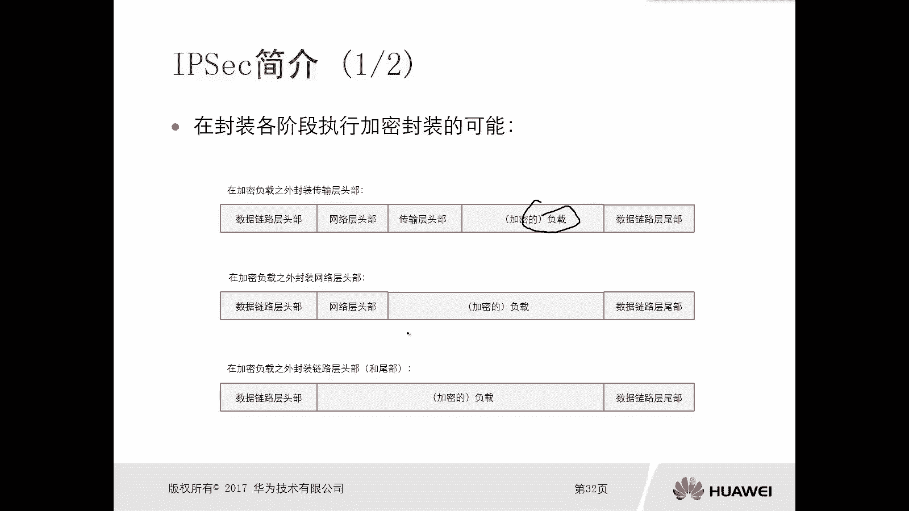

OK好好，那么接下来我们就看一下这个IPSCIP安全啊，它简称IPSC，那么这个IP注意一下，它不是一项协议啊，它是一个高度模块化的一个框架，在这个框架里面呢，我们其实有比如说有AK1对吧。

有AI cap，有esp h等等对吧，它是一系列的一个框架，它并不是指一个协议或者两个协议，那么在IP里面我们的核心呢是两种封装企业，一个叫做ESP，一个叫做AHESP呢叫做封装安全负载。

或者叫做封装安全静载啊，它的IP协议号是50，那么对ESP呢它可以提供，比如说我们对数据进行加密啊对吧，然后通信方的一个身份认证啊，和这个数据的完整性保护，那么对于AHAH叫做认证头部。

它的协议号是51，而H只能提供身份认证和完整性校验，它提供不了加密，所以说esp啊要比H要好，对不对，所以说我们在用app对数据进行保护的时候，我们一般首选是esp或者是esp加A是两个一块用。

但是很少有人去直接用AH的，因为它不加密码，对不对，好嗯，那么还有还有呢，我们就是在这个传输数据的时候啊，因为涉及到一些认证啊，一些加密啊，就会有认证算法和加密算法。

那么认证算法和加密算法实际上也有很多种，对不对，但是我们IP呢，可以去提供多种多样的认证和加密，你都可以去选择啊，可以选择，那么我们也可以采用不同的这个，共享密钥和手段啊。

那么同时呢对于这个数据进行封装的时候呢，我们也可以用不同的封装的方式啊，哎这是IPC它的一个简介呃，所以说综合来讲呢，这个IPCC它是干嘛用的，他就是为了保护我们的数据对吧。

在一个不安全的网络环境上进行传输，那么我们怎么去保护这个数据安全呢，无非就是对它进行加密啊，进行一个啊完整性校验呀，做身份认证啊，对不对，那么这种情况下，就会涉及到我们在IPSEC里面使用的一些协议。

比如说ESPAH啊，甚至后面我们还会去讲这个IK1啊，c cap啊。

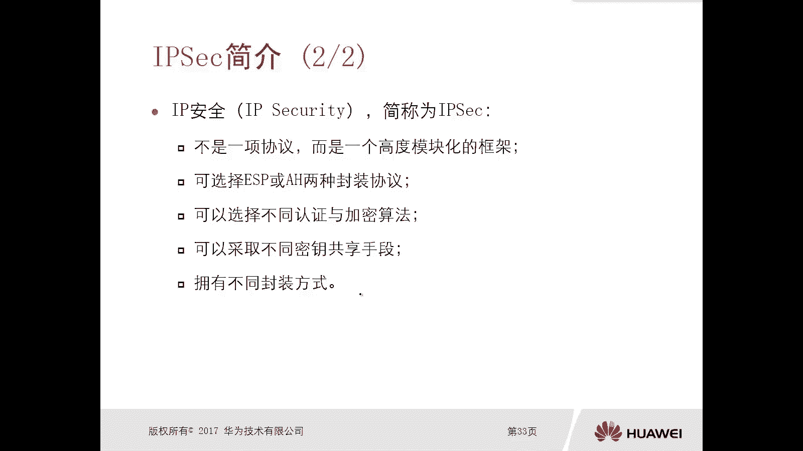

对不对，而这些东西啊好，那么我们应该有一个了解了对吧，那么接下来呢我们就看一下这个IK的简介。

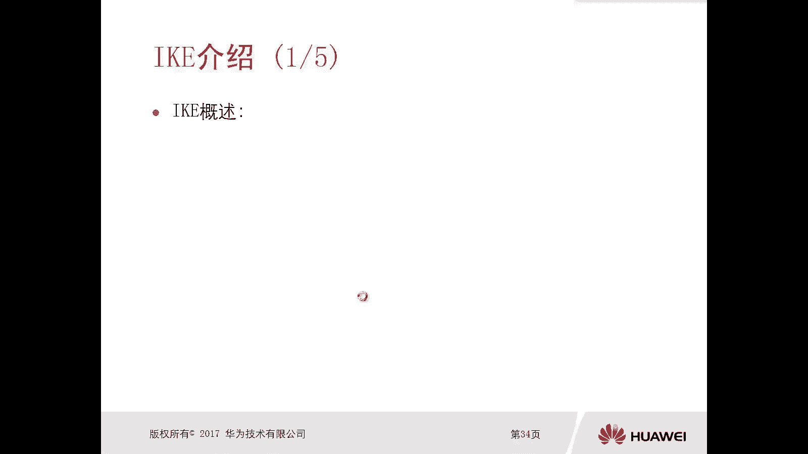

那么前面我们说讲你为了去保护这个数据啊，假设啊我就给大家画一个图啊，嗯两台路由器对吧，经过了一个网络环境，那么A路由器要和B路由器要进行数据通信，假设中间呢是因特网，那么因特网它不安全的，对不对。

那那什么人都有，对不对，黑客也有对吧，你不要把这个数据给泄露出去，对那么比如说A设备要和B设备进行一个传输，那正况下假设我们采用的是IPSC这种架构，那么也就是说A比如说我用的是ESP。

那么意味着B你也得用ESP这个协议，对不对好，那么比如说A我用的是这种A这种方式，A的这种认证方式，那么B呢你也得用A这种认证方式，对不对，比如说我A用的是E这种加密方式，那么E呢你也得用E的加密方式。

那么同时那么A如果你要用啊，比如说这个认证密钥啊，验证密钥，比如说是123，假设啊，随便写的啊，123，那么是不是意味着你B也得用123对吧，那A你要加密密钥，你用456，那么B呢你的加密钥也得456。

你都得一样的嘛，对不对，说白了OK那么这种情况下呢，实际上就存在一个问题，那你的认证和加密算法，这个倒是无所谓，你都用统一的，这个没关系，这是密钥，密钥怎么办对吧，没有的话就说，那你就配成俩不就行了吗。

你就按照我们这个图这边配123，然后加密配456，那这个呢只是考虑到了AB两台设备哦，ab两台设备他俩重新的时候，你用这两个不同的密码，对不对，一个1231456，真正可加密，那比如说A还要和C通信。

还有和D通信，还有和E通信，还要和F通信，甚至是好多路线，那你你为了安全起见，你A和B用一套密钥，A和C用一套密钥，A和D用一套密钥，A和E用一套密钥等等等等，那也就意味着你在A设备上。

你要管理多少套密钥，对吧，而且采用这种静态的配置密钥的方式，也不好对吧，你比如说你有个网银，对不对，比如说银行的网银有密码对不对，那过个几个月人家都提示你要不要改一下啊，必须要改一下对吧，那目的是什么。

为了安全对不对，那同样如果说你采用的密钥是静态的话，那为了高度安全，那么你可能需要定期的去修改，那你这工作量也太大了，对不对，哎工作量太大了，OK那么这种情况下。

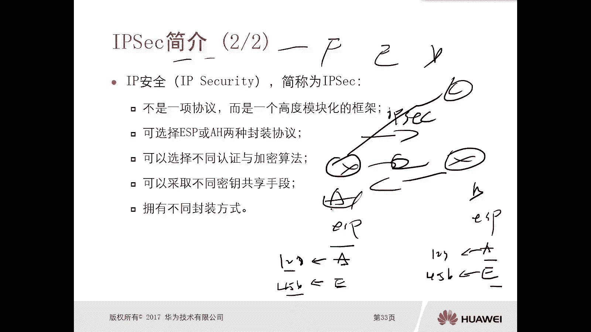

那么这种情况下怎么办呢，哎我们就用另外一个协议搞定，用AK1啊，用AK1，那么IKE呢它全称叫做互联网密钥交换协议，你干嘛，兄弟他就是去交换密钥的对吧，它是一种用来交换和管理密钥的协议对吧。

哎那么它在IP里面的作用是什么呢，去提供自动协商交换密钥，建立安全联盟的服务，那么通过数据去计算密钥，也就是说有这个IK的参与，意味着我们不需要手工静态的为啊，不同的这个IPSC去配置密码，让他算。

反正他们算出来都一样，而且这个还有一个好的地方，就是他会定期的更新密钥管理员，你配好了，不管了，他后面都会自动化，这个太智能了，对不对，这多好，你也不用管那个对不对，反正每个人每个路由器和路由器。

就一对，路由器的密码和另外一对路由器的密码。

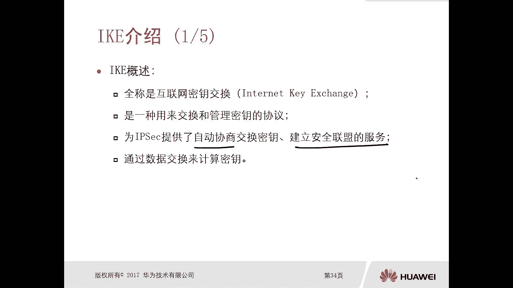

肯定不一样，哎这个就解决了刚才我们说的问题啊，好那么IT1对吧，他去协商这个密钥，他需要进行两个阶段啊，他的工作啊，第一个阶段呢哎那么主要是建立一个通信信道，二通讯信道，那么第一种模式成为主模式。

另外一种模式叫做野蛮模式，啊演员模式，也就是说我先建立一个安全的通信信道，然后在这个安全的通信信道里边呢，再去传输我的数据啊，就是建立一个数据性的，那这种模式就是快速模式，没有快速模式。

那么对于这个呃每个阶段啊，那么后面呢我们是有这个讲解的啊，就是它的过程讲解啊。

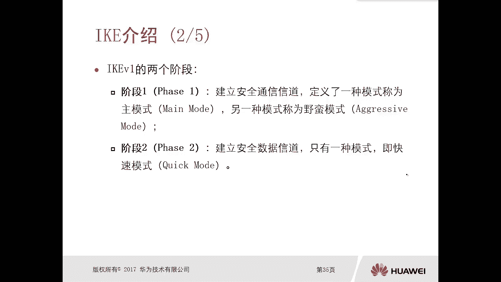

那么接下来我们就看这个阶段一和阶段，它的过程，那么计算一主模式啊，刚才我们讲了，他有主模式和野蛮模式，对不对，那么主模式第一个报文和第二个报文我们看啊，比如说A和二个AR1和R对吧，他们要协商。

要协商这个APSC，那么这种情况下，A 21a2，首先他们得去协商啊，和认证加密相关的一些参数，你比如说有认证方式啊，认证算法呀，加密算法呀对吧，什么密钥交换参数啊等等等等等等对吧，所以这种情况下。

比如说A21先发一个boy啊，这训练啊，我这有两套方案，你选吧对吧，我给你提供什么安全提议，安全提议是什么意思呢，安全提议，实际上就是我要去协商的一些安全的参数，比如说认证方式，认证算法。

加密算法D是足信道的时长对吧，然后我又提供了两个嘛，对不对，哎就发过来了，发过来了以后呢，那么A2A2它也是提前配了安全提议的，他配了两个对啊，OK那么呢它根据你发送过来的这两套方案。

它会和本地的IK安全体系做个匹配，那么匹配完了以后说OK哥们，你这两个题我都看了啊，那我选安全题哦，安全提二对吧，因为这个安全T2和我AR2上面的安全提一，正好是匹配的，你看共享SHEA1对吧。

ASCBC2565都一样。

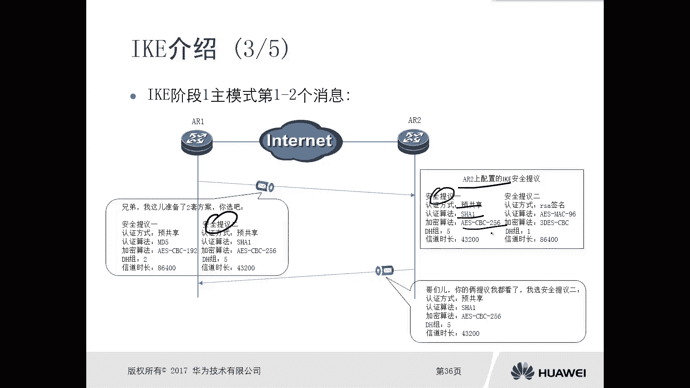

要匹配啊，OK我们就用这个吧啊好。

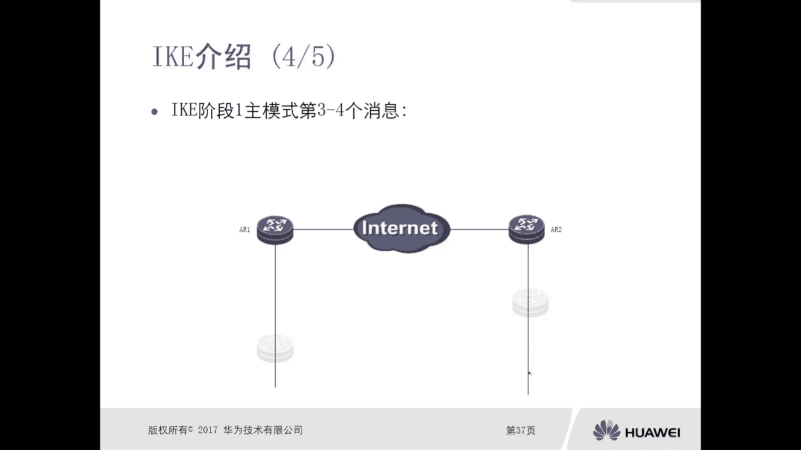

然后呢呃这个AR1和A2就知道了啊，以后我们这个做数据的加密和认证的时候对吧，算法包括认证的方式，我们也用这种方式，那么就确定了啊。

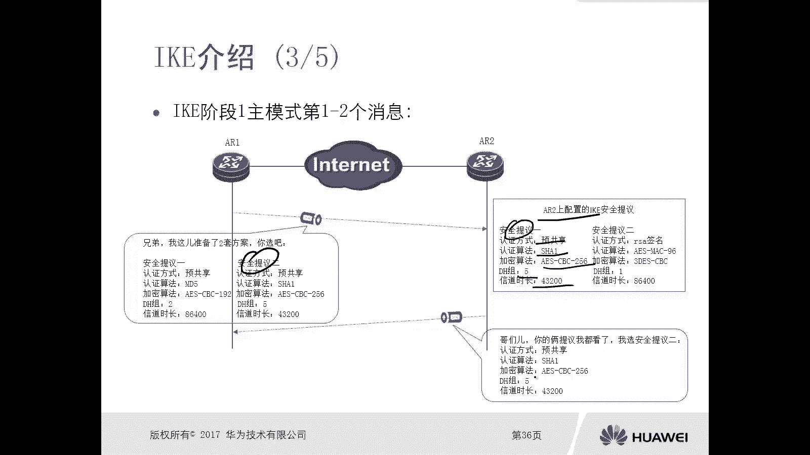

认证方式，认证算法和加密算法，而接下来我们第三个消息和第四个消息，第三个消息和第四要四个消息呢，实际上是双方会去交互一些和密钥有关的，一些随机数，大家注意啊，他们不是直接交互密钥啊，他们是交互随机数。

然后再利用这个随机数各自产生一致的密钥，哎你比如说对吧，有中间人，假设有中间人攻击他在这截获了，那没关系啊对吧，我A21发送的是什么，我告诉你几个是一数啊，兄弟我告诉你三个数啊，你记好了。

分别是GPA对吧，就是一些随机数，那么A2收到以后呢，他会利用这些随机数计算出来一个密码，比如说这个密钥是K没有没有计算K，那么A2呢也会告诉A21啊，一一水，比如大B对吧好，Ok。

那么路由器A他也会利用这些随机数，计算出一个密钥K那他俩是一样的，要注意一下，那么那么注意一下的，大家注意一下，并不是我计算密钥的时候，只用到GPA和大B不是的。

那么AR1和A2它本地是有留存的随机数啊，流程的就是没有发出来的，那这种情况下，攻击者你截获的只是部分的随机数，那么攻击者他是没法算出密钥的对吧，这个工作的就有点，心理阴影面积还GPA。

所以这种情况就比较安全了对吧，那么计算出来的这个密钥哎，我就可以去做一些，比如说算法呀，加密呀，对不对，就用这个密钥。

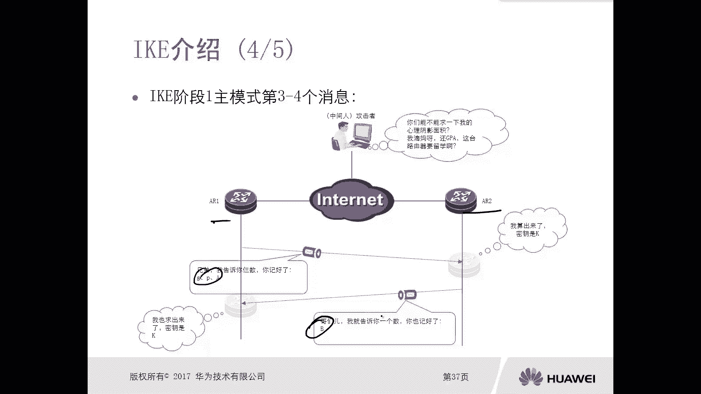

好这是第一个阶段搞定了，然后第二阶段，第二阶段我们看快速协商，快速协商模式，好，那么第二个阶段呢，是我们需要对加密的通信的流量，加密算法运算法，封装协议，封装方式，密钥有效期等等信息进行协商对吧。

所以这种情况下，那么你需要在A2上，比如说我配了一些IP sec的安全提对吧，加密算法运行算法，封装协议，封装方式，对不对，ml有效期等等啊，然后那A21又是提供了两个方案，你选吧。

A2说OK我就选这个了。

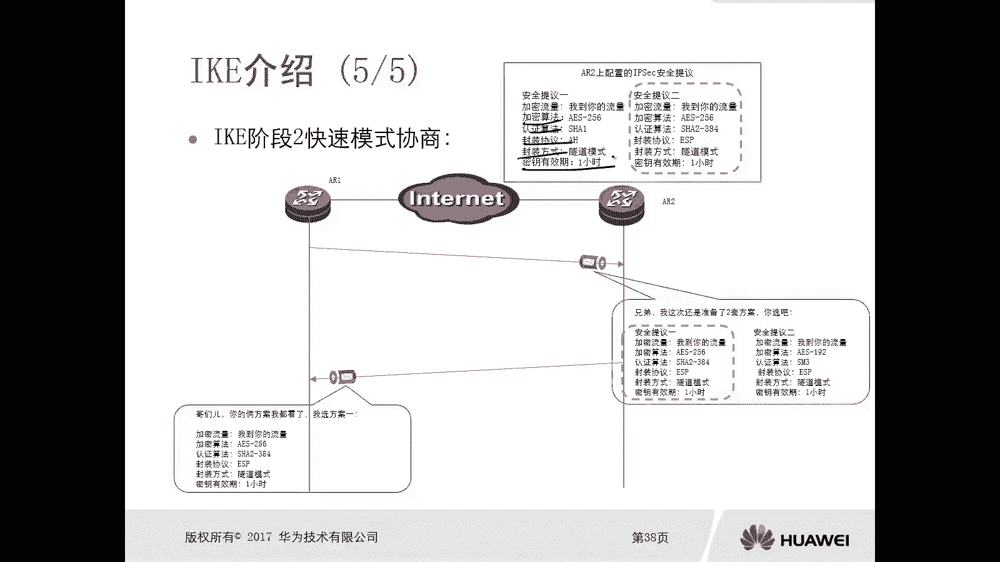

那么我们就定了，哎这样这个第二个阶段呢就结束了。

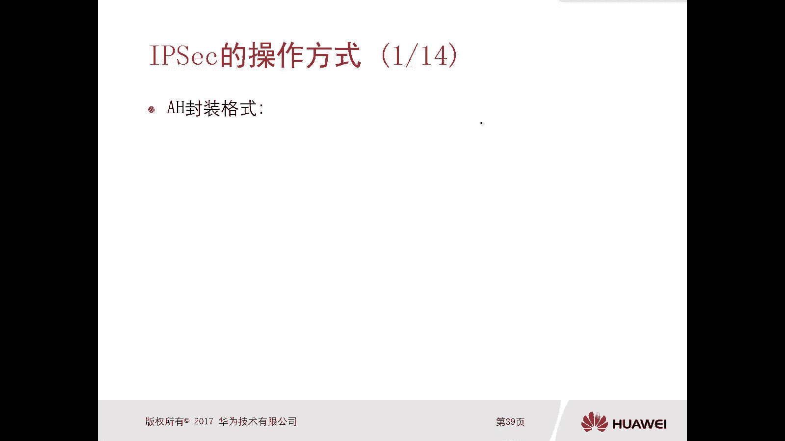

那么后面呢我们根据协商出来的这些，加密算法呀，认证算法呀，封装方式啊，封装协议啊，那么对数据进行一个加密认证对吧，身份认证和完整性校验就可以了，哎那你看这里面有没有去配什么密钥啊。

有没有去配他的认证密钥，加密钥没有，这完全就是他们自己协商出来的。

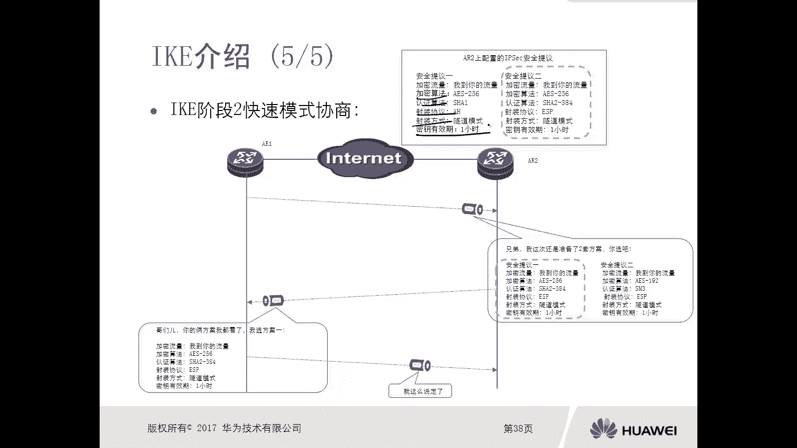

还有时间时间超时要重新写上，哎这是这是这是这个IPSC是吧。

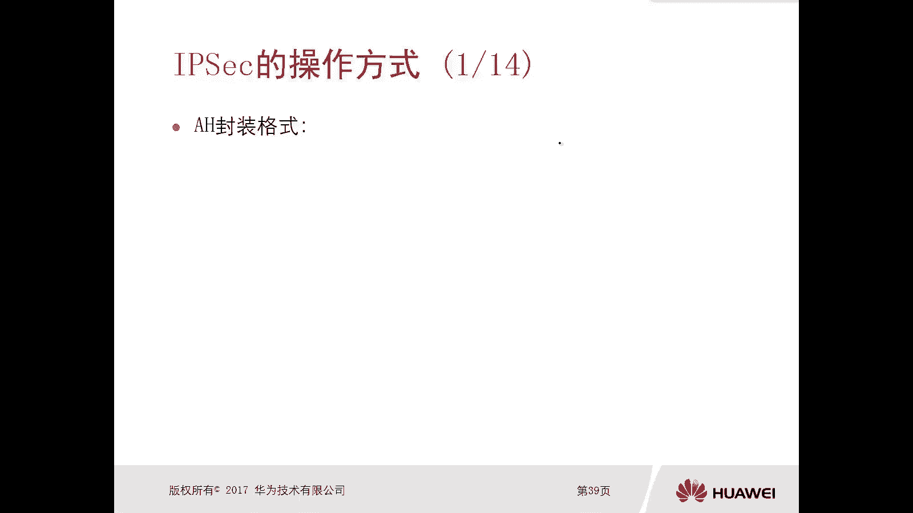

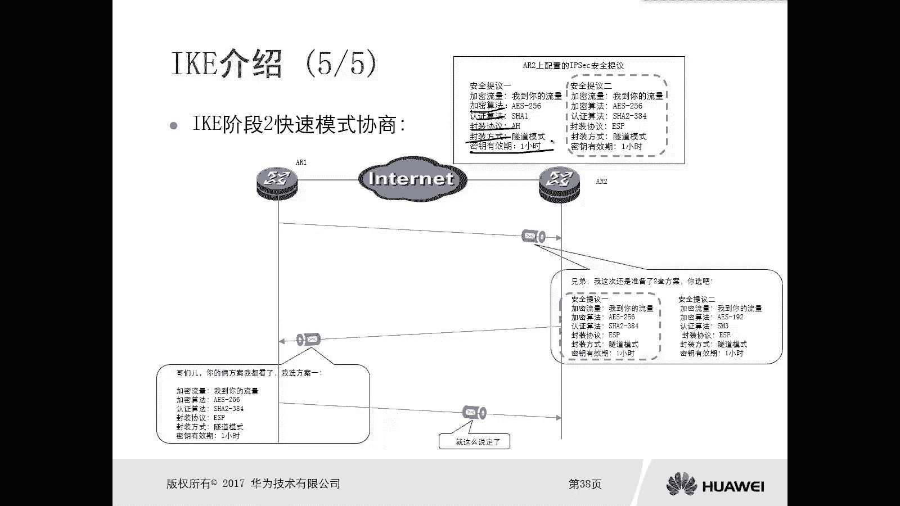