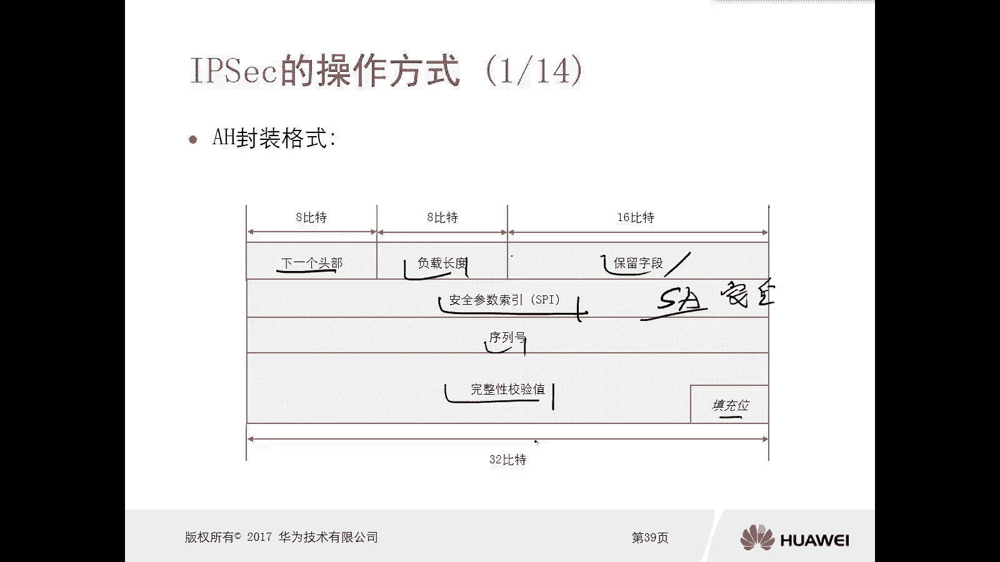

# 华为认证ICT学院HCIA／HCIP-Datacom教程【共56集】 数通 路由交换 考试 题库 - P55：第3册-第9章-4-IPsec的操作方式 - ICT网络攻城狮 - BV1yc41147f8

好，那么接下来我们看一下这个app，它的一个操作方式啊，第一个是这个H的封装格式。

我们先看一下刚才讲的这个P呀，它有两种封装协议，一个是A1个是ESP，对不对，好在这里边呢我们看它有一个下一个头部，那么下一个头部呢，实际上指的是我们这个就是下一次的封装，下一个头部封装是什么。

然后负载长度啊，保留字段有一个安全参数索引SPI啊，这个非常非常重要，它的作用是唯一的去描述一个SAIC呢，叫做安全联盟，安全联盟，那么我是要通过不同的安全联盟，不同的SA啊。

就这个SPI去索引我的不同的安全联盟，然后利用安全联盟里边的参数，比如说你的认证方式，你的加密方式对吧，然后对数据包进行处理，所以说这个很重要很重要，因为我们一台设备的话，你可能和多台设备都有IP。

对不对，那你和不同的设备的IPC，那么你采用的SPA不一样，那你的C也不一样，对不对，所以你得搞清楚，你拿个数据包，你不要搞错了，不要乱，不要乱了套，对不对，OK然后是序列号完整性校验值填充位。

然后对于这个AA是谁呢，在这个app里面操作的时候呢，它有两种模式进封装啊，那么第一种呢是传输模式啊，传输模式它是在我们原始的数据基础之上，在IPV4和TCP啊，就是你的三层和四层之间加入了一个AF。

一个头啊，这个呢就是传输模式哦，原来是这样的，你看这个照片里面，他是没有写出来这个原始数据，原始数据，比如说是这样的，给他画一下啊，好这是IPV4的头对吧，比如说你是一个TCP的应用。

或者UDP的应用都可以啊，啊然后是我们的应用层的信息，比如说你原始数据是这样的，对不对，如果利用AH对这个数据进行封装的话，如果是传输模式，那么它是在IPP4和TCP中间啊，插入一个AH的头啊。

ta h的头去保护我们的数据，那么如果是隧道模式呢，如果是隧道模式的话，他不是在这插入一个AH头了，它是在原始的基础之上增加一个AH的头啊，就这个对吧好，然后再去增加一个新的IPV4的头啊。

那么我们看啊，这是原始的数据对吧，哎加个A是头，再增加一个新的IPV4的头，这个叫做隧道模式，二手的模式，那么这两种模式呢，我们管理员呢你配置的时候可以选，那当然也要去结合你的应用场景啊，用场景去选。

不要随便去做，那么另外一种协议呢ESPESP。

我们看它的格式，首先也是安全索引，SPI很重要，对不对，然后序列号啊，那么数据部分填充位校验和完整性校验值。

那么对于esp的封装呢也是两种模式。

一个是这个传输模式，一个是C的模式，传输模式呢也是在原来的IP头部，和我们的传输层TCP或者UDP啊，中间插入一个USB的头部，同时在数据后边增加了一个esp，然后增加了一个完整性校验的一个值啊。

这是传输模式，那么隧道模式呢，隧道模式是在原始的数据基基基础之上啊，那么增加了esp头啊，增加了这个esp的一个尾啊，增加了一个新的IP头，还有一个完整性的一个效应，那么由于我们esp协议啊。

他除了去做认证，身份认证，完成人生校验，孩子加密，所以说它的加密如果是传输模式的话，它是对我们原始的传输层的头部数据部分啊，还有esp TV进行了加密，而如果是隧道模式呢，隧道模式它把原来的IP头部。

TCP头部以及应用数据以及esp的V都做加密，哎，所以说我们一开篇讲IPSEC，它可能的加密的方式的时候，那三种其实并不并不啊，并并不是特别特别的好，对不对，你要么只是加密数据部分，要么加密传输层。

要么加密网络层，但是我们现在看到，如果你采用esp的一个隧道模式的话，它是所有的数据进行加密，对新增加的这个IP头和esp的头部，对不对，哎这种就更加安全了啊，这是IPC操作里面的esp的封装方式。

好，那么接下来我们看一下完整的IP封装的第一步，比如说这台设备它是发送方的IP设备啊，那么原始的是TCP的数据和啊，我们的数据数据部分对吧，比如说这个数据啊，它是一个TCP的一个数据。

那么数据部分和TCP头部对吧，好那么第一步，首先呢我要给这个数据增加一个ESP的尾，来增加一个esp的一个尾部啊，那么这个esp的尾部，它的下一个头部字段指的是一个TCP啊。

就是六这样的一个头部好，那么第二步呢增加了尾翼以后，那么接下来接下来发送方的IP去查询，我本地的CDB安全联盟的安全，安全联盟的数据库啊，我们前面讲过啊，所以这个设备上可能会有多个安全联盟，对不对。

它不同的IP它会形成不同的IC啊，好那么查询到以后啊，他会利用SA里边的加密算法对吧，哎对我们的数据进行加密，那么这个数据呢从原来的非加密状态。

变成一个加密状态，对吧对好，那么变成加密状态以后，那么继续查询啊，我们的SA同时找到它的SPI安全索引嘛，对不对，然后增加一个IP的头啊，比如说通过esp的方式啊啊，那么就是ESP的头啊。

那么把这个安全索引给放进去放进去好。

那么现在这个数据呢就是一个呃完整的数据了，有esp的头部，有TCP头部加密了，然后有数据部分加密了，然后有esp的尾部也被加密了，对不对，但是现在缺少一个完整性校验，那么发送方设备呢又去查询ISA里边。

是不是有这个散列算法呀，对吧，因为做完整性校验的时候，我们实际上用的是散列算法，OK好，然后利用这个散算法再结合我们之前IK1啊，这个得到的密码对不对，哎那么进行一个散列计算啊。

那么3D计算是将整个数据去做计算，那么得到一个这个散列值啊，把这个计算结果散列值啊，给他放到EPV后边完整性校验字段里面。

对吧，然后就变成一个完整的esp被加密，被完整性校验过的一个数据就发送给了接收方，那么接收方收到以后，首先他要利用ESP啊，头部里面的索引它读取，对不对，然后根据这个索引去查询我本地的ICADB。

SPISPI对不对，然后通过相同的SPI找到A，然后利用SA里面的散列算法，同样对这个数据进行一个计算，计算的结果，如果计算结果，闪电池和这个数据的后面的这个完整性校验，里面的字段是一致的。

那么说明一个问题，说明这个数据在传输过程中没有被更改过对吧，这种散列算法我们知道它有雪崩效应，就是你对一个数据做了一次散列，然后这个数据简单改一个字符，比如说你加了空格，加了一个字。

那么再去做散列的时候，它们的值是完全不一样的，很难找到两个文件，两个不同的文件，他们说他们散列出来的值是一样的，没有这种可能，所以说我们可以通过这种方式去判断，你这个数据在传输的过程中有没有被人篡改。

保证它的完整性，对不对。

哎好，那么完整性没有问题，OK那我们就把这个esp e s p的头部给摘掉对吧，同样把这个这个呃任呃，这个完整性校验的部分呢就给拿掉，对不对，那么主要是剩下了C的头部数据部分，和ESP的尾部。

那么这些全都是被加密的，我要解密，对不对好，那么解密怎么解呢，又是查询SADB查询S那么查询到S以后呢，利用C里面的加密算法据他们进行解密，最终数据呢变成一个非机密的状态。

OK那么路由器我就可以进行正常的读取了对吧，哎读取，然后同时注意一下，把ESP的尾部给剥掉，最终就还原了我们原始的数据，哎那这样一想，我在一个不安全的网络环境里边啊。

传输数据的时候对数据进行加密完整性校验，对不对，然后传输过去，然后对端呢，他还知道这个数据在传输过程中有没有被更改，对吧，如果更改了，我可能就丢了，这有问题对吧，没有更改我的解封装，解封装它是加密状态。

对不对，然后我再去对它进行解密，那么中间如果说有中间人，他把数据包给截获了对吧，那无非就是唉我想去窃取里面的信息，被加密了，你怎么窃取啊，打不开，对不对好，那如果说我想去更改里面信息，你改啊。

改了以后我对端接收方我就能知道对吧，所以说你也没法去做破坏了啊，好这就是它的好处，那么这种方式呢一般呢我们是用在啊，比如说我们在这个站点和站点，就是就是就是处于不同物理位置的啊。

哎一些站点和站点之间要实现一个数据通信，对吧，P4为平啊。

所以接下来我们就看一下这个PSEC，我们去用的一个场景是什么，第一种场景啊，比如说我们在一个内网里面也为了安全啊，这文件服务器和文件服务器之间，他们去传输数据的时候，为了安全啊。

那么我们可以采用传输模式注意啥啊，他们这两个文件服务器啊，不需要经过运营商的网络环境，他们直接互通，这种情况可以用传输模式对吧，因为你传输模式你没有增加新的IP to，对不对，你没有增加新IP to。

你是圆的那个原来的IP to对吧，原来的P头，所以这种情况下OK没有问题对吧好。

那么另外一种模式，隧道模式，隧道模式一般用在，比如说哎我这是总部的一个网关路由器，这是一个分布的网关路由器，我们想实现总部内网和分布外网啊，分部的内网实现一个通信，但是呢中间经过了英特网，这种情况下。

你用传输模式就不行了，哎必须要用隧道模式啊，那么隧道模式需要在我们的路由器上边对吧，有公网地址嘛，对不对，他需要去为这个数据增加一个新的IP头，那么这个新的IP头呢往往是一个公网地址，因为只有这样。

你这个路由器A的数据，才能利用公网地址传输到路由器B唉，路由器二，然后路由器二呢再去做解封装，露出原来的什么原IP地址，对不对，然后再进行一个传输，唉这是在我们这种环境里面使用的，这个隧道模式啊。

好这就是PSC啊，我们做完以后他的一个操作过程啊，那么总结来讲就是各种查询对吧，就想方设法的让这个数据啊先给它封装对吧，封装esp北啊对吧，然后再去给它加密，再去给他做完整性校验对吧。

最后再放上一个ESP的SPI对吧，发出去，然后最多呢无非就是利用这些信息啊，我去找找了以后呢，这个解密对吧，然后去验证它是不是完整的哎，然后再剥掉所有的封装，最终露出原始数据进行读取。

看好这是这个app它的一个操作的过程啊。

