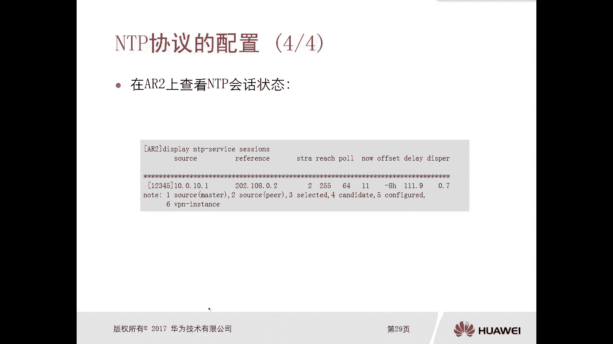
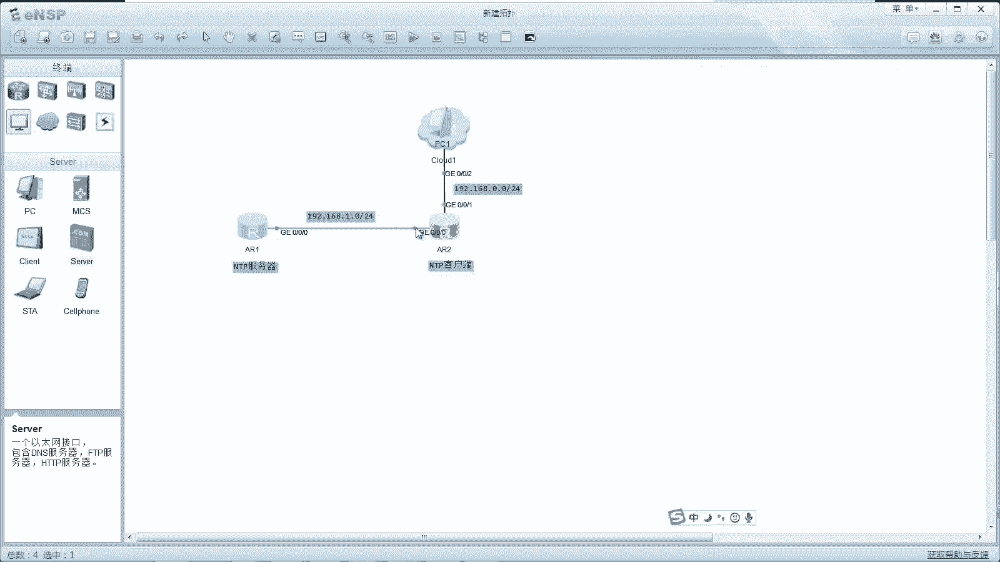
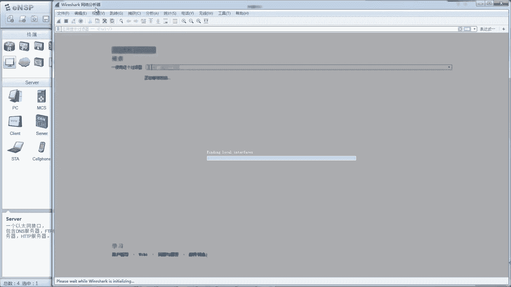
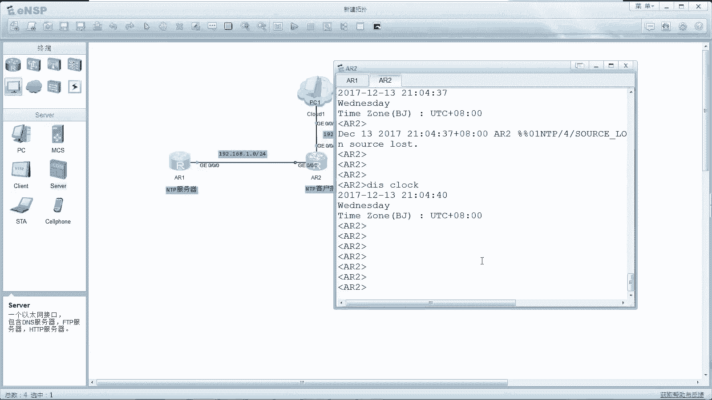
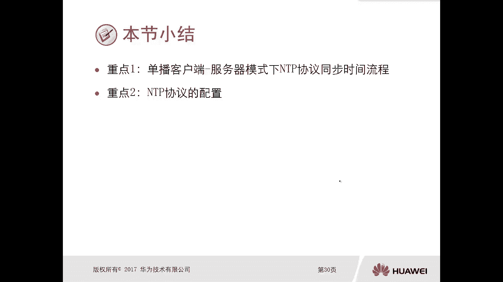

# 华为认证ICT学院HCIA／HCIP-Datacom教程【共56集】 数通 路由交换 考试 题库 - P56：第3册-第11章-2-NTP协议及配置 - ICT网络攻城狮 - BV1yc41147f8

那么接下来我们讲一下这个NTP协议啊，N t p，那么NTP呢呃它叫做网络时间协议，那么为了使我们的网络设备啊，赋予准确而一致的时间，那么是绝非儿戏的对吧，因为这些操作呢。

可以为日后的这个网络正常运行和日常运维，带来重大的便利啊，你想你比如说我们后期这个设备有故障了对吧，有错误了对吧，它会有一些这种trap信息，或者是日志信息记录到我们NMS设备，或者是记录到设备本身。

那么如果说你这个设备没有一个，准确的时间的话，你没法去确定出现问题的时间是什么时间段，对吧，哎哎包括我们后期对设备的一些调整，对不对等等，都有一个时间的参照啊，所以说我们的网络设备必须要去同步时间啊。

同步时间啊，那么本节呢主要是将从如下两个方面去介绍，这个网络时间协议NTP，那么第一个是NTP协议的原理，第二是NTP协议，它的配置，我们先看一下这个NTP协议的简介。

NTP呢它会以这个UDP作为传输层协议，那么这个企业的供端口号是123，UDP的123，那么它定义了同步消息和控制消息啊，定义了同步消息和控制消息，那么也就是说哎，我们这个协议实际上是用来去同步。

我们设备的时钟的是吧，同步和控制，那么对于NDP协议呢，它定义了单播客户端服务器模式，对整体模式和广播模式，也就是说这个在不同的场景里面啊，我们可以采用不同的这种NTP企业的模式，那么NTP。

我们我相信大家也知道是什么东西了，对它就是一种在设备之间同步时间的协议对吧，哎同步时间写好，那比如说啊你看我们现在哎，我可以在这个一个网络里面找一台设备啊，把他的时间设置准确。

然后把这台设备给它设置成NDP的服务器，然后其他所有其他的设备，都认为是NTP客户端，那么其他所有的设备你们在同步时间的时候，朝着这台NTP服务器同步就可以了，比如说我们胶片中这个NTP服务器对吧。

它的时间是10：10分对吧，那么对于这个NTP客户端，对不对，哎所以如果说我们在NTP客户端上，你配置了要和NDP这个服务器，进行时时钟同步，那么这种情况下，这个NTP客户端就会去发送。

请求同步时间的信息啊，这个同步消息啊，同步消息就叫做NDB的同步消息来请求啊，我要和你的时间进行同步，这个就好比说我给你对下表吧，对不对，我的表时间是8。10分，你的表几点好。

那么也就是说在我们那个同步请求消息里边，实际上是包含了NTP客户端，现在的时间8。10分，这个时间呢我们叫做T0时间，做T0时间啊，就T0，那么当NDP收到同步请求消息以后啊。

那么那么这个NGB服务器呢就会做出响应啊，就会做出这个响应啊，就是同步响应信息啊，这么小的信息就OK你好，那么我现在接收到了你的请求对吧，我接收到你请求的时候，就是我接收到你请求的时候，我的时间是10：

10：01，然后我发送这条响应消息的时候，我的时间是10：10：05，因为它毕竟有时延，对不对，我收到了我再处理一下，然后再发，有时延，对不对，哎所以这两个时间呢我们第一时间叫做T1。

第二时间呢可以叫做T2，刚才我们有一个T0嘛，对不对，现在是三个时间了，然后呢他就会把这个响应消息发给这个客户端，那么客户端客户端啊，那么客户端收到以后，收到以后，它会根据四个时间。

计算出它与服务器之间的时间差和转发延迟，那么第四个时间是什么呢，第四个时间是我收到这个响应时间的，我收到了一个响应消息的时间，你看我说的这个响应，休息的时间是08：10：05，这个叫做T3时间啊。

就是我收到NGB服务器，响应报文的时间是T3，所以呢他会利用T0对吧，T1T2T三这个时间进行计算对吧，它会计算发出请求和收到响应之间的总时间啊，然后再减去NDP服务器处理响应时间，休息的时间。

那么就是线路的往返延迟时间啊，那么算出来是两秒，对不对，OK好，那么我们两边的时间差是T减T0，加上T2减T3啊，那么除以二对吧，那么得出来啊是四个小时，再除以二是两个小时。

也就是说我比服务器是慢了两个小时整，我需要把表调快两个小时，对吧，那么这种情况下它就会根据这个计算啊，包括这个时间也算上吧，对不对，哎包括时间也算上，然后最终计算出来我的时间应该是多少。

最终呢它的时间和服务器的时间呢，是一模一样的，对不对，哎他得有实验啊，再注意一下哎，这个呢我们刚才看到这个同步层，实际上甭管是弹幕的方式还是主播的方式，还是广播的方式，他都是这样的情况。

只不过发包的时候用的是单播，还用的是广播，还用的是主播啊，这点区别啊，嗯好这是这个NDP非常简单对吧，非常简单好，那么我们看一下这个NTP，它的一个配置环境啊，那么对于NTP这个协议呢。

我们是分层次的哎，那么它有第一层，第二层和第三层啊，那么同步方向呢是第一层去同步第二层，第二层去同步第三层啊，第三层当然你可以同步这个第四层等等，对不对，哎它一层一层的嗯好啊。

那我们看一下这个AREARE，那么作为这个呃时钟时钟源，那么怎么去做呢，哎我们可以去嗯，你看啊，这是这个运营商服务器啊，就是这个SP的路由器，那么A21既作为时钟源，也作为一个客户端，对不对。

它作为客户端呢，是要去同步云商的路由器的时钟，同时呢它也要向下去同步A2的时钟，对不对，也可以这样去做，我们看它的配置啊，首先是IP地址，我们看了对不对，然后他去设置NTP的弹幕服务器。

这是运营商的地址，没问题吧，没问题吧，同时他把自己也设置成了一个这个主时钟，就是服务器是吧，哎服务器啊，因为他要向其他的设备去同步实现，对不对，服务器两个命令，然后对于A2。

它直接朝着R1去做同步就可以了对吧，那么同步完了以后呢，我们就可以去查看NTP服务的状态了对吧，看它的服务状态，那这里呢我们就可以看到它的层次，对A21来讲它是第二层，对不对。

然后对A23来讲它是第三层对吧，哎那么他现在的时间我们都能看到，对不对，这个应该是没有同步好的，对不对，哎同步好了是一样的了，好那么在A2上呢，我们可以去看这个NTP service的session。

我们看他有没有建立session啊，这里面这些信息啊，嗯好，那么接下来呢我就给大家做一个简单的NDP。

它的配置啊，好那么我们做一个实验啊，我们就用这个L1和L2做个实验就好了对吧，然后现在呢我们先去确定，把A2E呢做成一个NTP的服务器啊，然后呢这个A2呢做NDP的客户端，那么首先呢我们第一步呢。

你得保证你的NTP服务器的时钟是准确的啊，包括日期，对不对，那么首先我们上来以后呢，呃我们得先去这个名字改一下啊，然后他的IP地址G0杠零杠零，IP地址192。168。1。100。

哎这个A2的地址呢应该也没有设置啊，A2，24对吧，我心想192。168。1。100好，那么首先我们要看一下这个，你要让哪台设备作为服务器对吧，它的一个时间我们去display clock对吧。

clock啊，那么在这里边呢，我们能够看到它的一个时间的市区啊，市区那么是中国标准时间，但是呢这是UTC减去九九十九个小时，对不对，那不对的，我们中国标准时间，比如说以北京为例，对不对。

一般都是北京时间嘛，对不对，那么一般都是呃不能交到一半啊，就是这种情况下应该是UTC加东八区嘛，对不对，加八个小时嘛，对不对啊，就是在UTC的基础之上加上八个小时，那么就而同时他的这个时间也是错误的。

16年，对不对，好日期也错误的，所以说我们首先得保证啊，我们的这个服务器它的时区时间是正确的，那么时区时间先改哪个，注意一下，一定是先改时区再改时间，要不然你把时间改对了，失去一条又又又不对了，对不对。

哎所以说我们先在用户视图下面去修改tel啊，那比如说北京对吧，然后是加八个小时，在UTC的基础之上啊，加八个小时，那么现在我们就能看到现在呃这个时区是北京，然后USC加八个小时，对不对好。

然后呢我们再去配置daytime啊，那现在呢现在的时间是8。50哎，大概53是这样啊，也是8。53，那么就去配置，这个是20：53分啊，比如说50秒介绍啊，然后日期呢是2017年的12月13啊。

刚过完双12对吧，13好回车，那么做完以后呢，我们在display clock我们就能看到对吧，是2017年的12月13，8。51035101秒，UDC北京啊，东马逊嗯，好那么这个服务器就搞定了对吧。

就他的时间搞定了啊，好，那么接下来呢，哎我们需要把这个服务器给它配置成，配成一个NTP的这个同步时钟源，那么就是通过NTP，这NTP的service ref clock master。

好那么后面呢我们可以打个问号看一下啊，它有一个这个层次对哎层次层次的话，那么缺少你不止的话就是一啊，这是第一个层次，那那那有人在向你同步的话，就是第二层次啊，别人在向第二层次同步的话，就是第三个层次。

以此类推，对不对好，那现在我们可以看到啊，这个已经update了，对不对啊，然后我们通过display n DP的一个状态啊，我们现在能看到对吧，是同步状态，这个显示我不知道是哪的问题啊。

他老是显示八对不对，那很奇怪，那比如说我们把这个设置一下NTP呃，service对吧，然后是master1，对啊，他也是显示八对，按这个来讲，它应该是一是对的啊，不应该是八的，我们先把它删掉再试一把啊。

这里这里是master，这就没有NTP了，NTP16了对吧，我们把NTP，我们设置成比如说人五吧，看一下有没有效果啊，A5就可以诶，很奇怪啊，我们在安do NTP嗯对吧，然后我们去设置NTP，诶好了啊。

不知道什么原因造成的，反正我们是先设置一下就好了，好了好，现在状态是同步，就是现在你自己给自己同步啊，就这意思啊，现在同步状态啊，好这就OK了，那么接下来呢哎我们在二上面啊，把它作为客户端去做操作啊。

呃这个很简单，那么直接我们首先要去确认一下你的这个time zone，对不对，哎time zone明显，这是不对的，对不对，它是减了八个小时，那么呢他的时间是15年，对不对，也不对。

所以说首先我们也要去修改它time照啊，北京啊，嗯增加八个小时，对不对，在UTC基础之上啊，然后呢我们再去看一下这个时间嗯，时时钟是OK的，对不对，这时间还是不对的好，那么接下来呢。

我们就要用这个NTP服务器给他同步啊，我们在这进行一个抓包。

然后呢我们在这去做操作啊，这个操作就是一条命令，就是NTP service unit，Cast server，192。168。1。100搞定，对然后NDP都是状态，现在我们看同同步状态。

然后属于第二层对吧，服务器是多少，对不对，然后我们去display clock呃，那么这个稍微慢一点啊，这个日期是同步过来了，对不对，但是时间好像是不对的，时间好像是不对的啊，那么在一上边的时间。

嗯十二十三八。58，那么这个我们稍等一下啊，好那么这个等一下等一下，这个是正常了，我们看下这个A21模拟器有点问题啊，啊是9。04对吧，哎现在就OK了对吧，同步过来吧，OK好，包括他的一个状态，对不对。

同步状态，那么是这个啊，这个是二层，对不对，好这是展示是OK的啊，建议大家如果有真机的话，用真题做一下模拟器，可能是有问题啊，模拟器是有问题，好那么这样我们就把这个NTP配置就讲完了。

好，那么本节小结呢是呃，DEO客户端和服务器模式下，NDP协议同步的时间流程很简单，对不对。

