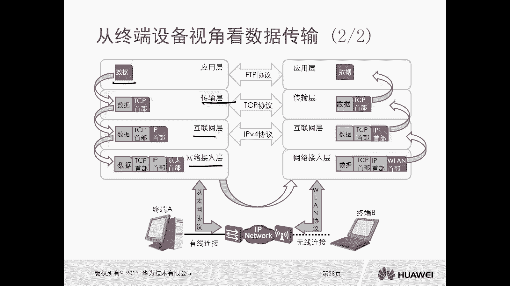
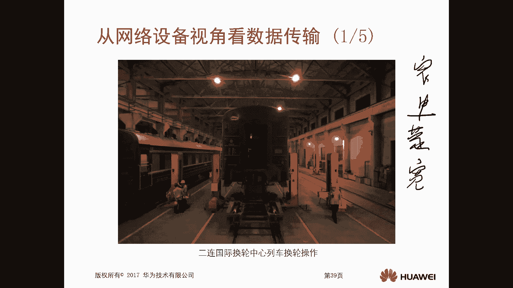
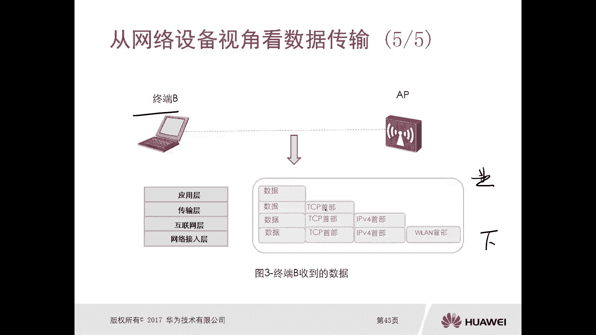

# 华为认证ICT学院HCIA／HCIP-Datacom教程【共56集】 数通 路由交换 考试 题库 - P5：第1册-第3章-4-实现数据传输1 - ICT网络攻城狮 - BV1yc41147f8

那么接下来我们看一下实现传输数据啊，它是怎么实现的啊，那么实现传输数据，本小节呢主要是描述数据封装和解封装的过程，那么前面呢我们应该是已经介绍过，这个OSI7层，包括TCP和IP4层对吧。

那么当时应该也介绍过，我们说在发送方来讲呢，它是从高层到低层的处理的，然后在接收方来讲呢，它是从低层到高层进行处理了，那么这个处理过程呢分别就是封装和解封装好，那么接下来我们就看一下它分为几个部分。

一共是四个部分，第一个呢是封装与解封装，哎我们看什么，他怎么实现封装和解封装，第二个呢是从终端设备的视角去看数据，它的传输啊，啊第二，第三个是从网络设备的视角去看数据的传输啊。

第三个是从网络拓扑的视角去看数据传输，那么首先我们看封装与解封装，封装呢实际上是每一层为载荷部分，去添加本层相关的一些空信息，那么载荷呢一般都是我们的有效数据啊，就是payload载荷好。

那么对于它的作用来讲呢，第一个是确保数据可靠的到达目的地对吧，你得去添加一些控制信息吧，你没有这个控制信息，你怎么去确保呢啊第二个呢是特点，它是自上而下进操作的内容呢是由少到多啊，我们刚才也讲了。

对于发送方来讲呢，它是从这个高层就是上层到低层，或者叫下层进行处理的对吧，然后内容是由少而多，一层一层就加点东西嘛，都是在添加，对不对，所以说肯定是越来越多，那么解封中呢，每一层为载荷部分。

播出本层协议相关的一个控制信息啊，你看一个封装是添加解封装的，是播出对吧，他俩正好是相反的，那它的作用是提取原始数据是吧，好特点是自下而上，就从低层到高层进行操作，内容呢是越来越少啊。

哎他俩是正好相反的啊，好那么我们看一下啊，举个例子啊，比如说这儿有一个发送方，要给给这个接收方去发送数据，那这个呢我们是按照TCP跟RP4层来的，分别是应用层，传输层，互联网层和网络接入层是吧。

那么对于发送方来讲呢，首先是要通过高层应用层进行处理，应用层呢比如说我就是一个数据，通过FTP的方式去传输传输文件好，那么这个数据通过应用层的处理以后，要交到传输层进行处理。

传输层由于我们现在使用的一个协议啊，就是TCP协议，因为不同层里面呢它协议是不一样的啊，应用层FTP传输层，TCP我们前面也讲过的对吧，那么在传输层呢，它就会为这个数据呢增加一些控制信息。

那这个在传输层我们利用TCP协议的时候，它增加的控制信息呢是TCP的一个手部啊，那么TTP这个传输就处理完了，处理完了以后呢，接下来是交给互联网层，那么交给互联网层，互联网层现在我们使用的是IP协议啊。

所以说在互联网层，他要为我们的数据加上一个IP的首部IP首付，那么对于传输层来讲，它的配路的载荷呢就是数据，对于互联网层来讲呢，它的配置的载荷呢就是数据加上TCP对吧，然后我再加上我的控制信息。

IP收入好，那么互联网层处理完了以后呢，紧接着又交给网络接入层，那么网络建设层我们采用的是以太网协议，所以说在网络接入层为他的披露的载荷，添加的是一个以太网的首部唉，以太网的首部哎，那这样呢。

在发送方从上到下这样的一个处理过程啊，就叫做封装，封装呢我们看它是由少变多的这个数据对不对，由小变大哎，这个处理完了以后就可以进行发送了，好那么当这个发送方啊，把这个数据处理完毕以后。

那么通过以太网的一个线路啊，那么发送给这个接收方，那么接收方他要处理的时候呢，是从下到上的处理，那么首先呢是要经过网络接入层进行处理，因为我我这个技术方面用的也是以太网协对吧。

所以说在接入层他处理的时候呢，它是将这个以太首部给去掉诶，播出播出再把剩下的数据呢交给互联网层，就交给它的上层，那么到了互联网层呢，我们看它只有数据TCP首部和IP首付了，那么互联网层进行处理的时候呢。

他是把IP手术IP首部给部署，然后再把剩下的数据呢交给它的上层传输层，那么传输层呢只会剩下数据和TTP的首部啊，那么传输层呢再对这个数据进行处理呢，是把TTP的首部进行播出，最终呢把数据交给应用层啊。

那么最终我们看发送方发出去的数据，最终接收方接收的数据是一模一样的，哎这个接收方从下到上的一个处理过程呢，就叫做解封装啊，这就几分钟，OK好，那么刚才我们看的是封装和解封装啊。

那么接下来我们看一下从终端设备唉，视觉去看数据的一个传输啊，那么特点呢是对于终端设备来讲，它是不清楚数据在传输过程中，是否会被重新封装和解封装的啊，这个是终端设备呢是不清楚的。

而且终端设备呢是只关心上层的数据，下层协议可以通过上层协议来覆盖的掩盖的，所以我们看不管是发送方也好，还是接收方也好，他只关心数据的那上面的我无所谓的，你覆盖就覆盖掉了，对不对，因为本身我收到以后。

我只看到数据了，哎，这是从这个终端设备的视觉，去看这个数据的传输的啊，好那比如说我们看这个图啊，这个图就是从这个终端设备的视角去看，这个数据传输的，那么对于终端设备来讲吧，我最看重的是关注这个数据。

然后数据我发出去以后对吧，在发射的过程中，你甭管是经过传输层对吧，然后是还是物联网层还是接入层，这个我就不管了对吧，我是不关心的，哎这是终端设备啊，好，那么接下来呢，是从网络设备的视角去看数据传输好。

那么这个从网络设备的视角看数据传输呢，就给了一个非常啊好的一个例子啊，非常有趣的例子啊，那么就是这个二联国际幻灵中心，这列车换轮的一个操作，因为从中国要进入蒙古，那么呢如果你采用火车的方式啊。

那么需要在这个边界处啊，会进行一个换轮操作，因为在中国的话，他用的是窄轮的这种轨道啊，那么到了蒙古国呢，他用的是这个宽轮的，所以说也就是说你看你，比如说你从这个中国要进入到蒙古。

那么你必须要换上在蒙古里边能够通用，叫做试用的这个轮轮子，对不对，就是昆仑啊，那么和这个数据通信是一样的，那么你不同的网络设备哎，你要增加的一个适配这个头部是不一样的，你增加的内容也是不一样的。

就是控制信息也不一样的。

好，那么接下来我们看一下，从网络设备的视角去看这个数据传输，那么在从这个网络设备的视角去看，数据传输的特点是什么呢，数据包的封装和解封装对吧，主要是针对互联网层和网络接入层，进行操作的啊。

好那么你中间有可能是这个一些交换机啊，有可能是一些路由器啊是吧，哎交换机或路由器，那么都会执行封装和解封装，但是对于这种网络设备，它不是终端设备对吧，网络设备，那么他去做解封装和封装的时候呢。

一般呢是在互联网层和网络技术层，它并不像我们终端那么全面，它一共是市场对吧，有应用层，传输层，网络层，网络接入层，对不对，那么对于我们的网络设备呢，只会在互联网层和网络接入层，进行封装和结构上。

甚至还可以对协议的手部进行替换和修改，那么也是针对互联网从和网络接入层，哎你比如说这个终端A去发送数据对吧，在中端A上面呢，它在应用层数据传输层加上TCP首部对吧，在互联网层加上IP的首部。

在网络接入层呢加上了以太首部，这是对于终端A来讲，他的操作是从上层到下层，四层都进行了一些操作，对不对，但是这个数据比如说我交出去以后，到达了这个交换机，那么交换机呢得去判断这个以太网的首部。

是不是本交换机的一个目的地址，在这呢交换机会去判断对吧，已发送终端A发送出来这个数据，他的以太首部的目的的硬件地址，是不是本交换机的，那么在这假设它不是啊，因为我们认为这个终端A它发出来的这个数据。

是要交给他的网关路由器的，所以交换机呢他怎么去判断是与不是呢，它是通过网络阶层处理的啊，那比如说我们后期还会去讲更高深一点的，比如说这个我们有三层交换机，有可能他的这个以太首付的目的的，这个硬件地址呢。

就是这个交换机的地址对吧，这样的话他去处理的时候要进行更换一台首付，那么但是在我们这个环境里边呢，就现在这个胶片环境里边，它是不是不是，那么交换机在网络接入层进行处理完了以后呢。

他这个手部呢是没有发生变化的对吧，还是绿色的方式啊，那么进行传输，那么交到了路由器，那么路由器首先他也要去判断这个数据，他的以太首部的目的硬件地址是不是本周期，那在这呢是是的话。

他要把这个以太首付给播出，播出是在网络接入层去实现的，播出后，那么他剩下的是要进行IPV4，首部的进行处理，那么处理的时候呢是在互联网层进行处理，那么在这一层的处理呢主要是寻址路由哎，寻路由。

那么处理完了以后呢，路由器会重新为这个数据哎，更换一个以太手部啊，这个一台手部更换一台手部变成粉色的了，那么继续往下进行传输传输，那么到达AC以后，AP呢又要通过网络接入层次处理，发现你这个以太首部。

正好是这个AP它的一个硬件地址，这样的话AP也经过网络接入层的处理，将以太首部去替换成一个WLAN的首部啊，因为你看我们这些设备，这些设备之间就是PC终端设备和交换机。

交换机和路由器之间的都是以太的网络环境，所以说他们都采用的是以太的手部，都是以太的首部，但是呢到达了AP这边，AP这边呢采用的是WL啊，所以这儿呢呃因为这采用的是无线嘛，就变成W了，哎所以这种情况下。

这个AP呢是把这个呃以太手部去给它替，换成一个W的首部，最终数据传到了终端B好，那么操作说明大家可以看一下啊，哎对于这个交换机来讲，它的工作层次是网络接入层，操作呢主要是去查看这个以太首部的目的的。

硬件地址是不是自己，但是发现不是自己是路由器，所以呢他就会将数据值呢直接发给路由器对吧，那么对于交换机，它工作层次是工作在网络技术层，它没有涉及的内容是什么呢，是以太网手部之上的内容，它是涉及不到的。

因为对于这个交换机，它只是去处理网络接入层的一些信息，你比如说上面的网络层呢对吧，哎他是不处理的，哎就是互联网层啊，他不处理的，那么对于路由器来讲，它的工作层次呢是互联网层和网络接入层。

那么首先呢它也是先在网接入层经处理，怎么处理呢，也是去看你这个以太网的首部的目的硬件地址，是不是自己发现是自己，狮子姐的话就要进行解封装的操作，解封装的操作就是我刚才讲的，要播出以太网的手部。

那去查看他互联网层IP首部对吧，那么去查看他的IP首部发现终端是B，那么这种情况下它会进行路由，路由的话就是根据这个逻辑的地址啊，去查询他的图表，然后去确定他下一跳发给中端B，发给终端B的时候呢。

他要去修改数据帧的目的，硬件地址为B，也就是说对这个数据进行重新封装，发给AP对吧，那么对于AP设备来讲呢，它属于网络接入层的一个，这个这个工作层次的设备啊，啊那么他是查看以太网首部的目的地址。

是不是终端必下室对吧，那么江淑珍进行解封装啊，播出以太网的首部，然后再将这个数据帧呢重新进行封装，替换为W的首部，并发送给终端B设备，那么对于这个路由器来讲，它没有涉及到的内容呢。

就是IP首部之上的传输层，应用层啊，它涉及不到，我也不会对什么传输层和应用层，进行什么封装和解封装对吧，那么对于AP来讲呢，他是工作在网技术层，所以说以太网首部之上的它也是涉及不到的好。

这是从这个网络设备的视角去看数据的传输好，那么最终呢我们看这个B呢收到数据以后，它是从下层到上层啊，如果第一层到高层进行处理，那么首先是这个WLAN手部处理，处理完了是IPV4TCP，最终是数据。

这样呢这个AP呃，这个终端呢就收到了这个数据终端的处理啊，不是AP啊，是终端好。

