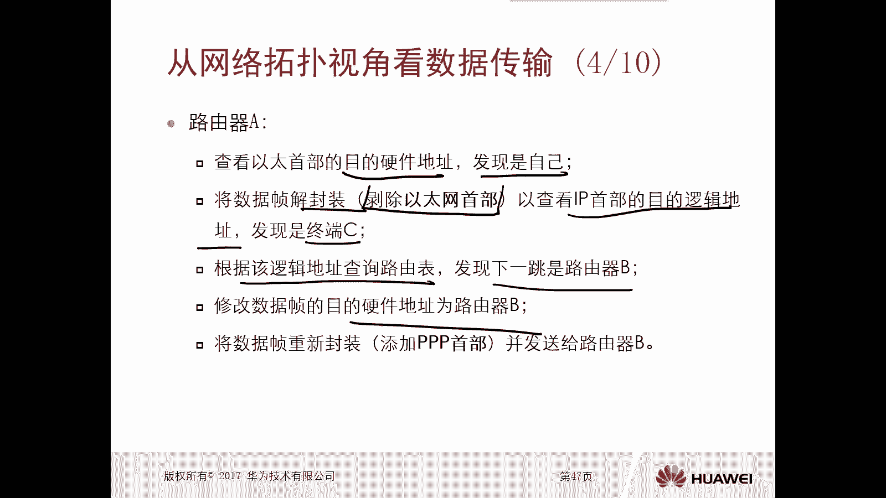

# 华为认证ICT学院HCIA／HCIP-Datacom教程【共56集】 数通 路由交换 考试 题库 - P6：第1册-第3章-5-实现数据传输2 - ICT网络攻城狮 - BV1yc41147f8

那么接下来呢我们再看一下，从这个网络拓扑的视角去看这个数据传输啊，所以我们看从这个全局角度去观察，这个数据传输的过程，你看从全局角度来讲呢，我们看这里面的例子是这个，假设B需要向这个终端C去发送数据啊。

那么B朝着C区发送出去，那么实际上B到C中间的链路呢，有各种各样的类型的内容，比如说有以太有P，那么你在以太链路上和在pp链路上，它的封装肯定是不一样的，对不对，最起码他这个封装。

那个头部肯定是有一点差别的，对不对，因为一个是以太以太的话，你在这个呃网络技术层，它的首部是以太网的一个首部，对不对，但是在PP链路呢就不是以太网的首部哎，这是一个全局的一个这个视角啊。

角度啊去观察数据传输过程。

那么我们接下来看一下中端B，那么中端B要发给中分C，那么B呢首先要从上而下的封装数据，以形成数据真，那么首先呢数据B是将数据对吧，在应用层面处理处理以后呢，是在传输层去增加TCP的一个手部。

那么目的用的是FTP，然后再在这个互联网层进行处理，加上一个IP，首部目的呢要进行寻址，最终呢在这个基层啊，技术层，网络技术层再进行处理，增加一个以太网的首部啊，目的的是6000，那么这样呢。

他就会将这个数据帧呢发给了交换机A，那么交换机A查看以太网首播的目的硬件地址，发现是路由器的A所以说理论上原理上来讲啊，交换机A它不会对以太网首部做任何的改动，而是直接把数据帧发给路由器AI。

发给路由器A好，那么当路由器A收到以后。

查询以太网的首部的目的硬件地址诶，发现就是自己啊啊，这样的话他就要将数据帧进行解封装，解封装呢其实就是破除以太网的手部，然后去查看IP的首部的目的的逻辑地址是谁，发现是终端C，那么发现是终端C。

那么根据逻辑地址查询图表，发现去往C的下一项是路由器B哎，那么这种情况下呢，它就会修改数据帧的目的，硬件地址为路由器B。

路由器B，那么因为和路由器B之间。

是采用PPP的链路啊，所以说他就会重新封装一个PPP的手部，并且把这个数据发送给B哎。

那么你看交换机和路由器A之间呢，是这个以太网链路，所以说交换机A发送过来的数据呢，它是以太网的一个头部，但是路由器A进行解封装以后，再处理完了以后要交给B的时候，由于A和B之间的是pp电路。

所以说呢它增加的是一个PPP的首部哎。

这是路由器A它的一个处理过程啊，那么就交到了路由器B，那么路由器B呢去查询PP的首部，它的目的硬件地址，发现就是自己啊，那么这种情况下它会将数据解封章啊，就是抛出这个pp的手部。

然后依旧是查看IP首部它的目的逻辑地址，发现它的终端的是C，那么怎么去往C呢去查询路表啊，查到以后呢，再去修改数据帧的目的，硬件地址为C，因为闭路器和终端C之间呢也是以太网。

所以说路由器在重新封装的时候，是增加了个以太网的手部啊，这样呢就发送这个交换机B。

那么交换机B收到以后发现以太网的首部呢，他的目的硬件地址是终端C，所以说交换机B呢就直接把数据转发给终端C。

那么终端C收到了数据以后，他要从下而上将数据进行解封章，首先去看以太网首部它的目的地址呢，是不是中间C方案是对吧，那么解封账号以后再去看IP首部目的地址，是不是中间C他也是对吧。

再次解封中发现他的TCP的守护是FTP，S级封装就交给了FTP这个应用啊，就是数据，这样的话最终的终端C呢就露出来了。

原始的一个数据，优秀的数据，那么从TCP和IP的模型的角度去观察，完整的工作流程，我们可以看一下啊，在终端B上边，他一定是经历了应用层，传输层，互联网层，网络接入层，一共是四层，对吧啊。

四个层次的完整的处理，但是到了交换机A，交换机A因为他是工作在网络接入层，所以说他只在网络接入层进行处理对吧好，那么到路由器B，路由器B呢是工作在互联网层，所以说路由器啊，路由器A啊，路由器A和B啊。

路由器A和B，那么他们要进行处理的这个层次呢，是首先是网络接入层，然后是互联网层对吧，进行处理，那么到了交换机B呢，依旧是只经过网络接入层的处理，最终到了终端C，终端C呢是一个完整的一个啊系统。

所以说他处理的时候呢是从上往啊，从下往上的一个顺序，那么呢是也是经历了四层的一个处理，那么终端B叫做封装对吧，终端C呢做解封装啊，那么中中间这些交换机设备啊，路由器设备呢也存在封装和解封装的过程。

唉所以说注意一下，那么不同的设备它的处理的层次啊是不一样的，你工作的第第第几层啊，你只能处理到这个层次，你高层处理不了了对吧，而且这些中中间这些终端的，中间的这种网络设备，它也不需要关心你的应用层。

传输层是什么内容对吧，我只关心基层是什么内容，我只关心互联网层是什么内容，对不对，好，就是从这个网络拓扑的视角去看数据的传输啊。

所以说本节本节的一个小节呢，重点一是封装解封装的意义和特点对吧，第二个是从终端设备去观察数据传输局部，从网络设备去观察数据传输局部啊，从网络拓扑去观察传数据传输是全局对吧。

思考一下列哪项陈述是不符合事实的，都选A封装操作会导致数据增加，这肯定是肯定是的，对不对，解封装操作呢会导致数据增加，是错的对吧，C发送方设备对数据执行封装，那就是对的对吧。

D接收方设备对数据执行封装应该是解封装，所以说答案是正确，答案是A和C，第二路由器为何被称为三层设备，A因为路由器工作在OSI参考模型的互联网层，啊B因为路由器工作在OSI参考模型的网络层。

C因为路由器工作在TCPIP参考模型的互联网，是因为路由器工作在TCPIP参考模型的传输，正确答案是B对吧。

