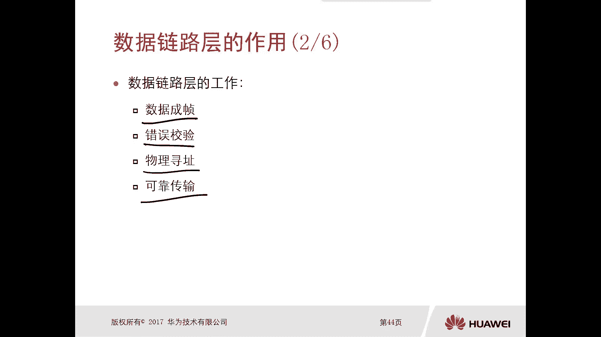
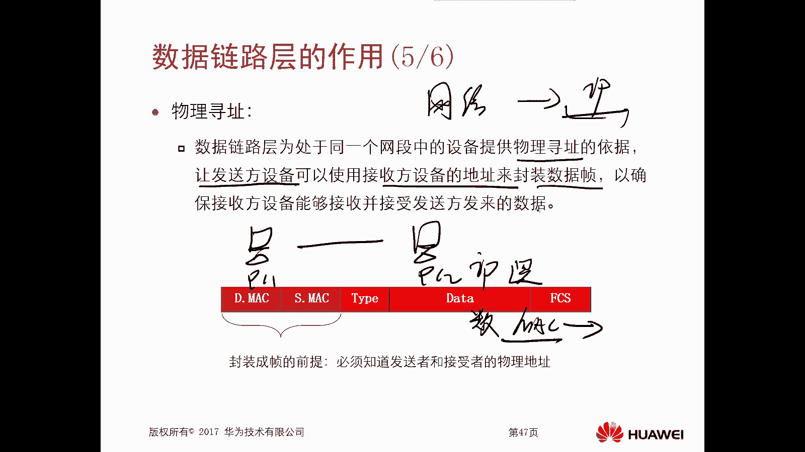
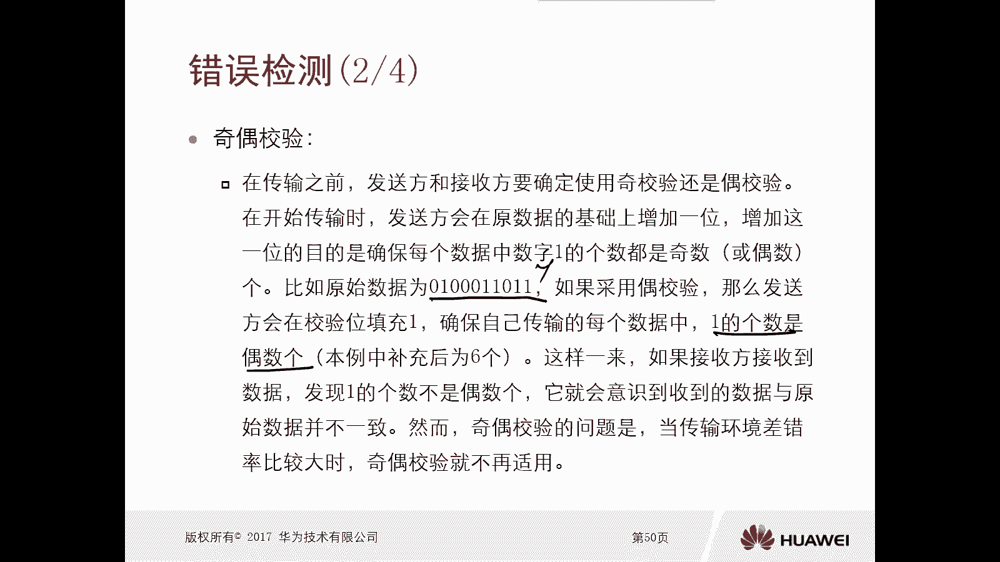
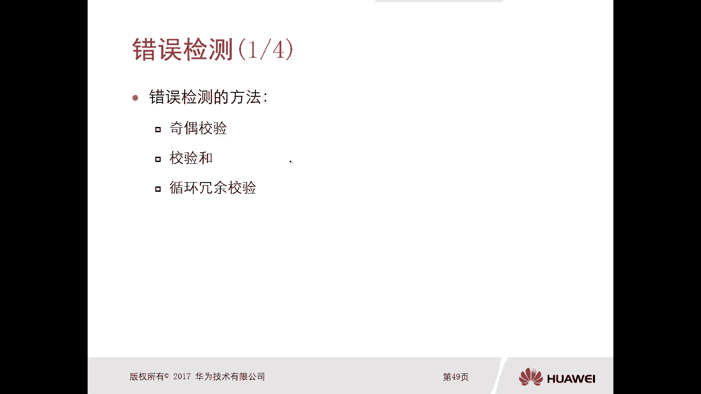

# 华为认证ICT学院HCIA／HCIP-Datacom教程【共56集】 数通 路由交换 考试 题库 - P7：第1册-第4章-1-数据链路层 - ICT网络攻城狮 - BV1yc41147f8

好那么接下来我们看一下这个数据链路层啊，那么本小节呢，主要是通过以下四个部分来进行介绍啊，第一个呢就是数据链路层的作用，那么虽然我们这个呢在前面章节里面，已经讲到过了对吧，但是当时讲这个分层的时候呢。

就简单提到了数据链路层他的一个概括对吧，对于他的详细的作用呢，嗯没有特别重点的去讲，第二个呢是错误错误的一个检测，对于数据链路层呢，它其中一个职责就是要去做这个数据，真的一个错误检测嗯。

那么后面呢我们还要去介绍链路的类型，那么常见的链路类型有哪几种对吧，包括介质访问控制组成，它的作用是什么好。

那么首先呢我们先看一下这个数据链路层，它的一个作用，那么前面我们在讲分层结构的时候哦，我们当时应该是举个例子，比如说啊这是PC1吧对吧，然后要和这个PC2去发送数据，那么发送数据的时候是由PC1。

从高到低的一个封装对吧，前面我们讲OSI7层的时候是从高什么应用层，表示层会话层，传输层，网络层啊，对不对，那么数据链接层物理层一层一层进行处理对吧，从高到低，那么到了PCPC2对于接收方。

它是从低到高的一个顺序去解封装，那么前面我们讲过封装和解封装了对，所以呢这个数据链路层的作用呢，是针对两个方向的，第一个比如说我如果对于PC来讲，它是从高层往下进行封装一分钟。

所以说你这个数据链路层的上层紧接着零层，而是是网络层，已经过网络层处理过后的是什么呢，叫做数据包，对吧，数据包，那么这个数据包呢是把它封装成帧，因为你在数据链路层要进行处理嘛，对不对。

是把网络层的数据包封装成真，然后再交给物理层进行编码和发送，那么前面我们介绍过对吧，从高到低嘛对吧，哎这对于这个我们发送端的一个设备来讲，那么对于接收方，比如PC2来讲，它是将从物理层收到的比特流。

因为你这个比特流出去以后，PC2收到肯定是先从物理层收到的对吧，然后在数据链路层呢把这个比特流处理给它，转化成一个数据帧，然后再交给上层的网络进行处理，这就是数据链路层的作用啊。

其实呢就是按照我们封装和解封装对吧，这个数据的一个顺序，那么数据链层它具体作用对吧，简单概括就是当你进行封装的时候，它是通过数据链路层，讲网络层的数据包去封装成数据真的。

然后再交给这个物理层进行编码发送对吧，但是对于你接收到的一个数据的时候呢，它是把比特流处理成数据真，然后再把数据帧交给我们的这个网络层，进行处理的诶，这是数据链路层它的一个作用。

好，那么接下来我们看一下这个数据链路层，它的一个工作的内容啊，这是你作为我们知道了对吧，然后他具体的在这个工作过程中呢，他要做哪些事情对吧，就是他职责什么，第一个呢是数据成真。

那么这个其实我们讲作文的时候已经提到过了，对不对，他就是把这个数据呢变成一帧，对不对，那第二个呢是做错误校验啊，第三个呢是物理的寻址，OK我们在网络层其实也讲到过寻址对吧。

但是那个呢是在网络层的一个逻辑的寻址，用的是IP地址，对不对，那么对于数据论证层呢，它有一个物理的寻址哎那么具体怎么做呢，我们往后看啊，最后一个呢是可靠成熟啊，那么这是他的几个重要的工作。

那么接下来呢我们就一个一个的去详细的介绍。

首先第一个是数据成真，那么我们讲当这个数据进行封装的时候，它是经过网络层的封装的数据，然后到达了这个数据流层对吧，就是你经过网络层封装过后，它变成数据包，然后到达数据链路层进行处理的时候呢。

数据链路层啊，这个协议啊，需要给这个数据包去添加上头部和尾部，你看我们这个胶片里边的这个图呢，实际上这个数据部分呢，我们可以认为是上层的数据啊，那这些数据都经过了，比如说我们的应用层，传输层。

网络层的处理，处理完了，我们都认为是上层的数据，然后在这个数据链路层进行处理的时候呢，实际上它是封装的一个头部和一个尾部，那么这个封装过后的结构呢就叫做数据帧，哎，就叫做数据帧。

那么数据帧呢一定是这个物理层执行编码，转换的一个数据，就是你经过这个数据链路层变成数据帧以后，接下来的一步，就是要在物理层上进行一个编码了，哎比如说我们变成那个比如说零幺，零幺这种比特流对吧。

在这个什么光纤链路上啊，不能是光纤链路，是这个网线链路上对双绞线路上进行传输，对不对，光线任务是光了就不一样了啊，肯定编码方式不一样，对不对。

看好，这是这是这个数据重镇啊，哎这是第一个，第二个呢是错误校验，因为我们这个信号啊，它在这个物理层传输的过程中难免会出现差错，你甭管是什么链路的问题啊，甭管还是设备的问题等等原因，对不对。

有可能会出现差错，但是因为位于这个物理层之上的，这个数据链路层，因此呢，这个位于数这个物理层之上的这个数据链路层，它需要去承担错误校验的功能，哎如果你有问题，那么这个数据那是不是不要传，要丢掉啊。

对不对，你有问题吗，有错吗，对不对，哎，所以说它的目的是确保交付给网络层的数据，真的是正确的，你要是错误的，你交往去这这也白工作，对不对，没用的，对不对，唉，所以说这个校验功能呢。

是我们这个数据链路层协议啊，需要给数据包封装一个尾部的一大原因，哎那么具体的这个错误校验啊，我们后面再去讲他的方法其实很多的啊，很多的嗯，一会我们再去讲他错误校验的方法啊。

那么接下来我们看第三个，第三个呢是做一个物理寻址，我们前面讲IP讲这讲这个网络层的时候，我们讲到了一个逻辑寻址的IP地址，对不对啊，那么当时我们说就类似于这个寄快递写信，这种这种方式啊。

你得知道对方的地址吧，哎这个呢是指的是逻辑地址，那么对于数据链路层呢，它也要去做一个寻址，它寻址就不再是逻辑性质了，而是一个物理的寻址，而物理的寻址，那么也就是说我给大家举个例子啊。

你比如说一台PC1对吧，然后连了一台，比如说PC2经过很长的啊，经过一个交换机吧，我们就这样讲对吧，PC1和PC2他们两个要进行通信的时候，PC1除了要知道PC2的IP地址。

这个IP地址就是网络层的逻辑地址对吧，那么他必须还要知道PC2的数据，链路层的地址啊。

就是数据链路层的地址好，那么这个地址呢叫做Mac地址，IMAC地址，那么对于这种Mac地址呢，是我们去生产这些网络设备，包括这些终端设备的时候，这个厂商他把他那个Mac地址，就会烧到他的接口卡里面。

理论上来讲呢，这个Mac地址呢是全球唯一的啊，那么后边我没有章节啊，专门去介绍这个Mac地址唉，这是一个硬件地址啊，你所有的设备，所有的这个网卡它都会有一个Mac地址，哎这个是烧进去的啊，就是固定的。

一般情况下是不会去更改它的对吧，一般情况下有些设备是改不了的啊，但是好像是有些设备是可以改的，但一般情况下不要不要进行修改啊，这个不用去改它的好，所以说呢我们得知我们得让这个发送方设备啊。

可以使用接收方设备的地址来封装数据帧，因为你进行数据封装的时候呢。

他要啊他要去做一个原木Mac的封装，原木Mac的封装，那刚才我们讲了，你数据链路层封装的时候，它封装的是一个头，那个头部里面最重要的是我得有原木麦克，就是你发送方的Mac地址和接收方的Mac地址。

这样的话你才能确保这个收方设备，能够接收并接受发送方发来的这个数据对吧，你你说我从我在网络层三层，不是在IP里边不已经设置它的IP地址吗，哎这个不行，哎，因为我们解封装的时候呢，是从底层开始解封装的。

先物理层，数据链路层，然后是网络层，如果说你的数据链路层，里边的原木Mac地址都不对的话，那么这个终端呢是不需要再向上进行解封装了，它IP就不看了，你IP是对的，有什么用啊对吧。

所以说你的原木Mac地址必须要对的，你发送方的接收方的到底是多少对啊，所以说这个呢是封装成真的一个前提，我必须要知道发送者和接收者的一个物理地址，那么对于这个发送者的物理地址，你肯定是知道的对吧。

你自己要发数据，你的Mac地址，你的物理地址，当然你很清楚，但是对于接受者的就是你的目标终端设备，它的物理地址你怎么获取呢，哎这个呢我们在这留个疑问，哎，就是目的方的Mac地址怎么去获取。

你肯定他肯定一开始不知道对不对，那么后面呢我们再去讲一个非常重要的协议，叫做ARP协议，那么后面我再去解释啊，OK好那么这里边还有个type类型。

然后是数据，然后才是FC校验，对吧好，那么校验呢一会我们再去解释啊，怎么去做错误校验，那么接下来呢我们看一下可靠传输，那么在物理介质的一个差，错率比较严重的情况下，通过确定和重传来确保通信的接收方。

接收到的数据，提供保证数据可靠传输的机制对吧，你比如说我这个差错率比较严重，那你丢掉了吧，那丢掉以后，那我得知道诶，这确确定这个数据确实被丢掉了，那你怎么知道啊，是不是我发送数据的时候。

他必须得有确保确信息对啊，我给你了，你有没有收到吗，你告诉我什么，如果说你没收到，你告诉我没收到，那可能是中间出问题了对吧，那我再给你重传一份嘛对吧，这样的话才能保证可靠的传输嘛，哎这是可靠传输好。

那么接下来呢我们就去介绍这个，错误检测的一个方法主要有三种，一个是奇偶校验啊，第二个是校验和啊，这个用的比较多对吧，第三个呢是循环的冗余校验好，那么呃其实我们呃除了这个数据链路层。

有这种错误校验的这个呃工作过程啊，其实还有其他的，比如说网络层啊啊比如说一些上层啊，也会有这种校验对吧，那么我们在后边再继续讲的时候，讲的最多的就是校验和好。

那么接下来呢我们就认识一下这三种方法，那么第一种呢就有校验哎，这个文字比较多啊，但是有必要去简单简单读一下啊，你看比如说我在传输这个数据之前，那么发送方和接收方要确定使用的是G啊，G校验还是偶校验。

因为奇偶校验码是两个对吧，然后在开始在开始传输的时候呢，发送方会在原数据的基础之上增加一倍对吧，原来数据是这样的。

它又增加一，那么增加这一位的目的是确保每个数据中，数字一的个数都是奇数或者偶数份，就是这个数啊，你比如说我们的原始数据，它给的是这样的一串，那这里边的一是123455个，如果你采用偶校验的话。

那么发送方呢会去校验位去填充一，这样的话就会确保我们这个一的个数呢，是一个偶数位，你看现在是这个五个嘛，你添加了E不就六个嘛，对吧好，那么这样一来，如果奇数方奇收到的数据，发现一的个数它不是偶数个。

你比比如说在在传输过程中，它出问题了，他丢了或者怎么着的，对不对，那他就会意识到哦，原来这个输的数据和原始数据它不是一样的，对吧，但是呢我们看这个奇偶校验的问题是，当传输环境差错率比较大的时候。

这个奇偶校验就不再适用了，你比如说我不是丢了一个，丢了俩呢对吧，你比如现在是六个。

我丢了俩，那四个那四个也是偶数啊对吧，那我说哎对接收吧，这种情况就完全体了，对不对，OK好，所以说这种那就不再适用了啊。

注意下还校验和这个校验和是用的比较多的啊，他什么意思呢，就是它教育和就是我发送方在发送数据的时候，先通过累加计算好数据的一个总的校验，和你发这些数据，我把数据一般是通过二进制的一种方式算法。

他这个算法还是比较简单的啊，这个交换和它就是对这个16位的二进制数啊，进行一个反码求和对吧，哎哎得到一个数字呢叫做校验和的值，然后呢，他就会把这个值啊封装在这个数据里边对吧，数据的外部数据外部。

然后发送给这个接收方，那么当这个接收方收到数据以后呢，他使用同样的这种算法进行计算，然后如果说你这个数据在传输过程中，没有出现问题的话，那么接收方呃，因为它的计算是一样的啊，所以技术方他算出来的。

它这个校验和的值和你这个数据携带，这个校验和的值是一样的，那表示这个数据在传输过程中它没有问题，但是如果说发现他两个不一样，那就是有问题了吗，对吧，哎这是这个校验和这个校验和用的比较多的啊。

我们后边讲一些协议的时候，都会讲的教育和教育和校验和是吧，当然这个校验和的方法呢，可能这个不是这么一种啊，还有其他的方式啊。

OK好，那么第四个呢是循环冗余校验，那么循环的冗余校验呢，这种检测方式呢主要是借助多项式除法，来判断数据在传输过程中是否出现了差错啊，如果说被发送数据和一个附加比特，那么这两者所组成的函数呢。

能够被系数的次幂的多项式整除，说明数据在传输的过程中是没有遭遇修改了。

所以说你你你看啊，这个甭管是第一种，第二种还是第三种。

它其实呢就是通过一种算法去计算出来，你传过去是什么样的，到时候对端再进行一次计算，如果一样或者怎么样的对吧，符合某个规则标准，那么说明是OK的对吧，唉就这样了，那包括我们后期学安全的时候。

安全里面大部分内容也是这样的，你你怎么去判断，判断一个数据在传输过程中它的完整性呢，一般呢也是做一些什么校验，做一些这个什么哈希啊之类的。

对不对，哎都是这样的，OK好。

