# 华为认证ICT学院HCIA／HCIP-Datacom教程【共56集】 数通 路由交换 考试 题库 - P8：第1册-第4章-2-链路类型及介质访问控制子层 - ICT网络攻城狮 - BV1yc41147f8

好，那么接下来呢我们介绍一下这个链路的类型啊，那么从这个物理层的角度看呢，那么连接设备之间的介质呢分为两种，第一种呢是共享型的这个介质，但是共享型的介质呢，我们需要解决如何找到对方和如何避免冲突。

这两个问题，哎那么一会儿我们会去介绍共享型的介质，它是什么样的一种这个工作方式啊，那么第二种呢是点对点的连接，那么双方独占通信信道啊，那么现在我们嗯这个基本常用的这个设备啊，都是这个点到点的这种链接啊。

就是双方独占通信信道这种，因为这种呢它的效率会更高一些，呃当然这个讲这个双向通独占通信信道之前呢，我们得去介绍这个共享性，要不然我们没法去想到它们之间的区别啊。

好那么接下来我们先看一下这个嗯hub集线器。

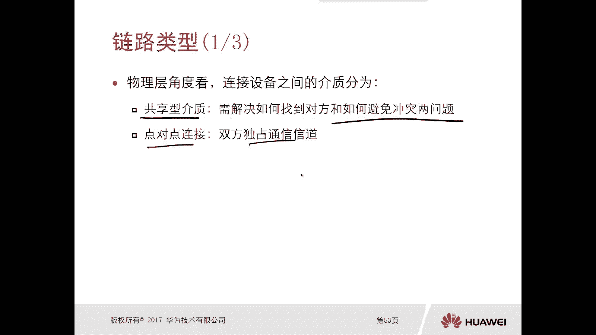

那么这是一个早期的一种网络设备，这个设备呢它是一个物理层的设备，哎它是一个物理层设备，它的目的呢就是我收到数据以后呢，我再从其他端口转发出去，所以说对于极限性来讲，它是一个典型的共享型的一个介质。

那么它一个接口收到数据，它会从除了这个接口以外的，其他接口都转发出去啊，都是这样的，所以说对于集线器连接的设备呢，它都属于同一个冲突域啊，都属于冲突域，那么什么叫做冲突域，那么冲突域呢其实就是这样的。

就是当我发送数据的时候，比如说这个终端一发送数据的时候，那么你终端二终端三，终端是终端五，终端六，你不能发送数据，如果说你没发送数据，那么有可能我没发送数据的时候就会冲突啊。

就是你这个终端一发送出去的数据就会冲突，那么冲突以后呢，那么这种情况下可能就会出现丢失了，就会有问题，所以说你在一个网络环境里边，如果说你所有的设备都处于同一个冲突域的话，那么就会有这种数据的冲突。

所以说它的通信的效率就比较低了啊。

比较低了好，那么接下来我们看一下另外一种网络设备，叫做交换机叫switch，那么switch交换机呢是建立的点对点的连接网络，那么它是隔离了冲突域啊，你比如说我主机A和主机C进行通信。

会影响到主机B和主机C，主机B和主机A通信吗，不会啊，不会的，你像之前如果是一个hub的话。

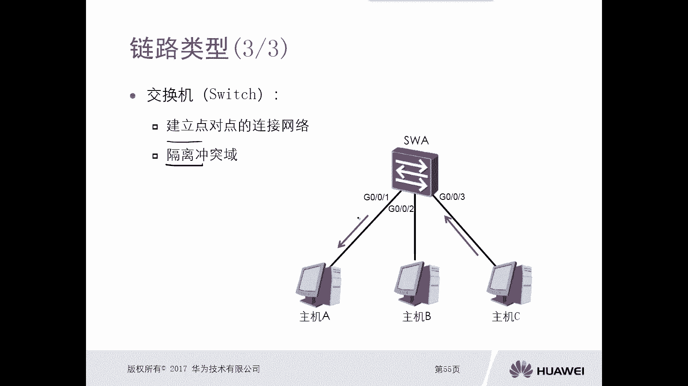

那就不行对吧，你你终端一你甭管和谁通信，其他的都会受到影响。

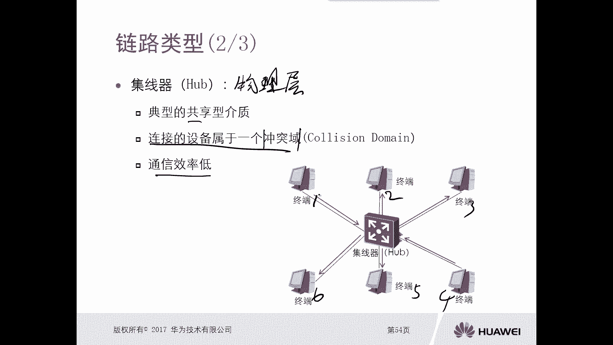

唉所以说这种交换机中网络设备呢就提过去，提高了我们这种交换网络里边，它这个通信的一个效率，那现在我们在交换网里面的大部分，不能说大部分应该叫做全部，全部用的是这种召唤机器设备，不再用hub了。

很不hub很少见了对吧，你像我从这个07年，我就开始这个接触到网络嘛啊，那么包括后之前的一些工作啊，包括现在的一个讲课啊对吧，我没见过哈巴。

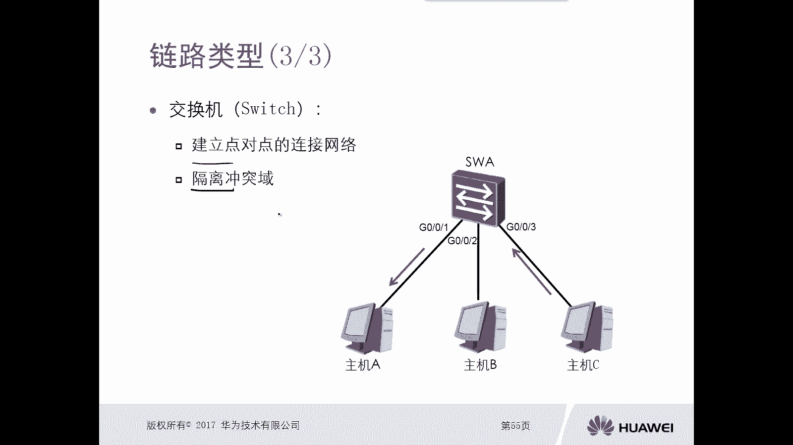

没有见过哈巴，OK好，这是一个交换机啊。

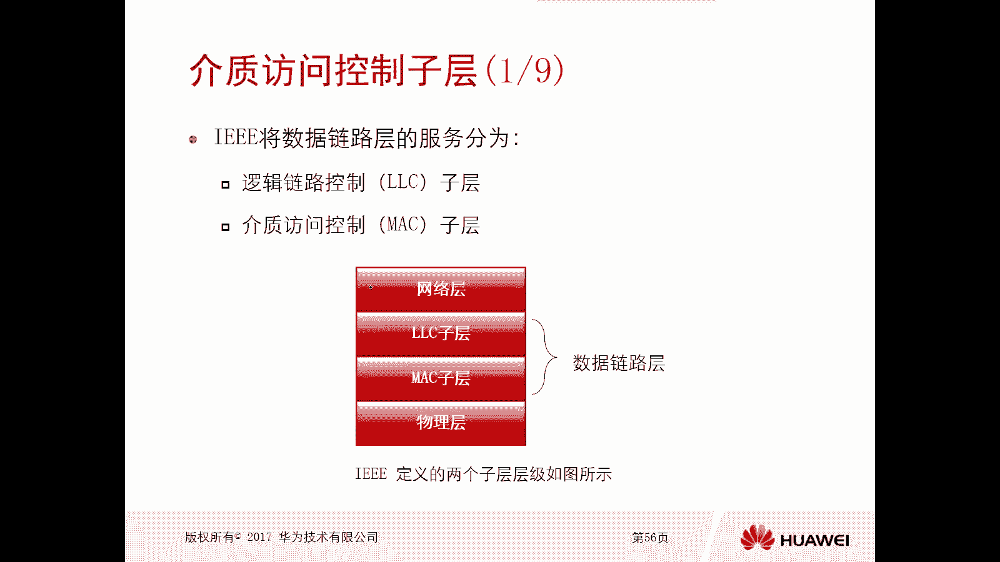

好，但是我们刚才看到，早期呢是没有这种交换机设备的。

它只有这种集线器设备，那么机器设备可能在这种典型的共享行，这种机制里边呢，所有连接的设备呢就会处于一个冲突域。

那么冲突欲呢我们要解决什么样的问题呢，需要姐姐如何找到对方，和如何避免冲突两问题啊，就是我们要想办法呀要解决对吧。

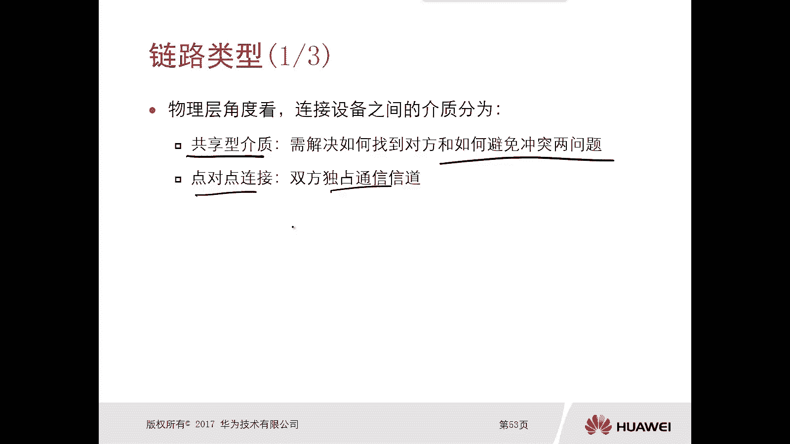

这个呃网络中他如何有序的去收发数据。

如何实现相互寻址等等，这幅对吧，所以说呢这个i trip e呢，他就将这个数据链路层的服务呢，就分了两个层次，两个子层啊，一个叫做链路，叫做逻辑链路控制子层，Lc，一个是一个叫做介质访问控制子层啊。

max哎大家注意一下，这是这个数据链路层，HPE呢给它定义了两个子长啊。

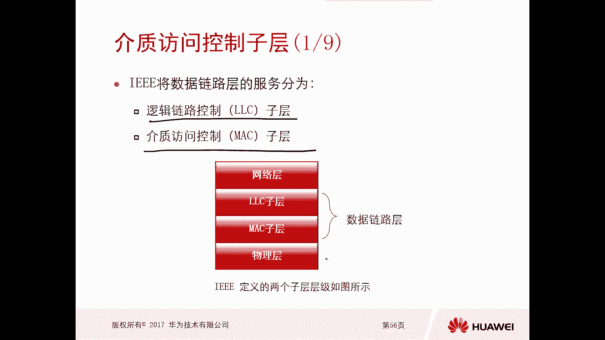

两个子层好，那么第一个叫做逻辑链路控制子层，LC子层，那么这个呢是与网络层相接的，你看网络层紧接着是LC子层，那么它的目的是为不同的max层协议，与网络层协议之间去提供统一的接口。

并且提供流量控制的服务，哎那么这里边这个子层呢，这个LC子层呢它是有目的的，目的浮点叫DCAP，还有原服务访问点。

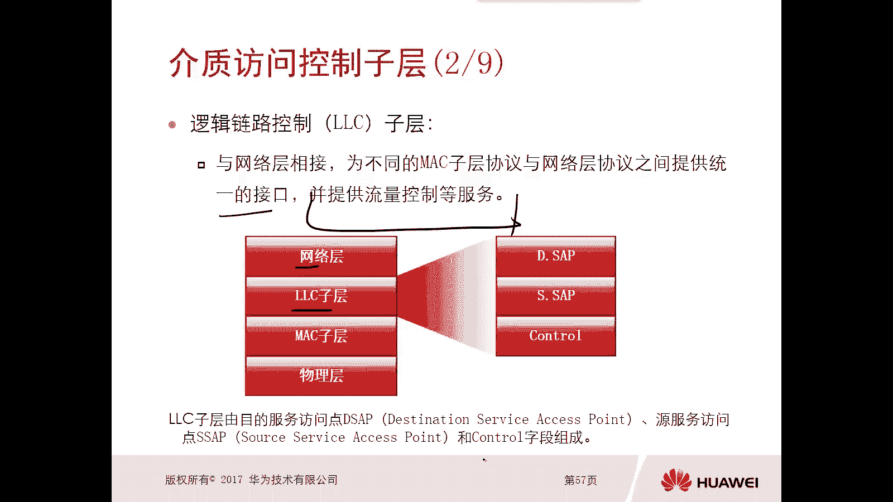

哎，就是这个LLC层，那么另外一个呢就是介质访问控制层叫做max层，那么这个呢是与物理层相接的，他的目的就是为了统一这个X子层协议，和不同的物理层介质之间的，一个啊这个提供沟通的这种媒介啊。

啊并且执行与硬件有关的这个服务啊，包括比如说我们共享网络中，去实现这个资源分配啊，让通信可以适应不同的传输介质啊，实现数据的寻址啊，都是在介质访问控制图层。

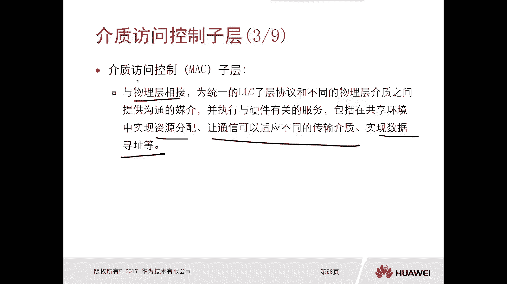

就是max层实现的好，那么从逻辑上看呢，这个保证共享介质不会出现信息冲突的方法呢，主要是由以下两种啊，那么前面我们也介绍到了这个共享介质，共享介质里边，那就会出现这种信息冲突。

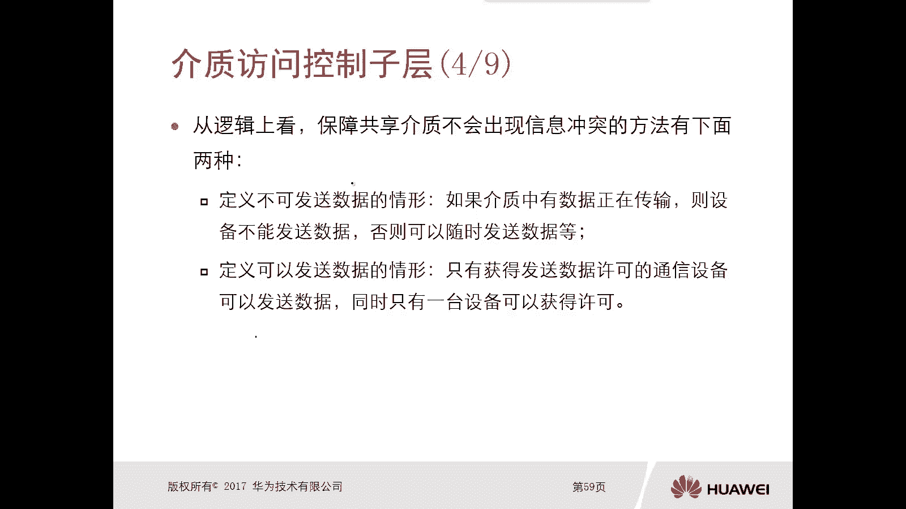

就会造成这个通信效率比较低，所以说这个IEEE呢，他把这个数据链路层呢又划分了两个子层，划分两个子层，刚才的刚才我们也讲了。

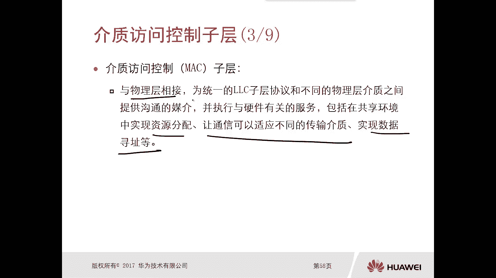

他的目的呢就是在这种共享介质里边，去制定一些明确的规则，让我们这么多的设备，你有序的去发对吧，你之前如果你之前为什么有冲突，就是有可能无序的罚，你也罚，我也罚，他也罚，就会出现冲突。

那现在我制定一些规则，让你们进行有序的去发送，那么就不会有冲突了嘛，对不对，唉所以接下来我们看一下这个呃，保证共享就是不会出现信息冲突的方法啊，那么有哪两种，第一个就是我可以去定义不可发送数据的情景。

比如说某种情况下，你是不能发送数据的，在这种情况下，只有可能有一个人在发送，那么其他人不发，那么就不会有冲突对吧，哎我们我们看一下，如果建设中有数据正在传输，那么这个设备呢你就不能去发送数据。

否则可以随时去发送数据等等对吧，因为有人在发，你不要去发，你发的话就会有冲突啊，因为我们是共享介质啊，唉这是第一种是定义不可发送数据的情形，第二个呢是定义可以发送数据的情形，比如说在某种情况下。

你是可以去发送数据的，而且同只能有同一台设备可以获得这样的许可，你想如果说你定了发送数据的情形，那同一时间有多台设备都可以去发，那不就有问题了嘛，对不对，所以说呢只有获得发送数据许可的通讯设备。

是可以发送数据的啊，同时呢只能是一台设备可以获得许可，所以根据这两种大的方法。

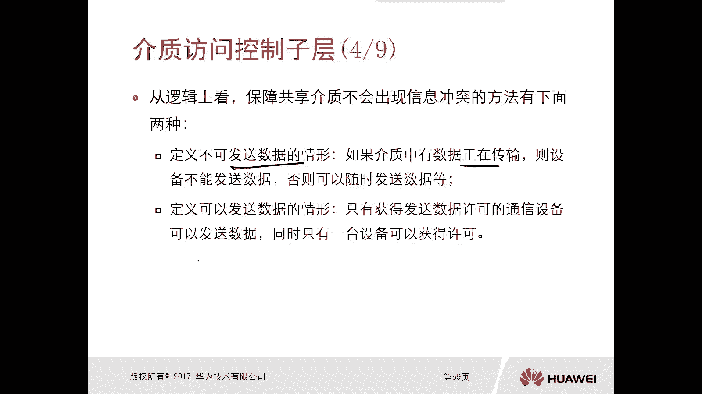

我们看一下常见的在共享介质里边，常见的冲突的避免技术有哪些，第一种载波侦听多路访问冲突检测，叫做CSM杠CD啊，第二种呢是令牌桶，第三种呢是在无限的网络环境里面去使用的，叫做载波侦听多路访问冲突避免。

那么我们前面这两种，都是在有限的网络环境里面啊，就是有限的这种嗯共享限制里边，那么对于后面这种呢，是在无限的这个网络环境里边啊。

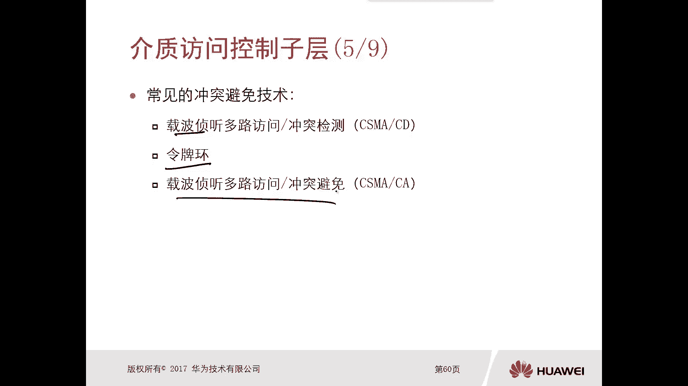

那么接下来呢我们一个月去介绍啊，第一个我们先看载波侦听多路访问冲突，检测CSA杠CD，那么在共享式的网中呢，我们不同主机同时发送数据的时候，就会有这种信号冲突的问题对吧。

但是呢我们可以定义不可发送数据的情形，来避免冲突，那么对于CSM杠CD呢，它的工作原理非常简单，就做一个总结，就是先听后发，边听边发冲突停发啊，随机延迟后重发，这个是什么意思呢，先听后发的是。

我们在这里边共享介质里面，使用了这种CSM杠CD，那么所有的主机在进行发送数据的时候，他先要去监听，在这样的一个共享介质里边有没有冲突唉，所以叫做先听后发，如果没有冲突，我才发。

而且他在发送的时候边侦听看看有没有冲突，一旦检测到有冲突，立马停止发送，然后呢随机搞一个延迟，哎，这个延迟过后哎，发现这个这个这个共享在里边，我我我在监听啊，又没有冲突了，又没有人在发送数据了。

我再重新发送，这就是CSMACD的工作原理，非常非常简单，它就是一边听一边发，只要有冲突，他就不再发了对吧，然后随机延迟，然后再发啊，所以说他这个总结的比较到位的。

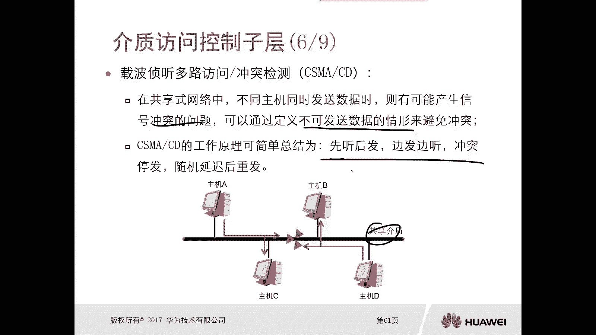

比较精简的啊，来看这是这个CSM杠CD，那么第二种呢是令牌环，令牌环，令牌环的话是通过一种定义，可以发送数据的情形来避免冲突的这个技术，那么对于一个环上的设备或者叫某个站点，他收到一个令牌后。

那么大家注意下，在这种令牌环的这个网络环境里边啊，是所有的站点他会按照顺序收到这个令牌，这个令牌的话就是按照这个顺序啊，就是就是来回的去传递的对吧。

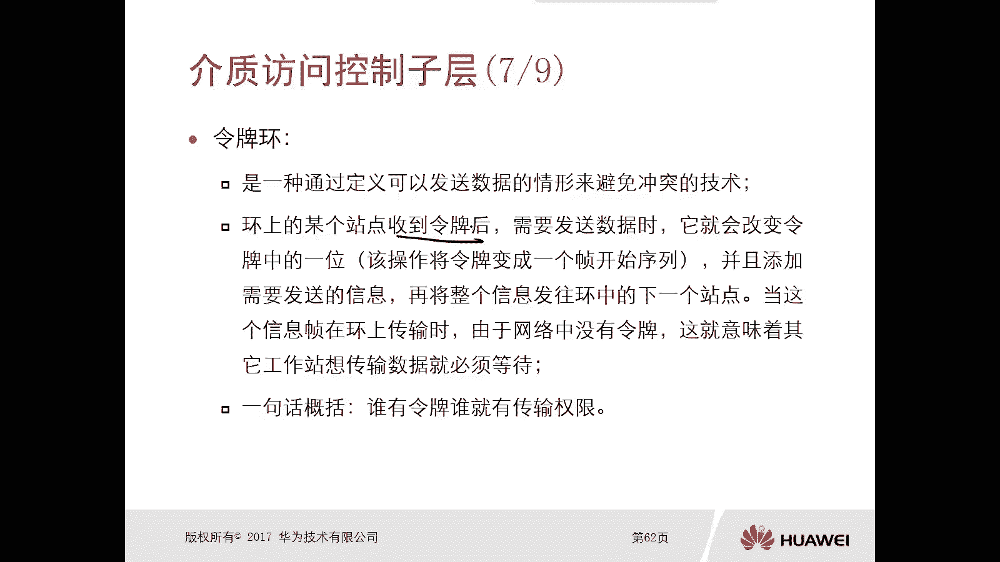

你比如说我有好多设备，一圈设备啊，这有个图的，大家可以看一下啊，你比如说我有客户端123456，那么这个令牌环呢，它就会在这个按照这个规定时间啊，在这个客户端123456，123456之间进行一个传输。

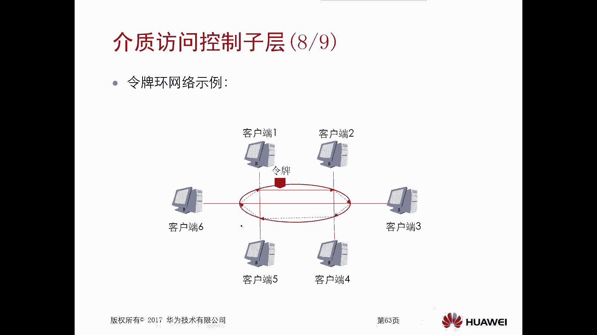

进行传输对吧，哎那个谁拿到这个令牌，令牌还就这个令牌啊，谁拿这个令哎，你可以你有权限去发送出去，如果说你没有拿到令牌，你有数据你也发不出来，哎所以说呢你看啊还上了这个某节点，输入令牌以后。

需要发送数据的时候，他就会改变令牌中的一位，那么这个操作呢是将这个令牌变成一个针，开始修序列，并且去添加需要发送的信息，然后再将整个信息发往环中的下一个节点好，那么当这个信息在呢在环上传输的时候。

由于网络中你没有令牌环，没有这个令牌，对不对，那就意味着其他工作站想传输数据，就必须要等待，所以说一句话概括就是谁有这个令牌，谁就有权限传输，但是有人就讲了，如果说我有令牌。

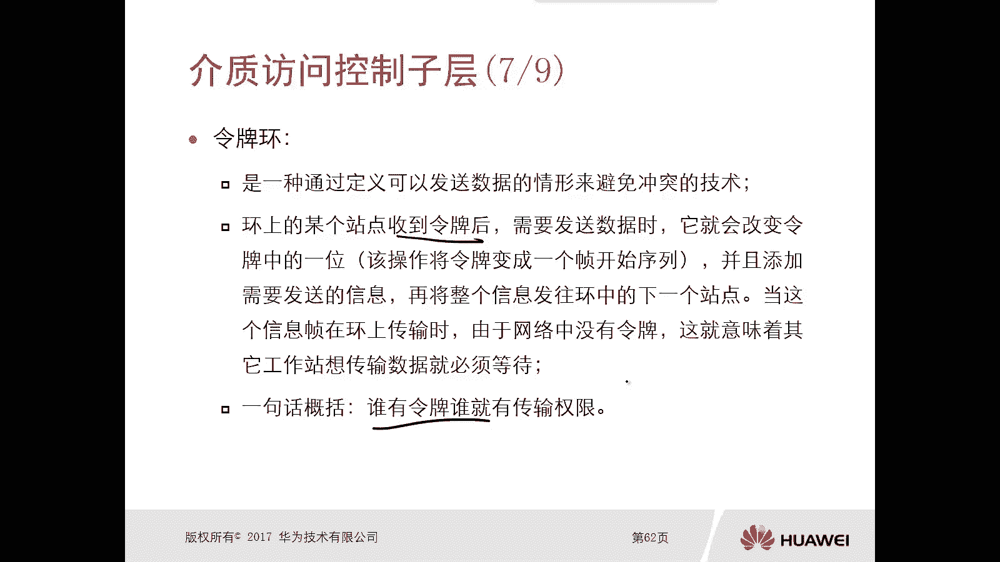

我没有数据要发送，那这个令牌你就发到另一个节点，那下一个节点拿到令牌以后，可能他要进行数据的发送了对吧，他发完以后再把令牌交给另外一个客户哎，以此类推，你拿到令牌就可以发，没有令牌就发不了。

所以这个呢是从这个唉叫做定义，可以发送数据的情形来避免冲突。

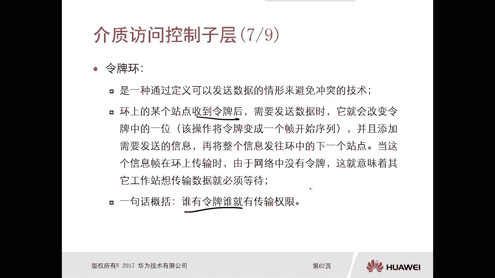

那么在同一时间，是不是只有一个设备能够拿到这个令牌，对不对，那这种情况下，是不是只同时只有一台设备再发出去。

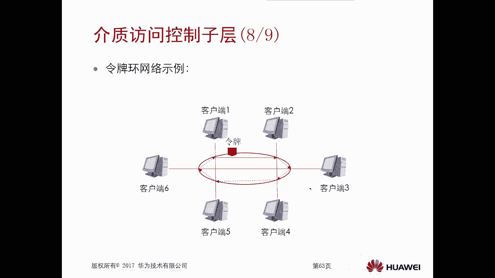

那就不会有冲突啊，好那么另外一种呢是载波侦听多路访问冲突，避免叫做CSM杠CA，那么这个呢是用于这种无限的局域网，局域网环境里边啊，去做一个冲突，避免技术的啊，那么这是另外另外一种啊。

通过这个定义不可发送数据的情形，来避免冲突的技术的啊，那这个什么意思呢，就是除了我们发送第一个数据帧的设备，你可以在检测到信这个信道空闲的时候，仅仅是经历了一段短暂的时间间隔，就可以发送数据增值外。

其他设备及时检测到了信道空闲，也必须要随机回退一段时间来避免冲突，唉这个和这个CSM杠CD就不一样了，对不对，那个我们是它有检测，只要有冲突就不发，只要有空闲就发，对不对，哎这个不是的。

就是这个是当你发送的第一个数据站，你发送完了以后，你检测信息到空闲的时候，哎你会经历一个非常短的时间间隔，继续发送数据，但是其他设备呢它检测到空闲以后，他必须有回退的时间来避免冲突。

好那么这个设备在回去时会设置一个计时器，等待过程中只要检测到这个信道被占用，因为你看啊，比如说你第一个数据帧发送，第一个数据进的设备，你发送完了，然后检测到这个信呢是空闲的。

然后你紧接着经历了一个非常短的时间间隔，又开始发送数据了，但是其他的设备呢，它那个计时器要比你长对吧，他们等待过程中，就会检测到这个信道已经被占用了，这时候他会暂停计时，吸到计时啊。

待这个计时器倒计时结束，再执行数据中的一个发送对吧，只要有占用，他就暂停，没有占用，继续到意识到计时结束以后再发生，哎哎这是这种载波侦听多路访问啊，然后冲突避免cs a m AC a。

这个就是介质访问控制市场啊，里边避免在这个共享网络环境里面如何实现啊，这个规则去避免冲突。

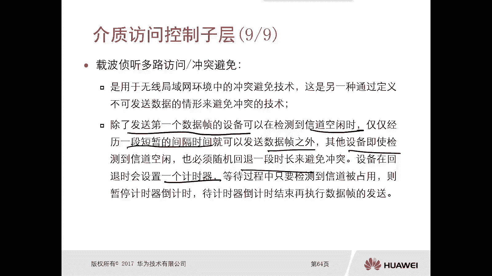