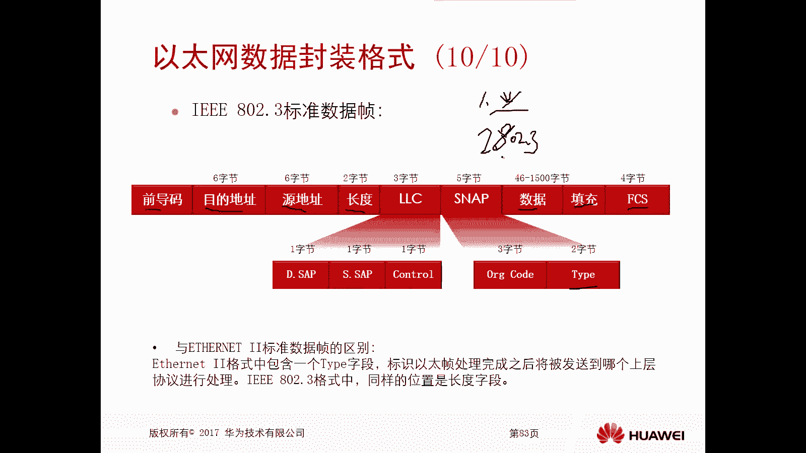
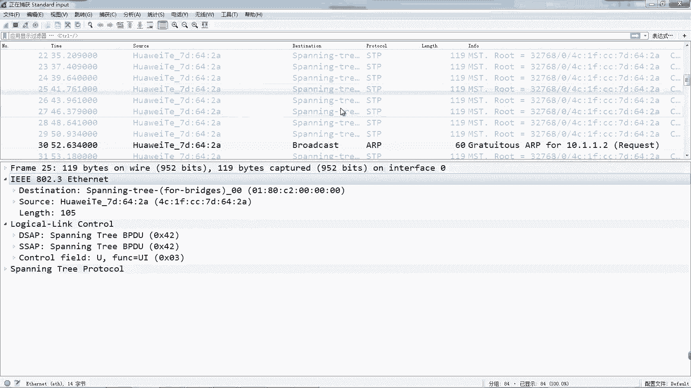
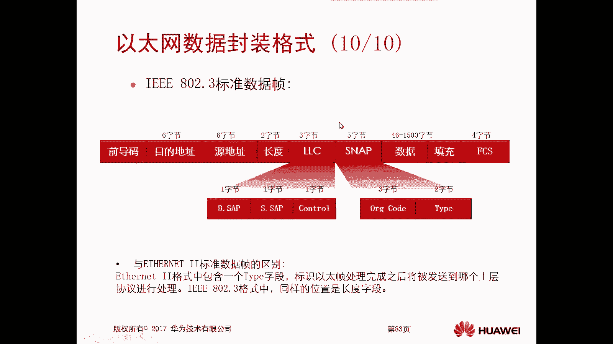

# 华为认证ICT学院HCIA／HCIP-Datacom教程【共56集】 数通 路由交换 考试 题库 - P9：第1册-第4章-3-以太网协议概述及以太网数据封装格式 - ICT网络攻城狮 - BV1yc41147f8

那么接下来呢给大家介绍一下，这个以太网协议啊，那么本小节呢，主要是通过以下三个部分进行介绍，那么第一个部分呢就是以太网的概述啊，包括它的一个产生啊，它的发展啊，那现在我们目前这个网络上用的最多的。

就是这个以太网啊，第二个呢是以太网的数据的一个封装格式啊，那么我们最常见的这种以太网数据封装格式，一共是两种啊，那么比如说以太to啊，80203以太啊，那么它具体的封装格式长什么样啊，我们一会儿看一下。

那么第三个呢是这个Mac地址的简介，那么我们在上一节呢我们实际上已经讲到过了，在数据链路层里面呢要做一个物理的寻址，那么物理寻址寻的实际上就是Mac地址好，那么首先我们看这个以太网的概述。

以太网的由来和发展，那么1973年呢，是由这个ROBERTMACOFT，在这个施乐公司的一个帕洛阿尔托研究中心啊，用这个粗同轴电缆去搭建了第一个局域网，而且他这个当时的网速是2。94兆每秒。

对当时来讲呢，这个已经是很快了，对不对，很快了，OK好，那么他将这个网络用以太做命名啊，那么以太网的历史呢就由此开始了，是在1973年开始的，1973年好，那么几年以后啊，DEC英特尔和16公司。

共同制定了十兆每秒速率的以太网标准，那么目前呢被称为这个以太to标准，那现在我们这个在呃网络上进行传输的，这个数据，它的封装格式啊，啊我们这些这些业务数据啊，全都是以太兔啊，全都有太多，那刚才你讲的。

比如说还有个802。3以太吗，那么802。3以太在哪用呢，一般呢是在我们的一些这个交换网络环境里面，的一些协议会用八两院算以太好，那么1983年呢，IEEE就是IEE，i triple e802。

3标准出炉啊，那么这个标准呢是对这个以太兔标准呢，进行了少许的修改，那么希望通过这种方式啊，重新去定义以太网的标准诶，这是我们这个IHQE802。3啊，两个标准，一个是以太兔。

一个是i trip e02。3标准，那么对于以太网的一个分类呢，其实我们前面也简单介绍过啊，一个是共享型的以太网，一个是以太交换型的以太网，那么共享型的以太网呢有什么样的特点。

第一个特点呢就是同一冲突域，同一冲突域啊，那么在共享以太网里面呢，所有的设备呢它处于同一个冲突域里面啊，那么只要有一个设备在发送数据，那么其他设备是不能发送数据的对吧，那我们在上一节呢也讲解了。

如何在冲突域里面去保证终端设备有序，在发送数据呢，那么我们有一些技术对吧，那么主要是通过CSMA杠CD啊，这个技术去检测和避免冲突的，那么随着这个冲突域的增大啊，那么网络的性能就会随之降低啊。

所以这种共享型的以太网呢，实际上已经处于一个淘汰的这个趋势了，或者说已经被淘汰掉了对吧，那现在我们进行组网的时候，那么全都不会使用这种共享型的以太网络啊，那么早期呢。

你比如说我们这有一个以太网的一个实例，那么早期我们有一款设备叫做集线器hub，我们前面也讲到过的对吧，那连到hub上的所有的客户端，它们都属于同一个冲突域，但是随着我们网络设备的发展啊。

包括这个冲突域它的一个缺陷啊，那么我们现在基本不用去前期的，我们用的都是交换机啊，对啊，哎所以说呢交换型以太网，它采用的是这个交换机去隔离冲突域的啊，那么它冲突域就会减小啊，减减小，那么进行隔离啊。

那么通信各方两两通过独占媒介进行通信，那你两个通信的双方在进行通信的时候，会不会影响到其他人通信呢，是不会的对吧，是不会的啊，那么这样呢这个网络性能呢就比较高效了，哎这是我们交换型的一套。

那么接下来呢我们就去看一下，刚才我们介绍到的这个数据对吧，它的两个标准，一个是以太to这个标准，一个是802。3亿，它的标准，那么我们看一下这两个标准，它的一个数据的封装格式有什么不同啊。

那么首先我们看这个以太兔，以太兔呢，这个标准是定义的数据封装格式如下图，首先呢它这个数据封装啊，那么有一个前导码，还有一个清扫码，然后紧接着是六个字节的目的地址，六个字节的原地址。

OK这个地址呢指的就是Mac的一，就是我们在数据链路层中，在数据链路层中啊，他要封装的一个物理地址，要寻址吗，我们前面讲过的不好，那么紧接着是两个字节的类型啊，然后数据和填充字段呢。

是占到了46~15004节不等，那么我们会去解释为什么是46，不是56呢，最后呢是f cs是一个校验，是四个字节，所以说你整个的一个以太to的啊，以太to的哎，这个数据帧的长度呢。

那是64~1518字节之间啊，你加一下嘛，46你加上所有的对不对，然后1510加所有的，一共是64~1518这些键好，那么接下来呢我们就一个人去看一下啊，首先看这个前导码，前端码是七个字节组成的。

而且它是固定的啊，10101010，那么在七个字节的前代码之后呢，之后的下一字节而被称为真起始定义符，这个字节也是固定的，是10101011啊，这八个字节的目的是为了通过编码。

让一个以太网数据帧的开头部分，表现为有规律的物理信号啊，以便去提醒这个收方设备啊，说OK那这个我们拿了个数据帧，我们要同步时钟，这是真起始符的最后两个定义呢，最后两位的定义是幺幺。

这是为了告知接收方在这两个比赛之后，即为以太网数据间的下一个阶段开始了啊，其实说白了就是你这个前导，包括你这个定价，否则最后两个位对吧，目的就是告诉接收方，哎这有数据进来了对吧，哎这是一个。

那么这个进去完了以后，接下来是下一个数据点哦，那就是这个啊，这就是前导符，前导码，前导码，它是那么以太网数据帧头部封装的一个，前端码和真，其实订阅服务各位的一个数值，大家可以看一下前导码的定义。

一共是七个字节对吧，七个字节每个字节都是固定的，然后真七是伏是一个字节，一个字节101010，那么最后两个V呢为幺幺啊，这是一个字节的这个真起始定义符啊，好那么接下来是这个目的地址。

目的地址呢是由六个字节去组成的，它们的作用呢是标识数据帧的一个目的设备，对吧，你比如说我一个PCA，要朝着PCB去发送出去，那么在PCA上，你要去封装PCB的一个目的地址啊。

这个有点类似于快递包裹的收件人的地址啊，但是我们后边你讲这个网络网络层地址的时候，就是IP地址的时候，这个IP地址也有点类似于收件人类的啊，但是他俩是两个层面，一个是数据内容层，一个是网络层的啊。

不那么原地址呢也是六个字节，那么它的作用是标识你数据帧的这个始发设备，那刚才我举的例子，比如说PC朝着PCB去发，那么PC进行数据链层进封装的时候，那这个PCA呢，他要封装上自己的这个原Mac地址。

是表示诶这是谁发出去的，那么类似于这个快递包裹里面发件人的地址啊，好就是这个原地址好，那么类型类型呢是由两个字节组成的，那么它的作用主要是为了告知对方设备，这个数据帧在网络层使用的是什么协议。

进行封装的啊，那么这样的话，以便于这个接收方选择同样的协议，来对这个数据帧进行解封装，因为你用哪个协议对他进行封装，你必须要用哪个协议对它进行解封装，不一样的嘛，对不对，哎，那么类型呢我们最常见的。

比如说0X0800，0X表示是后边这个数是16进制啊，0800哎，0800，那么0800表示它的网络层的协议，用的是IP协议，那么这样的话你接收方收到以后，他要用IP协议对这个数据进行封装。

而且封装对吧，那么还有一个最常用的是0X0806，这个是ARP协议ALP写啊，那么这两个最经常用啊，当然还有其他的这个斜类型啊，这是两个比较重要的比较基础的啊，0800和0806也希望大家把这个记住啊。

好紧接着是填充，那么以太网里面是有标准的规定的，它是一个以太网，数据呢是最小的，长度是不得小于64个字节的啊，那么也就是说它的数据部分，刚才我们看到了是不能小于46个字节。

但是如果说你数据部分不足46个字节，那很有可能哦对吧，你比如说有一些小的数据，它可能用不了46个字节，那么这种情况下你得把它填充到46之间，那么填充呢，就是用填充字段来进行一个填充的啊。

那么这样的话就可以让它满足最小长度，这样的要求，但是这个问题就来了对吧，为什么在以太网数据帧里边，它有最小长度，为什么不得小于64呢，或者说它的数据部分为什么是46呢，对吧，OK我们看一下它的解释。

定义最小包长呢目的是在我们共享网络环境里，我们共享式的网络环境里面，它有一个CESMCD，那么这个CSM杠CD呢去检测的时候，它是有时间的，对不对，如果说你不定义这个最小包长，很有可能CSM杠CD。

它检测的时候没有足够的时间可以检测到冲突，所以定义最小包场的目的呢，就是实现CSM杠CD在检测的时候，有足够时间可以检测到冲突，你比如说在下面举了个例子啊，大家可以看一下啊，比如说主角我简单画一个图吧。

这是主机A要，然后在这个网络环境里边呢，他可能有一个主机B，好那么主机A呢他发送的帧很小，很快就可以完成这个真的发送，但是呢比如说这两台主机它距离很远，那么在主机A发送的帧传输到主机B的前一刻。

主机B开始发送数据，因为主机B他不知道这个共享网络里面，有没有人在发，因为他没有收到嘛，对不对，所以主机B就开始发红灯，那么这样呢当主机A的真到达主机B的时候，主机B呢就检测到了冲突。

于是呢就开始发生这个冲突信号啊，但假如在主机B的冲突信号传输到主机A之前，因为你主机A发送的真显小啊，主机A的J呢已经发送完毕了，那么这时候主机A虽然他得到了冲突信号对吧。

但是他不认为是自己数据发送的时候，产生的冲突对吧，他会认为自己已经发动成功了，因此在这种情况下，必须有最小包长的限制，那么这个最小包长呢，是我们这个网络的设计者们经过了大量的论证，大量的实践。

最终得到的一个最小值，就是在这个最小值里边，不管你的网络是什么样的对吧，只要有冲突，那么是有足够时间去检测到冲突的对吧，你不要说我发着发着发完了，然后才有冲突，我不认为是我的一个冲突，对不对。

我认为是发展成功了啊，那么有这样小的一个限制呢，就是你在发送过程中一定是能够检测到冲突啊，这样你才能够对吧，停止发送，看好这是这个以太网之间的最小长度，为什么是不得小于64的一个原因，这个很重要哦。

你看，好然后呢是这个FCS这个校验，FCSS校验呢它是由四个字节组成的，那么这个字段会封装的数据线的尾部，刚才我们看这个格式也看到了，他的目的就是对啊，就是供这个对端设备啊，去检验他收到的数据帧。

是否和发送方发送的时候一致，如果是一致的，表示这个数据在传输过程中没有出现破坏嘛，对吧哎如果这个校验以后发现不一样，那么说明这个数据真在传输过程中出现了问题，那么可能他就会有丢包了，对不对，好。

那么这个FCES校验，它使用的是哪一种校验的算法呢，我们前面讲过对吧，讲过这个算法，那么用的是哪一种呢，用的是第三种，第三种叫做多项式除法余数啊，我们前面讲过的啊，好，接下来我们看一下这个HE，802。

3标准的一个数据帧，那么前面我们讲的是这个以太to啊，对不对，现在我们看一下这个802。3以太，那么它也有前导码对吧，然后他也有这个填充部分，那么数据部分呢也是46~1500，也有FC校验对吧。

也有这六个字节的目的，Mac地址也有六个自己的原地址啊，这是不和以太to不太一样的地方呢，是它这里边的长度，它有一个长度在以太图里面的是type类型对吧，哎这个长度是表示我们整体的数据的长度喽。

好那么字节三个字节的LC，我们前面讲过802。3以上这个数据Z呢，它有这个LC控制子层对吧，唉还有五个自己的SNP，那么在SNAP里面有个type类型。

这个type类型和以太to里面的type类型是一样的，二是一样的，OK那么区别就在于这啊，就是以TT里面包含tape类型，那么标识这个以太帧处理完以后呢，你就发送给哪一个上层协议进行处理。

那么HV1802。3中呢，同样的位置是长度字段，那么它的type类型在哪呢，在五个字节的SNP里面，唉，这是HOE802。3标准的呃，这个数据帧，那么在我们的网络运行过程中，那么哪一种数据封装的时候。

需要使用以太兔这种封装格式，哪种数据需要使用IHAOE802。3呢，那么我们几乎是99%的情况下，我们真正的数据就是业务数据啊，这是我们的业务数据在进行发送的时候，那么使用的是bet to。

那么在什么情况下用的是80203呢，比如说我们一些交换的协议对吧，甚至是甚至是一些路由的协议啊，它进行发送数据的时候，用的是这个IHFE的802。3，哎80203，OK这个注意一下。

我们后期再讲这个其他的一些内容的时候，也会有一些相关的实验呀，也会有一些相关的装包啊，唉就会能看到这个数据的一个封装啊，那么接下来呢，我就给大家去找两个比较实际的抓包，抓下来的这个以太two的。

和HBE8。2。3的这个数据帧，给大家看一下好那么给大家看一个抓包文件啊，那这个抓包文件里面呢是能够看到以太to的，这个真的格式，包括802。3以太，我们先看一下这个以太to的啊，你看像这种数据呢。

是我一个正常的一个业务的通信数据啊，那么大家可以看一下这个针呢，它前面就是以台to的封装，对不对，以太的封装，那么以太to的封装我们看一下这个格式，有这个目的Mac地址，原Mac地址对啊。

然后有type类型，然后中间这些是数据，那么实际上它后边还有一个FCS，只不过我们这where shark啊，它是显示不出来FCS的FCS好，这是这个以太two啊，那么接下来再看一下这个。

比如说在这个网络环境里面，我抓到了一些交换网络使用到的一些协议，比如说生成树协议STP，好像这种协议呢它使用的就是802点300000000ti，Trip e，802点300000000ti。

那么它有这个呃目的Mac地址，原Mac地址长度对吧，LLCLC里面有什么DSAPSCAP啊对吧，然后是我们的数据，当然也有SS等等啊，这就是这个两个实际的这个数据，我们抓包抓到的看到的这个呃。

它的一个格式，封装和胶片里面提到的是一样的好。

那么这样这个以太网数据封装格式这一块呢。

