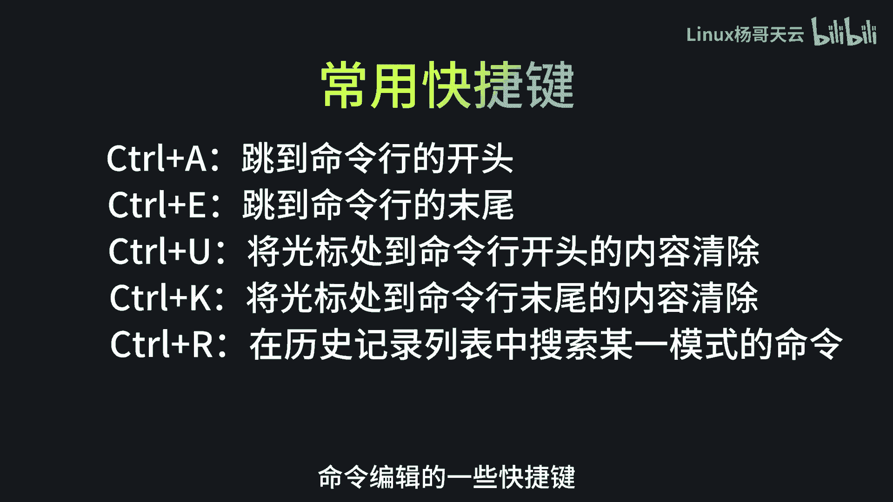
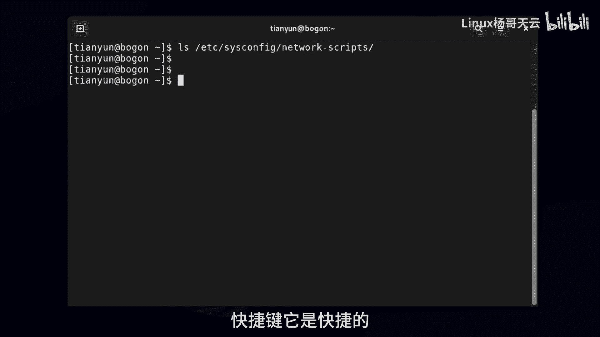
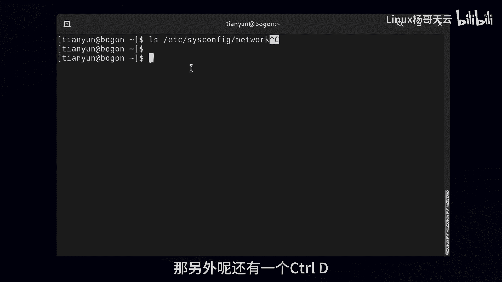
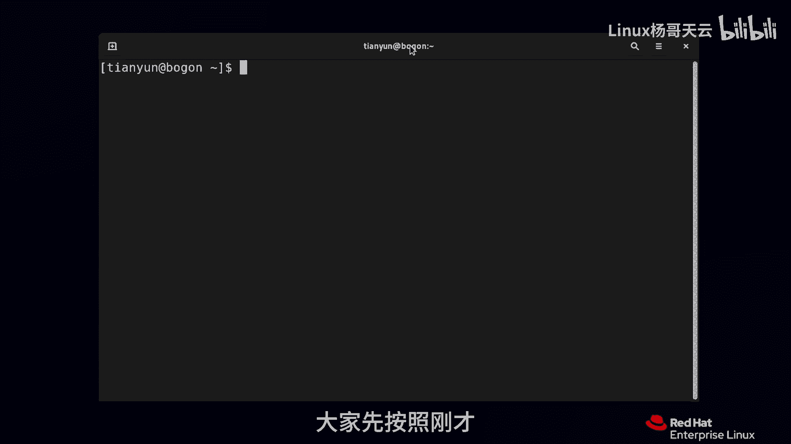

Linux入门教程：10：Bash Shell常用快捷键

在本节课中，我们将学习在Bash Shell环境下进行命令编辑时常用的一些快捷键。掌握这些快捷键可以显著提升在命令行中工作的效率。

上一节我们介绍了Shell的基本概念，本节中我们来看看如何通过快捷键更高效地编辑命令。

### 快捷键应用场景
假设我们输入了一个错误的命令，例如将 `cat` 误输入为 `cet`。当系统提示命令未找到时，我们需要修改这个命令。虽然可以使用方向键移动光标进行修改，但使用快捷键会更加快捷。

以下是Bash Shell中一些常用的编辑快捷键及其功能：

*   **`Ctrl + A`**：将光标快速移动到**命令行的最开头**。
*   **`Ctrl + E`**：将光标快速移动到**命令行的最末尾**。
*   **`Ctrl + K`**：删除从**当前光标位置到命令行末尾**的所有字符。
*   **`Ctrl + U`**：删除从**当前光标位置到命令行开头**的所有字符。
*   **`Ctrl + R`**：**反向搜索历史命令**。输入关键词后，Shell会动态显示匹配的历史命令。
*   **`Ctrl + C`**：**终止当前正在运行的命令或程序**。在输入命令时按下，可以取消当前输入的命令行。
*   **`Ctrl + D`**：**发送EOF（文件结束符）**。在空命令行上按下，效果等同于输入 `exit` 命令，会退出当前终端会话。

### 快捷键使用说明
1.  执行命令时，光标可以停留在命令行的任意位置，按下回车键即可执行，无需特意将光标移至末尾。
2.  符号 `^` 在Linux文档中常用来表示 `Ctrl` 键。例如，`^C` 即代表 `Ctrl + C`。
3.  `Ctrl + C` 在终止命令时会显示 `^C` 作为视觉反馈，以区别于回车操作。
4.  `Ctrl + D` 在命令行有内容时，会删除光标后的一个字符；在空命令行时，则会退出终端。

本节课中我们一起学习了Bash Shell中用于命令编辑和控制的几个核心快捷键。熟练运用 `Ctrl+A/E` 进行光标跳转、`Ctrl+K/U` 进行快速删除、`Ctrl+R` 搜索历史以及 `Ctrl+C/D` 进行控制，能够让你在命令行环境中操作更加得心应手。