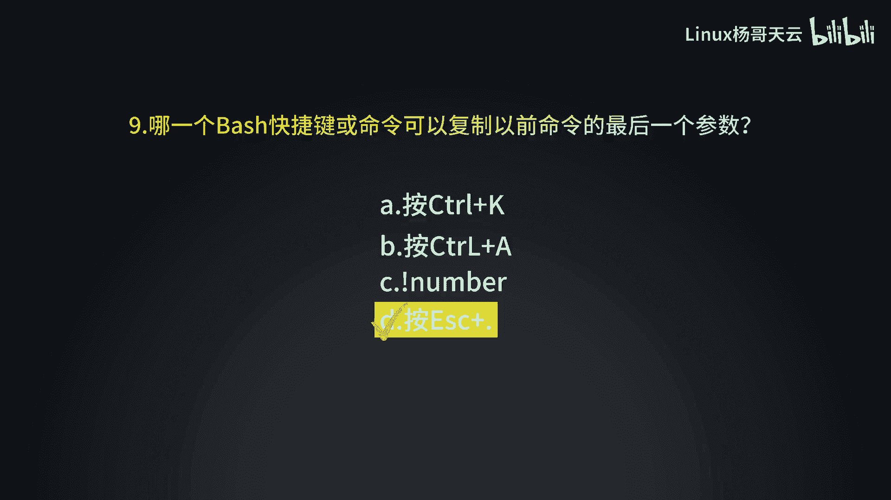

# Linux入门与RHCE认证：P11：使用Bash Shell执行命令小测验

在本节课中，我们将通过一系列测验题目，检验你对Bash Shell基础命令的掌握情况。测验涵盖了文件操作、路径导航、命令历史等核心知识点。

## 测验题目

以下是本次测验的全部题目，请根据你的知识进行解答。

1.  如何创建一个名为 `test` 的目录？
2.  如何切换到 `/home` 目录？
3.  如何查看当前所在的工作目录？
4.  如何列出 `/var` 目录下的所有文件（包括隐藏文件）？
5.  如何创建一个名为 `file.txt` 的空文件？
6.  如何将 `file.txt` 文件复制到 `/tmp` 目录下？
7.  如何删除当前目录下的 `test` 目录？
8.  如何查看最近使用过的10条命令历史记录？

---

本节课中，我们一起通过测验回顾了Bash Shell的常用命令，包括目录管理、文件操作和历史查询。熟练掌握这些命令是高效使用Linux系统的基础。