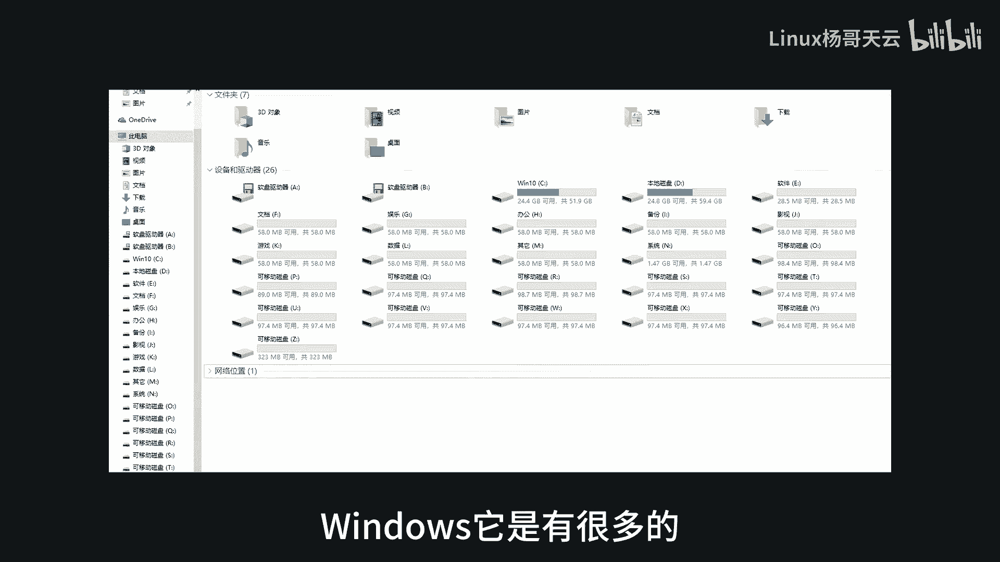
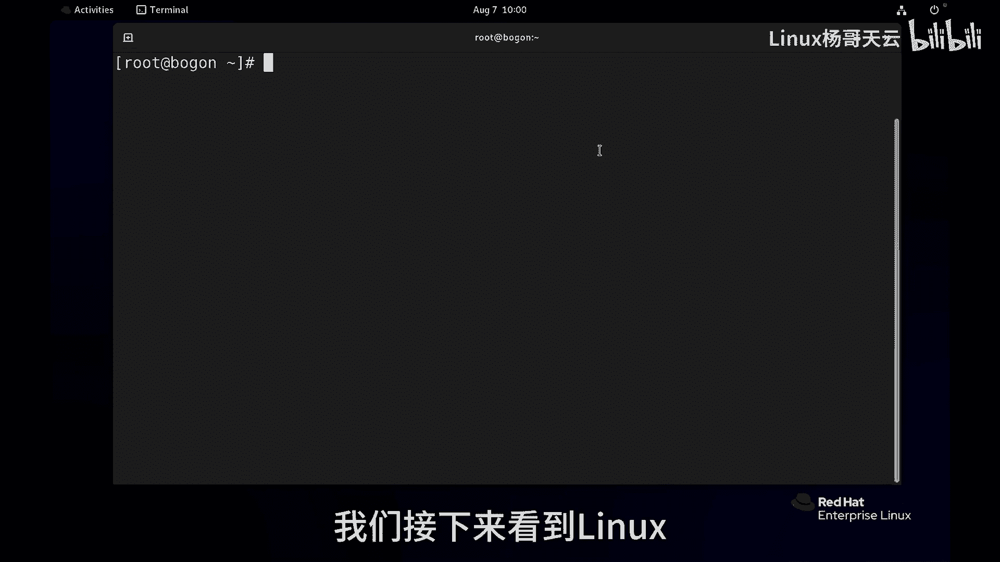
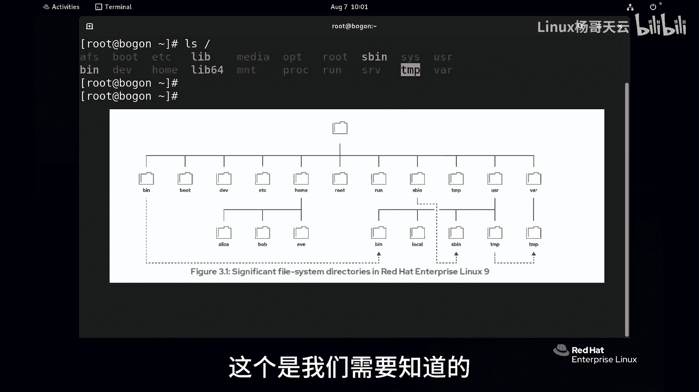
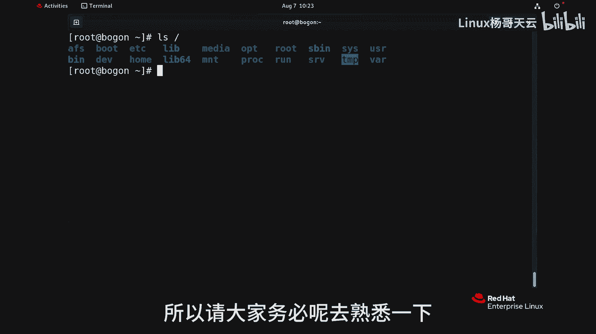

# Linux入门教程：13：Linux文件层次系统结构 📂

在本节课中，我们将要学习Linux操作系统的文件层次结构。理解这个结构是管理文件、配置系统和进行故障排除的基础。与Windows的盘符（如C盘、D盘）不同，Linux采用一种单一的、树状的结构来组织所有文件和目录。

## 概述：Linux的目录树 🌳

Linux将所有文件组织成一棵倒挂的树，最顶端是根目录（`/`），所有其他目录和文件都从根目录开始分支。这并不意味着Linux只有一个分区，分区可以挂载到这个树状结构的任意位置，这一点我们将在后续课程中详细讲解。

了解根目录下各个重要子目录的用途，对于后续的系统管理和日常工作至关重要。

## 文件类型简介

在深入了解目录之前，我们先简单了解Linux系统中的文件类型。这些文件大致可以分为以下几类：

*   **静态文件**：除非手动编辑，否则内容不会发生变化。例如，许多配置文件。
*   **动态/可变文件**：内容会随着系统或进程的运行而改变。例如，日志文件会记录系统事件，并不断追加新内容。
*   **持久性文件**：系统重启后内容依然保留。例如，网络配置、主机名等系统配置文件。
*   **临时/非持久性文件**：系统重启后可能会被清除。例如，某些进程运行时产生的临时数据或PID文件。

## 根目录下的重要子目录

以下是根目录（`/`）下一些核心子目录及其功能的详细介绍。

### `/boot` - 启动目录

`/boot` 目录存放着系统启动所必需的文件。例如，引导加载程序GRUB的配置文件就位于此处。更重要的是，Linux内核文件（通常名为 `vmlinuz-*`）也存储在这里。内核是操作系统的核心，负责管理进程、内存和设备等。

### `/dev` - 设备目录

`/dev` 目录体现了Linux“一切皆文件”的哲学。系统中所有的硬件设备（如磁盘、网卡）和虚拟设备（如终端 `tty*`、标准输入/输出）都在这里以文件的形式存在。例如，第一块硬盘可能对应 `/dev/sda`。

### `/etc` - 配置文件目录

`/etc` 是系统管理员打交道最多的地方之一，它存放了系统和应用程序的**配置文件**。例如，主机名配置文件 `/etc/hostname`，网络配置文件通常也在 `/etc` 下的子目录中。安装的软件通常也会在 `/etc` 下创建自己的目录来存放配置。

### `/home` - 用户家目录

`/home` 是**普通用户家目录**的父目录。每个普通用户都会在 `/home` 下拥有一个以自己用户名命名的子目录（即家目录），用于存放个人文件和配置。例如，用户 `tianyun` 的家目录就是 `/home/tianyun`。

**注意**：系统管理员（root用户）的家目录是单独的 `/root`，并不在 `/home` 下。

### `/run` - 运行时数据目录

`/run` 目录存放系统启动后**进程运行时的数据**，例如进程的PID文件。这些文件通常由系统自动管理，一般不需要手动干预。进程停止后，其对应的运行时文件可能会消失。

### `/tmp` 与 `/var/tmp` - 临时文件目录

这两个目录都用于存放临时文件，任何用户或进程都可以在此写入数据。它们的区别在于清理策略：
*   `/tmp`：通常系统会定期清理（例如，10天内未被访问、修改的文件）。
*   `/var/tmp`：允许文件存放更长时间（例如，30天）。

### `/usr` - 用户程序与数据目录

`/usr` 是一个非常重要的目录，存放着用户安装的**软件、共享库和只读程序数据**。它包含几个关键子目录：

*   `/usr/bin`：存放**普通用户使用的命令**（用户命令）。例如，常用的 `ls`, `cat` 命令就位于此。
*   `/usr/sbin`：存放**系统管理员使用的命令**（系统管理命令）。例如，创建用户的 `useradd` 命令。
*   `/usr/local`：通常用于存放**本地编译安装的软件**，以避免与系统包管理器安装的软件冲突。

### `/var` - 可变数据目录

正如其名，`/var` 目录存放经常变化的（Variable）数据。这包括：
*   **日志文件**：存放在 `/var/log` 下，如系统日志、安全日志、服务日志等。
*   **缓存数据**
*   **数据库文件**
*   其他运行时生成且需要持久保存的数据。

## 总结

本节课我们一起学习了Linux文件系统的层次结构。我们了解到Linux采用从根目录（`/`）开始的树状结构，并详细探讨了 `/boot`, `/dev`, `/etc`, `/home`, `/run`, `/tmp`, `/usr` 和 `/var` 等核心目录的用途。掌握这些目录的功能，是成为一名合格Linux系统管理员的基石。在后续课程中，我们将更深入地使用和操作这些目录中的文件。