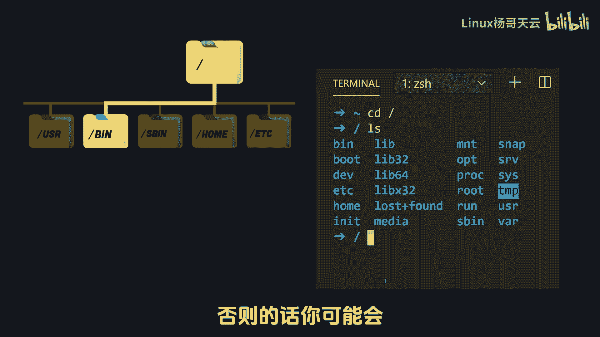
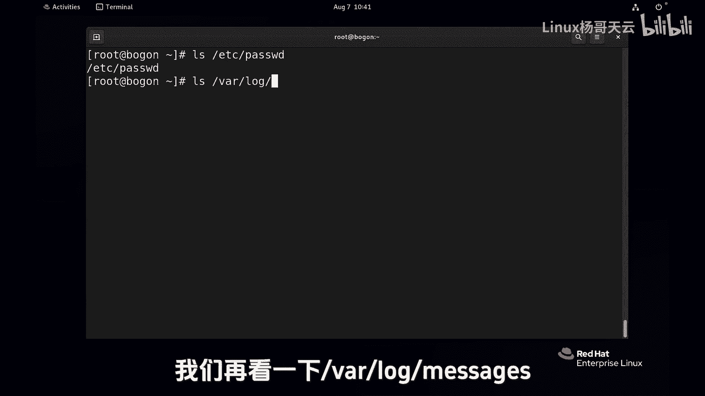
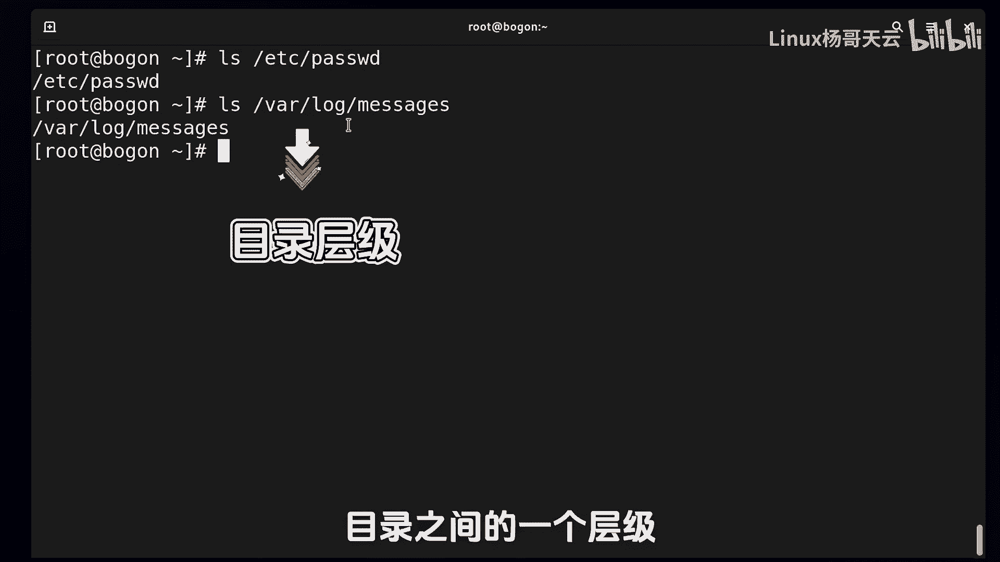
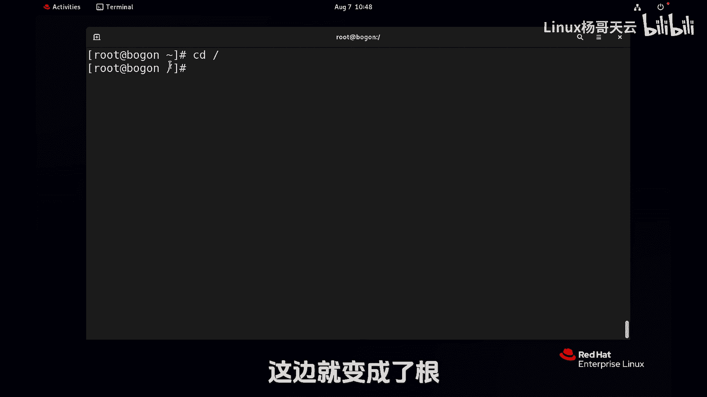
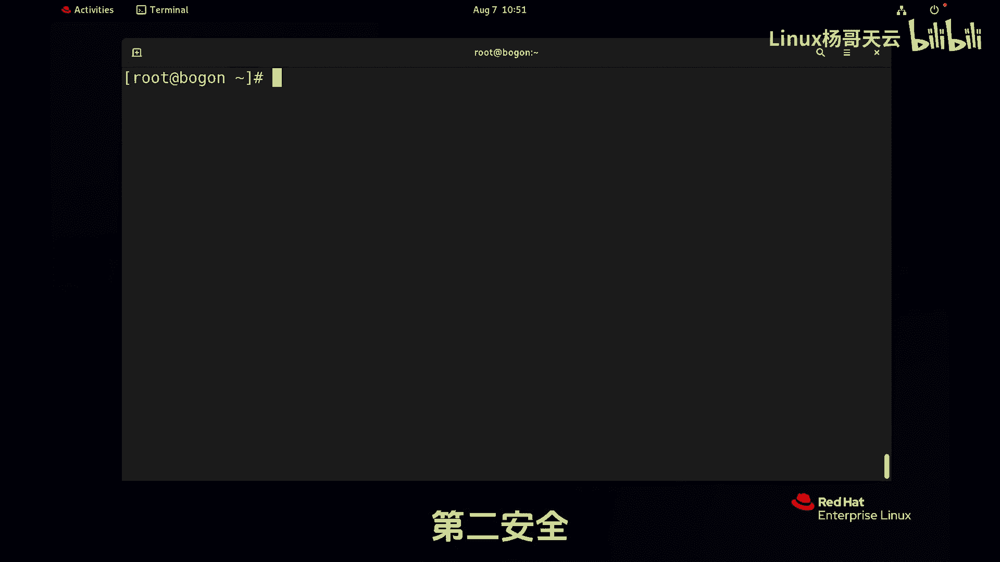

# Linux入门教程：14：绝对路径与相对路径 📂


在本节课中，我们将要学习Linux系统中定位文件的两个核心概念：**绝对路径**和**相对路径**。理解它们对于高效、安全地管理文件至关重要。


## 概述



管理文件时，首先需要明确操作哪个文件。这涉及到文件的定位问题，即通过路径来指定文件的位置。路径分为两种主要类型：绝对路径和相对路径。本节将详细介绍这两种路径的概念、区别及使用场景。

## 核心概念解析



### 当前工作目录



在深入路径之前，需要理解“当前工作目录”的概念。它指的是你当前在文件系统中所处的位置。你可以使用 `pwd` 命令来查看当前工作目录。

**命令示例：**
```bash
pwd
```
这个命令会打印出你当前所在的目录的完整路径。

### 绝对路径

绝对路径是从文件系统的根目录（`/`）开始的完整路径。它能够唯一、绝对地定位一个文件，无论你当前身处何处。

**核心公式：**
```
绝对路径 = / + 目录1 + / + 目录2 + ... + / + 文件名
```
例如，`/var/log/message` 就是一个绝对路径。它表示从根目录开始，依次进入 `var` 目录、`log` 目录，最终定位到 `message` 文件。

**关键点：**
*   路径开头的 `/` 代表根目录，是一切路径的起点。
*   后续的 `/` 用于分隔目录层级。
*   使用绝对路径可以确保你操作的是指定的文件，没有歧义。

### 相对路径

相对路径是相对于你当前工作目录的路径。它不以 `/` 开头，其起点是你的当前位置。

**核心公式：**
```
相对路径 = （相对于当前目录的）目录或文件名
```
例如，如果你当前在 `/var` 目录下，要访问 `log/message` 文件，只需使用 `log/message` 这个相对路径即可。

**关键点：**
*   相对路径的起点是当前目录（可通过 `pwd` 查看）。
*   它更简洁，但只在特定上下文中有效。如果你切换到其他目录，同样的相对路径可能指向不同的文件或根本不存在。

## 路径使用策略

了解了两种路径后，我们来看看如何选择使用它们。以下是两个核心原则：



### 原则一：效率优先


选择能最快、最直接到达目标文件的路径。

*   **使用相对路径的场景**：当你已经位于目标文件所在的目录或其父目录时。例如，在 `/var/log` 目录下查看 `message` 文件，直接使用 `message` 或 `./message` 即可。
*   **使用绝对路径的场景**：当目标文件距离你当前目录较远时。例如，你在 `/home/user` 目录下，想查看 `/etc/passwd` 文件，直接使用绝对路径 `/etc/passwd` 比先切换目录再使用相对路径更高效。

### 原则二：安全优先

在某些高风险操作中，路径的选择直接影响系统安全。

*   **命令行删除操作**：在使用 `rm` 等删除命令时，**建议优先使用绝对路径**。这可以避免因当前目录判断错误而误删其他文件。
*   **脚本中的删除操作**：在编写Shell脚本执行删除时，**必须使用绝对路径**。这是为了防止脚本在不同环境下运行时，因工作目录变化而导致灾难性错误。

## 总结

本节课我们一起学习了Linux文件定位的核心知识。

*   **绝对路径**以根目录 `/` 开头，能唯一确定文件位置，但通常较长。
*   **相对路径**以当前目录为起点，书写简洁，但其有效性依赖于当前的工作目录。
*   选择路径时，应兼顾**效率**（使用更短的路径）和**安全**（在高风险操作中使用绝对路径以避免误操作）。



掌握路径的使用，是熟练进行Linux文件管理的基础。下一节，我们将开始学习具体的文件操作命令。