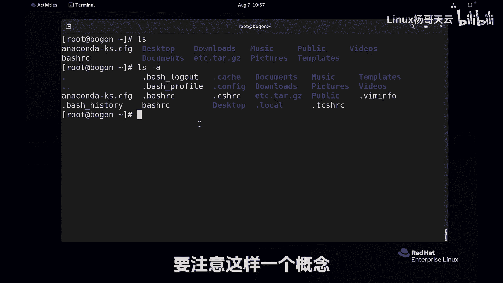

Linux入门教程：15：Linux中 “.“和”..“的含义


在本节课中，我们将要学习Linux文件系统中两个非常特殊的目录项：点（`.`）和点点（`..`）。理解它们的含义和用途，是掌握Linux目录操作的基础。


上一节我们介绍了`cd`命令的基本用法，本节中我们来看看如何使用`.`和`..`来更灵活地切换目录。

### 目录中的特殊项：`.` 与 `..`

在Linux系统中，每个目录下都默认存在两个特殊的目录项：一个点（`.`）和两个点（`..`）。它们并非普通的文件夹，而是具有特殊含义的符号链接。

*   **点（`.`）**：代表**当前目录**本身。
*   **点点（`..`）**：代表**上一级目录**（父目录）。

这两个符号是相对路径的重要组成部分。例如，无论你身处文件系统的哪个位置，`cd ..`命令都可以让你直接返回上一级目录，就像有一个“回家”的快捷通道。

### 如何查看隐藏的`.`和`..`

默认情况下，使用`ls`命令是看不到以点开头的文件和目录的，因为它们被视作“隐藏”项。为了查看包括`.`和`..`在内的所有内容，我们需要使用`ls`命令的`-a`选项。

以下是`ls`命令的常用选项：
*   `ls -a`：列出目录下的**所有**文件和目录，包括隐藏项。
*   `ls -l`：以长格式列出文件和目录的详细信息。
*   `ls -la` 或 `ls -al`：结合以上两者，以长格式列出所有内容。

执行`ls -a`后，你会在列表的最前面看到`.`和`..`这两个条目。

### `.` 和 `..` 的实际应用

理解了概念后，我们来看看它们的具体用法。

1.  **使用 `..` 切换目录**
    假设当前目录是 `/var/log`，想要返回其父目录 `/var`。
    *   方法一：使用绝对路径 `cd /var`。
    *   方法二：使用相对路径 `cd ..`。这是更快捷的方式。
    继续执行 `cd ..`，则会从 `/var` 目录返回到根目录 `/`。可见，`..` 的含义是动态的，始终指向当前目录的直接上级。

2.  **使用 `.` 代表当前目录**
    点（`.`）代表当前目录本身。例如，`cd .` 不会改变你的位置，因为你仍然停留在“当前目录”。
    另一个常见用法是在执行当前目录下的脚本时，需要指明路径。例如，运行当前目录下的一个脚本 `myscript.sh`，命令为 `./myscript.sh`。这里的 `./` 就明确告诉系统，脚本位于当前目录。

### 关于“隐藏文件”的扩展知识

在Linux中，**凡是以点（`.`）开头的文件或目录名，默认都是隐藏的**。这不仅包括特殊的`.`和`..`，也包括用户或系统创建的配置文件，例如家目录下的 `.bashrc`。

这一点很重要：**点（`.`）是文件名的一部分**。例如，文件 `.bashrc` 和 `bashrc` 是两个完全不同的文件，可以同时存在于同一个目录中。`touch` 命令可以用来创建空文件，我们可以用它来验证：

```bash
touch .bashrc   # 创建隐藏文件 .bashrc
touch bashrc    # 创建普通文件 bashrc
ls              # 只显示 bashrc
ls -a           # 显示 .bashrc, .., ., bashrc
```



本节课中我们一起学习了Linux中“点”（`.`）和“点点”（`..`）这两个特殊目录的含义与作用。`.`代表当前目录，`..`代表父目录。它们是导航文件系统的得力工具，并且都属于以点开头的“隐藏文件”。理解它们，将为后续学习更复杂的路径操作和命令执行打下坚实基础。