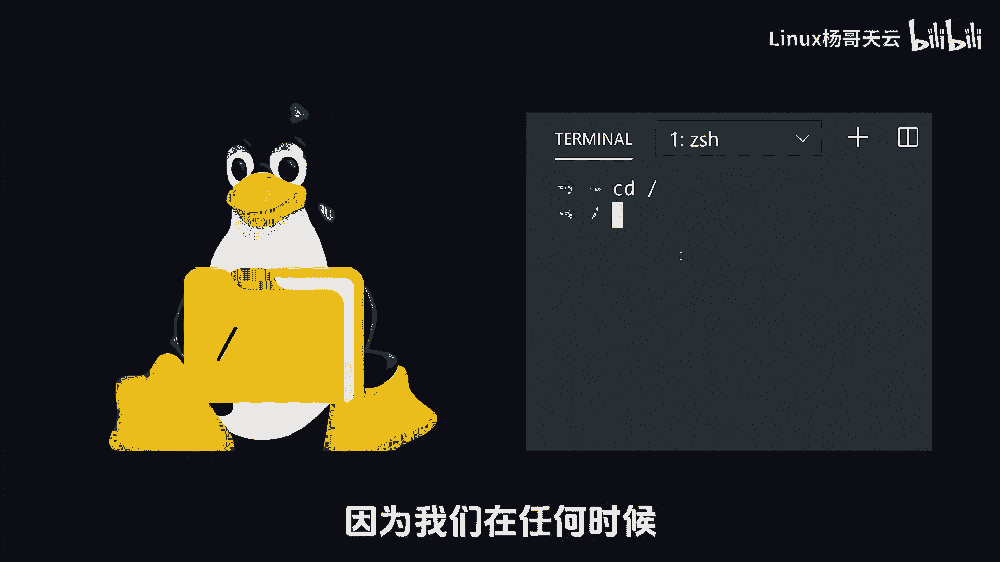
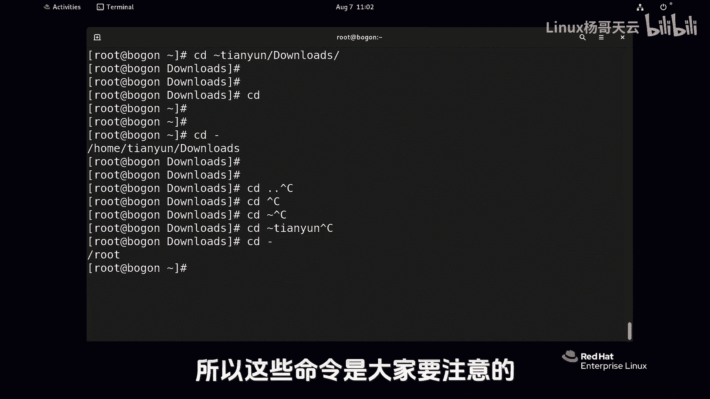

Linux入门教程：16：Linux中不可错过的cd命令 🗂️


在本节课中，我们将要学习Linux系统中一个非常基础且高频使用的命令——`cd`命令。`cd`命令用于切换当前工作目录，是进行文件操作和系统导航的基石。掌握它的各种用法，能让你在Linux文件系统中自如穿梭。



---


上一节我们介绍了文件系统的基本结构，本节中我们来看看如何在不同目录间进行切换。

`cd`命令的第一种用法是跟上**绝对路径**。绝对路径是从根目录（`/`）开始的完整路径。

**示例代码：**
```bash
cd /var/log
```
这条命令会切换到根目录下的 `var` 目录中的 `log` 子目录。请注意，`cd` 命令后面只能跟目录，不能直接跟文件名。

---

理解了绝对路径后，我们来看看如何使用**相对路径**。相对路径是相对于当前所在目录的路径。

**示例代码：**
```bash
cd sssd
```
假设当前目录是 `/var/log`，而 `sssd` 目录就在其下方，那么这条命令就会切换到 `/var/log/sssd`。这里没有在路径前加斜线（`/`），因此它是一个相对路径。如果加了斜线，就变成了从根目录开始的绝对路径，含义完全不同。

在输入路径时，可以使用 `Tab` 键进行自动补全。一个有用的技巧是：凡是按 `Tab` 键能自动补全出一个斜线（`/`）的，说明它是一个目录；如果不能，则可能是一个文件。

---

除了具体的路径，`cd` 命令还有一些特殊的快捷用法，可以快速定位到特定目录。

以下是几个常用的快捷用法：

*   **`cd ~` 或 `cd`**：直接回到当前登录用户的**家目录**。例如，`root` 用户会回到 `/root`，普通用户（如 `tianyun`）会回到 `/home/tianyun`。
*   **`cd ~username`**：快速切换到指定用户的家目录。例如，`cd ~tianyun` 会切换到用户 `tianyun` 的家目录（`/home/tianyun`）。当然，能否成功进入取决于你的访问权限。
*   **`cd -`**：返回到**上一次**所在的目录。这类似于遥控器上的“返回”键，它不是在目录层级中向上移动，而是在你最近访问的两个目录之间快速切换。
*   **`cd ..`**：向**上一级**目录移动。这里的 `..` 代表父目录。

请注意区分 `cd -`（返回上次目录）和 `cd ..`（向上级移动）的不同。`cd -` 记录的是你切换目录的历史，而 `cd ..` 是沿着目录树的结构向上走一层。

---



本节课中我们一起学习了 `cd` 命令的核心用法。我们首先介绍了如何使用绝对路径和相对路径进行目录切换，然后详细讲解了几个能极大提升效率的快捷操作：快速回家（`cd ~`）、切换到指定用户家目录（`cd ~username`）、返回上一个目录（`cd -`）以及向上移动（`cd ..`）。熟练掌握这些技巧，是你在Linux命令行环境中高效工作的第一步。