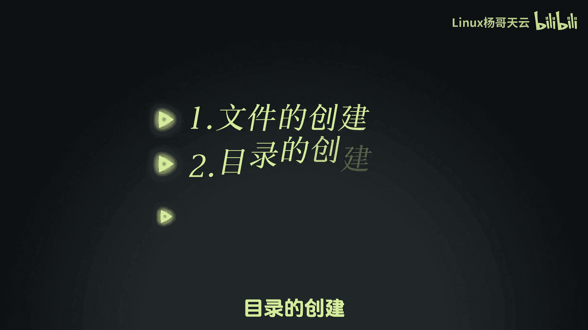
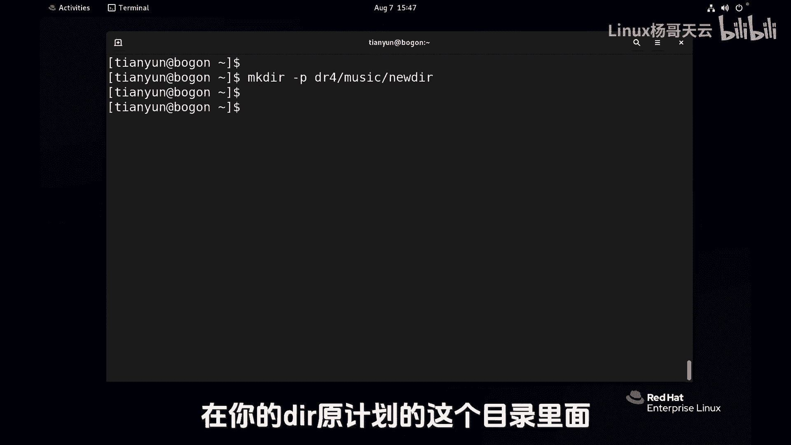
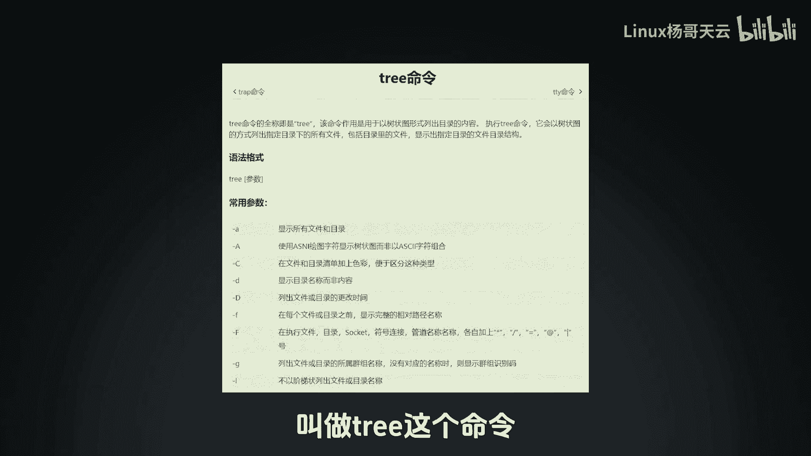
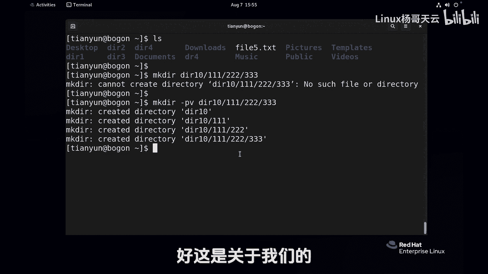

# Linux文件管理基础教程：P17：创建目录和文件 📁📄




在本节课中，我们将要学习Linux系统中最基础的文件管理操作，包括如何创建目录和文件。这是管理Linux系统文件和目录结构的第一步。

## 创建目录

上一节我们介绍了课程概述，本节中我们来看看如何使用`mkdir`命令创建目录。

`mkdir`命令用于创建新的目录。其基本语法如下：
```bash
mkdir [选项] 目录名...
```

以下是使用`mkdir`命令的几种常见方式：

*   **创建单个目录**：在命令后直接跟上目录名称即可。
    ```bash
    mkdir dir1
    ```
    执行后，若无报错，则成功创建名为`dir1`的目录。

*   **创建多个目录**：可以一次性创建多个同级目录，只需在命令后跟上多个目录名作为参数。
    ```bash
    mkdir dir1 dir2 dir3
    ```
    此命令会同时创建`dir1`、`dir2`和`dir3`三个目录。





*   **创建多级目录**：若要创建嵌套的多级目录结构，需要使用`-p`选项。
    ```bash
    mkdir -p dir4/music
    ```
    `-p`选项的作用是：如果父目录（例如`dir4`）不存在，则连同父目录一起创建。执行后，会创建`dir4`目录，并在其下创建`music`子目录。

> **重要提示**：使用`-p`选项时务必小心，因为它会自动创建路径中所有不存在的父目录。如果路径输入错误，可能会创建出非预期的目录结构。例如，误将`dir4/music/newdir`输入为`dirr4/music/newdir`，则`-p`选项会创建一个全新的`dirr4`目录结构，而非在预期的`dir4`下操作。

*   **显示详细创建过程**：可以使用`-v`选项来查看命令执行的详细步骤。
    ```bash
    mkdir -pv dir10/111/222/333
    ```
    此命令会逐级显示创建`dir10`、`111`、`222`、`333`目录的过程。

## 创建文件

了解了目录的创建后，接下来我们学习如何使用`touch`命令创建文件。

`touch`命令的主要用途是创建新的空文件。其基本语法为：
```bash
touch 文件名...
```

以下是使用`touch`命令的要点：

*   **创建空文件**：在命令后跟上想要创建的文件名即可。
    ```bash
    touch file1.txt
    ```
    执行后，会在当前目录下创建一个名为`file1.txt`的空文件。在Linux中，文件扩展名（如`.txt`）本身并无特殊意义，主要是为了用户便于识别文件类型。

*   **创建多个文件**：与`mkdir`类似，可以一次性创建多个文件。
    ```bash
    touch file2.txt file3.txt
    ```

*   **注意路径问题**：创建文件时，需要明确指定路径。参数可以是绝对路径或相对路径。
    ```bash
    touch /tmp/test.txt .file5.txt
    ```
    第一个参数`/tmp/test.txt`是绝对路径，文件将创建在系统的`/tmp`目录下。第二个参数`.file5.txt`是相对路径，文件将创建在执行此命令时的当前工作目录下（例如用户的家目录`/home/tianyun`）。

> **权限说明**：并非在所有位置都能随意创建目录或文件。操作能否成功取决于当前用户对该路径的权限。例如，普通用户无法在根目录（`/`）下直接创建目录，但可以在权限开放的临时目录（如`/tmp`）下进行操作。

## 总结



本节课中我们一起学习了Linux文件管理的基础操作。我们掌握了使用`mkdir`命令创建目录（包括单级、多级目录），以及使用`touch`命令创建空文件的方法。同时，我们了解了`-p`、`-v`等常用选项的作用，并特别注意了命令执行路径和系统权限的重要性。这些是进行后续文件复制、移动、删除等操作的基础。