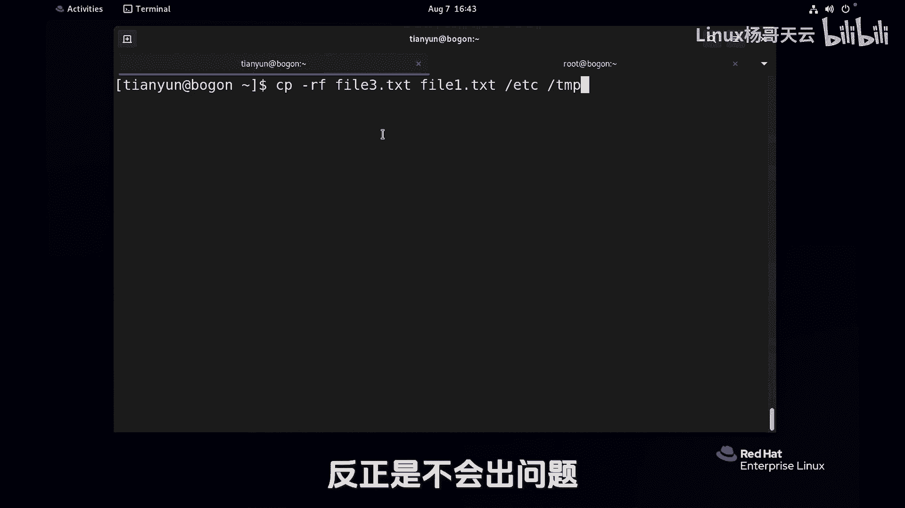

Linux入门与红帽认证RHCE通关教程：P18：使用cp命令复制文件和目录 📂


在本节课中，我们将学习Linux系统中用于复制文件和目录的核心命令——`cp`。我们将从基础的文件复制开始，逐步深入到目录复制、覆盖行为以及不同用户权限下的差异，确保你能够全面掌握其用法。

---

### 复制文件

`cp`命令的基本语法是 `cp 源文件 目标文件`。其核心功能是将源文件复制到目标位置。

以下是文件复制的几种常见操作：

*   **复制到目录并保留原名**：将当前目录下的 `file1.txt` 文件复制到 `/tmp` 目录下，不指定新文件名，则目标文件仍叫 `file1.txt`。
    ```bash
    cp file1.txt /tmp
    ```
*   **复制到目录并重命名**：将 `file1.txt` 文件复制到 `/tmp` 目录下，并重命名为 `file11.txt`。
    ```bash
    cp file1.txt /tmp/file11.txt
    ```
*   **在当前目录复制并重命名**：在当前目录下，将 `file1.txt` 复制一份并命名为 `file3.txt`。
    ```bash
    cp file1.txt file3.txt
    ```

---

上一节我们介绍了文件复制的基本操作，本节中我们来看看复制时可能遇到的覆盖问题，以及普通用户与管理员（root）行为的差异。

### 文件覆盖与用户权限

当目标位置已存在同名文件时，`cp`命令的默认行为会直接覆盖，但普通用户和管理员的表现有所不同。

1.  **普通用户**：在全局可写目录（如`/tmp`）下复制文件时，默认直接覆盖，无任何提示。
2.  **管理员用户**：执行复制时，如果遇到同名文件，默认会进行交互式询问，提示 `overwrite`（是否覆盖），需要用户输入 `y` 或 `n` 来确认。

**原因分析**：管理员权限极高，为防止误操作覆盖重要文件，系统为其`cp`命令设置了别名（alias），实际执行的是 `cp -i`（`-i` 代表 interactive，即交互模式）。而普通用户权限有限，使用的就是原始的`cp`命令。

**验证与操作**：
*   查看管理员的`cp`别名：`alias cp`
*   管理员临时使用原始`cp`命令（绕过别名）：
    ```bash
    \cp 源文件 目标文件
    ```
    或
    ```bash
    /usr/bin/cp 源文件 目标文件
    ```

---

了解了文件的复制后，接下来我们学习如何复制目录。复制目录需要额外的选项，因为需要处理目录内的所有内容。

### 复制目录

复制目录必须使用 `-r`（或 `-R`，递归 recursive）选项，其含义是递归复制目录及其内部的所有子目录和文件。

以下是目录复制的操作：

*   **复制目录**：将目录 `dir2` 完整复制到 `/tmp` 目录下。
    ```bash
    cp -r dir2 /tmp
    ```
*   **管理员复制系统目录**：以管理员身份复制 `/etc` 目录到 `/tmp`。由于别名存在，每个文件都会询问，此时使用 `\cp` 来避免交互。
    ```bash
    \cp -r /etc /tmp
    ```

---

### 复制多个项目

`cp`命令支持一次性复制多个文件或目录到同一个目标位置。

其语法格式为：`cp 源1 源2 源3 ... 目标目录`。以下是将多个项目复制到`/tmp`目录的示例：
```bash
cp file3.txt file1.txt dir2 /tmp
```

---



本节课中我们一起学习了Linux中`cp`命令的全面用法。我们掌握了复制文件的基础操作，理解了不同用户权限下覆盖行为的差异及其原理，学会了使用`-r`选项递归复制目录，以及如何一次性复制多个项目。记住，在需要复制目录时，`cp -r`是必备选项；而作为管理员，了解`cp -i`别名的存在能帮助你避免误操作。