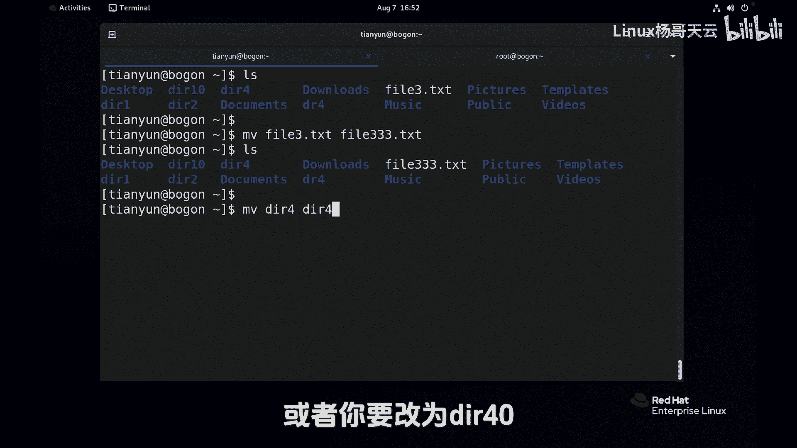
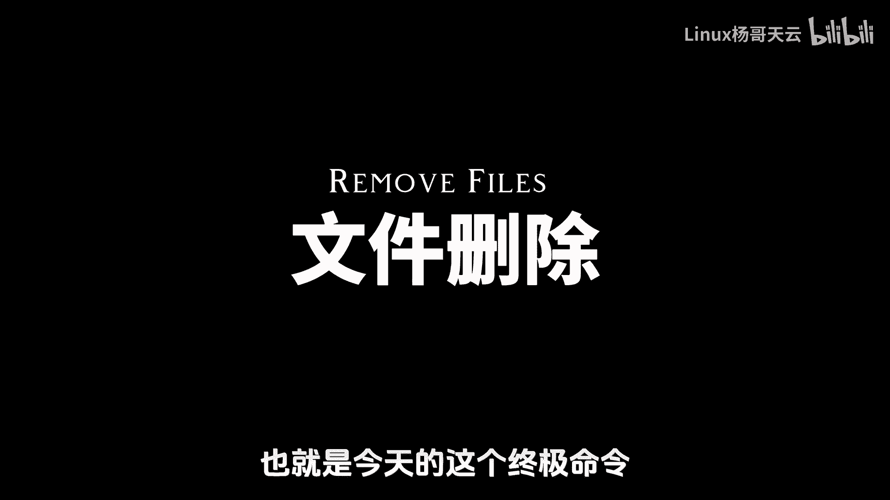
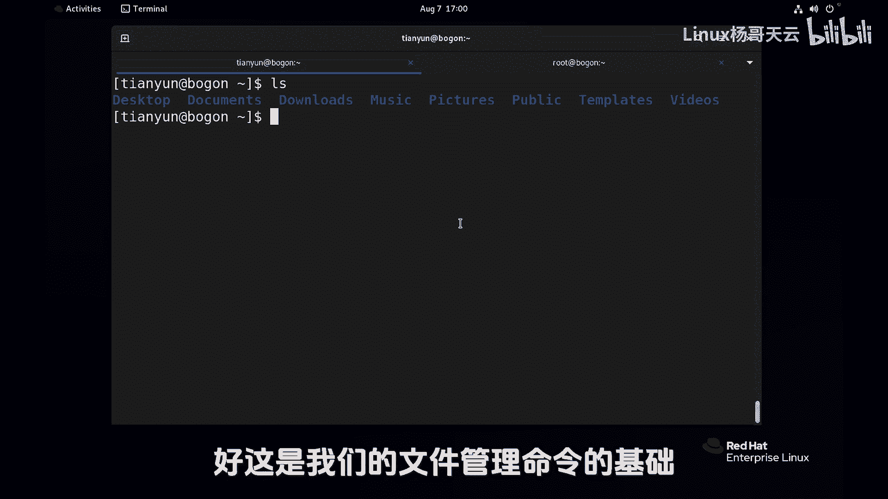

Linux入门与红帽认证RHCE通关教程：P19：文件的移动与删除


在本节课中，我们将要学习Linux系统中两个非常重要的文件管理命令：`mv`和`rm`。我们将了解如何使用`mv`命令移动和重命名文件与目录，以及如何使用`rm`命令删除它们。这两个命令功能强大，但使用不当也可能带来风险，因此理解其正确用法至关重要。

---

### 文件的移动与重命名：`mv`命令

上一节我们介绍了文件的复制，本节中我们来看看文件的移动。`mv`命令相当于Windows系统中的“剪切”操作。它与`cp`命令的核心区别在于，移动后源文件将不复存在。

`mv`命令的基本语法是：
```bash
mv [源文件或目录] [目标路径或新名称]
```



以下是`mv`命令的几种常见用法：



1.  **移动文件**：将文件移动到另一个目录，不改变文件名。
    ```bash
    mv file1.txt /tmp/
    ```
    执行后，当前目录下的`file1.txt`文件会消失，出现在`/tmp/`目录下。

2.  **移动并重命名**：在移动的同时为文件指定新名称。
    ```bash
    mv file2.txt /tmp/new_file2.txt
    ```
    执行后，`file2.txt`被移动到`/tmp/`目录并重命名为`new_file2.txt`。

3.  **重命名文件**：在当前位置为文件改名，这本质上是将文件“移动”到同路径下的新名称。
    ```bash
    mv file3.txt file333.txt
    ```
    执行后，`file3.txt`被重命名为`file333.txt`。

4.  **移动或重命名目录**：`mv`命令同样适用于目录，用法与文件相同。
    ```bash
    mv dir4 dir44
    ```
    执行后，目录`dir4`被重命名为`dir44`。

`mv`命令的使用非常简单直接。接下来，我们将进入一个需要更加谨慎操作的环节：文件的删除。

---

### 文件的删除：`rm`命令

了解了如何移动文件后，现在我们来学习如何删除文件。`rm`命令用于删除文件或目录，它功能强大，但使用时必须格外小心，尤其是以管理员身份操作时。

`rm`命令的基本语法是：
```bash
rm [选项] 文件或目录
```

以下是`rm`命令的关键选项和用法：

1.  **删除文件**：直接删除一个文件。
    ```bash
    rm file333.txt
    ```
    文件会被直接删除，没有确认提示。

2.  **删除目录**：删除目录需要使用 `-r`（递归）选项，因为目录可能包含子目录和文件。
    ```bash
    rm -r dir1
    ```
    此命令会递归删除`dir1`目录及其内部所有内容。

3.  **强制删除**：使用 `-f`（强制）选项可以忽略不存在的文件或删除时的提示。`-rf` 组合非常强大且危险。
    ```bash
    rm -rf dir2
    ```
    此命令会**无任何提示**地强制删除`dir2`目录及其所有内容。

**重要警告**：`rm -rf` 命令极其危险，特别是当以管理员（root）身份在根目录（`/`）或系统关键目录下执行时（例如 `rm -rf /`），可能导致系统被彻底摧毁，数据无法恢复。

**管理员用户的特殊提示**：在大多数Linux系统中，管理员用户的`rm`命令通常被设置为别名 `rm -i`，即在删除前会进行交互式确认。这是为了防止误操作。你可以使用 `\rm` 或 `command rm` 来使用原生的、不带`-i`选项的`rm`命令。

**路径使用的安全建议**：
*   **在命令行手动操作时，尽量使用相对路径**：先通过`cd`命令进入目标目录，确认无误后再执行删除。这样可以避免因路径输入错误而误删其他文件。
    ```bash
    cd /home/tianyun/target_dir
    rm -r ./*
    ```
*   **在脚本中编写时，务必使用绝对路径**：这能确保脚本行为的确定性，避免因执行环境不同而导致意外。

一个真实的教训是，本想输入 `rm -rf /home/tianyun/etc/`，却不慎在输入路径时过早按下了回车，导致命令在错误的位置执行，造成了数据损失。因此，操作`rm`命令时必须保持专注和谨慎。

---

### 总结

本节课中我们一起学习了Linux文件管理的两个核心命令：
1.  **`mv`命令**：用于**移动**和**重命名**文件或目录。其基本逻辑是将源数据转移到目标位置。
2.  **`rm`命令**：用于**删除**文件或目录。使用 `-r` 选项删除目录，使用 `-f` 选项强制删除。**`rm -rf` 命令威力巨大，务必谨慎使用**，尤其是在管理员权限下。建议在命令行手动操作时使用相对路径以增加安全性。



熟练掌握并安全地使用这两个命令，是进行高效Linux文件管理的基础。请始终牢记：数据无价，操作前先确认。