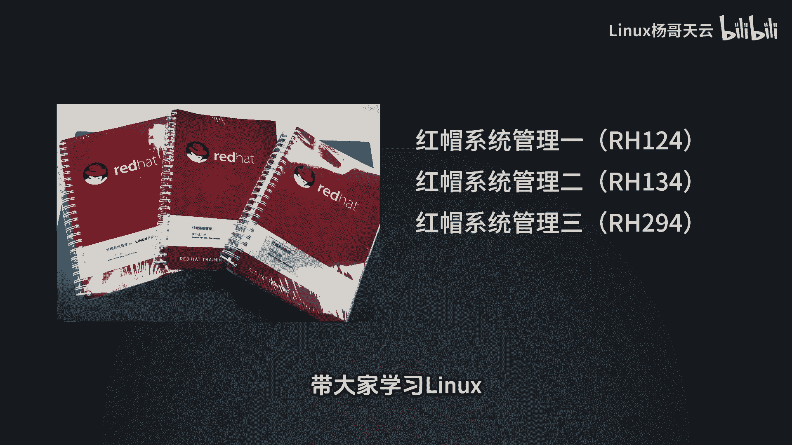
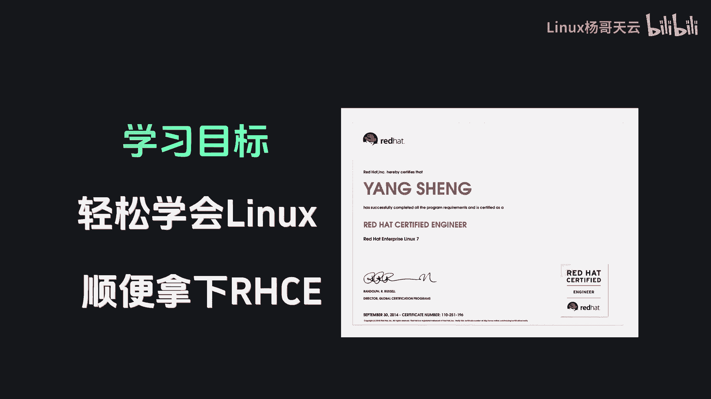
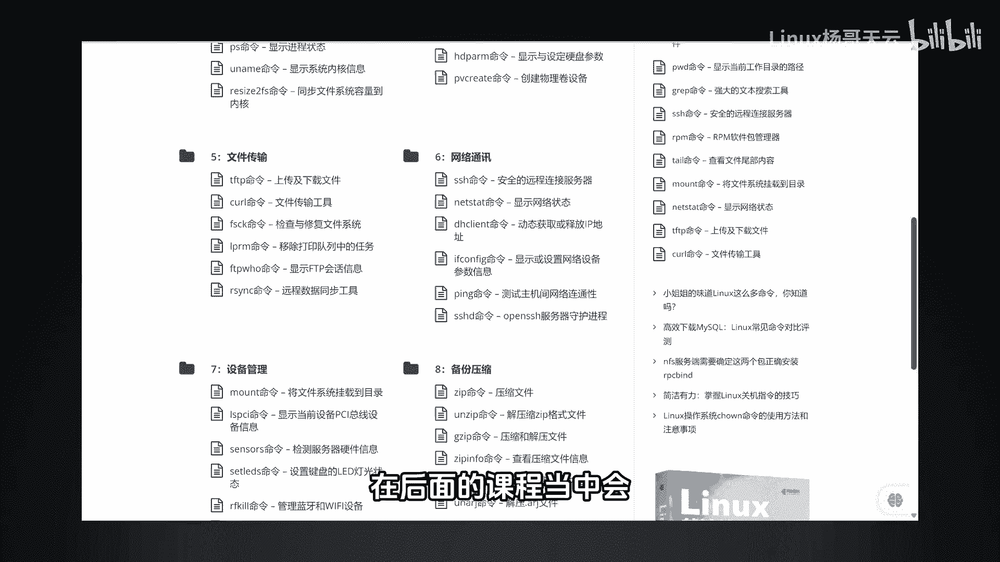

# Linux入门与RHCE认证：1：课程先导与学习路径 🚀

在本节课中，我们将了解本系列课程的整体目标、学习路径以及如何高效地掌握Linux技能，并最终通过红帽RHCE认证。

从今天开始，我将按照红帽官方教材的顺序，带领大家系统性地学习Linux。

我们的核心目标是轻松学会Linux，并在此过程中顺利拿下RHCE认证。

我们将严格遵循官方三本教材的顺序，帮助大家真正掌握Linux这项基础技能。许多同学可能在大学期间接触过Linux，因为目前很多专业都开设了相关课程，但常常感到无从下手。

问题的关键在于Linux命令繁多，且每个命令又包含大量参数。但实际情况是，我们日常使用的核心命令并没有那么多。其中，高频使用的命令可能只有十几个到二十个，另一些命令的使用频率则相对较低。

因此，学习的重点在于掌握如何高效地查阅命令帮助文档的方法。这些具体技巧和内容，我们将在后续的课程中为大家详细讲解。

所以，希望大家能够跟随我的教学节奏，我们一起轻松愉快地学习Linux。

---

本节课中，我们一起学习了本课程的总体目标与学习路径。我们明确了将按照红帽官方教材体系化学习，并理解了掌握核心命令与查阅帮助的方法比死记硬背所有命令更为重要。在接下来的课程中，我们将从基础开始，一步步深入Linux的世界。