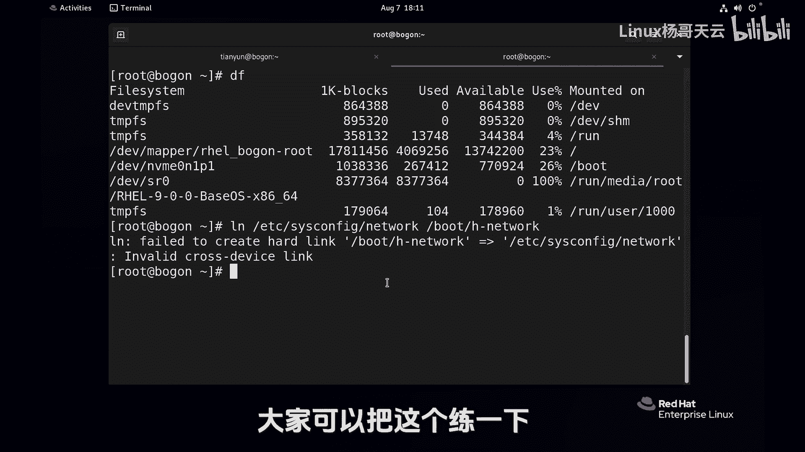

Linux入门教程：20：文件链接-硬链接 🔗


在本节课中，我们将要学习Linux系统中的文件链接，特别是硬链接。我们将了解什么是硬链接，如何创建它，以及它的工作原理和限制。

---

下面介绍Linux的文件链接。通过链接的方式，可以为路径较深的文件创建一个简单的访问入口，类似于Windows的快捷方式。但Linux远比Windows强大，因为它支持两种链接：硬链接和符号链接（也称为软链接）。本节中我们来看看硬链接。


首先，我们创建一个文件。

```
touch file1.txt
```

这个文件目前没有内容。我们前瞻性地使用一些命令来添加内容。

```
echo "杨哥" > file1.txt
```

我们先查看一下文件。`ls -l`命令用于查看文件的长列表详细信息。在Linux中，也可以直接使用`ll`命令，因为它是一个别名，相当于`ls -l --color=auto`。

```
ll
```

输出中，第一个字符表示文件类型：`d`表示目录（文件夹），`-`表示普通文件。此外，有一列数字，对于文件夹通常是2，对于文件通常是1。这个数字表示文件被硬链接的次数。目前是1，因为只有一个文件指向它。

我们再用`-i`选项查看文件的索引节点号。每个文件都有一个唯一的索引节点号。

```
ls -i file1.txt
```

或者使用`ll -i`。索引节点号（例如`50641747`）不是固定的，取决于存储位置。目前链接数是1。

那么，如何为文件创建硬链接呢？使用`ln`命令。

以下是创建硬链接的步骤：
1.  指定源文件。
2.  指定目标链接文件。

```
ln file1.txt h_file1.txt
```

现在，我们使用`ll`查看一下。

```
ll
```

可以看到两个文件，它们的颜色相同。注意，两个文件的链接次数都变成了2。我们验证一下它们的内容。

```
cat file1.txt
cat h_file1.txt
```

两个文件内容都是“杨哥”。如果我们修改其中一个文件的内容。

```
echo "杨哥天云" >> file1.txt
```

再查看两个文件。

```
cat file1.txt
cat h_file1.txt
```

两个文件的内容都更新了。同样，如果修改`h_file1.txt`，`file1.txt`也会同步变化。这是因为它们指向硬盘上的同一个数据块，拥有相同的索引节点号。

我们再为`file1.txt`创建一个硬链接。

```
ln file1.txt /tmp/file16.txt
```

现在有三个文件。查看它们的详细信息。

```
ll -i file1.txt h_file1.txt /tmp/file16.txt
```

这三个文件拥有相同的索引节点号和链接数（3）。对其中任何一个文件进行操作，都会影响其他两个。

现在，我们删除原始文件`file1.txt`。

```
rm file1.txt
```

然后检查另外两个文件是否还能访问。

```
cat h_file1.txt
cat /tmp/file16.txt
```

内容依然可以访问。硬链接的特点是：为文件增加链接入口，删除其中任何一个链接，只要不是最后一个，文件数据依然存在。只有当最后一个硬链接被删除时，文件数据才会从硬盘上真正删除。

例如，我们以root用户操作，将`/etc/sysconfig/network`文件硬链接到当前目录。

```
ln /etc/sysconfig/network ./network
ll -i /etc/sysconfig/network ./network
```

可以看到它们是同一个文件。这方便了我们对深层路径文件的访问。

然而，硬链接有其限制。以下是硬链接的两个主要限制：
1.  不能对目录创建硬链接。
2.  不能跨文件系统（分区）创建硬链接。

首先，尝试对目录创建硬链接。

```
mkdir dir1
ln dir1 dir2
```

系统会报错，不允许对目录创建硬链接。

其次，关于跨文件系统。使用`df`命令查看分区情况。

```
df -h
```

通常有`/`根分区和`/boot`分区等。尝试将根分区下的文件硬链接到`/boot`分区。

```
ln /etc/sysconfig/network /boot/h_network
```

系统会提示“cross-device link”错误，即不能跨设备链接。可以简单理解为，不能在不同的“盘符”（如C盘和D盘）之间创建硬链接。

硬链接的优点在于，它可以有效防止文件被误删除（通过多个入口），并且不会额外占用磁盘空间（多个文件名指向同一份数据）。这是Windows系统不具备的特性。

---



本节课中我们一起学习了Linux的硬链接。我们了解了如何使用`ln`命令创建硬链接，认识到硬链接的多个文件名共享同一份数据实体的特性，以及它的两大限制：不能链接目录，不能跨分区。这是Linux文件系统中强大而独特的功能之一。