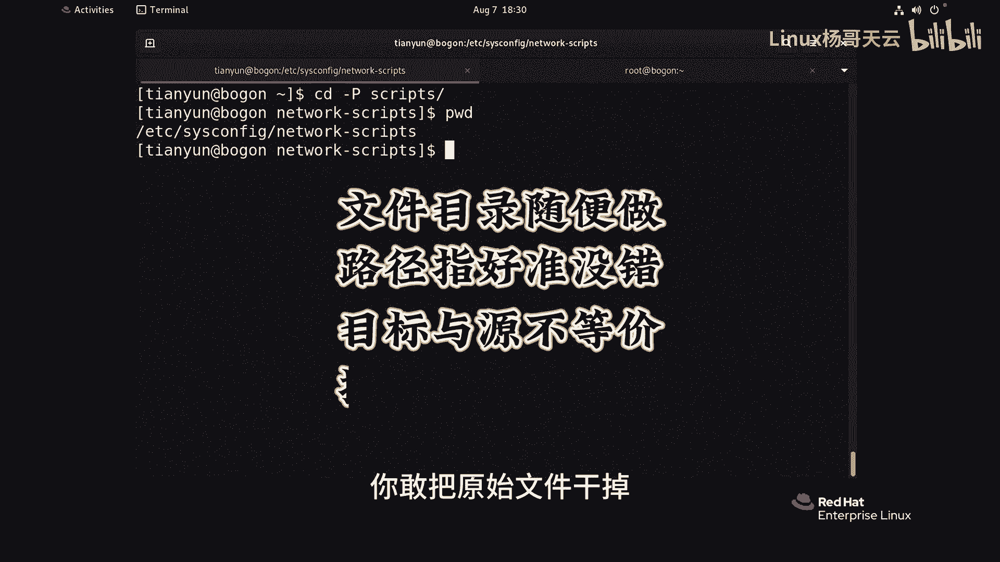

# Linux入门教程：21：文件链接-软链接 🔗


在本节课中，我们将要学习Linux系统中的一种重要文件类型——软链接（符号链接）。我们将了解它的创建方法、特点、与硬链接的区别，以及使用时的注意事项。

---

上一节我们介绍了硬链接，本节中我们来看看另一种链接方式——软链接。软链接，也称为符号链接，其功能非常灵活，可以为文件或目录创建。

以下是创建软链接的基本命令格式：
```bash
ln -s 源文件或目录 链接文件
```
其中，`-s` 选项代表创建软链接。

现在，我们通过一个演示来具体操作。假设当前有一个目录 `DRE`，里面包含文件 `file1` 到 `file10`。我们首先为文件创建一个软链接。

```bash
ln -s 猪猪侠.txt S_猪猪侠
```
使用 `ls -li` 命令查看，可以发现两个文件的inode编号完全不同，并且链接文件 `S_猪猪侠` 的名称会以淡蓝色显示，前面有一个 `l` 的标志，表示这是一个链接文件。它明确指向 `猪猪侠.txt`。

访问任何一个文件都没有问题。无论是访问原文件还是链接文件，内容都是一致的。修改任何一个文件，另一个也会同步变化。

---

接下来，我们看看如何为目录创建软链接。

```bash
ln -s DRE DIE_link
```
查看这个目录链接，同样会显示 `l` 标志。一个关键区别是：**软链接不会增加原始目录的链接计数**，这与硬链接不同。

在创建软链接时，建议使用**绝对路径**，以避免因相对路径在目录移动后可能导致的链接失效问题。

软链接的灵活性很强，一个原始文件可以对应多个软链接。但是，它也有一个显著的缺点。

---

如果删除了原始文件，会发生什么？

删除原始文件 `猪猪侠.txt` 后，软链接 `S_猪猪侠` 仍然存在，但其颜色通常会改变（例如变为红色），表示它成了一个“悬空链接”。此时访问该链接，会提示找不到文件。

然而，这里存在一个“陷阱”：如果在原位置**重新创建**一个同名文件 `猪猪侠.txt`（即使内容不同），那么之前“悬空”的软链接 `S_猪猪侠` 会立刻重新指向这个新文件，并恢复正常访问。这就像链接“找到了新的依靠”。

---

最后，我们探讨一个关于目录软链接的细节。当我们 `cd` 进入一个目录软链接时，默认进入的是**链接文件本身的路径**。

如果想直接进入软链接所指向的**真实物理目录**，需要使用 `cd -P` 命令。`-P` 选项代表遵循物理（physical）路径。

```bash
cd -P scripts_link
```

---



本节课中我们一起学习了软链接（符号链接）。我们掌握了它的创建命令 `ln -s`，理解了它与硬链接在inode、链接计数上的核心区别。我们认识到软链接可以为目录创建，使用灵活，但也需注意其依赖原始文件的特性——原始文件被删除会导致链接悬空。同时，我们了解了使用绝对路径创建以及 `cd -P` 命令进入真实目录等实用技巧。