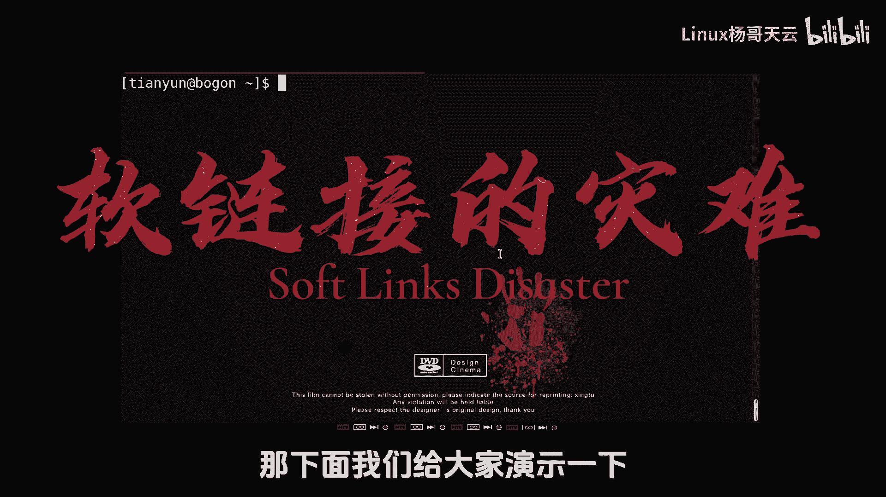
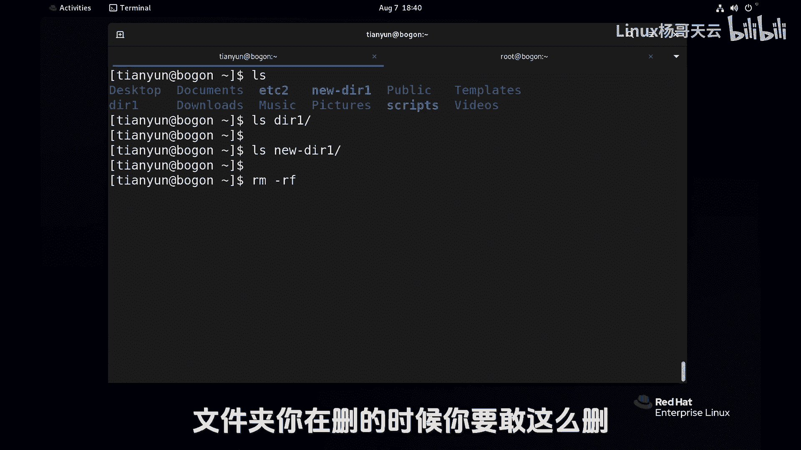
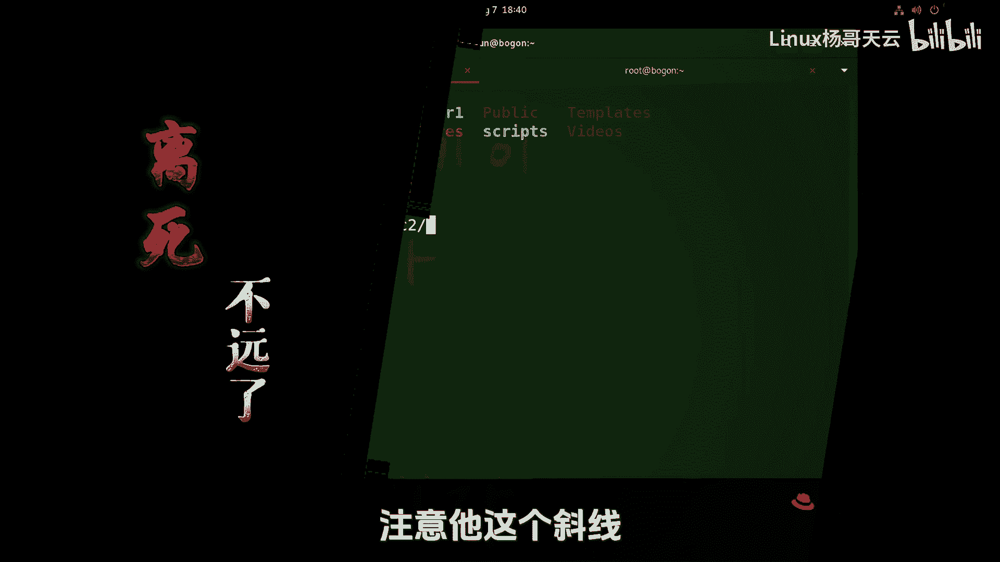
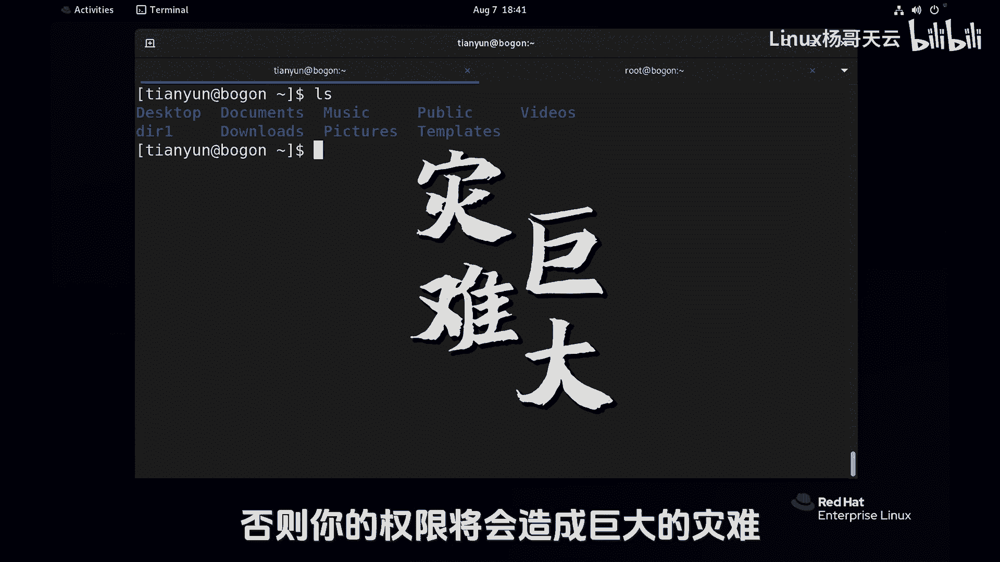
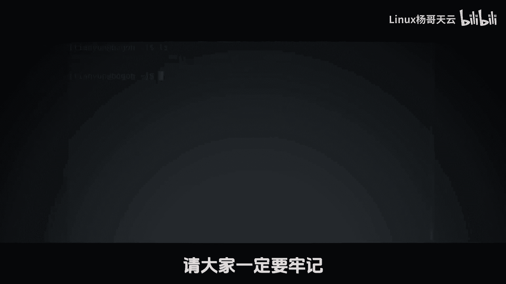

Linux入门与红帽认证RHCE：22：软链接的灾难 ⚠️


在本节课中，我们将要学习一个关于Linux软链接（符号链接）的重要且危险的细节。如果不注意，一个简单的删除操作可能导致灾难性的后果，特别是对于系统目录。本节将详细演示这个场景，并解释如何安全地删除指向目录的软链接。



上一节我们介绍了软链接的基本概念和创建方法，本节中我们来看看一个在删除软链接时可能遇到的“陷阱”。

### 软链接删除的风险演示

首先，软链接可以指向文件，也可以指向目录，并且支持跨文件系统。我们创建一个指向 `/etc` 系统目录的软链接来演示。

```bash
ln -s /etc EDC2
```

使用 `ls -l` 命令查看，可以看到 `EDC2 -> /etc`，这表示 `EDC2` 是一个指向 `/etc` 的软链接。

现在，问题来了：如何删除这个软链接 `EDC2`？

一个直觉的操作可能是使用 `rm -rf` 命令。但这里有一个关键细节需要注意。

**错误示范（针对目录软链接）**：
如果你在软链接路径末尾意外地加上了斜杠 `/`，命令的含义将发生根本改变。

```bash
# 危险操作！这将删除软链接指向的真实目录(/etc)下的内容。
rm -rf EDC2/
```

请注意命令中的 `EDC2/`（带斜杠）。系统会将其解析为“进入 `EDC2` 所指向的真实目录 `/etc`，然后删除该目录下的所有内容”。如果你以 `root` 用户身份执行此操作，将会清空至关重要的 `/etc` 目录，导致系统崩溃，这无疑是灾难性的。

### 安全删除软链接的方法



为了安全地删除软链接本身（而不是它指向的内容），**必须确保路径末尾没有斜杠 `/`**。



**正确操作**：
直接使用软链接的名称，不加斜杠。

```bash
# 安全操作：这将只删除软链接文件EDC2本身。
rm -rf EDC2
```

这个命令会移除 `EDC2` 这个链接文件，而不会影响其指向的 `/etc` 目录。

### 核心要点总结

以下是关于删除目录软链接的核心注意事项列表：
*   **危险模式**：命令 `rm -rf linkname/`（带斜杠）会删除软链接**指向的真实目录内的所有文件**。
*   **安全模式**：命令 `rm -rf linkname`（不带斜杠）只会删除**软链接文件本身**。



> **特别警告**：在删除指向目录（尤其是系统关键目录如 `/etc`、`/home`、`/var`）的软链接时，务必仔细检查命令，确保路径末尾没有多余的斜杠。对于 `root` 用户，这更是一个需要极度谨慎的操作。



本节课中我们一起学习了删除Linux目录软链接时的重大风险。关键点在于：**删除操作时，软链接路径后是否添加斜杠 `/`，将导致完全不同的结果**。请始终牢记，要删除软链接本身，应使用不带斜杠的路径名。养成这个习惯，可以避免许多不必要的系统灾难。