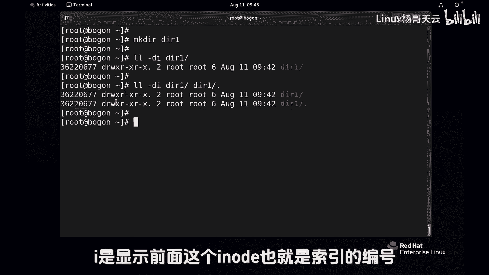

# Linux入门与RHCE认证：23：为什么根目录的链接次数是18？ 🔗


## 概述
在本节课中，我们将探讨Linux文件系统中一个有趣的细节：为什么根目录（`/`）的链接次数（link count）显示为18。我们将通过查看目录的`ls -ld`命令输出，理解链接次数的含义，并揭示它与目录中的`.`和`..`条目之间的关系。

---

## 根目录链接次数的观察
首先，我们使用`ls -ld`命令查看根目录的详细信息。请注意输出中的一个数字：`18`。这个数字代表根目录的链接次数。

```bash
ls -ld /
```

## 理解`.`和`..`目录
在Linux中，每个目录都包含两个特殊的隐藏条目：
*   `.`（点）：代表当前目录本身。
*   `..`（点点）：代表当前目录的父目录（上一级目录）。

对于根目录（`/`）而言：
*   `/`：根目录本身。
*   `/.`：根目录下的`.`，指向根目录自身。
*   `/..`：根目录下的`..`，由于根目录没有父目录，所以`/..`也指向根目录自身。

我们可以使用`ls -id`命令查看这三个路径的inode编号（文件系统内部标识符），会发现它们完全相同，证明它们指向同一个实体。

```bash
ls -id / /. /..
```

## 统计根目录下的`..`链接
上一节我们介绍了`.`和`..`的概念。本节中我们来看看根目录的链接次数是如何计算的。链接次数本质上统计的是有多少个目录条目指向同一个inode。

根目录下的许多子目录，它们的`..`条目都指向根目录。以下是查看这些`..`条目inode编号的命令：

```bash
ls -id /afs/.. /boot/.. /etc/.. /media/.. /opt/.. /root/.. /sys/.. /usr/.. /dev/.. /proc/.. /mnt/.. /srv/.. /tmp/.. /var/..
```

执行上述命令后，你会发现列出的所有`..`条目inode编号都与根目录的inode编号（例如128）一致。这意味着它们都是指向根目录的链接。

如果我们统计一下数量：
```bash
ls -id /afs/.. /boot/.. /etc/.. /media/.. /opt/.. /root/.. /sys/.. /usr/.. /dev/.. /proc/.. /mnt/.. /srv/.. /tmp/.. /var/.. | wc -l
```
结果是14个。加上根目录自身的`/`、`/.`、`/..`这3个条目，总数似乎是17个。但系统显示为18，这是为什么呢？

## 根目录的特殊性与动态验证
根目录比较特殊。在计算链接时，根目录自身的条目（`/`）可能只被计算一次，而`/.`和`/..`都被算作指向它的链接。加上子目录的14个`..`链接，以及可能存在的其他系统预留链接，共同构成了总数18。

我们可以通过动态创建和删除目录来验证链接次数的变化：
1.  在根目录下创建一个新目录`dir1`，然后立即查看根目录的链接次数，会发现它从18变成了19。
    ```bash
    mkdir /dir1
    ls -ld /
    ```
    这是因为`/dir1/..`这个新条目也指向了根目录，增加了一个链接。
2.  删除这个目录，链接次数会恢复为18。
    ```bash
    rm -rf /dir1
    ls -ld /
    ```

## 普通目录的链接次数
现在，让我们看看普通目录的链接次数规则。创建一个新目录`dir2`并查看其信息：

```bash
mkdir dir2
ls -ldi dir2
```

你会发现新目录的链接次数默认是**2**。这两个链接分别是：
1.  目录本身（`dir2`）。
2.  目录下的`.`条目（`dir2/.`）。

当在该目录下创建子目录时，由于子目录的`..`会指向它，其链接次数会增加。系统内部使用这种机制来管理目录结构，虽然用户通常不能手动为目录创建硬链接，但系统通过`.`和`..`自动维护着这些链接关系。

---



## 总结
本节课中我们一起学习了Linux根目录链接次数为18的原因。关键在于理解链接次数统计的是指向同一inode的目录条目数量。根目录的链接来自其自身的特殊条目（`/`、`/.`、`/..`）以及其所有一级子目录中的`..`条目。通过创建和删除目录，我们验证了链接次数的动态变化。同时，我们也了解到任何新建目录的默认链接次数为2，对应着目录自身及其内部的`.`条目。这深入揭示了Linux文件系统层次结构的内在联系。