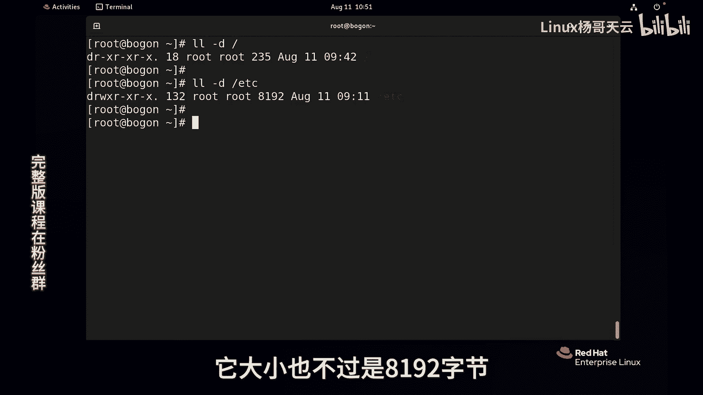
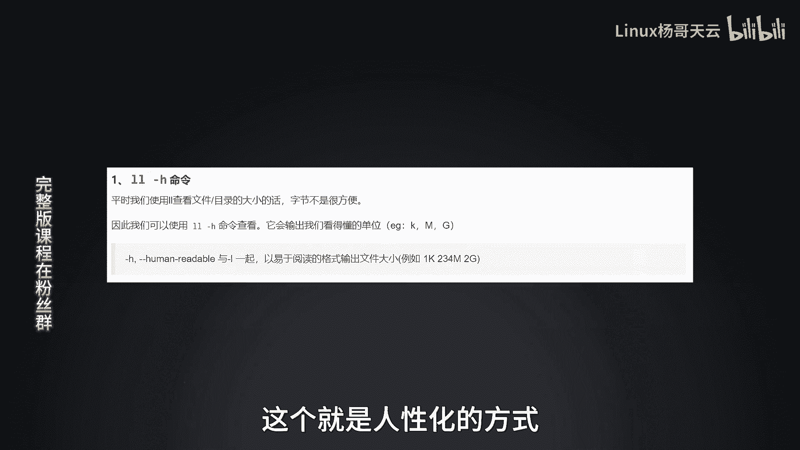
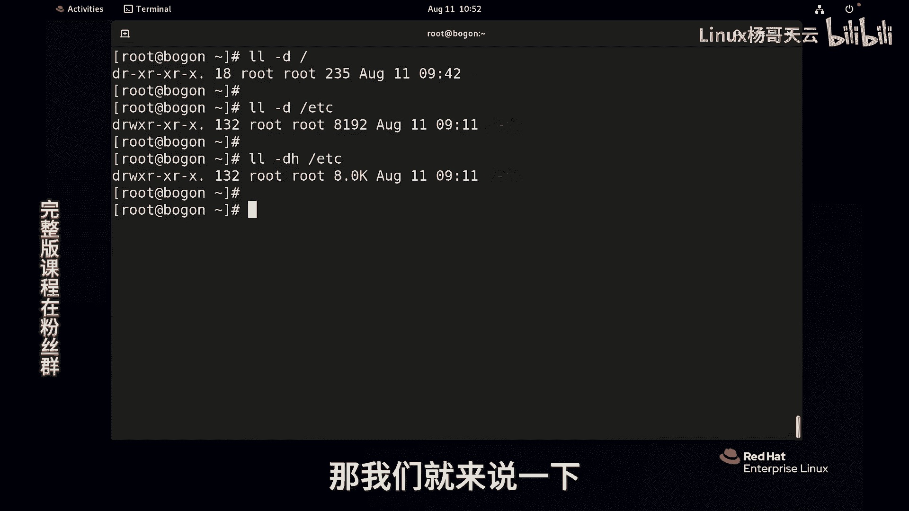
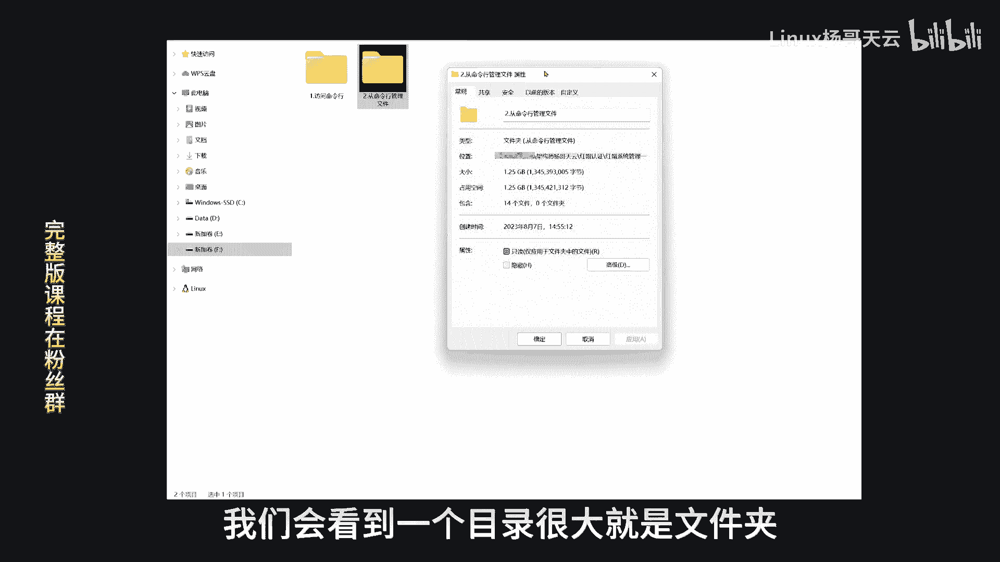
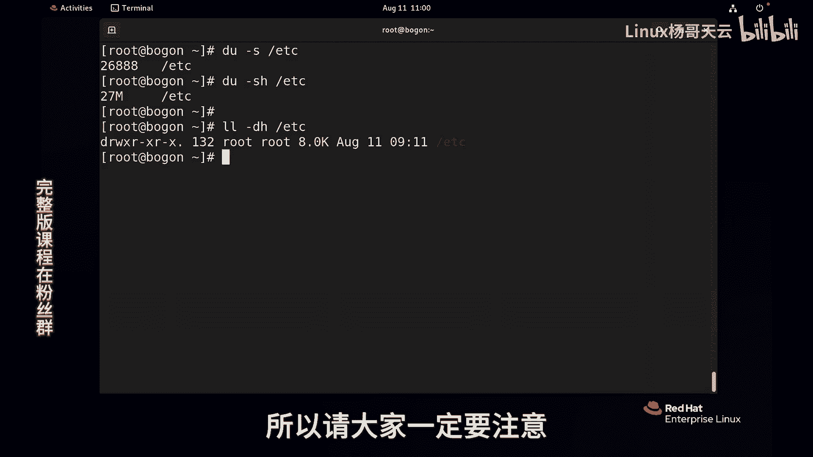

# Linux入门教程：P24：文件管理-为什么目录反而没有文件大？ 📁


在本节课中，我们将要学习一个Linux文件系统中看似矛盾的现象：为什么目录（文件夹）的大小显示得比其内部包含的文件还要小。我们将深入探讨目录的本质，并学习如何正确查看目录及其内容的大小。

---



## 目录的本质

上一节我们介绍了文件的基本属性，本节中我们来看看目录到底是什么。



在Windows系统中，查看一个文件夹的属性时，其大小通常是其内部所有文件大小的总和。但在Linux中，情况并非如此。Linux遵循“一切皆文件”的哲学，目录本身也是一个特殊的文件。



当我们使用 `ls -ld` 命令查看根目录 `/` 或 `/etc` 目录时，会发现它们的大小非常小，例如只有235字节或8KB。



```bash
ls -ld /
ls -ld /etc
```

这与我们通常对“文件夹”的认知不同。目录文件内部存储的并不是其子文件的实际数据内容。

## 目录里存储了什么？

为了理解目录的大小，我们需要知道目录文件里到底存储了什么。

目录文件的内容类似于一本书的目录页。它不存储章节（文件）的具体内容，而是存储了章节名（文件名）和对应的页码（在Linux中称为inode号）。inode是文件系统中用于存储文件元数据（如权限、所有者、数据块位置等）的数据结构。

我们可以使用 `ls -i` 命令查看文件名及其对应的inode号。

```bash
ls -i /etc | less
```

以下是目录文件内部存储结构的简化表示：

```
文件名1 -> inode号1
文件名2 -> inode号2
文件名3 -> inode号3
...
```

因此，目录文件本身只占用很小的空间来存储这些“文件名-inode号”的映射关系。它并不包含其下任何文件的实际数据，也不包含更深层次子目录的文件列表。

## 如何查看目录及其内容的真实大小？

既然 `ls -ld` 查看的是目录文件本身的大小，那么如何查看一个目录连同其所有子文件和子目录的总大小呢？

我们可以使用 `du` (disk usage) 命令。`du` 命令用于估算文件或目录占用的磁盘空间。

*   **查看目录下每个项目的占用情况**：直接使用 `du /etc` 会列出 `/etc` 下每个文件和目录的大小，输出内容较多。
*   **查看目录的总大小**：使用 `-s` (summary) 选项可以只显示总计。
*   **以人类易读的格式显示**：使用 `-h` (human-readable) 选项，将字节数转换为K、M、G等单位。

以下是查看 `/etc` 目录总大小的命令：

```bash
du -sh /etc
```

这个命令显示的数字，才更接近我们通常理解的“文件夹大小”，即该目录下所有内容占用的磁盘空间总和。

---

## 总结

本节课中我们一起学习了Linux目录大小的奥秘。

*   **目录本身是一个文件**，它存储的是其直接子项的“文件名”到“inode号”的映射列表，因此本身很小。
*   **`ls -ld` 命令**查看的是这个目录文件自身的大小。
*   **`du -sh` 命令**查看的是目录及其所有内容占用的总磁盘空间。
*   理解目录与文件大小的区别，有助于更深入地理解Linux“一切皆文件”的设计思想和文件系统的工作原理。



不要将目录想象成一个必须容纳所有内容的大容器，它更像是一份精准的索引或地图，指引系统找到实际存储数据的位置。