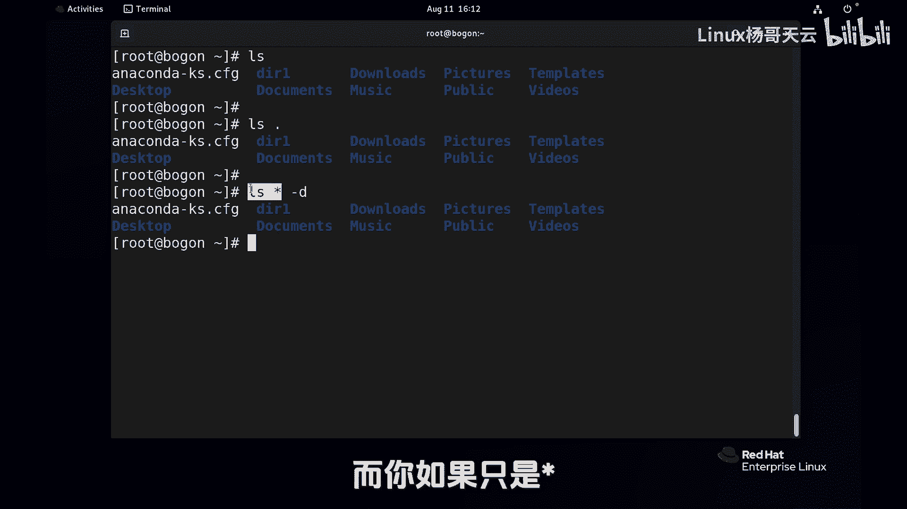
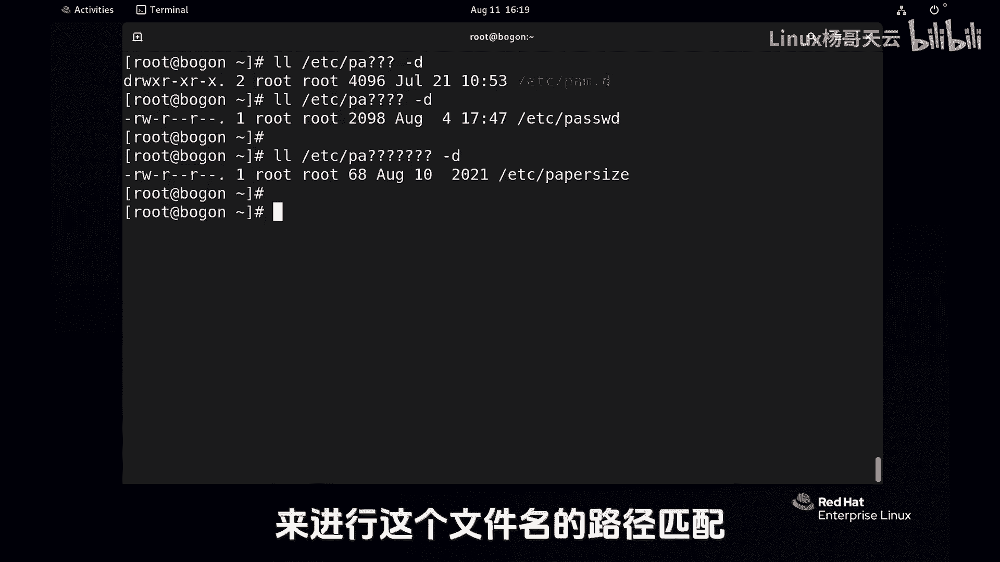
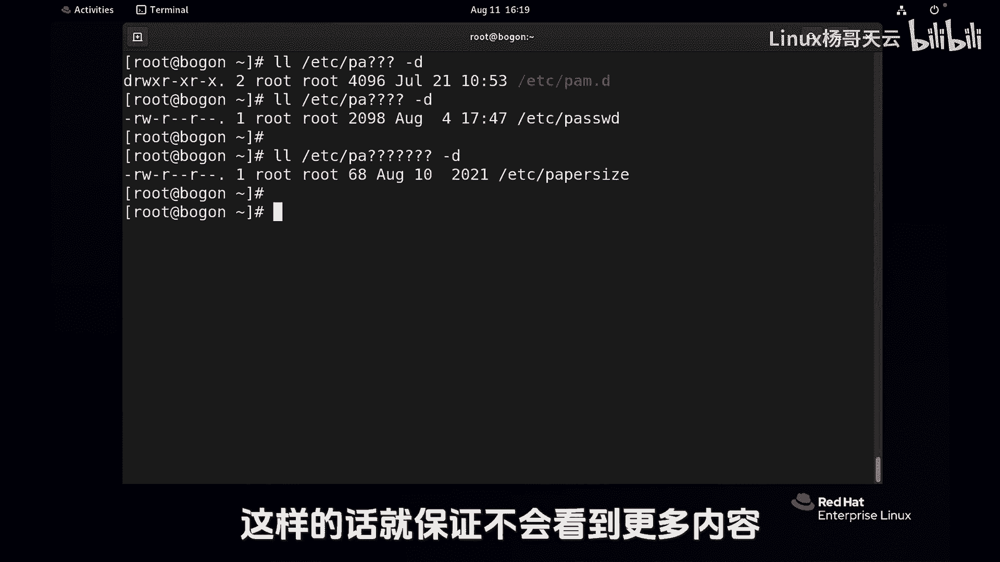

# Linux入门教程：P25：使用Shell扩展匹配文件名-路径名扩展 🚀


在本节课中，我们将要学习Shell扩展中的一个重要部分——路径名扩展。掌握它可以帮助我们高效地匹配和操作文件，是提升Linux命令行管理效能的关键。


## 概述


要想提高Linux Shell的管理效能，必须了解Shell扩展。Shell扩展包括大括号扩展、波浪线扩展、变量扩展、命令替换以及路径名扩展。这些功能可以帮助我们完成一些比较复杂的任务，同时提高工作效率。

首先，我们先来看一下路径名扩展。路径名扩展会用到像星号、问号以及方括号这几个特殊字符。大家在学习时，一定要注意尽量保持和我当前的环境一致。

## 准备测试环境

目前我们处于一个干净的状态，并且是管理员身份。首先，创建一个测试目录，例如叫`dir1`，并进入这个目录。

```bash
mkdir dir1
cd dir1
```

为了学习，我们先创建一些测试用的文件。

```bash
touch file1 file2 file3 file1.txt file2.txt file3.txt filea.txt fileb.txt 杨哥.txt 杨哥.log
```

下面我们就来看看如何使用路径名扩展来操作这些文件。

## 使用问号（`?`）进行扩展

例如，我们现在要查看`file1`、`file2`、`file3`这三个文件。传统的方式是逐个列出。

```bash
ls file1 file2 file3
```

但实际上，我们可以使用路径名扩展。首先介绍问号（`?`）。在路径名扩展中，问号表示一个任意字符。

```bash
ls file?
```

这个命令会列出所有以`file`开头，后面紧跟一个任意字符的文件，例如`file1`、`file2`、`file3`、`filea`、`fileb`。

## 使用星号（`*`）进行扩展

星号（`*`）与问号不同，它表示任意多个字符（包括零个字符）。

```bash
ls file*
```

这个命令会列出所有以`file`开头的文件。星号的位置很灵活，也可以放在前面或中间。

```bash
ls *.txt
ls *a*
```

星号是使用最多的通配符。例如，批量删除所有`.txt`文件：

```bash
rm -rf *.txt
```

## 使用方括号（`[]`）进行扩展

方括号用于匹配括号内指定的一个字符。

```bash
ls file[12]
```

这个命令会列出`file1`和`file2`。方括号匹配的是其中任意一个字符。

方括号内还可以使用指数符号（`^`）或叹号（`!`）进行反向选择，表示“不匹配”括号内的字符。

```bash
ls file[^12]
# 或
ls file[!12]
```

这个命令会列出`file3`、`filea`、`fileb`等，即不是`file1`也不是`file2`的文件。

## 路径名扩展的注意事项

上一节我们介绍了三种基本的通配符。本节中我们来看看在实际使用中需要注意的一个关键点。

当我们使用通配符时，它不仅会匹配文件，也会匹配目录。这有时会导致意想不到的结果。

例如，在`dir1`目录中执行：

```bash
ls *
```

这个命令不仅会列出当前目录的文件，如果匹配到子目录（如`dir1`本身不存在子目录，但若有），还会列出子目录下的内容。这是因为`*`匹配到了目录名，`ls`命令会去显示该目录的内容。

为了避免这种情况，如果我们只想查看匹配到的项目本身（不递归显示子目录内容），可以使用`-d`选项。



```bash
ls -d *
```


`-d`选项的意思是“只显示目录条目本身”，而不是其内容。

## 实际目录操作示例

接下来，我们来看一个更真实的例子，操作`/etc`目录。

列出`/etc`目录下所有以`pa`开头的条目：

```bash
ls -d /etc/pa*
```

如果不加`-d`选项：

```bash
ls /etc/pa*
```

你会发现，如果匹配到了目录（如`/etc/pam.d`），命令会继续列出该目录下的所有文件，这可能不是你想要的结果。加上`-d`选项后，就只会显示以`pa`开头的目录和文件本身。

同样，使用问号时也应注意：

```bash
ls -d /etc/pa????
```

在实际使用中，根据你的需求决定是否添加`-d`选项。如果你明确想查看目录下的内容，则不需要加`-d`。

## 总结



本节课中我们一起学习了Shell的路径名扩展，这是提高命令行效率的重要工具。


我们主要学习了三个通配符：
*   **问号 `?`**：匹配任意一个字符。
*   **星号 `*`**：匹配任意多个字符（包括零个）。
*   **方括号 `[]`**：匹配括号内指定的一个字符。可以使用`^`或`!`进行反向匹配。



此外，我们还学习了在使用通配符时，如果不想让命令递归显示匹配到的目录下的内容，可以使用`ls -d`命令。在实际操作中，灵活运用这些通配符和选项，可以极大地简化文件管理任务。