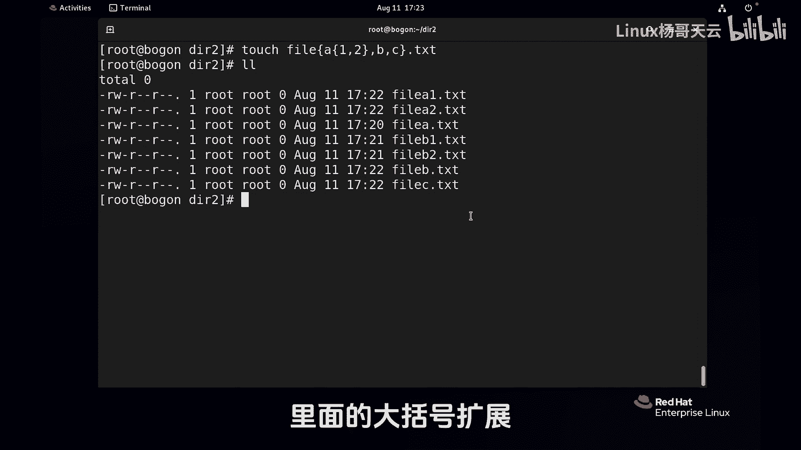

# Linux入门教程：P26：使用Shell扩展匹配文件名-大括号扩展

## 概述


在本节课中，我们将学习Shell扩展中一个非常实用且强大的功能——大括号扩展。它可以帮助我们高效地生成一系列文件名或路径，从而简化文件创建、复制、移动等操作。

---


## 准备场景

首先，我们找一个空目录来演示。这个目录目前是空的。


```bash
mkdir test_dir && cd test_dir
ls
```

## 大括号扩展的基本用法

大括号扩展主要使用两种符号：`..` 表示范围，`,` 表示枚举。

### 1. 使用 `..` 创建数字序列

假设我们需要创建 file1 到 file10 这十个文件。传统方法需要逐个输入文件名，而使用大括号扩展可以极大地简化操作。

以下是创建 file1 到 file10 的命令：

```bash
touch file{1..10}
ls
```

执行后，系统会高效地生成 file1, file2, ..., file10 这十个文件。

### 2. 使用 `..` 创建字母序列

同样地，我们也可以生成字母序列。例如，生成 fileA 到 fileZ：

```bash
touch file{A..Z}
ls
```

这将创建 fileA, fileB, fileC, ..., fileZ 等一系列文件。

### 3. 使用 `,` 枚举特定项目

除了范围，我们还可以使用逗号 `,` 来枚举特定的、不连续的项目。例如，创建名为“杨哥AA”、“杨哥BB”、“杨哥CC”、“杨哥DD”的文件：

```bash
touch 杨哥{AA,BB,CC,DD}
ls
```

这里，逗号隔开的每个部分都会与前面的“杨哥”组合，生成独立的文件名。

---

## 大括号扩展的高级应用

上一节我们介绍了大括号扩展的基本语法，本节中我们来看看它在处理文件路径时的强大简化能力。

### 简化文件路径操作

假设我们需要将一个路径很长的文件复制一份并重命名。例如，复制 `/etc/sysconfig/network-scripts/ifcfg-ens33` 文件为 `/etc/sysconfig/network-scripts/ifcfg-ens33.back`。

传统命令需要输入两次长路径：

```bash
cp /etc/sysconfig/network-scripts/ifcfg-ens33 /etc/sysconfig/network-scripts/ifcfg-ens33.back
```

使用大括号扩展，我们可以将相同的路径部分合并，极大地简化命令：

```bash
cp /etc/sysconfig/network-scripts/ifcfg-ens33{,.back}
```

这个命令的原理是：大括号内的逗号将参数分为两部分。第一部分为空，代表原文件名 `ifcfg-ens33`；第二部分为 `.back`，代表在原文件名后追加 `.back`。因此，这个命令等价于上面的长命令。

为了更清晰地看到过程，可以加上 `-v` 参数：

```bash
cp -v /etc/sysconfig/network-scripts/ifcfg-ens33{,.back}
```

这种方法同样适用于 `mv`（移动/重命名）等操作。

---

## 大括号扩展的组合嵌套

大括号扩展支持嵌套组合，可以创建更复杂的模式。以下是其组合方式：

假设我们想创建以下文件：`fileA1.txt`, `fileA2.txt`, `fileB1.txt`, `fileB2.txt`。

我们可以使用嵌套的大括号来实现：

```bash
touch file{A,B}{1,2}.txt
ls
```

让我们分析一下这个命令：
*   外层的 `{A,B}` 会先展开为 `A` 和 `B`。
*   对于每个外层结果，内层的 `{1,2}` 会再展开。
*   最终组合生成：`fileA1.txt`, `fileA2.txt`, `fileB1.txt`, `fileB2.txt`。

我们再来看一个更复杂的例子：

```bash
touch file{A,{B,C}}.txt
```

这个命令的结果是：
*   首先展开 `{A,{B,C}}`，得到 `A`, `B`, `C`。
*   然后与前面的 `file` 和后面的 `.txt` 组合。
*   最终生成：`fileA.txt`, `fileB.txt`, `fileC.txt`。

---

## 总结

本节课中我们一起学习了Shell扩展中的大括号扩展功能。



我们掌握了以下核心要点：
*   **基本语法**：使用 `{x..y}` 生成连续范围，使用 `{a,b,c}` 枚举特定项目。
*   **路径简化**：利用 `{原字符串, 新后缀}` 的格式，可以高效地复制或重命名文件，避免重复输入长路径。
*   **组合嵌套**：大括号可以嵌套使用，以生成复杂的文件名组合模式。

大括号扩展是一个非常实用的工具，能够显著提升在命令行中处理批量文件操作的效率。请务必熟悉并掌握其用法。