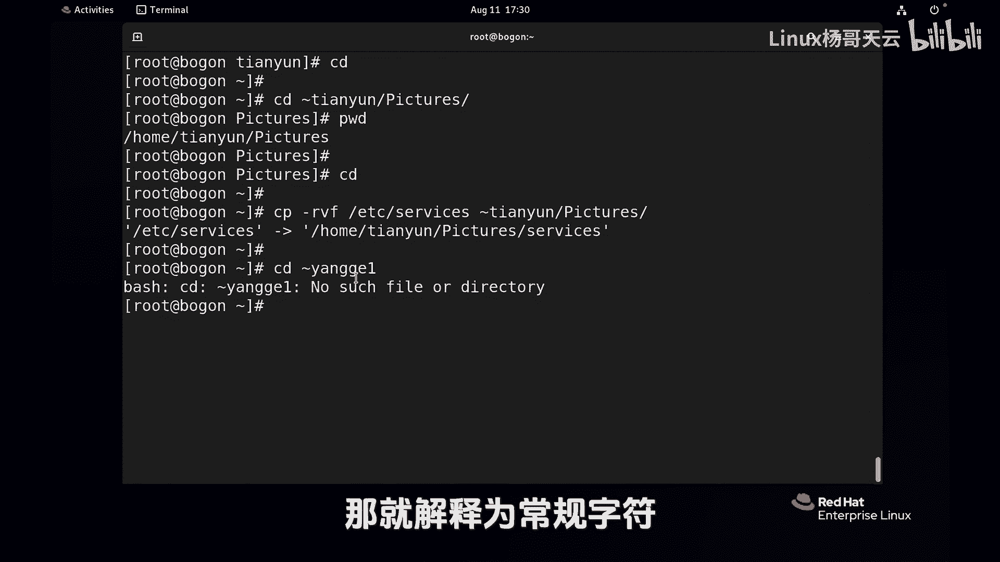
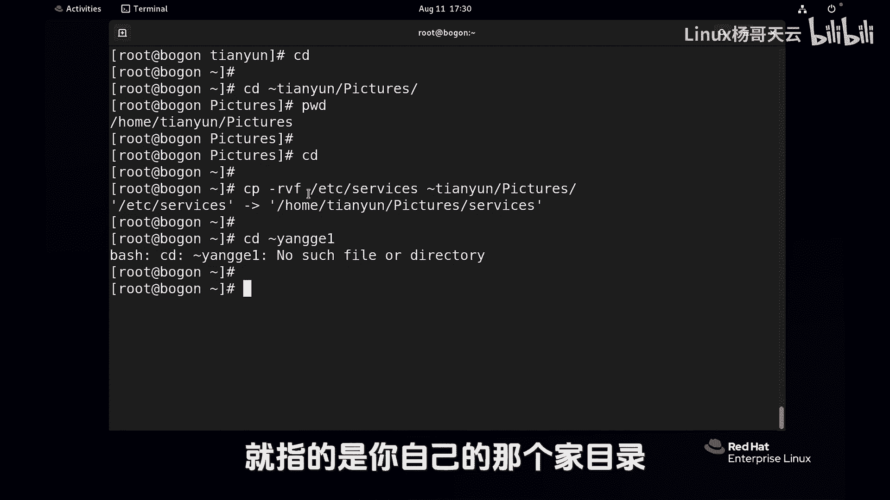
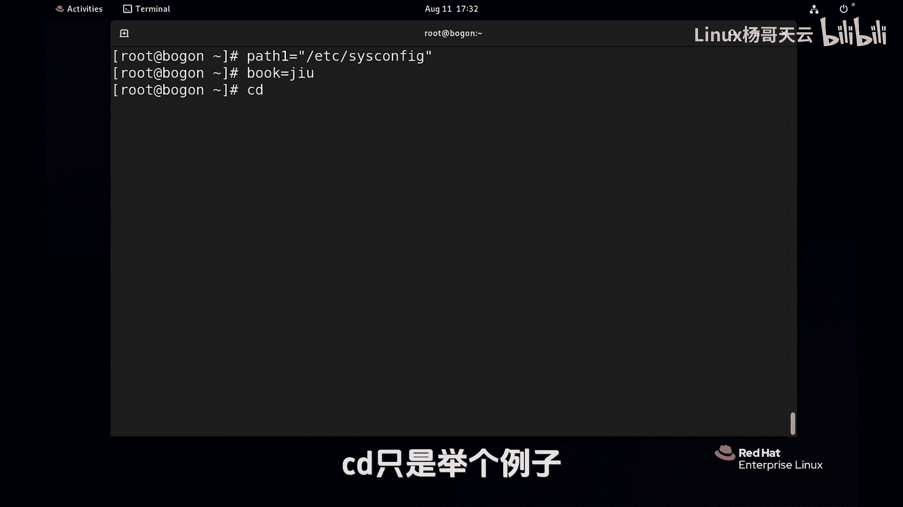
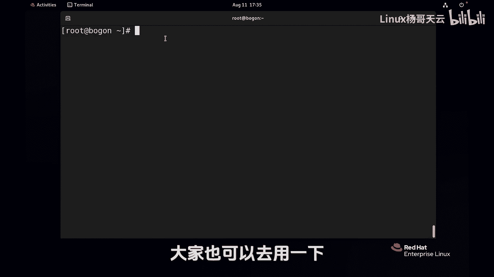

# Linux入门教程：P27：使用Shell扩展匹配文件名-波浪线扩展


## 概述
在本节课中，我们将学习Shell扩展中的波浪线扩展和变量扩展。这两种扩展能帮助我们更高效地指定文件路径和引用预设值，是Shell操作中非常实用的技巧。


---

## 波浪线扩展

上一节我们介绍了Shell扩展的概念，本节中我们来看看波浪线扩展的具体用法。

波浪线 `~` 在Shell中代表用户的家目录。例如，命令 `cd ~` 会切换到当前用户的家目录。

波浪线后可以跟上具体的用户名，以指定该用户的家目录。例如，`cd ~root` 会切换到root用户的家目录。如果当前用户是管理员root，也可以切换到其他用户的家目录，例如 `cd ~tianyun` 会切换到用户tianyun的家目录（`/home/tianyun`）。



不仅 `cd` 命令可以使用波浪线扩展，任何涉及文件路径的操作都可以使用。例如，将文件复制到指定用户的家目录下：
```bash
cp /etc/services ~tianyun/
```
这条命令会将 `/etc/services` 文件复制到用户tianyun的家目录中。


如果波浪线后的用户名不存在，Shell会将其解释为普通字符，而不是路径扩展。



单独一个波浪线 `~` 代表的是当前用户的家目录。


---

## 变量扩展

了解了波浪线扩展后，我们接着学习另一种强大的扩展方式：变量扩展。



变量由变量名和变量值两部分组成。我们可以自定义变量，例如：
```bash
path1="/etc/sysconfig"
book="九阴真经"
```
定义变量时，如果值中包含特殊字符（如斜线），建议使用双引号将其括起来。


要使用定义好的变量，需要在变量名前加上美元符号 `$`。引用变量时，可以使用大括号 `{}` 将变量名括起来，也可以直接使用。

以下是引用变量的示例：
```bash
echo $path1
cd $path1
cp /etc/services $path1/
```
第一条命令会显示变量 `path1` 的值。第二条命令会切换到变量 `path1` 所代表的目录。第三条命令会将文件复制到该目录。

除了自定义变量，系统还预定义了许多环境变量。例如：
*   `$USER` 代表当前用户名。
*   `$HOSTNAME` 代表主机名。

我们可以使用 `echo` 命令查看这些变量的值：
```bash
echo $USER
echo $HOSTNAME
```

---

## 总结
本节课中我们一起学习了Shell的两种扩展方式。
1.  **波浪线扩展**：使用 `~` 可以快速指向当前用户或指定用户的家目录，简化路径输入。
2.  **变量扩展**：通过定义和使用变量（`$变量名`），我们可以存储和引用常用的值（如路径），使命令更加灵活和可维护。



掌握这两种扩展，能显著提升在Linux命令行下的操作效率。