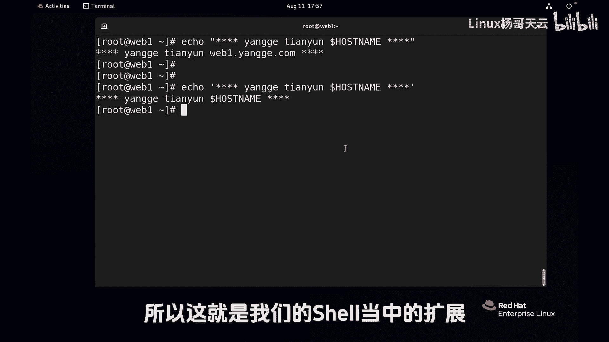
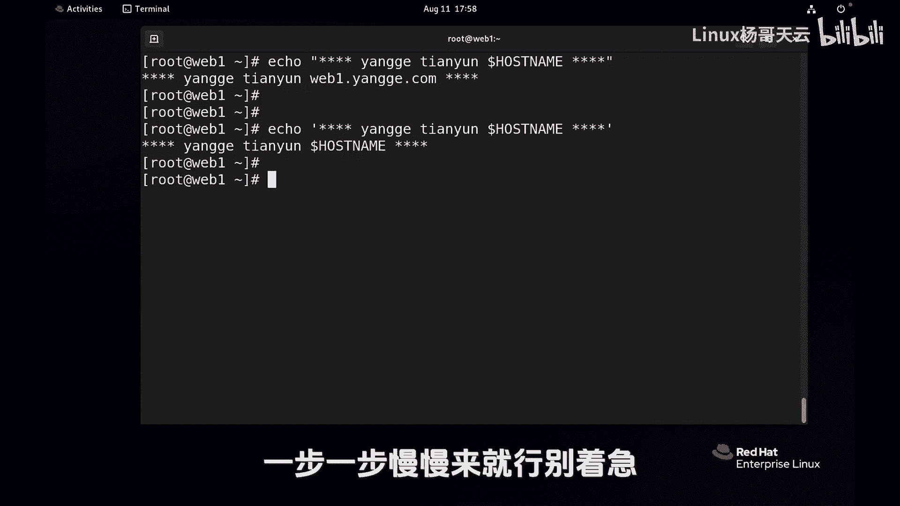

# Linux入门教程：P28：使用Shell扩展匹配文件名与变量替换


在本节课中，我们将学习Shell中的命令替换、转义字符以及引号的使用。这些技巧对于编写脚本、处理文件名和变量至关重要。


## 命令替换

上一节我们介绍了变量扩展，本节中我们来看看如何将命令的执行结果作为参数使用，这称为命令替换。

命令替换允许我们将一条命令的输出嵌入到另一条命令或赋值中。这在需要动态生成内容（如以当前日期命名文件）时非常有用。

以下是命令替换的两种语法：

*   **现代推荐语法**：`$(command)`
*   **传统语法（不推荐）**：`` `command` ``

例如，我们想创建一个以当前日期命名的文件。如果直接写死日期，脚本就无法适应每天的变化。这时就需要使用命令替换。

```bash
# 直接使用date命令获取日期
date +%F
# 输出：2023-08-11

# 错误示例：试图直接使用命令输出作为文件名的一部分
touch date +%F.backup
# 这会被解释为多个参数，无法创建正确文件

# 正确示例：使用命令替换
touch $(date +%F).backup
# 或使用传统语法（不推荐）
touch `date +%F`.backup
```

执行上述命令后，会创建一个名为 `2023-08-11.backup` 的文件。`$(date +%F)` 会被替换为 `date +%F` 命令的执行结果。明天再执行，就会生成 `2023-08-12.backup` 文件。

> **注意**：官方建议使用 `$(command)` 语法，因为它更清晰，且能避免与单引号混淆。

## 转义字符（反斜线 `\`）

接下来，我们学习如何使用反斜线 `\` 来“转义”特殊字符，使其失去特殊含义，变为普通字符。

反斜线 `\` 的作用是防止其后面的**一个**字符被Shell扩展。你可以把它想象成一个“紧身符”，必须紧贴在需要“保护”的字符前面。

例如，变量 `$HOSTNAME` 会被扩展为主机名。如果我们想原样输出 `$HOSTNAME` 这个字符串，而不是它的值，就需要转义 `$` 符号。

```bash
# 变量扩展
echo $HOSTNAME
# 输出：yangge.tianyun.com

# 使用转义字符，阻止变量扩展
echo \$HOSTNAME
# 输出：$HOSTNAME
```

另一个常见场景是创建或处理带有空格的文件名。在Shell中，空格通常用于分隔参数。

```bash
# 错误示例：这会被认为是创建两个文件
touch 杨哥 天云.txt

# 方法一：使用引号（后续会讲）
touch “杨哥 天云.txt”

# 方法二：使用转义字符，让空格失去参数分隔符的作用
touch 杨哥\ 天云.txt
```

现在，我们成功创建了一个名为 `杨哥 天云.txt` 的文件。要删除它，同样需要处理空格：

```bash
# 错误示例：试图删除两个不存在的文件
rm 杨哥 天云.txt

# 正确示例：使用转义字符
rm 杨哥\ 天云.txt
```

转义字符还可以用于续行。当一条命令很长时，可以在行尾使用 `\` 后按回车，表示命令在下一行继续，而不是立即执行。

```bash
# 这是一条完整的命令，被分成三行书写
ls -l \
/etc/hostname \
/home
```

在上面的例子中，每行末尾的 `\` 转义了其后的回车符，使Shell知道命令尚未结束。最后一行没有 `\`，按下回车后，整条命令 `ls -l /etc/hostname /home` 才被执行。

## 引号：单引号与双引号

最后，我们来区分单引号 `‘’` 和双引号 `“”` 的作用。它们都用于定义一个字符串，但对字符串内容的处理方式不同。

**双引号 `“”` （弱引用）**：会解释字符串中的**变量**（`$VAR`）和**某些特殊字符**（如 `\`），但不会解释**通配符**（如 `*`, `?`）。

```bash
# 双引号内，变量会被扩展
echo “主机名是：$HOSTNAME”
# 输出：主机名是：yangge.tianyun.com

# 双引号内，通配符*被视为普通字符
echo “当前目录有文件：*.txt”
# 输出：当前目录有文件：*.txt （不会列出.txt文件）
```

**单引号 `‘’` （强引用）**：会原样输出引号内的所有内容，不进行任何解释（变量、通配符、转义符都无效）。

```bash
# 单引号内，所有内容都原样输出
echo ‘主机名是：$HOSTNAME’
# 输出：主机名是：$HOSTNAME

echo ‘当前目录有文件：*.txt’
# 输出：当前目录有文件：*.txt
```

> **比喻**：单引号像一个“金钟罩”，里面的任何字符都无法“作妖”，是什么就输出什么。双引号则像一个“滤网”，只允许变量和部分转义通过，但会挡住通配符。



选择哪种引号取决于你的需求：
*   当需要原封不动地输出一个字符串时，使用**单引号**。
*   当需要在字符串中嵌入变量值时，使用**双引号**。

---


本节课中我们一起学习了Shell扩展的三个重要概念：
1.  **命令替换**：使用 `$(command)` 将命令输出作为值使用。
2.  **转义字符**：使用 `\` 来取消紧跟其后的一个字符的特殊含义。
3.  **引号**：使用 `‘’` 进行强引用（不解释任何内容），使用 `“”` 进行弱引用（解释变量和部分转义）。



这些是Shell编程和日常命令操作的基础，请结合之前的通配符（`*`, `?`, `[]`, `{}`）、波浪线 `~` 和变量扩展多加练习，后续课程中我们会灵活运用这些知识。