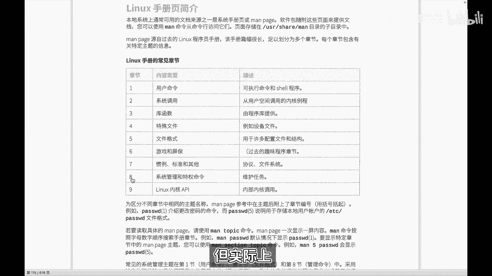
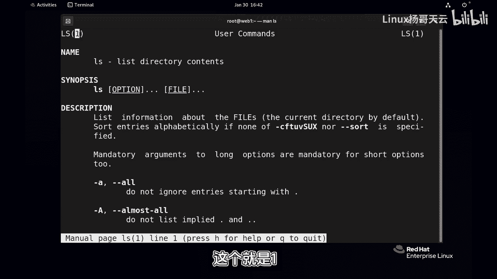
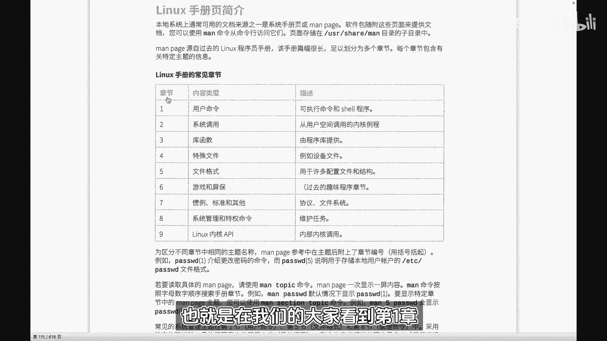
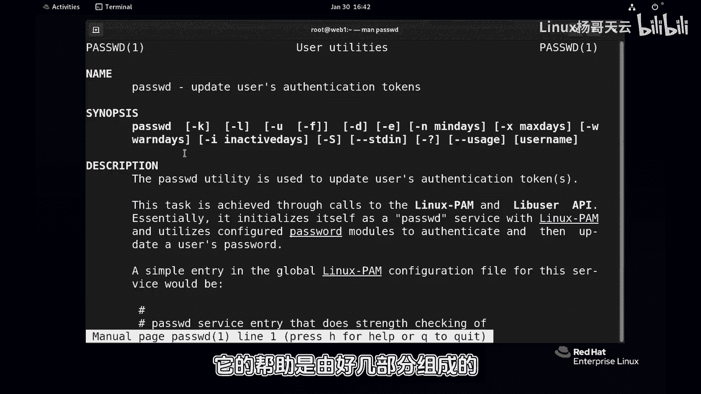
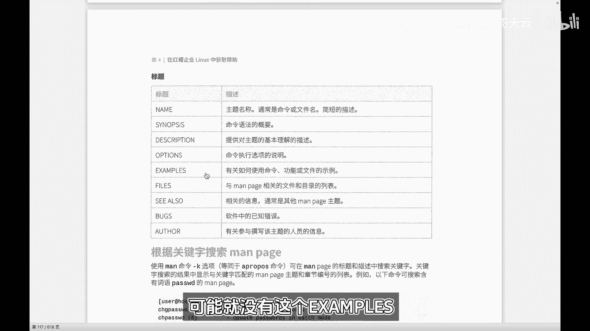
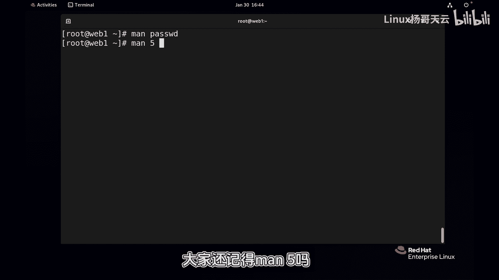
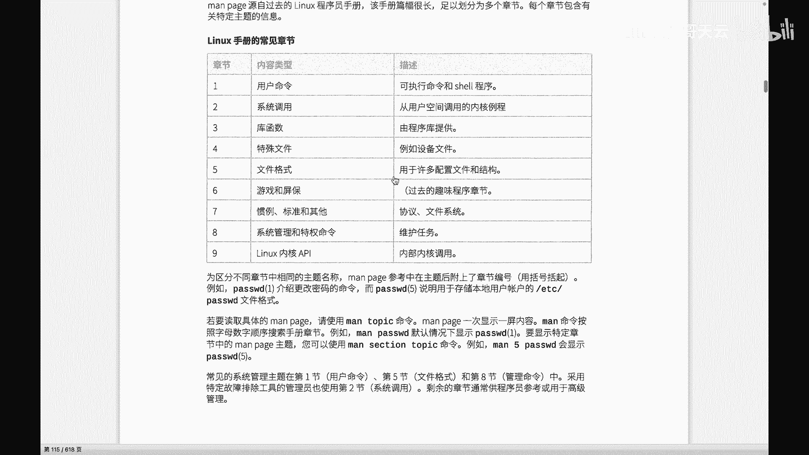
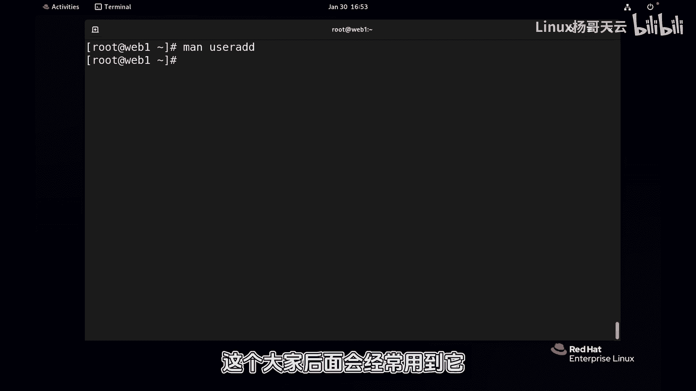

# Linux入门教程：29：Linux帮助man 📖

## 概述
在本节课中，我们将学习Linux系统中一个极其重要的工具——`man`命令。`man`是“manual”（手册）的缩写，它是获取命令、配置文件格式等详细帮助信息的主要途径。对于初学者和运维人员来说，熟练使用`man`是解决未知命令用法和理解系统配置的关键。

## man的章节概念
上一节我们介绍了Linux命令的基本使用，本节中我们来看看如何获取命令的详细帮助。`man`手册的内容被分成了不同的章节，每个章节存放特定类型的帮助信息，就像图书馆里不同类别的书架。

以下是`man`手册的主要章节及其含义：




*   **1：用户命令** - 存放普通用户可执行的命令帮助，例如 `ls`, `cp`。
*   **2：系统调用** - 存放内核提供的函数接口帮助，供开发人员使用。
*   **3：库函数** - 存放标准C库等函数帮助，供开发人员使用。
*   **4：特殊文件** - 存放`/dev`目录下设备文件的帮助。
*   **5：文件格式** - **存放配置文件格式的说明**，例如 `/etc/passwd` 文件的结构。
*   **6：游戏** - 存放游戏相关帮助。
*   **7：杂项** - 存放其他难以归类的帮助，例如宏包、文件系统类型。
*   **8：系统管理命令** - 存放**只有管理员（root）才能执行**的命令帮助，例如 `useradd`, `fdisk`。

对于Linux运维人员，最常用的是 **1**（用户命令）、**5**（文件格式）和 **8**（管理员命令）这三个章节。

## 基本用法：查看命令帮助
让我们从最基础的用法开始。使用`man`命令查看一个命令的帮助非常简单。





**语法**：`man [章节号] <命令名或配置文件名>`



例如，查看 `ls` 命令的帮助：
```bash
man ls
```
执行后，会进入一个全屏的阅读界面。这个界面通常包含以下部分：
*   **NAME（名称）**：命令的名称及简要说明。
*   **SYNOPSIS（概要）**：命令的语法格式。**方括号 `[ ]` 内的内容表示是可选的**。
*   **DESCRIPTION（描述）**：命令功能的详细描述。
*   **OPTIONS（选项）**：命令各个参数选项的详细解释。
*   **EXAMPLES（示例）**：一些使用示例（并非所有命令都有）。



在这个界面中，你可以使用以下按键进行操作：
*   **上下箭头键**：逐行滚动。
*   **Page Up / Page Down**：翻页。
*   **`/` + 关键词**：向下搜索关键词，按 `n` 查找下一个，按 `N` 查找上一个。
*   **`q`**：退出帮助页面。



## 处理同名帮助：指定章节号
有时，不同的章节里可能存在同名的帮助条目。例如，`passwd` 既是一个命令（修改用户密码），也是一个配置文件（`/etc/passwd`，存储用户信息）。



如果不指定章节，`man` 默认显示编号最小的章节中的内容。
```bash
man passwd
```
默认会显示 **第1章节** 的 `passwd` 命令帮助。

如果你想查看 **第5章节** 的 `passwd` 配置文件格式帮助，就需要明确指定章节号：
```bash
man 5 passwd
```
这样就会显示关于 `/etc/passwd` 文件结构的详细说明，包括每个字段的含义。

## 搜索帮助条目：man -k
那么，如何知道一个主题在哪个章节有帮助呢？这时可以使用 `man -k` 命令进行搜索。

**语法**：`man -k <关键词>`

这个命令会在所有手册页的**名称和简短描述**中搜索包含该关键词的条目，并列出它们所在的章节。

例如，搜索与 `passwd` 相关的帮助：
```bash
man -k passwd
```
输出可能类似：
```
passwd (1)            - update user‘s authentication tokens
passwd (5)            - password file
```
从结果可以清楚地看到，`passwd` 在章节1和章节5都有帮助。你可以根据需求选择查看哪一个。

> **注意**：`man -k` 依赖于一个名为 `mandb` 的索引数据库。如果系统是新安装的或很久未更新，可能需要先运行 `sudo mandb` 命令来建立或更新索引。

## 其他帮助方式
虽然 `man` 功能强大且详细，但对于简单的命令，使用 `--help` 或 `-h` 选项获取快速帮助通常更便捷。
```bash
ls --help
```
`--help` 输出的信息通常更简洁，直接列出了命令的所有选项和简要说明，适合快速查阅。



## 总结
本节课中我们一起学习了Linux中强大的帮助工具 `man`。我们了解了`man`手册的章节分类，掌握了使用`man <名称>`查看帮助、使用`man <章节号> <名称>`指定章节查看同名帮助，以及使用`man -k <关键词>`搜索相关帮助条目的方法。同时，我们也知道了`--help`选项可以作为快速参考的补充。熟练运用这些帮助工具，将是你探索和掌握Linux世界的得力助手。