**Linux入门教程：P2：Linux系统安装包：Red Hat Enterprise Linux 与 CentOS Stream 9** 🐧

在本节课中，我们将要学习如何获取Linux操作系统。学习Linux的第一步是拥有一个可用的Linux系统。本节将介绍两个主流的Linux发行版：Red Hat Enterprise Linux和CentOS Stream 9，并指导你如何获取它们。

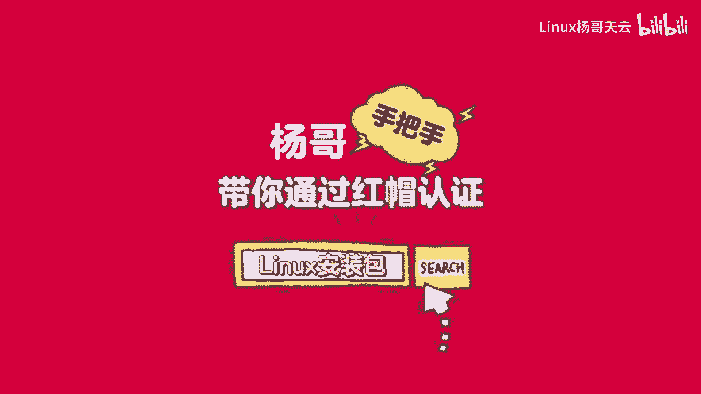

---

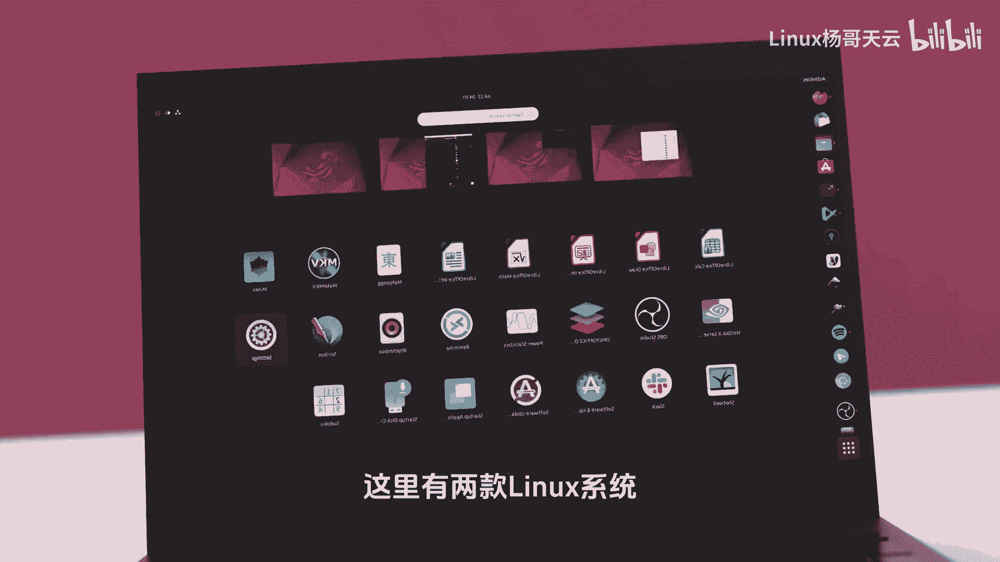

### 系统选择：RHEL 与 CentOS Stream

在学习Linux之前，第一步是获取一个Linux系统。这里有两款主流的Linux系统可供选择。

一款是红帽Linux，即Red Hat Enterprise Linux，简称为**RHEL**。另一款是CentOS，它目前主要提供**CentOS Stream**版本。

对于初学者，这两个系统都可以尝试，选择任意一个进行学习都没有问题。但需要注意的是，如果最终目标是参加红帽认证RHCE考试，则必须使用**RHEL**企业版。不过，从日常学习和使用的角度来看，两者基本没有太大区别。

因此，你无需纠结于选择哪一个。

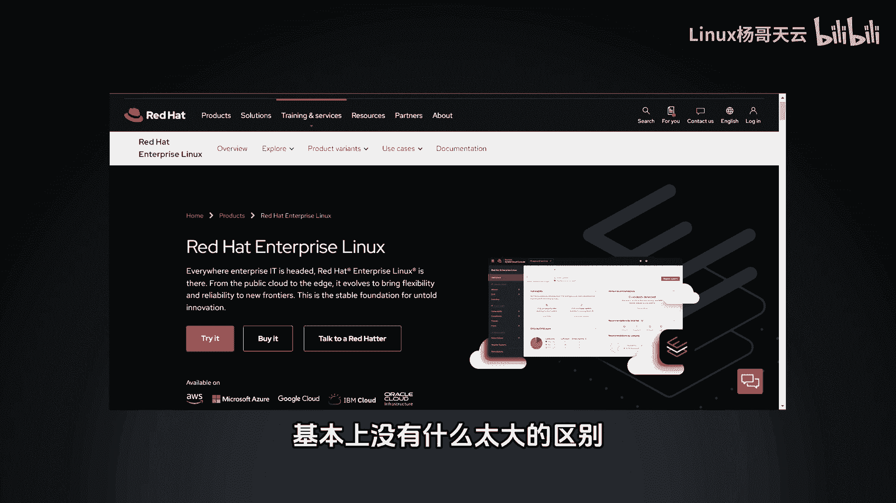

---

### 如何获取 Red Hat Enterprise Linux (RHEL)

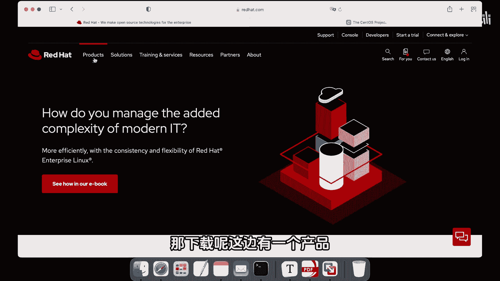

如果你选择使用RHEL企业版，首先需要访问其官方网站：**redhat.com**。

在网站上，找到名为“Red Hat Enterprise Linux”的产品，简称**RHEL**。点击进入后，你可以选择购买，或者申请一个**60天的试用期**。在试用期内，你可以订阅和更新系统。试用期结束后，系统仍然可以继续使用，只是无法再获得官方的升级和技术支持服务。

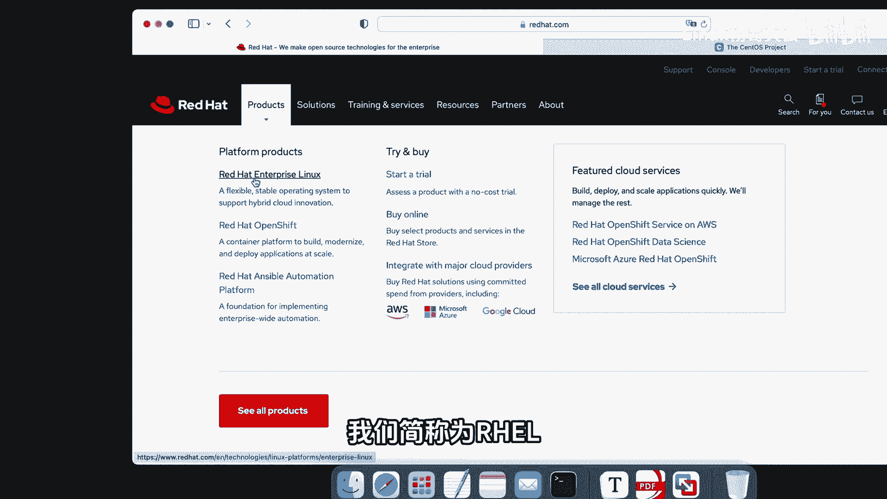

---

### 如何获取 CentOS Stream 9

另一个选择是CentOS Stream。你可以访问其官方网站：**centos.org**。

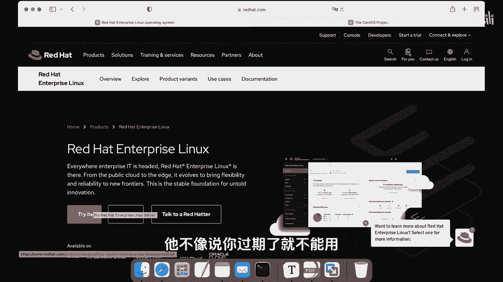

在该站点上，你可以下载CentOS Stream的安装镜像。网站通常提供版本9和版本8，建议初学者选择最新的**版本9**进行下载和学习。

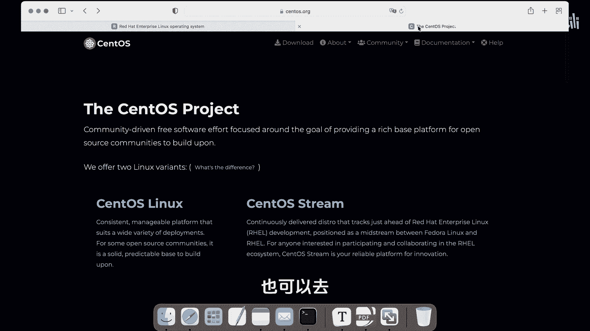

---

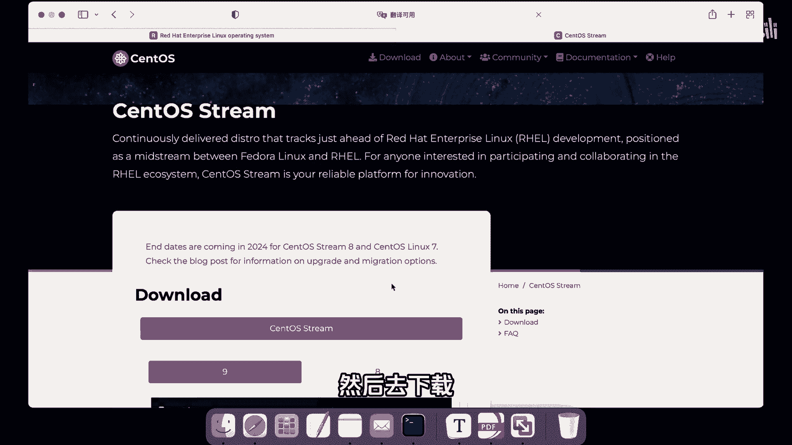

### 获取安装包的备选方案

如果你不清楚如何从红帽官网下载，或者希望快速开始，这里提供了一个备选方案。

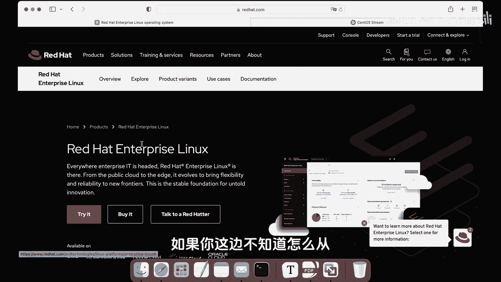

我已经为大家准备好了**CentOS Stream 9.0**版本的安装镜像文件。该文件大小约为几个GB，你可以直接使用它来安装系统。

---

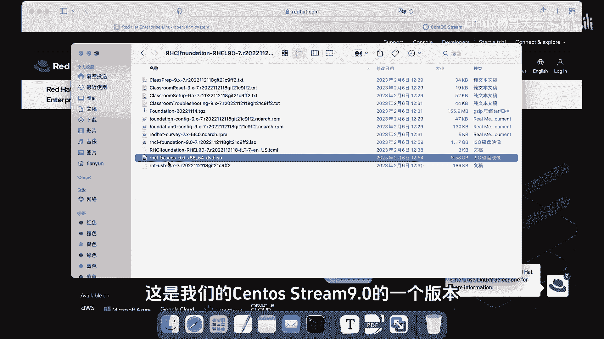

### 总结

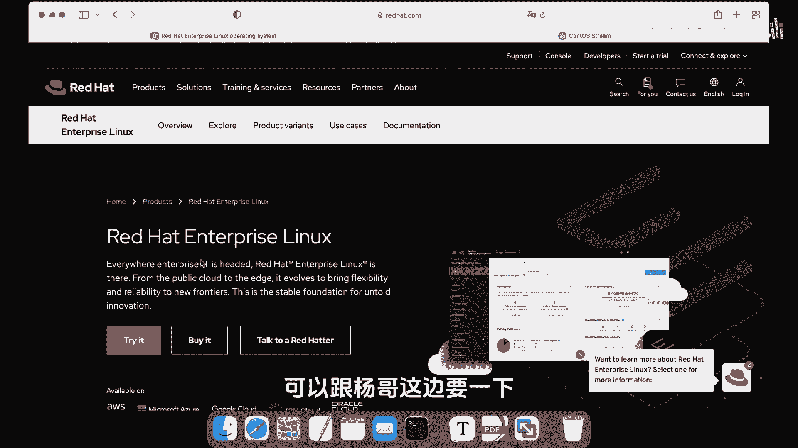

本节课中，我们一起学习了开始Linux之旅的第一步：获取系统。我们介绍了两个核心的Linux发行版——**Red Hat Enterprise Linux (RHEL)** 和 **CentOS Stream 9**，并说明了它们之间的主要区别及适用场景。同时，我们也提供了从官方网站下载系统镜像的方法，以及一个可直接使用的备选资源。接下来，我们就可以准备安装属于自己的Linux系统了。