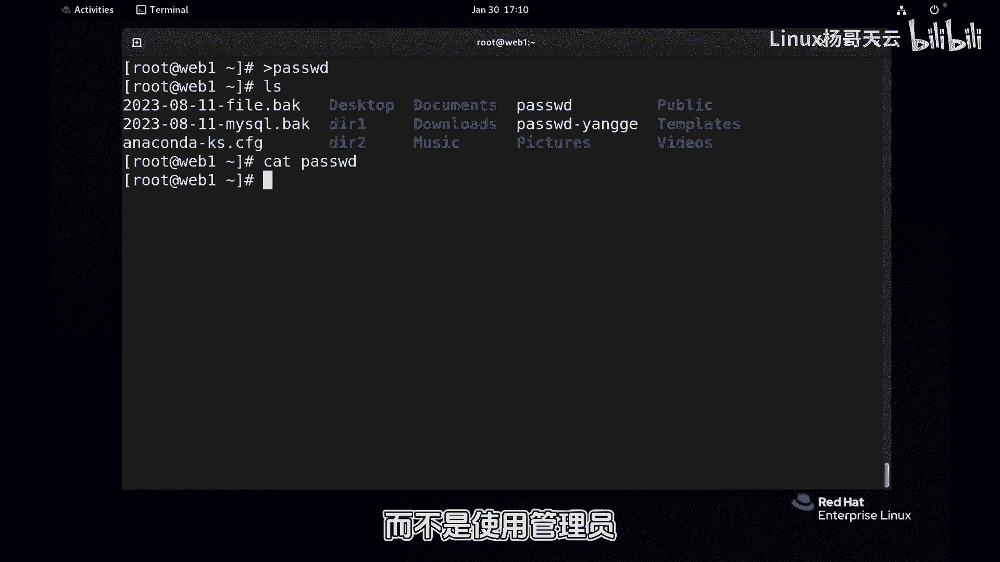
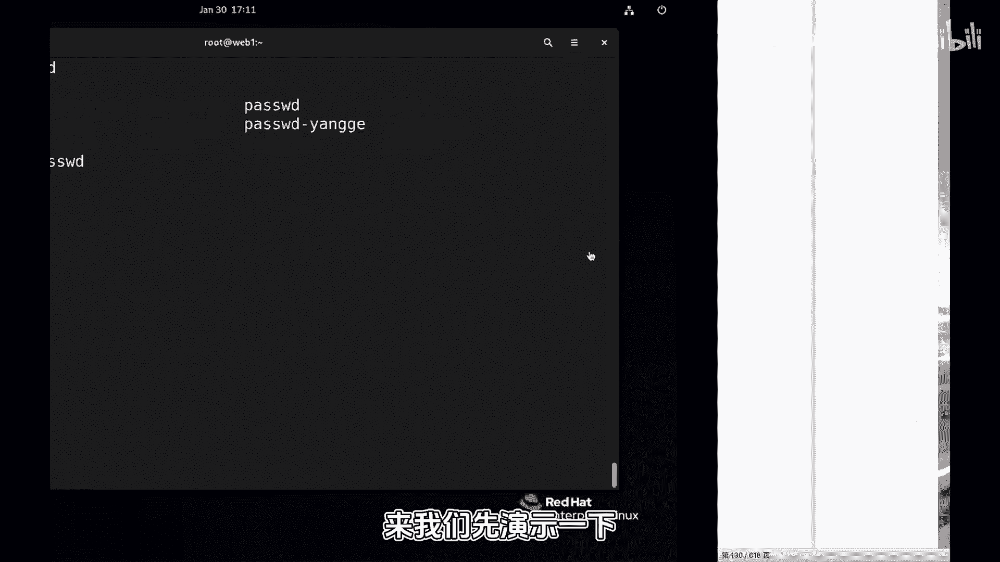
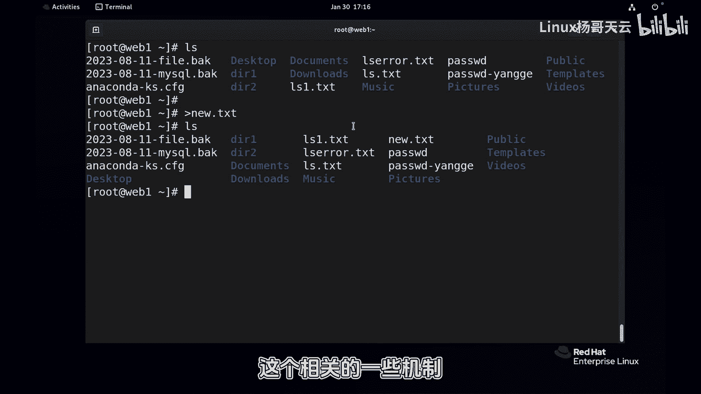

# Linux入门教程：第五章：文件创建、查看与编辑

在本节课中，我们将要学习Linux中文件的基本操作，包括如何创建、查看和编辑文件。在正式开始之前，我们需要先理解一个非常重要的概念：**文件重定向**。正确理解和使用重定向，能极大提升效率，但使用不当也可能带来严重后果。

上一节我们介绍了文件操作的重要性，本节中我们来看看文件重定向的具体机制。

## 理解文件重定向

在Linux中，命令执行后通常会产生输出信息。默认情况下，这些信息会显示在终端屏幕上。**文件重定向** 允许我们将这些输出信息“导向”到一个文件中，而不是屏幕上。

### 一个危险的演示



请看以下命令：
```bash
> /etc/passwd
```
如果以管理员身份执行此命令，`/etc/passwd`这个重要系统文件的内容将被**清空**。这是因为 `>` 符号的作用是将命令的输出覆盖到指定文件。如果文件不存在则创建，如果存在则先清空原有内容。

这个例子说明了重定向的强大与危险。因此，在管理文件前，必须透彻理解重定向。

### 重定向的基本用法

以下是重定向的一个基本案例：
```bash
ls > list.txt
```
执行后，原本应显示在屏幕上的 `ls` 命令结果，被保存到了 `list.txt` 文件中。



### 标准输出与错误输出

一个命令在执行时可能产生两种信息流：
1.  **标准输出 (stdout)**：命令正常执行时产生的信息。
2.  **标准错误输出 (stderr)**：命令执行出错时产生的错误信息。

默认情况下，两者都输出到屏幕。我们可以用重定向分别处理它们。

*   `>` 或 `1>`：仅重定向**标准输出**。
*   `2>`：仅重定向**标准错误输出**。

请看以下示例：
```bash
# 这条命令混合了正确和错误信息
ls /etc/passwd /etc/nonexistentfile > output.txt
```
执行后，只有正确的输出（`/etc/passwd`的信息）被存入 `output.txt`，而错误信息（文件不存在）仍然显示在屏幕上。

如果想将**所有输出**（包括正确和错误）都重定向到文件，可以使用：
```bash
ls /etc/passwd /etc/nonexistentfile &> all_output.txt
```
或者分别重定向：
```bash
ls /etc/passwd /etc/nonexistentfile > output.txt 2> error.txt
```
这样，正确结果保存在 `output.txt`，错误信息保存在 `error.txt`。

### 重定向的“追加”模式

前面提到的 `>` 会覆盖文件。如果想在文件**末尾添加**内容而不清空原内容，需要使用**追加**符号 `>>`。

例如：
```bash
echo “New line” >> existing_file.txt
```
这行命令会在 `existing_file.txt` 文件的末尾添加一行“New line”。

## 核心概念总结

以下是关于文件重定向的核心操作符：

*   `command > file`：将命令的**标准输出**覆盖写入到file。
*   `command >> file`：将命令的**标准输出**追加到file末尾。
*   `command 2> file`：将命令的**标准错误输出**覆盖写入到file。
*   `command 2>> file`：将命令的**标准错误输出**追加到file末尾。
*   `command &> file`：将命令的**标准输出和标准错误输出**都覆盖写入到file。
*   `command &>> file`：将命令的**标准输出和标准错误输出**都追加到file末尾。

## 过渡到文件操作

理解了重定向的机制后，我们就可以安全、高效地运用它来辅助文件管理。例如，我们可以用 `>` 快速创建一个新文件，或者用 `>>` 向日志文件添加记录。

在接下来的小节中，我们将正式学习如何使用 `vi`、`cat`、`more`、`less` 等命令来创建、查看和编辑文件内容。



本节课中我们一起学习了Linux文件重定向的核心概念。我们了解了标准输出与错误输出的区别，掌握了使用 `>`、`>>`、`2>`、`&>` 等操作符将命令输出导入文件的方法，并认识了重定向带来的便利与潜在风险。这是进行高效文件管理的基础，请务必熟练掌握。