# Linux入门教程：P31：Linux重定向详解 🚀

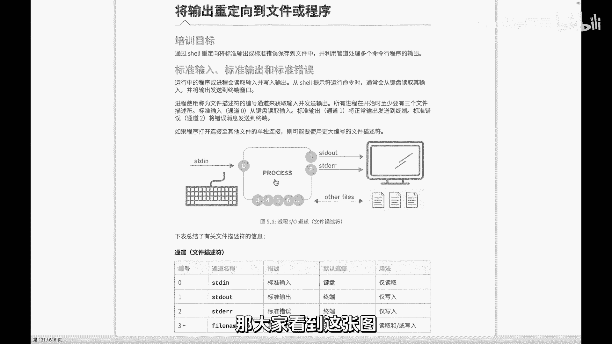

在本节课中，我们将要学习Linux中一个非常强大且基础的概念——重定向。理解重定向的机制对于高效使用命令行至关重要，它允许我们控制命令的输入来源和输出去向。

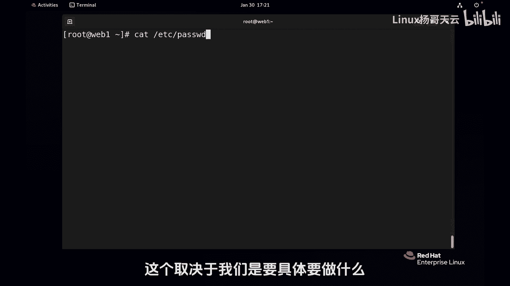

## 概述：进程的输入与输出

上一节我们演示了重定向的强大功能，但同时也提到，如果使用不当，它也可能带来风险。因此，我们必须先了解重定向背后的工作原理。

每个运行的程序（进程）都需要与外界进行数据交换，这主要涉及三个标准通道：
*   **标准输入 (stdin)**：进程读取数据的来源，默认是键盘。
*   **标准输出 (stdout)**：进程输出正确结果的去向，默认是屏幕（终端）。
*   **标准错误 (stderr)**：进程输出错误信息的去向，默认也是屏幕（终端）。

在Linux系统中，一切皆文件，这三个通道也被视为文件，并通过**文件描述符**来标识：
*   **文件描述符 0** 对应 **标准输入**。
*   **文件描述符 1** 对应 **标准输出**。
*   **文件描述符 2** 对应 **标准错误**。

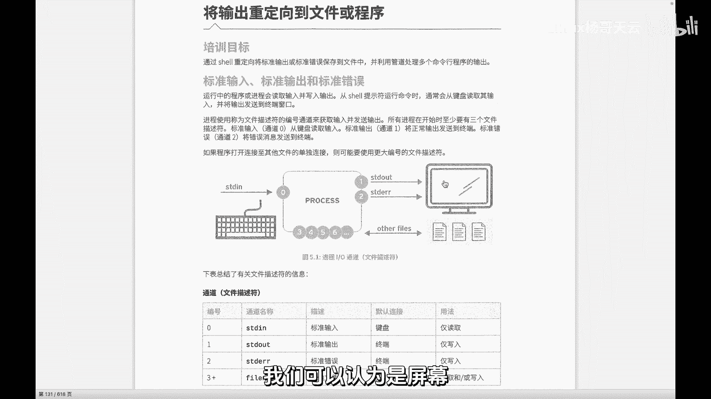

你可以将文件描述符想象成连接在进程上的水管。默认情况下，0号水管从键盘“水池”抽水，1号和2号水管将水排向屏幕“田地”。**重定向**的本质就是改变这些水管的连接方向。例如，将1号水管的出口从屏幕改到一个文件，那么命令的正确输出就会写入文件，而不是显示在屏幕上。

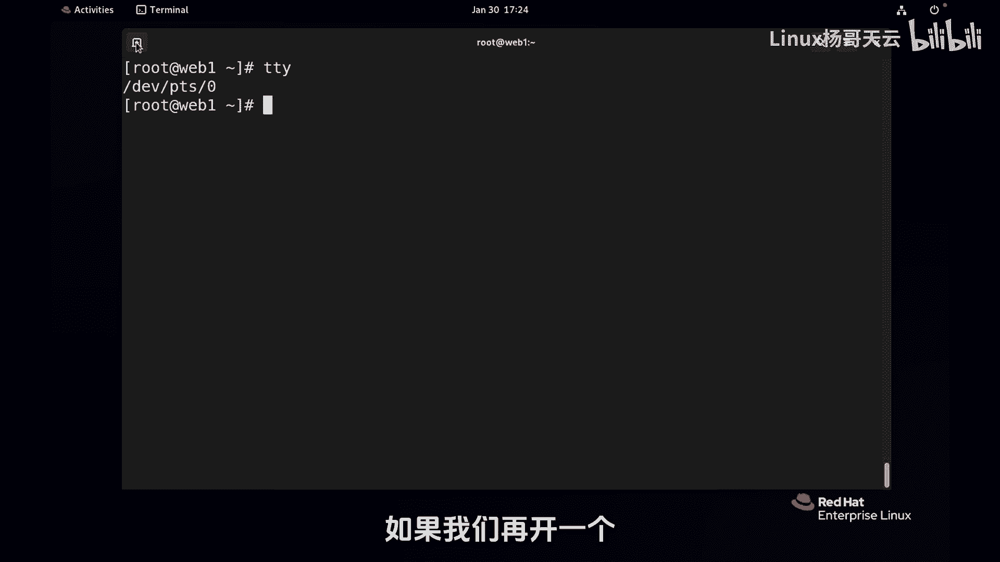

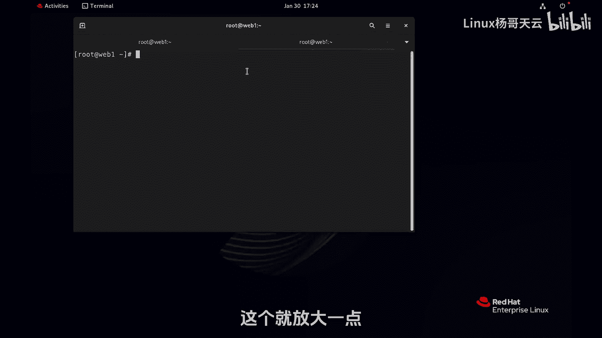

## 输出重定向详解

理解了基本概念后，本节中我们来看看如何具体使用输出重定向。输出重定向主要操作标准输出(1)和标准错误(2)。

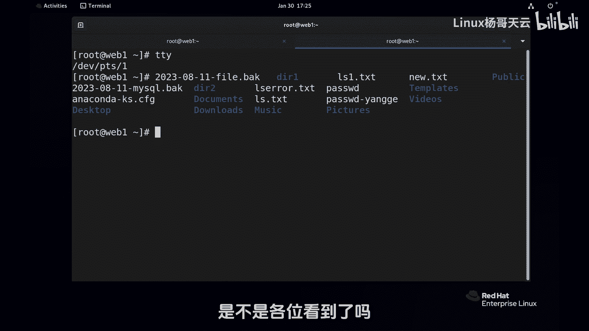

以下是输出重定向的几种核心用法：

1.  **`命令 > 文件`**
    *   **含义**：将命令的**标准输出**重定向到指定文件。如果文件已存在，则**覆盖**其原有内容。
    *   **示例**：`date > date.txt` 将当前日期时间写入`date.txt`文件，屏幕上不再显示。

2.  **`命令 >> 文件`**
    *   **含义**：将命令的**标准输出**重定向到指定文件。如果文件已存在，则在文件末尾**追加**内容。
    *   **示例**：多次执行 `date >> date.txt`，每次的结果都会追加到`date.txt`文件的末尾。

3.  **`命令 2> 文件`**
    *   **含义**：将命令的**标准错误**重定向到指定文件。如果文件已存在，则**覆盖**其原有内容。
    *   **示例**：`ls /nonexistent 2> error.log` 将“文件不存在”的错误信息写入`error.log`文件。

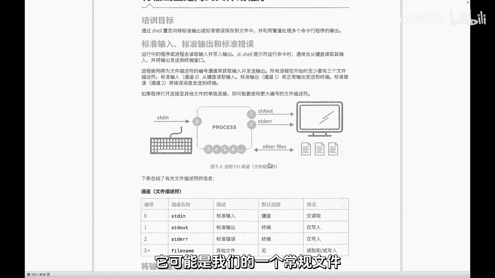

4.  **`命令 2>> 文件`**
    *   **含义**：将命令的**标准错误**重定向到指定文件。如果文件已存在，则在文件末尾**追加**内容。
    *   **示例**：`ls /nonexistent 2>> errors.log` 将错误信息追加到`errors.log`文件。

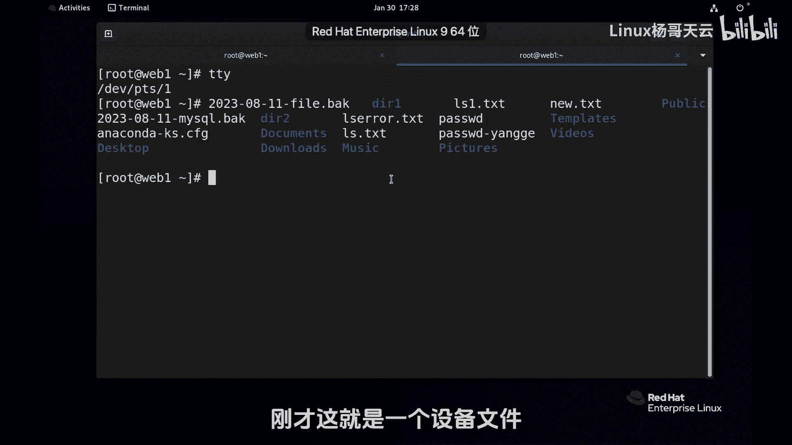

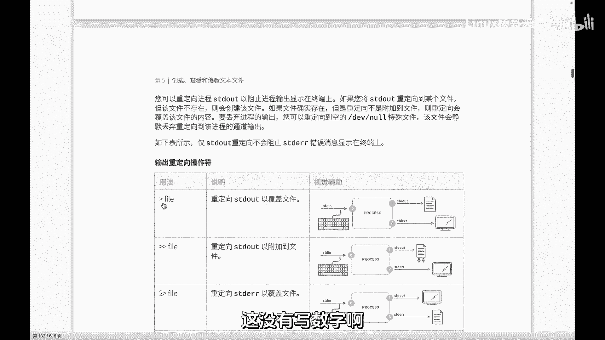

**重要提示**：在 `>` 或 `>>` 前没有指定数字时，默认操作的就是**文件描述符 1（标准输出）**。因此 `命令 > 文件` 等价于 `命令 1> 文件`。

## 综合应用示例

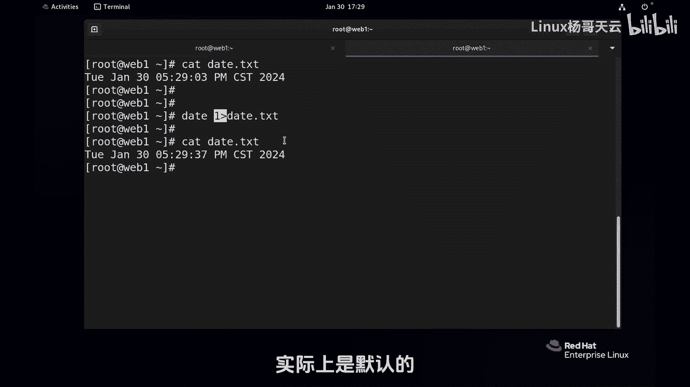

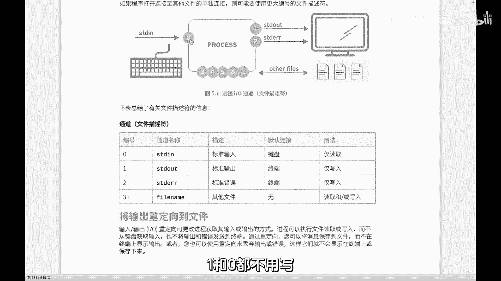

现在，让我们结合一个具体命令来实践如何同时重定向标准输出和标准错误。

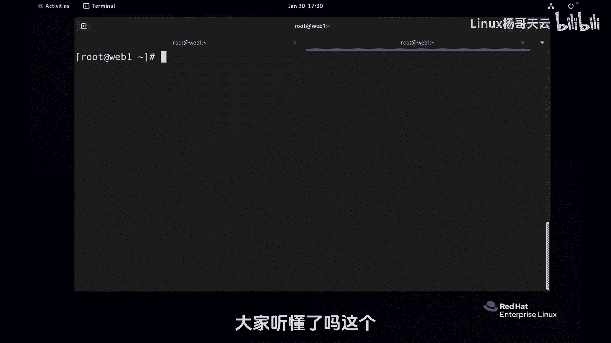

假设我们执行以下命令：
```bash
ls /etc/passwd /etc/shadow /nonexistentfile
```
这个命令会列出两个存在的文件和一个不存在的文件。结果会混合显示正确列表和错误信息。

以下是分离输出的方法：

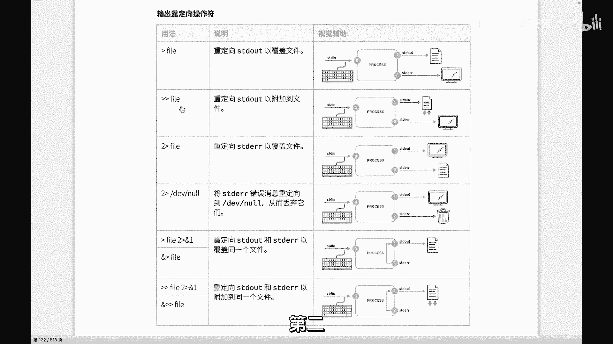

*   **将标准输出和标准错误重定向到不同文件**：
    ```bash
    ls /etc/passwd /etc/shadow /nonexistentfile > list.txt 2> error.txt
    ```
    *   正确文件列表会保存到 `list.txt`。
    *   错误信息会保存到 `error.txt`。
    *   屏幕上不显示任何内容。

*   **将标准输出和标准错误都重定向到同一个文件**：
    ```bash
    ls /etc/passwd /etc/shadow /nonexistentfile > all_output.txt 2>&1
    ```
    *   `2>&1` 表示“将文件描述符2（标准错误）重定向到文件描述符1（标准输出）当前指向的地方（即`all_output.txt`文件）”。
    *   所有输出（正确和错误）都会按顺序保存到 `all_output.txt`。

**警告**：使用单个 `>` 进行覆盖重定向时需要格外小心，因为它会无条件地覆盖目标文件的原有内容。在操作重要文件前，请务必确认你的意图。

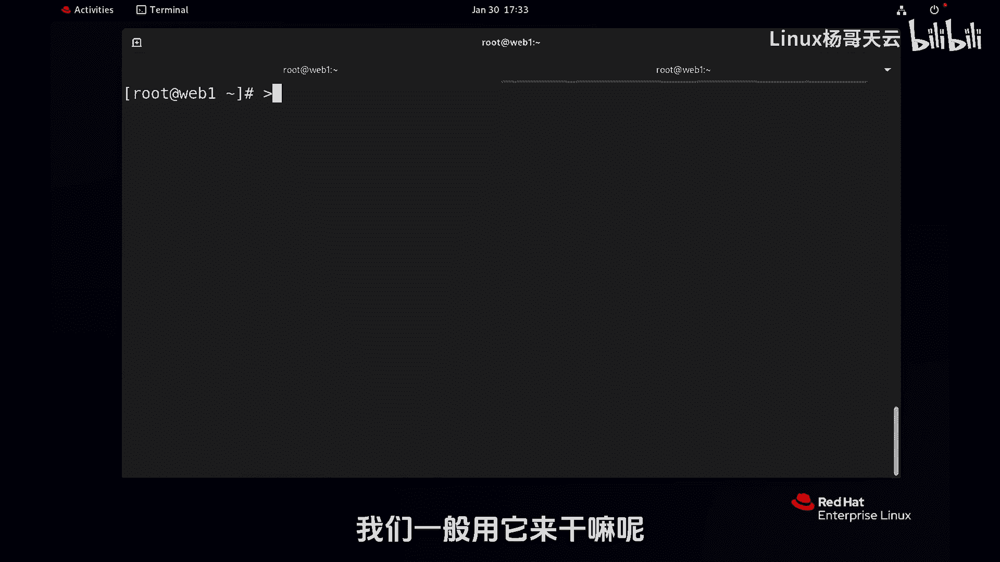

## 输入重定向简介

除了输出，我们也可以改变命令的输入来源，这就是输入重定向。

*   **`命令 < 文件`**
    *   **含义**：将指定文件的内容作为命令的**标准输入**。
    *   **示例**：`wc -l < /etc/passwd` 会计算 `/etc/passwd` 文件的行数。这里 `wc` 命令是从 `<` 后面的文件获取输入，而不是等待键盘输入。

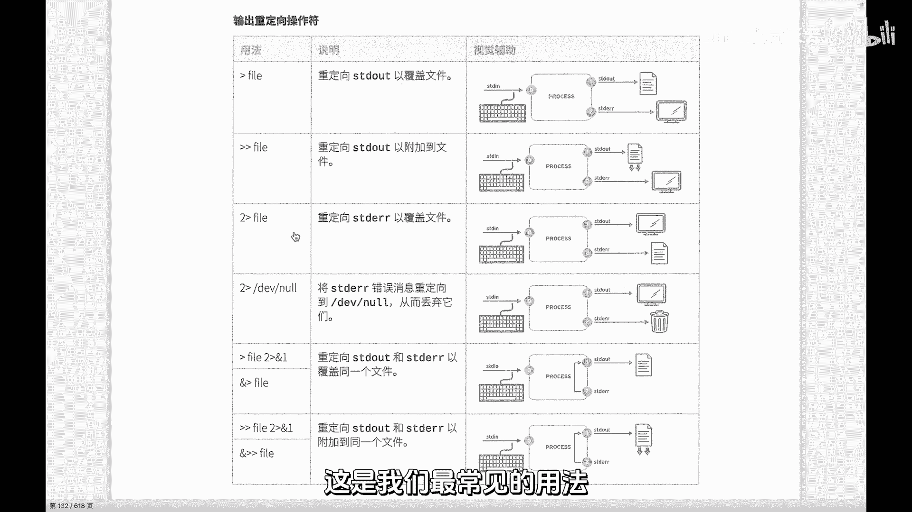

## 总结

本节课中我们一起学习了Linux重定向的核心知识。我们首先了解了进程的三大标准流（stdin, stdout, stderr）及其对应的文件描述符（0, 1, 2）。然后，我们深入探讨了输出重定向的语法：使用 `>` 或 `>>` 来重定向标准输出（覆盖或追加），使用 `2>` 或 `2>>` 来重定向标准错误。我们还学习了如何将两者合并或分离输出到不同文件。最后，我们简要介绍了输入重定向 `<` 的用法。

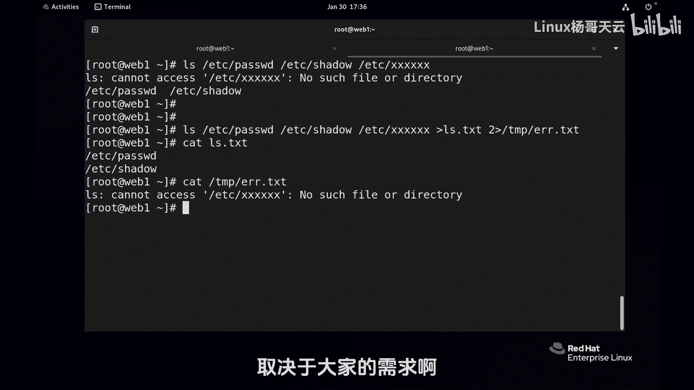

掌握重定向是成为Linux命令行高手的关键一步，它能让你灵活地控制数据流，实现日志记录、批量处理等复杂任务。请务必多加练习，熟悉这些操作。