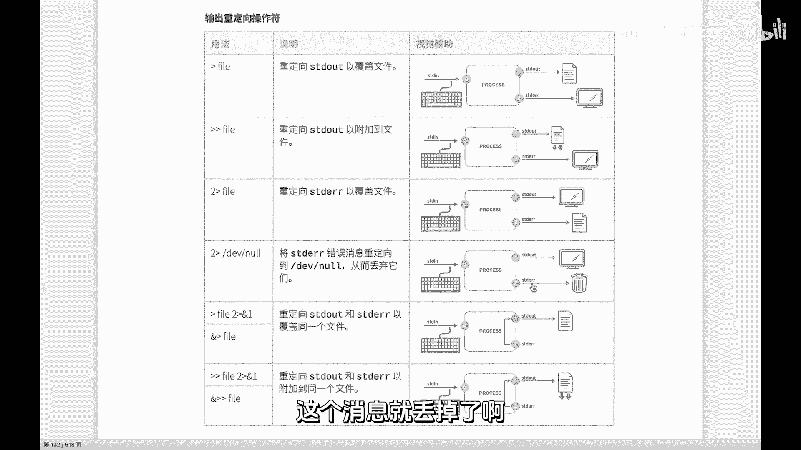
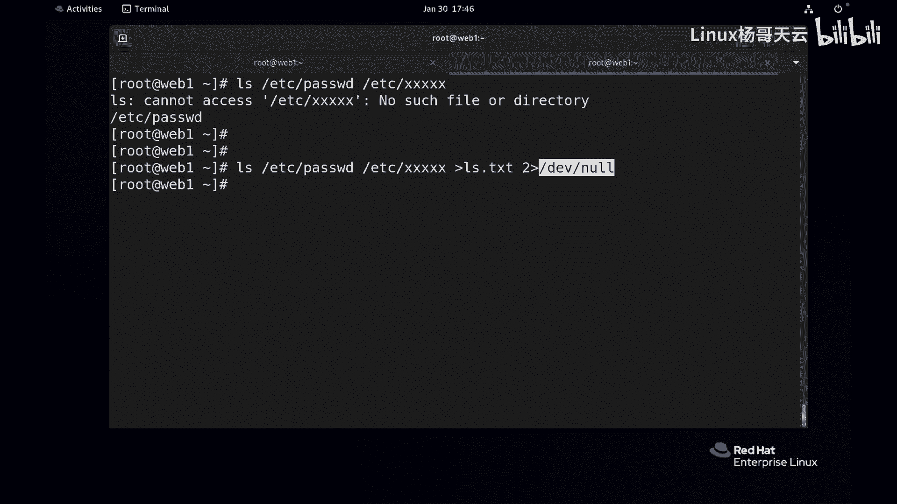
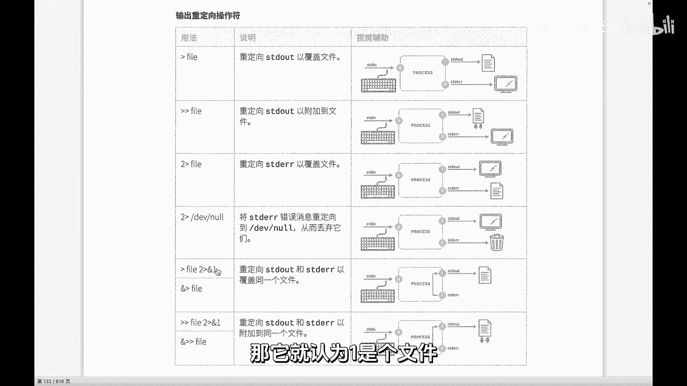
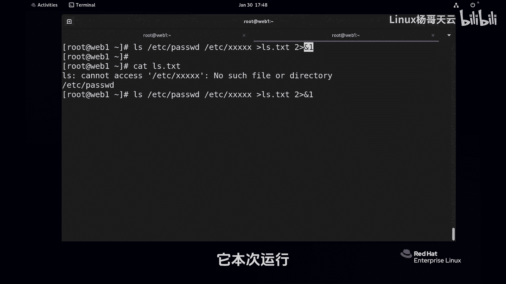
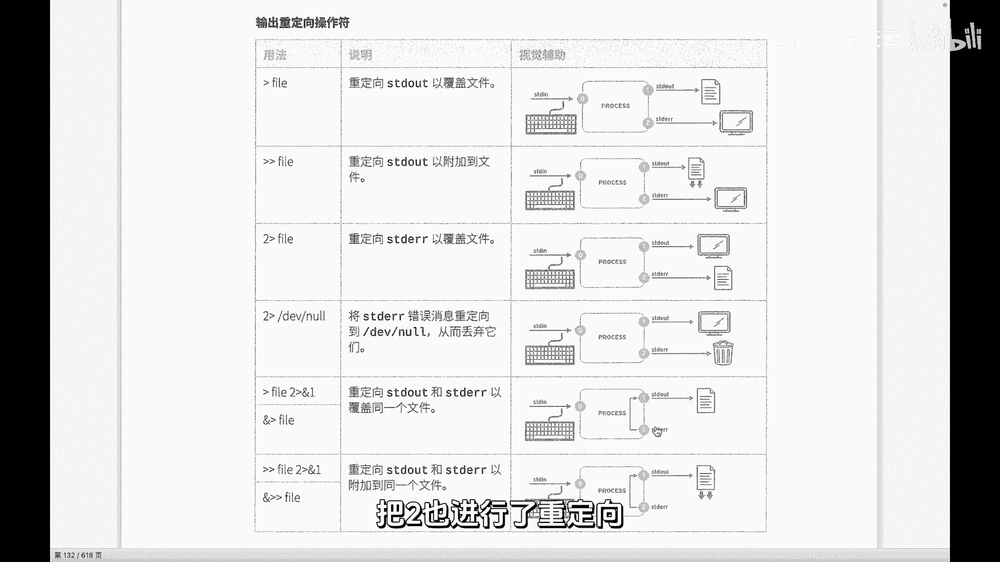
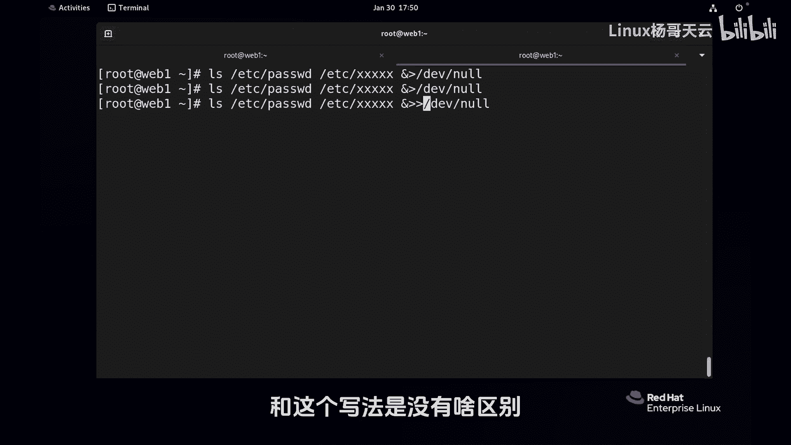
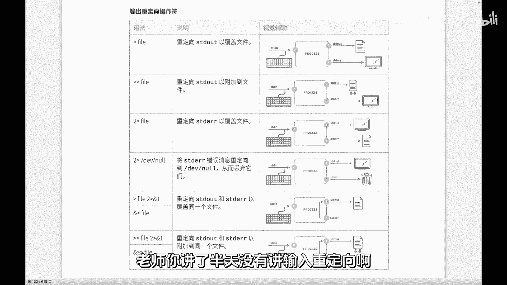
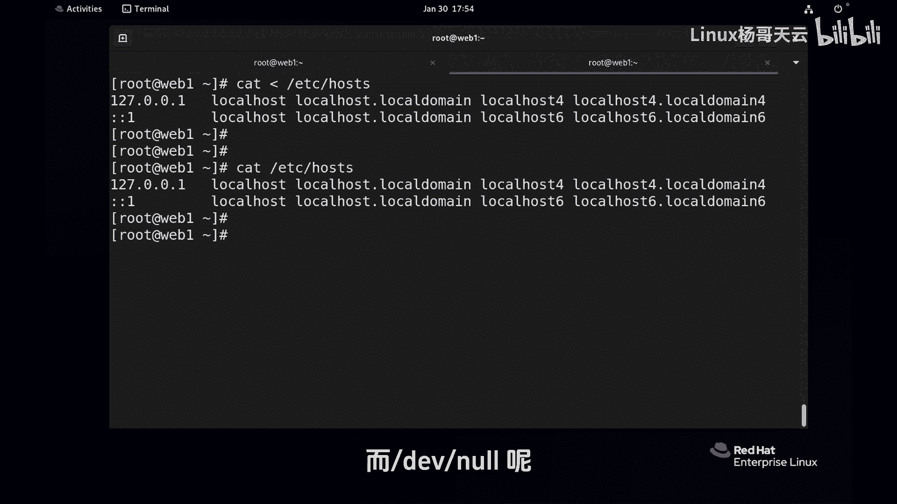

# Linux入门教程：P32：/dev/null是垃圾桶吗？



在本节课中，我们将深入探讨Linux中一个特殊的设备文件——`/dev/null`。我们将了解它的作用、工作原理以及如何在实际操作中正确使用它来丢弃不需要的输出信息。

---



上一节我们介绍了标准输出和标准错误的重定向基础用法，通常是将它们重定向到文件中。但在某些情况下，我们可能希望完全丢弃某些输出信息，这时就会用到特殊的设备文件。

这个特殊的文件位于 `/dev/null`。你可以将它想象成一个“黑洞”或“垃圾桶”。任何被重定向到 `/dev/null` 的数据都会被系统直接丢弃，无法找回。

例如，我们执行一个会产生错误的命令：
```bash
ls /nonexistent_directory
```
这个命令会输出错误信息。如果我们不想要看到这些错误信息，就可以将标准错误重定向到 `/dev/null`：
```bash
ls /nonexistent_directory 2> /dev/null
```
执行后，错误信息将不再显示，因为它被“丢进”了 `/dev/null`。



`/dev/null` 是一个设备文件，而不是普通文件。数据写入其中就如同进入虚空，消失无踪。请注意，这与Windows系统中的“回收站”概念完全不同。`/dev/null` 不是用来删除文件的，你不能也不应该尝试将文件复制或移动到里面。它的作用是**丢弃进程运行时产生的输出流（消息）**，而不是文件本身。

当然，我们也可以选择将标准输出（正确消息）也丢弃到 `/dev/null`：
```bash
ls /etc/hosts > /dev/null
```
这样，命令的正常输出也不会显示在终端上。



---



在重定向语法中，我们有时会看到 `&1` 或 `&2` 这样的写法。这里的 `&` 符号表示后面跟的是**文件描述符**，而不是文件名。例如：
*   `1` 代表文件描述符1（标准输出）。
*   `&1` 也代表文件描述符1。
*   如果直接写 `1`，系统会将其视为一个名为“1”的普通文件。

请看以下示例，它将标准错误重定向到标准输出所指向的地方（最终都写入文件）：
```bash
ls /etc/hosts /nonexistent > output.txt 2>&1
```
这条命令的含义是：将标准输出重定向到 `output.txt` 文件，同时将标准错误重定向到文件描述符1当前指向的位置（即 `output.txt` 文件）。因此，正确和错误信息都会进入同一个文件。



不过，这种写法较为繁琐。更常见的做法是使用 `&>` 符号进行**混合输出重定向**，它能同时重定向标准输出和标准错误：
```bash
ls /etc/hosts /nonexistent &> output.txt
```
这条命令与上一条命令效果相同，但写法更简洁。



如果我们希望完全丢弃一个命令的所有输出（无论是正确还是错误信息），最常用的写法就是重定向到 `/dev/null`：
```bash
ls /etc/hosts /nonexistent &> /dev/null
```
对于 `/dev/null` 而言，由于数据直接被丢弃，因此使用 `>`（覆盖）或 `>>`（追加）操作符没有区别，结果都是一样的。

---

关于输入重定向，它的使用场景相对输出重定向较少。一个简单的例子是 `cat` 命令。当 `cat` 后面不跟文件名时，它会从标准输入（键盘）读取数据：
```bash
cat
```
输入一行文字，回车后它会显示一行，直到你按下 `Ctrl+C` 终止。我们也可以使用 `<` 符号进行输入重定向，虽然在这个简单例子中效果与直接使用 `cat` 类似，但机制不同：
```bash
cat < /etc/hosts
```
这条命令将 `/etc/hosts` 文件的内容作为 `cat` 命令的输入。输入重定向在一些特定脚本和数据处理场景中非常有用，我们将在后续课程中结合具体案例讲解。

最后，**请务必再次牢记**：`/dev/null` 是用于丢弃**进程输出流**的，而不是用来删除文件的。绝对不要尝试执行类似下面的命令：
```bash
cp /etc/hosts /dev/null  # 错误！这会破坏 /dev/null 设备文件。
```
如果你想要删除一个文件，请使用正确的文件删除命令 `rm`。

---



本节课中我们一起学习了Linux中的特殊设备文件 `/dev/null`。我们明确了它的核心作用是充当“数据黑洞”，用于丢弃进程运行时产生的输出信息。我们掌握了如何通过 `> /dev/null`、`2> /dev/null` 和 `&> /dev/null` 来分别或同时丢弃标准输出和标准错误。同时，我们区分了文件描述符（如 `&1`）和文件名（如 `1`）在重定向中的不同含义，并强调了 `/dev/null` 的正确使用场景，避免将其误用作文件删除工具。