# Linux入门教程：34：轻松学习Linux管道 📖

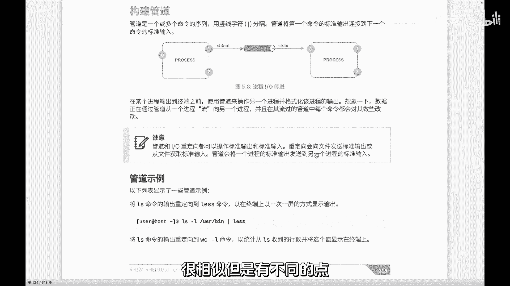

在本节课中，我们将要学习Linux中一个非常强大的功能——管道。我们将了解它的工作原理、与重定向的区别，并通过实例演示如何使用管道将多个命令组合起来，完成复杂的任务。

## 管道与重定向的区别 🔄

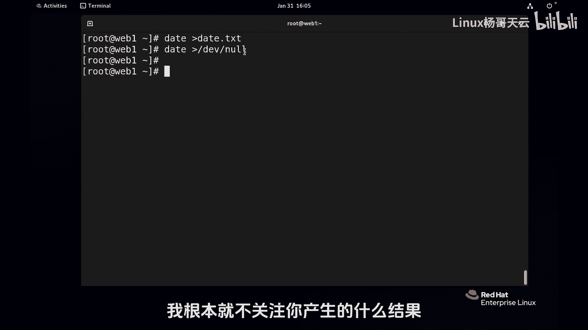

上一节我们介绍了重定向，它主要处理单个进程的输入和输出方向。本节中我们来看看管道，它与重定向相似但有本质区别。

重定向是将一个进程的输出（或输入）改变方向，指向一个文件（普通文件或特殊设备文件）。例如，将命令的输出保存到日志文件中，或者将错误信息丢弃到 `/dev/null`。

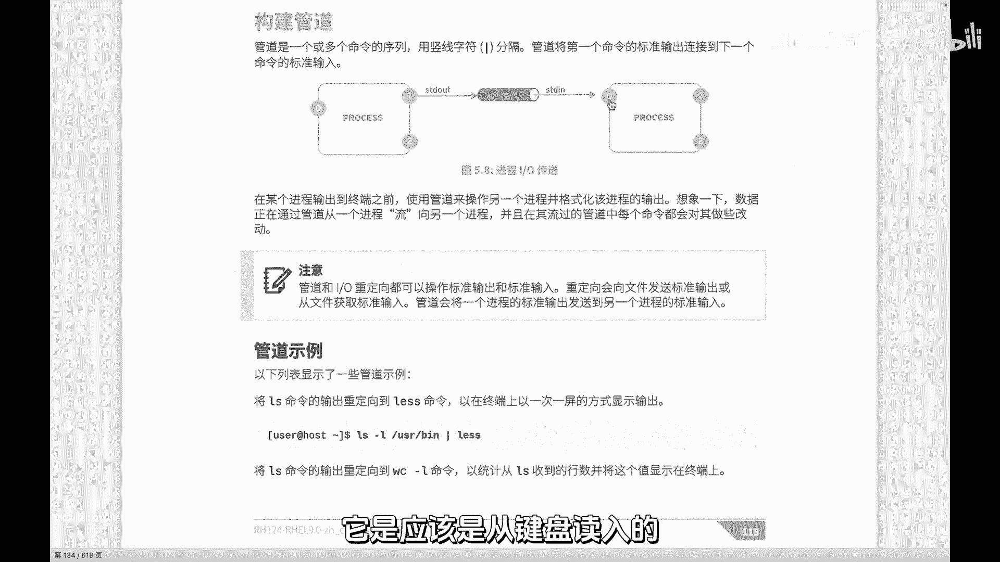

管道则不同，它使用竖线符号 `|` 连接两个命令。其核心功能是将前一个命令的**标准输出**，直接作为后一个命令的**标准输入**。这就像一条流水线，数据从一个命令“流”向下一个命令进行进一步处理。

**核心概念公式**：
```
命令A | 命令B
```
此公式表示：命令A的输出成为命令B的输入。

## 为何使用管道？ 🏭

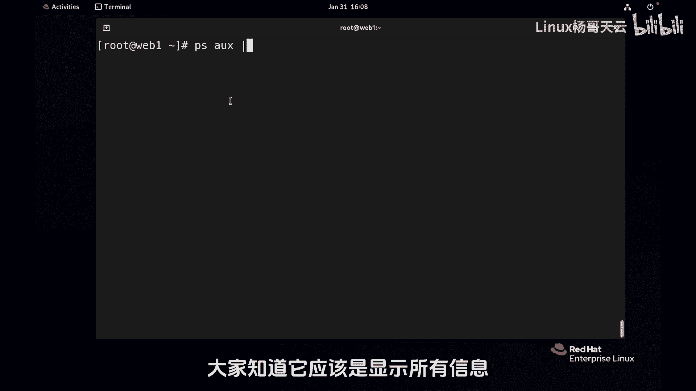

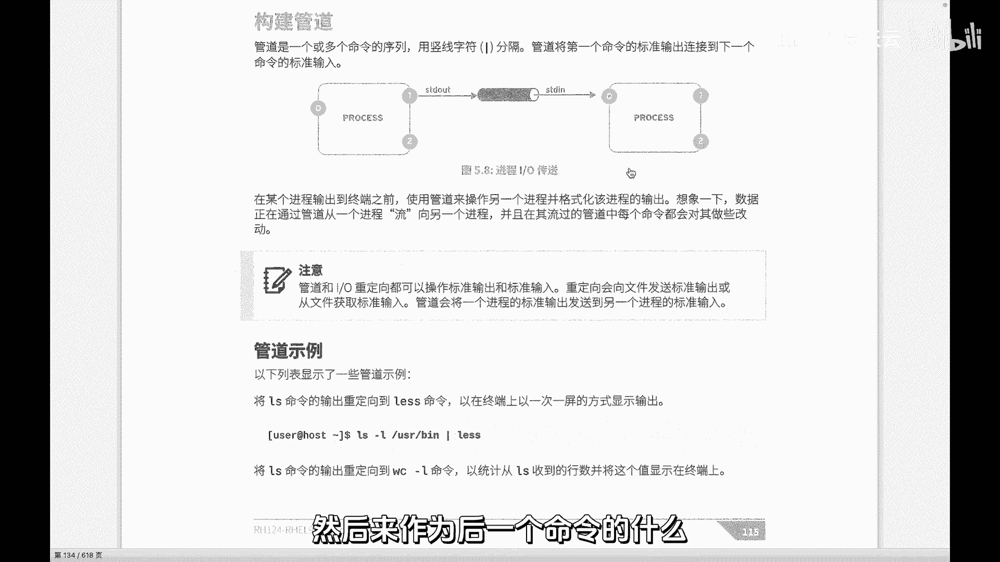

Linux中的每个命令通常只擅长完成一项特定任务。就像汽车制造需要多道工序协作一样，复杂的任务也需要多个命令组合完成。管道正是实现这种“命令流水线”的机制，它允许我们将简单的命令组装起来，实现强大的功能，尤其是在文本处理和日志分析中。

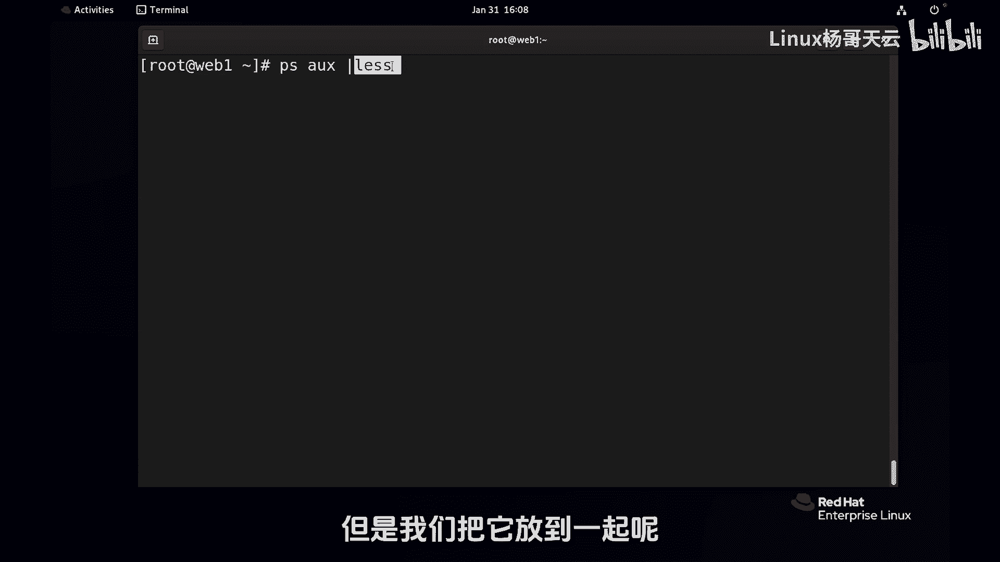

## 管道基础用法示例 💡

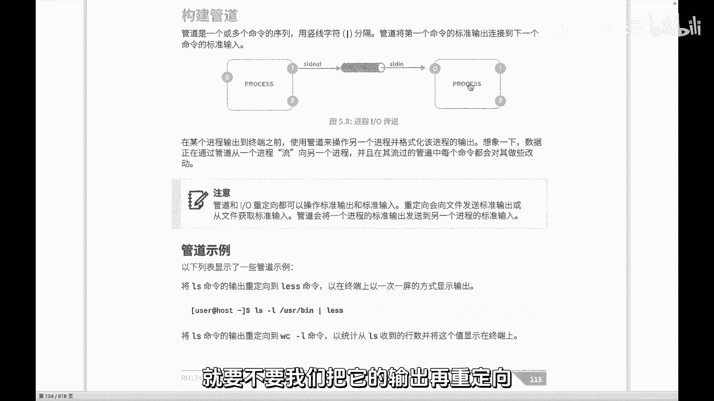

以下是几个基础示例，展示管道的实际应用。

**示例1：分页查看进程列表**
`ps aux` 命令会列出所有进程，输出内容可能很长。我们可以使用管道将其输出传递给 `less` 命令进行分页查看。
```bash
ps aux | less
```
执行后，`ps aux` 的输出不会直接显示在屏幕上，而是作为 `less` 的输入，从而可以上下翻页浏览。

**示例2：查看占用CPU最高的前5个进程**
这个任务需要多个步骤：列出进程、按CPU使用率排序、只取前几行。管道可以轻松组合这些命令。
```bash
ps aux --sort=-%cpu | head -6
```
*   `ps aux --sort=-%cpu`：列出所有进程并按CPU使用率降序排列（`-` 表示降序）。
*   `head -6`：取输出结果的前6行（第一行是表头，后5行是进程信息）。

**示例3：统计目录下的文件数量**
`ls -l` 会列出目录详情，每行代表一个文件或子目录。通过管道将结果传给 `wc -l` 可以统计行数。
```bash
ls -l /usr/bin | wc -l
```
这条命令会统计 `/usr/bin` 目录下的项目数量。

**示例4：查找最近修改的10个文件**
`ls -t` 可以按修改时间排序文件（最新的在前）。结合 `head` 命令即可取出最新的文件。
```bash
ls -t | head -10
```

## 管道的强大之处 ⚙️

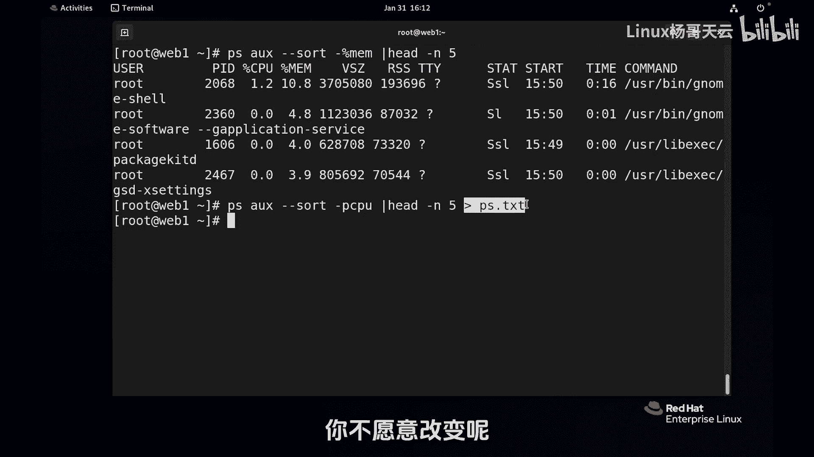

管道的真正威力在于可以多层嵌套，将数据像流水线一样传递给多个命令进行连续处理。

例如，我们可以组合更多命令进行复杂分析：
```bash
ps aux | grep 'python' | awk '{print $2, $11}' | head -5
```
这条命令的流水线是：
1.  `ps aux`：列出所有进程。
2.  `grep 'python'`：筛选出包含“python”的行。
3.  `awk '{print $2, $11}'`：提取每行的第2列（进程ID）和第11列（命令路径）。
4.  `head -5`：只显示前5个结果。

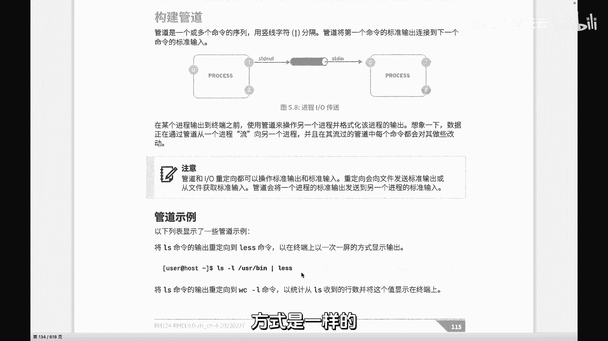

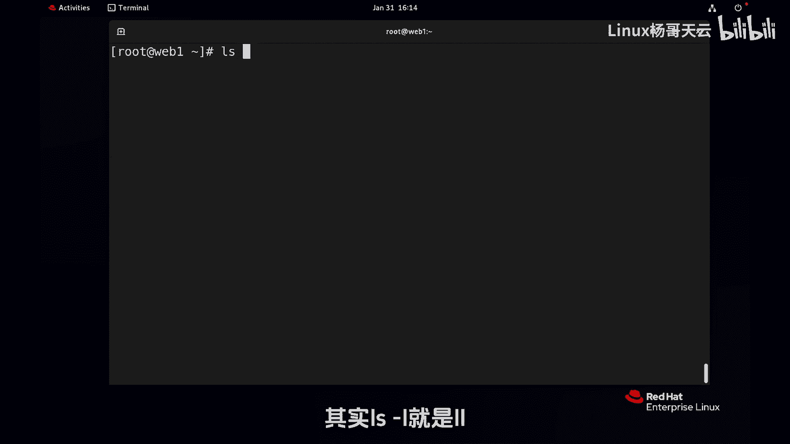

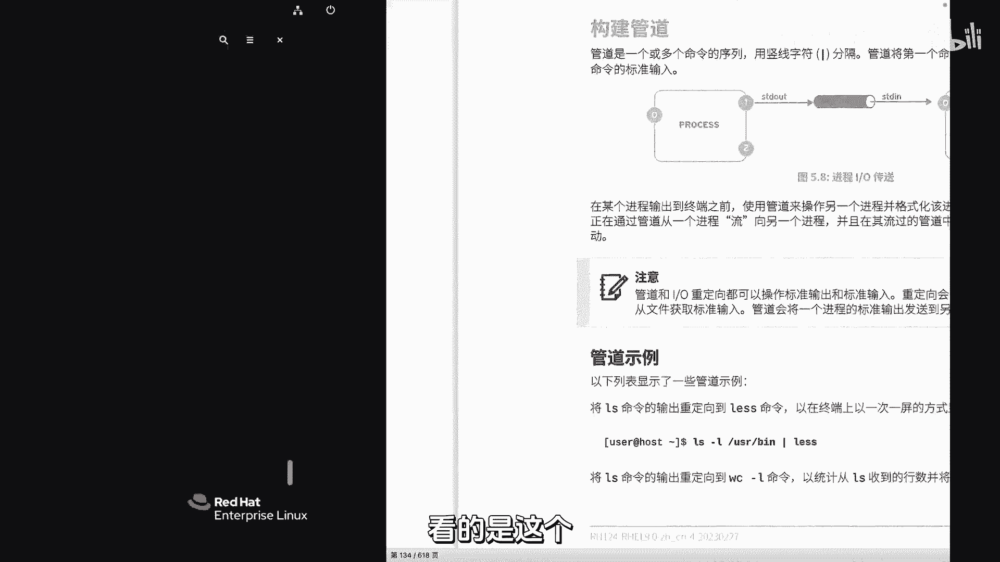

通过这种方式，我们可以用一系列简单命令完成复杂的筛选和格式化任务。

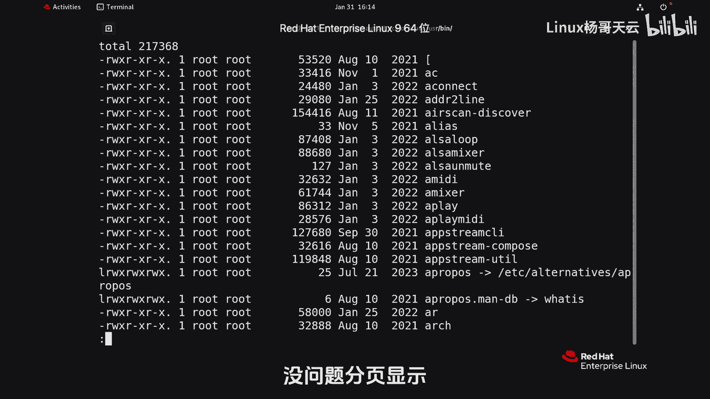

## 与重定向结合使用 🔗

管道和重定向可以结合使用。例如，将管道处理的最终结果保存到文件中：
```bash
ps aux --sort=-%mem | head -5 > top5_mem_processes.txt
```
这里，管道链的结果通过重定向 `>` 被保存到了 `top5_mem_processes.txt` 文件中。

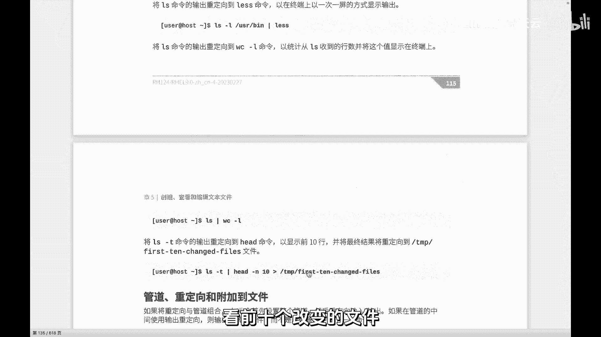

## 总结 📝

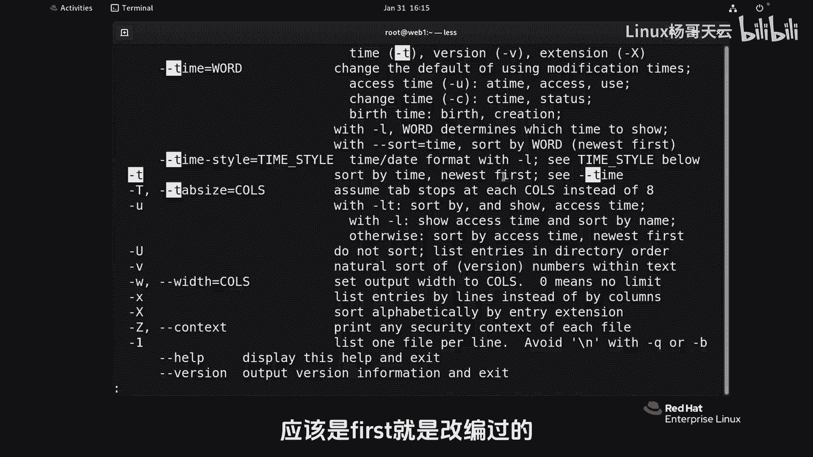

本节课中我们一起学习了Linux管道。
*   **核心**：管道 `|` 用于连接命令，将前一个命令的**标准输出**作为后一个命令的**标准输入**。
*   **与重定向区别**：重定向改变单个命令的输入/输出方向（指向文件），而管道实现多个命令间的数据传递。
*   **设计哲学**：体现了Linux“一个命令只做好一件事，并通过协作完成复杂任务”的设计哲学。
*   **强大之处**：支持多层嵌套，能与重定向结合，是脚本编写和系统管理中不可或缺的工具。

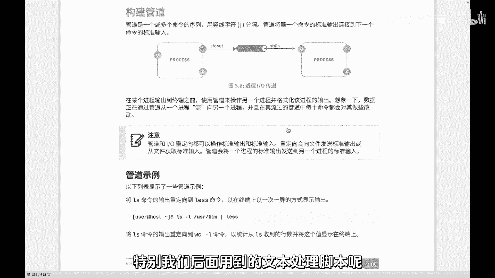

掌握管道能极大地提升你在Linux命令行下的工作效率和解决问题的能力。