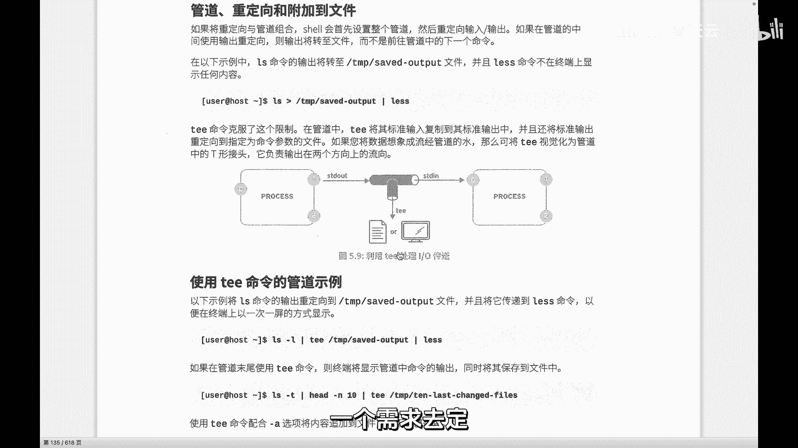
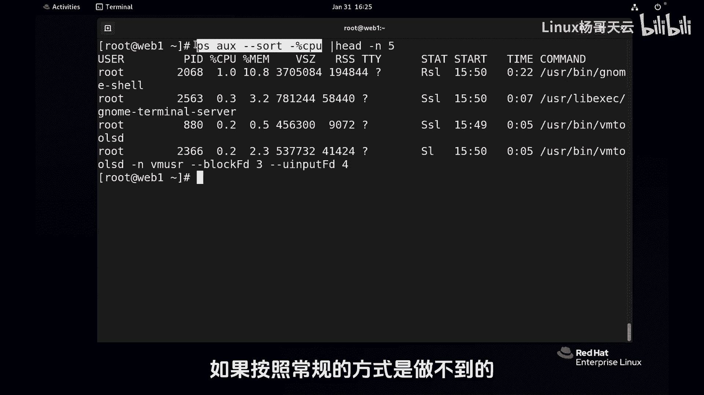
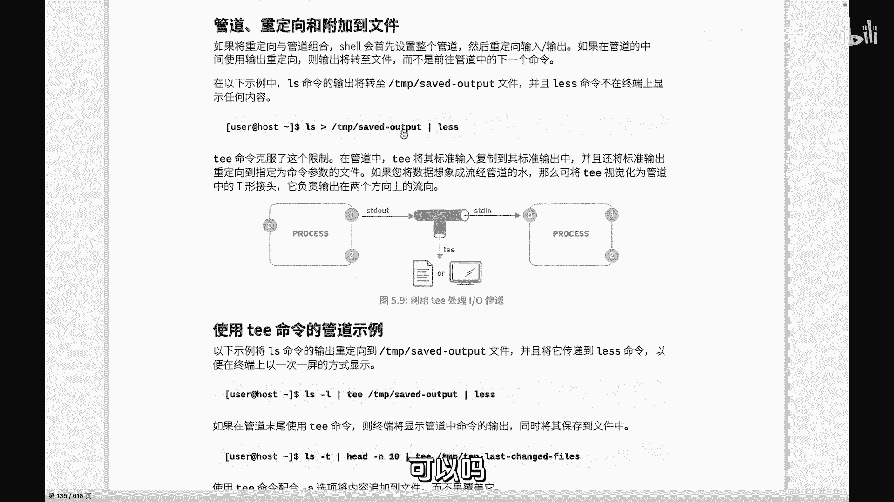
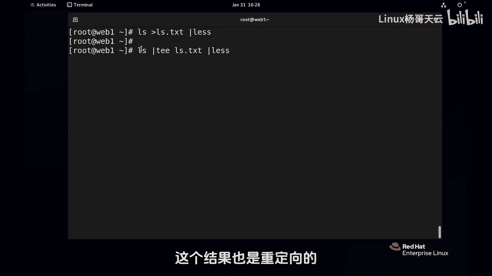
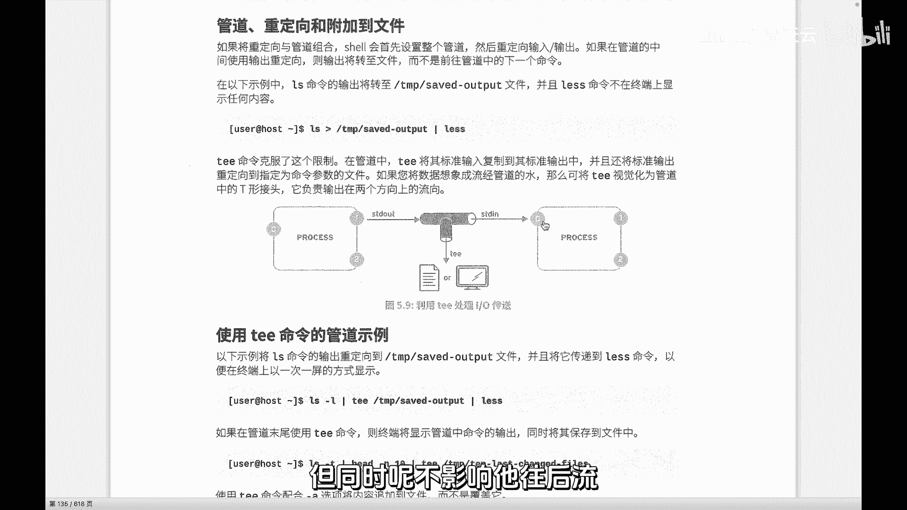
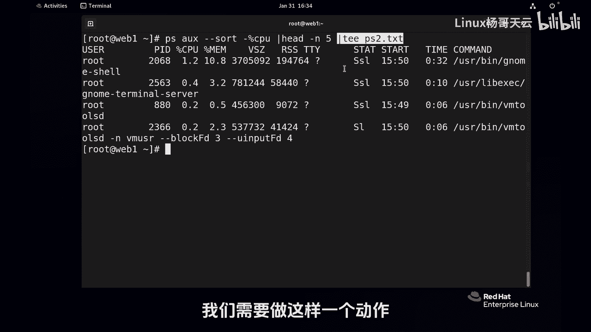
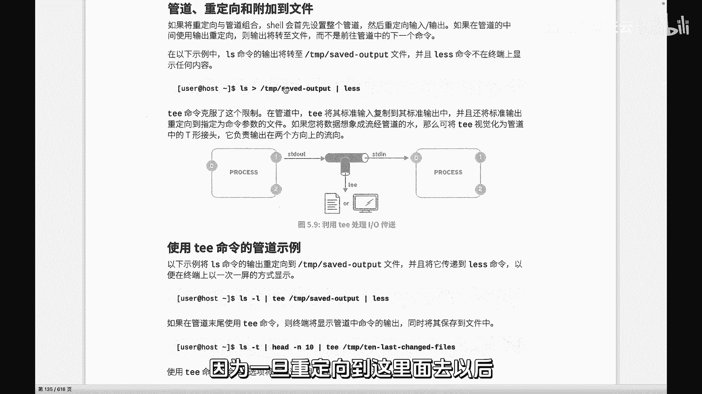
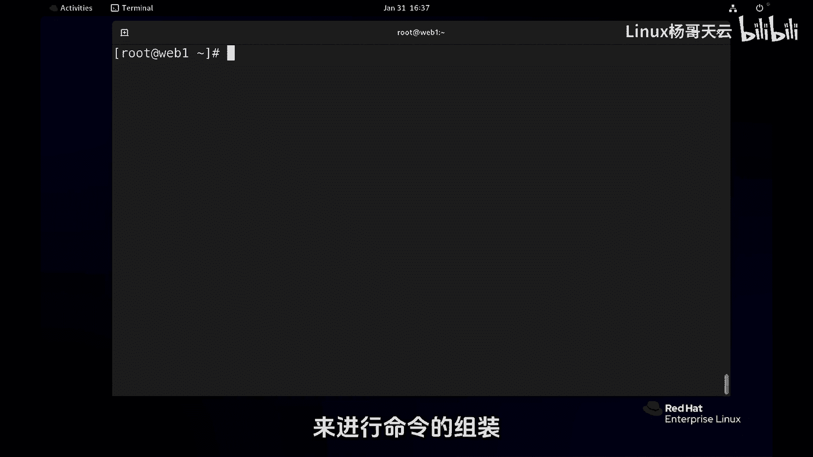

Linux入门教程：35：Linux特殊管道tee



在本节课中，我们将要学习Linux中一个非常实用的命令——`tee`。它就像一个水管中的“三通”，允许我们将一个命令的输出同时发送到屏幕和文件中，解决了普通管道或重定向无法兼顾的问题。



上一节我们介绍了管道的基本概念，它可以将一个进程的输出作为下一个进程的输入。本节中我们来看看当我们需要“复制”一份输出时，该如何操作。



### 普通管道的局限性

首先，回顾一下普通管道的工作方式。命令 `ps aux --sort=-%cpu | head -5` 会将 `ps` 命令排序后的结果，通过管道（`|`）传递给 `head` 命令，最终只显示前5行。在这个过程中，`ps` 命令的完整输出在传递给 `head` 后，就无法再被获取或保存了。



如果我们希望**既**将完整的排序结果保存到文件，**又**在屏幕上查看前5行，使用普通的管道或单独的重定向是无法实现的：
*   `ps aux --sort=-%cpu > output.txt | head -5` 是无效的，因为重定向 `>` 会直接将输出写入文件，不会再有数据传递给后面的 `head` 命令。



### tee命令的工作原理

`tee` 命令就是为了解决这个问题而生的。它的作用是从标准输入读取数据，并**同时**写入标准输出和一个或多个文件。你可以把它想象成管道线上的一个“三通接头”。

其基本工作原理可以用以下伪代码描述：
```
输入数据 -> tee -> [副本1: 文件] 和 [副本2: 标准输出 -> 下一个命令]
```

### tee命令的用法

以下是 `tee` 命令的几种常见使用场景。

**1. 保存命令原始输出并继续处理**
这是最典型的用法。我们想在管道中间保存某一阶段的输出。
```
ps aux --sort=-%cpu | tee ps_output.txt | head -5
```
*   **解释**：`ps` 命令的输出先交给 `tee`。
*   `tee` 会将其写入文件 `ps_output.txt`。
*   同时，`tee` 再将同样的数据通过标准输出传递给管道后的 `head -5` 命令。
*   **结果**：屏幕上显示CPU占用率最高的5个进程，同时完整的进程列表被保存在 `ps_output.txt` 文件中。

**2. 在复杂管道中保存中间结果**
你可以在任何需要保存中间数据流的地方插入 `tee`。
```
ps aux | grep -v ‘\[*\]’ | tee filtered_ps.txt | sort -k3 -rn | head -10
```
*   **解释**：这条命令先过滤掉内核线程（`grep -v`），然后将过滤后的结果通过 `tee` 保存到 `filtered_ps.txt`，再继续排序并取前10行。



**3. 使用追加模式**
默认情况下，`tee` 会覆盖目标文件。使用 `-a` 选项可以追加内容。
```
echo “New log entry” | tee -a application.log
```
*   **解释**：将 “New log entry” 这行文字**追加**到 `application.log` 文件的末尾，同时也在屏幕上显示。

### 注意事项

1.  **命令位置**：`tee` 加在管道中的哪个位置，就保存哪个位置之前命令的输出。你需要先规划好命令的逻辑，再决定在何处“分流”数据。
2.  **非管道命令**：需要注意的是，并非所有Linux命令都支持从标准输入（管道）读取数据。这类命令无法放在管道符右侧接收数据。`tee` 本身是一个典型的管道命令，它总是从标准输入读取。
3.  **与重定向结合**：`tee` 本身实现了重定向的功能（写入文件），但它是以一种“透明”的方式集成在管道中，不影响数据继续向下游流动。



### 总结



本节课中我们一起学习了 `tee` 命令。它是Linux管道操作中的一个强大工具，核心作用是**复制数据流**，实现将中间输出同时保存到文件和传递给后续命令。记住它的工作模式就像水管的三通，让你在构建复杂命令流水线时，可以灵活地留存中间数据，便于调试或记录。请多加练习，体会它在不同场景下的应用。