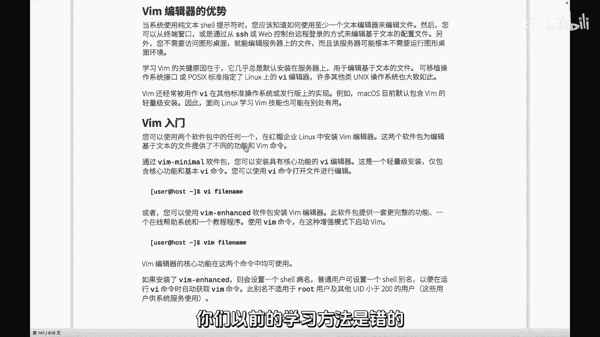
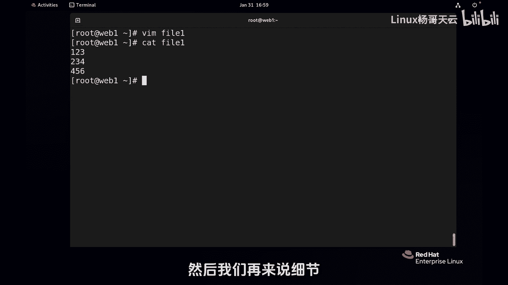
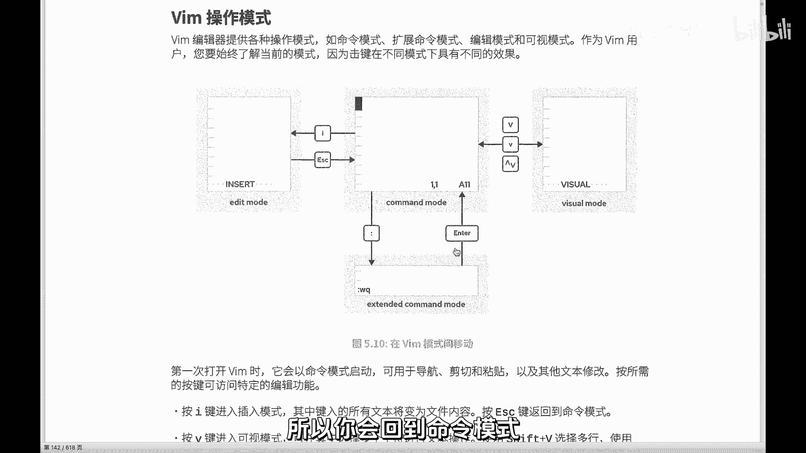
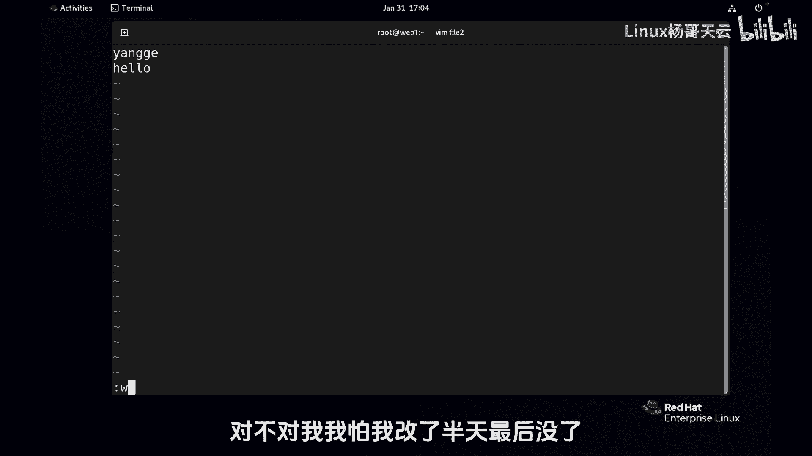
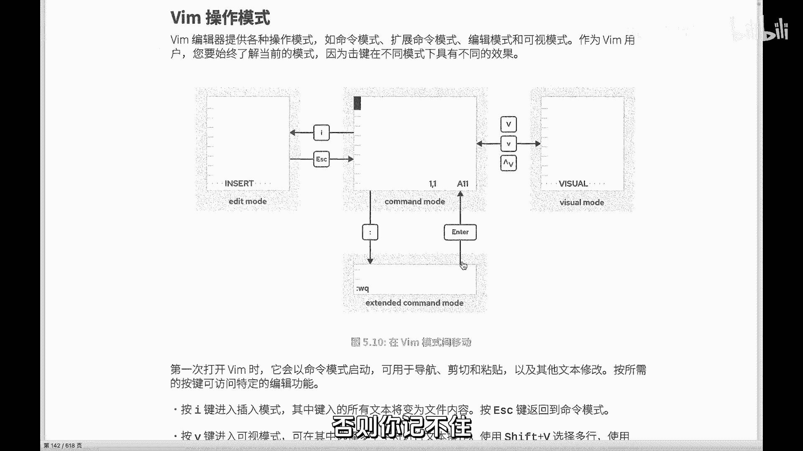

# Linux入门教程：P36：最强Vim快速入门教程 🚀

在本节课中，我们将要学习Linux系统中一个极其重要的工具——Vim编辑器。Vim是编辑配置文件和代码的强大工具，从简单的文本修改到处理复杂的程序文件都离不开它。我们将从最基础的操作开始，确保初学者也能轻松上手。

## 认识Vim编辑器



Vim是一个文本编辑器，而非编译器。它主要用于编辑文本文件，包括编写程序代码。我们每天都会使用它来修改配置文件，因此掌握Vim是Linux学习中的关键一步。

## Vim的三种核心模式

上一节我们介绍了Vim的基本概念，本节中我们来看看Vim的核心——三种工作模式。理解模式切换是熟练使用Vim的第一步。



Vim主要包含三种模式：
1.  **命令模式**：打开文件后的默认模式。在此模式下，键盘输入被视为命令，而非文本内容。
2.  **插入模式**：在此模式下，可以像使用普通文本编辑器一样输入和编辑文本。
3.  **扩展命令模式（末行模式）**：在此模式下，可以执行保存、退出、查找、替换等高级命令。

模式切换流程如下：
*   启动Vim后，自动进入**命令模式**。
*   在命令模式下按 `i` 键，进入**插入模式**。
*   在插入模式下按 `Esc` 键，返回**命令模式**。
*   在命令模式下按 `:`（冒号）键，进入**扩展命令模式**。
*   在扩展命令模式下执行命令（如 `wq`）后，会自动返回**命令模式**或退出Vim。

## 十秒快速入门

了解了模式的概念后，我们通过一个最简单的例子来快速上手。以下是创建一个新文件并保存的完整步骤：

1.  打开终端，输入命令创建一个新文件：
    ```bash
    vi newfile.txt
    ```
2.  此时处于**命令模式**，按 `i` 键切换到**插入模式**（屏幕底部会显示 `-- INSERT --`）。
3.  输入任意文本内容，例如 `Hello, Vim!`。
4.  按 `Esc` 键返回**命令模式**。
5.  按 `:`（Shift + ;）进入**扩展命令模式**，输入 `wq` 然后按回车。
    *   `w` 代表写入（保存）。
    *   `q` 代表退出。
    *   组合命令 `wq` 表示保存并退出。

至此，你已经完成了Vim最基本的创建、编辑和保存操作。

## 常用基础命令详解

现在你已经能让Vim“跑起来”了，接下来我们学习一些更实用的命令，让编辑更高效。以下是一些在**命令模式**下常用的操作：



*   **光标移动**
    *   `h`：向左移动光标。
    *   `j`：向下移动光标。
    *   `k`：向上移动光标。
    *   `l`：向右移动光标。



*   **文本编辑**
    *   `x`：删除光标所在位置的字符。
    *   `dd`：删除光标所在的整行。
    *   `yy`：复制光标所在的整行。
    *   `p`：将复制或删除的内容粘贴到光标下方。

*   **撤销与重做**
    *   `u`：撤销上一次操作。
    *   `Ctrl + r`：重做被撤销的操作。

在**扩展命令模式**下，除了 `wq`，还有以下常用命令：

*   `:q`：退出（如果文件未修改）。
*   `:q!`：强制退出，不保存任何修改。
*   `:w`：保存文件但不退出。
*   `:w [文件名]`：另存为新文件。
*   `:set nu`：显示行号。
*   `:set nonu`：隐藏行号。

## 总结



本节课中我们一起学习了Vim编辑器的核心知识。我们首先明确了Vim作为编辑器的定位，然后重点讲解了其三种核心模式（命令模式、插入模式、扩展命令模式）及其切换方法。通过一个“十秒入门”的实例，你掌握了使用Vim创建和保存文件的基本流程。最后，我们介绍了一些最常用的光标移动、文本编辑和文件操作命令，为后续更深入的学习打下了坚实基础。记住，熟练使用Vim的关键在于多练习，从这些基础命令开始，逐步探索更强大的功能。